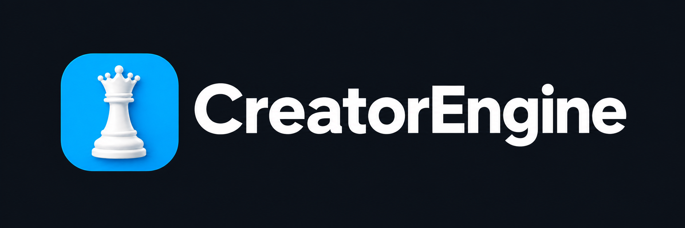
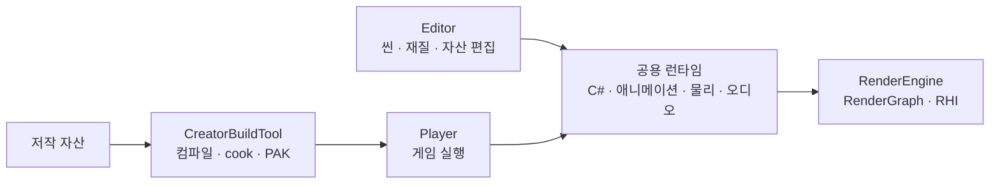

<p align="center">
  
</p>


<p align="center">Windows용 C++23 게임 엔진과 통합 에디터</p>

<p align="center">
  <a href="#시작하기">시작하기</a> ·
  <a href="docs/TechnicalGuide.md">기술설명서</a> ·
  <a href="docs/README.md">문서</a> ·
  <a href="docs/RefactoringPlanDashboard.html">개발 계획</a> ·
  <a href="CONTRIBUTING.md">기여하기</a>
</p>

## CreatorEngine 소개

CreatorEngine은 씬 편집부터 게임 실행과 패키징까지 하나의 작업 흐름으로 연결하는 게임 엔진입니다. Dear ImGui 기반 에디터에서 씬·프리팹·재질을 편집하고, C#으로 게임 로직을 작성하며, 독립 Player로 게임을 실행합니다. Editor와 Player는 같은 네이티브 런타임과 콘텐츠 파이프라인을 사용합니다.

현재 재설계와 개발은 개인이 주도하며, Legacy 버전에서 이어진 코드와 외부 라이브러리를 함께 사용합니다. 코드 분석·개발·문서 작성에는 생성형 AI를 보조 도구로 활용합니다.

> **개발 버전:** 현재 엔진은 `preview` 상태입니다. API와 자산 형식은 개발 중 변경될 수 있습니다. 이 문서의 기능 설명은 2026-10-10의 커밋된 master를 기준으로 하며, 지원·검증 범위의 세부사항은 [기술설명서](docs/TechnicalGuide.md)에 정리합니다.

## 시작하기

### 소스에서 빌드

다음 개발 환경을 준비합니다.

- Windows 10/11 x64
- Visual Studio 18 계열, Desktop development with C++ 워크로드, MSVC v145와 Windows SDK
- .NET 10 SDK, vcpkg, PowerShell 7
- DirectX 12를 지원하는 GPU와 드라이버

```powershell
git clone https://github.com/29thnight/CreatorEngine.git
Set-Location CreatorEngine

# VCPKG_ROOT를 설치된 vcpkg의 실제 경로로 설정합니다.
& "$env:VCPKG_ROOT\vcpkg.exe" integrate install

# VS 18 Community 설치 예시입니다. 설치 위치가 다르면 경로를 바꿉니다.
$msbuild = 'C:\Program Files\Microsoft Visual Studio\18\Community\MSBuild\Current\Bin\amd64\MSBuild.exe'
& $msbuild .\Editor\CreatorEditor.vcxproj /t:Build /m /p:Configuration=Debug /p:Platform=x64

& .\Bin\x64-Debug\Editor\CreatorEditor.exe --development-project .\Dynamic_CPP
```

Visual Studio에서는 `CreatorEngine.sln`을 열고 `CreatorEditor`를 시작 프로젝트로 지정할 수 있습니다. 의존성은 vcpkg manifest로 복원되며, 최초 빌드는 복원과 컴파일에 시간이 걸립니다. 실행 파일과 함께 생성된 런타임·리소스 폴더를 유지하십시오.

### 엔진 배포본으로 게임 제작

엔진 배포본을 사용하는 게임 제작자는 포함된 Editor와 CreatorBuildTool로 프로젝트를 열고 패키징할 수 있습니다. 이 경로에는 엔진 소스, Visual Studio, vcpkg와 시스템 .NET SDK가 필요하지 않습니다.

배포본 준비·프로젝트 연결·패키징 명령은 [배포 가이드](Tools/distribution/README.md)와 [BuildTool 사용법](BuildTool/README.md)을 참고하십시오. 현재 프로젝트 연결은 개발용 adapter이며, Launcher와 정식 프로젝트 파일 지원은 후속 작업입니다.

## 주요 기능

- **씬과 프리팹 편집** — 도킹 에디터, Scene/Game 뷰, Hierarchy, Inspector, Content Browser, 기즈모와 Play/Stop 전환을 제공합니다.
- **그래프 기반 재질 제작** — Lattice Material Node Editor에서 재질 자산을 작성하고 미리 볼 수 있습니다. 그래프 편집은 준비·검증 후 자동 반영·저장되며, 메시별 재질 override를 지원합니다.
- **렌더링 파이프라인** — Slang 재질과 공용 렌더 패스, 의존성·리소스 버전 기반 RenderGraph를 사용합니다. Editor는 DX12로 실행하고, Player와 공용 RHI에는 DX12·Vulkan 경로가 있습니다.
- **모델과 텍스처 처리** — glTF·FBX 임포트, 기하 LOD와 메시렛 경로, 임포트 설정에 따른 텍스처 mip·압축·쿠킹을 지원합니다. 게임 패키지는 준비된 콘텐츠를 사용합니다.
- **리소스 편집 자동 반영** — 자산과 메타데이터 변경을 감지해 재임포트·쿠킹·소비자 갱신을 수행합니다. C# 게임 스크립트는 저장 후 자동 빌드·재연결되며, 실패 시 이전 정상 결과를 유지합니다.
- **게임 런타임** — Scene·Entity·Component 수명 관리, 공용 작업 스케줄러, 애니메이션 LOD·CPU 버짓, PhysX 물리, miniaudio 오디오와 SDF 텍스트 경로를 갖추고 있습니다.
- **진단과 패키징** — CPU/GPU 프로파일링, 메모리 스냅샷 비교, `.ceprof` 캡처와 별도 뷰어를 제공합니다. CreatorBuildTool은 C# 컴파일부터 cook·PAK·Player 검증·게시까지 처리합니다.

구현된 경로의 전체 품질·성능 수용을 뜻하지는 않습니다. 특히 Vulkan 교차 검증, GPU 기능 확대와 RenderGraph 큐 최적화의 채택 조건은 [기술설명서의 구현 경계](docs/TechnicalGuide.md#구현과-검증의-경계)를 참고하십시오.

## 엔진 구조

Editor와 Player는 씬 런타임을 공유하고, 콘텐츠 도구는 저작 자산을 실행용 데이터로 준비합니다.



모듈 간 책임, 자원 소유권, 렌더 제출과 콘텐츠 게시 과정은 [기술설명서](docs/TechnicalGuide.md)에서 설명합니다.

## 저장소 안내

| 경로 | 내용 |
|---|---|
| [Engine](Engine/) | 씬 런타임, 렌더링, 물리, 진단과 공용 기반 |
| [Editor](Editor/) · [Player](Player/) | 편집용 호스트와 게임 실행 호스트 |
| [ScriptCore](ScriptCore/) · [ScriptCore.Generators](ScriptCore.Generators/) | C# 엔진 API와 소스 제너레이터 |
| [Lattice](Lattice/) | 그래프 모델, 문서와 편집 캔버스 |
| [BuildTool](BuildTool/README.md) · [Tools](Tools/) | 배포·컴파일·쿠킹·패키징과 검증 도구 |
| [Dynamic_CPP](Dynamic_CPP/) · [GameScripts](GameScripts/) | 소스 개발용 프로젝트, 자산과 스크립트 샘플 |
| [ThirdParty](ThirdParty/README.md) | 저장소에 고정한 외부 의존성과 출처 |
| [docs](docs/README.md) | 기술설명서, 설계, 개발 계획과 검증 기록 |

## 문서

- [기술설명서](docs/TechnicalGuide.md) — 현재 구현의 구조와 데이터 흐름, 빌드·실행·검증 경계
- [문서 색인](docs/README.md) — 설계 결정과 분야별 문서
- [개발 대시보드](docs/RefactoringPlanDashboard.html) — 진행 중인 작업과 후속 계획
- [BuildTool](BuildTool/README.md) · [배포 가이드](Tools/distribution/README.md) — 배포본과 게임 패키징
- [회귀 검사 안내](Tools/regression/README.md) — 변경 영역별 검증 절차

## 기여와 커뮤니티

버그 보고, 문서 개선과 코드 변경은 [GitHub Issues](https://github.com/29thnight/CreatorEngine/issues)와 Pull Request로 제안할 수 있습니다. 개발 환경과 변경·검증 기준은 [CONTRIBUTING.md](CONTRIBUTING.md), 참여자 간 행동 기준은 [CODE_OF_CONDUCT.md](CODE_OF_CONDUCT.md)에 있습니다.

## 라이선스

현재 저장소 루트에는 프로젝트 전체에 적용되는 별도 `LICENSE` 파일이 없습니다. 소스가 공개되어 있다는 사실만으로 사용·수정·재배포 권한이 부여되지는 않으므로, 외부 이용은 저장소 소유자에게 확인하십시오.

외부 의존성의 라이선스와 출처는 [vcpkg.json](vcpkg.json), [ThirdParty 안내](ThirdParty/README.md)와 각 라이브러리의 라이선스 문서에서 확인할 수 있습니다.
