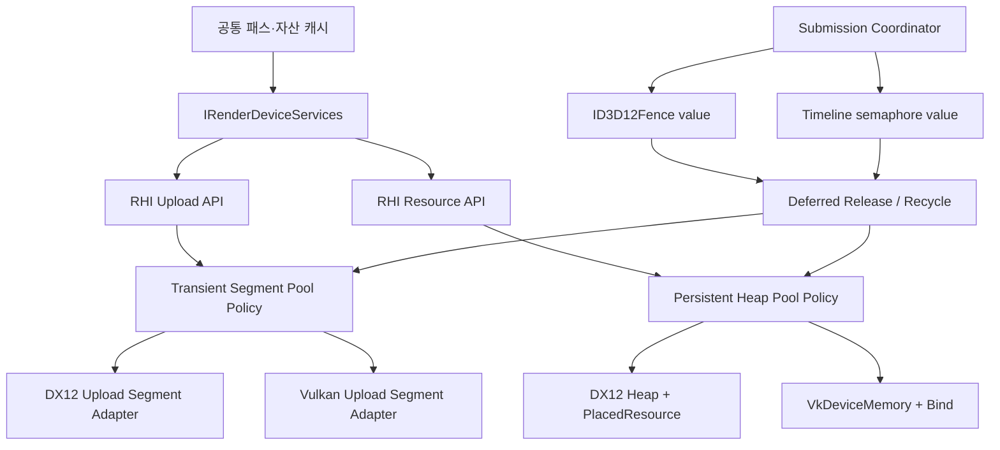
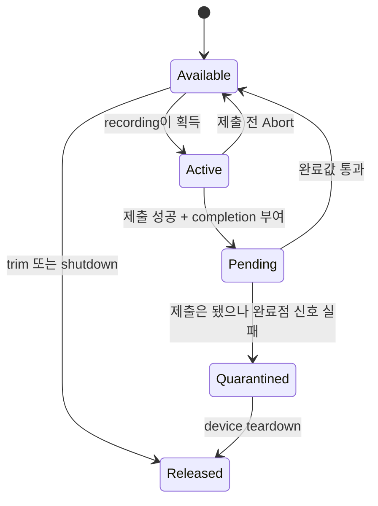
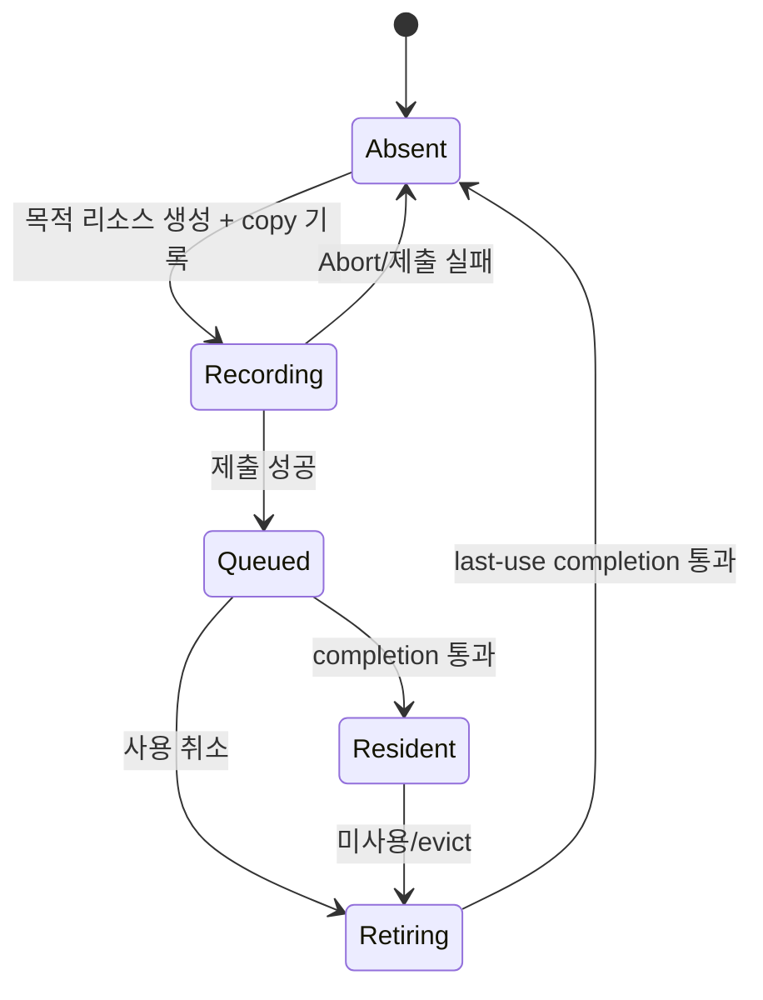

# RHI GPU 메모리·수명 관리 재설계

작성: 2026-08-14

상태: **Slice A~C correctness 구현·검증 완료 / fast path·Slice D 후속 구현**

대상: CreatorEngine RHI, DX12, Vulkan

관련 문서: `RhiBoundaryPlan.md`, `AssetResidencyPlan.md`

대체 범위: 두 문서의 upload ring, frame-count 수명, 향후 placed-resource heap 부분

구현 상태 (2026-08-14):

- Slice A 완료: 의미 기반 요청, all-or-none 배치, recording/completion,
  RHI `AbortFrame`, 제출 coordinator와 cache transaction listener를 배선했다.
- Slice B의 correctness 경로 완료: DX12/Vulkan 모두 completion-aware
  regular/large segment allocator로 전환했다. Vulkan flush는 command pool
  recycler를 사용하며 더 이상 제출 직후 CPU에서 기다리지 않는다. 현재 공통
  fast path는 mutex로 직렬화되어 있고, packed cursor CAS 및 worker allocation
  context는 프로파일링과 append-only resource registry 도입 후의 최적화로 남는다.
- Slice C의 현재 소비 경로 완료: DX12 메시 정점/인덱스는 한 배치로 예약하고,
  DX12 메시·텍스처와 Vulkan 텍스처는 Recording → Queued → Resident 및
  Abort rollback을 따른다. Vulkan live scene mesh cache가 아직 없으므로
  Vulkan self-test의 21MiB 정점/인덱스 배치 fixture로 같은 계약을 검증한다.
- Slice D는 별도 후속 변경이다. 기존 persistent resource 생성은 아직
  committed/dedicated 할당이며 placed/bound suballocation으로 바꾸지 않았다.
- Slice E는 실제 SBT 소비 경로가 생길 때 구현한다는 본문의 조건을 유지한다.
- 검증: VS18/v145 Debug 빌드 성공. `rhi.uploadsegments`를 2회 연속 실행해
  DX12 6/6, Vulkan 4/4, Vulkan validation layer clean을 확인했다.

---

## 0. 결정 요약

CreatorEngine의 업로드 메모리는 더 이상 **프레임 인덱스로 나눈 고정 링 버퍼**를
핵심 수명 모델로 사용하지 않는다. 다음 네 계층으로 분리한다.

1. **Transient Upload Segment Pool**
   - CPU가 쓰고 GPU가 읽는 임시 스테이징 메모리.
   - 선형 할당하고, 제출 완료값이 지난 세그먼트를 통째로 재사용한다.
   - 일반 세그먼트와 대형 전용 세그먼트를 분리한다.
2. **Submission/Lifetime Coordinator**
   - 모든 큐 제출에 단조 증가 완료값을 붙인다.
   - DX12 fence와 Vulkan timeline semaphore를 같은 RHI 완료점으로 번역한다.
3. **Deferred Release Queue**
   - GPU가 마지막으로 사용한 완료점이 지나기 전에는 리소스, 디스크립터,
     스테이징 블록을 파괴하거나 덮어쓰지 않는다.
4. **Persistent Resource Heap Pool**
   - 장기 상주 버퍼·텍스처는 큰 디바이스 메모리 힙 안에서 할당한다.
   - 해제 완료 후 free-list에 반환하고, 인접 빈 블록을 병합한다.

이 구조는 .NET GC의 **세그먼트, 빠른 선형 할당, 대형 객체 분리, 빈 세그먼트
standby** 개념을 차용한다. 그러나 GPU 주소와 디스크립터가 인플라이트 명령에
박혀 있으므로 **이동 압축과 세대 승격은 차용하지 않는다.**

DX12와 Vulkan은 동일한 RHI 계약과 상태 전이를 구현한다. 한 백엔드만 구현된
상태는 이 설계의 완료가 아니다.

---

## 1. 현재 코드에서 확인한 문제

### 1.1 업로드 경로의 비대칭과 고정 상한

| 항목 | DX12 현재 상태 | Vulkan 현재 상태 | 문제 |
|---|---|---|---|
| 기본 용량 | 프레임당 16 MiB 세그먼트 | 프레임당 8 MiB 단일 블록 | 동일 RHI 호출이 백엔드마다 다른 크기에서 실패한다 |
| 부족 처리 | 실패 수요를 기록하고 다음 `BeginFrame`에 세그먼트 하나 추가 | 즉시 무효 슬라이스 반환 | 최초 요청은 실패하며 Vulkan에는 성장 경로도 없다 |
| 대형 요청 | 다음 프레임에 요청 크기 세그먼트를 추가 | 항상 실패 | 현재 프레임의 큰 메시를 구하지 못한다 |
| 회수 기준 | 프레임 슬롯 fence 대기 후 슬롯 전체 reset | 프레임 슬롯 timeline 값 대기 후 offset reset | 중간 제출과 실제 사용 범위를 표현하지 못한다 |
| 동시 할당 | packed cursor CAS | 단순 `m_offset` | Vulkan 구현은 병렬 기록에 안전하지 않다 |

근거가 되는 현재 경로:

- DX12 초기 16 MiB 값: `RenderEngine/RHI/DX12/DX12DeviceResources.cpp`
- DX12 사후 성장: `RenderEngine/RHI/DX12/DX12UploadRing.cpp`
- Vulkan 고정 블록: `RenderEngine/RHI/Vulkan/VulkanFrameAllocators.cpp`
- 공통 표면: `RenderEngine/RHI/IRenderDeviceServices.h::AllocateUpload`

### 1.2 `scene.glb` 대형 메시가 사라지는 직접 경로

현재 DX12 메시 캐시는 정점 버퍼와 인덱스 버퍼를 별도의 호출로 올린다.

```text
Upload vertex staging
  └─ 성공 가능
Upload index staging
  └─ 프레임 세그먼트 부족 → 실패
      └─ 메시 전체가 무효 binding으로 반환됨
```

한 요청이 16 MiB를 넘거나, 같은 프레임의 앞선 업로드가 공간을 소비해 합계가
16 MiB를 넘으면 `DX12UploadRing::Allocate`가 그 프레임 요청을 거절한다. 현재
수정안은 다음 프레임부터 세그먼트를 늘리므로 **실패한 최초 프레임을 복구하지
않는다.** 같은 메시가 여러 패스에서 반복 요청되면 실패 수요도 중복 계상된다.

또한 정점 업로드 성공 후 인덱스 업로드가 실패할 수 있어 목적 리소스 생성,
복사 명령, 통계가 부분적으로 진행될 수 있다. 메시 하나는 정점·인덱스 staging을
**한 번에 예약하는 all-or-none 배치**여야 한다.

### 1.3 제출보다 먼저 resident가 되는 캐시

DX12 메시·텍스처 캐시와 Vulkan 텍스처 캐시는 복사 명령을 기록한 뒤 실제 큐
제출 성공을 확인하기 전에 resident map에 엔트리를 넣는다. 이후 프레임이
Abort되거나 제출이 실패하면 캐시는 GPU에 도달하지 않은 리소스를 정상 상주
리소스로 돌려줄 수 있다.

필요한 상태는 최소 다음 넷이다.

```text
Absent → Recording → Queued(completion) → Resident
                └──────── Abort ─────────→ Absent
Resident → Retiring(completion) → Absent
```

`Queued`는 같은 큐의 뒤 제출에서 사용할 수 있지만 아직 CPU 관점의 완료는 아니다.
교차 큐 소비나 readback은 `Resident`, 즉 완료 확인 이후만 허용한다.

### 1.4 제출 추적의 구멍

`DX12DeviceResources::EndFrame`은 fence를 신호하지만 다음 경로는 네이티브 큐를
직접 호출한다.

- `EnhancedRenderGraph.cpp`의 병렬 command list 제출
- `EnhancedApiOverheadBench.cpp`의 병렬 제출
- `DX12DeviceResources::FlushCommandList`의 중간 제출

직접 제출은 “어느 업로드 세그먼트와 어느 리소스가 어느 완료값에 속하는가”를
한 곳에서 결정할 수 없게 한다. Vulkan `FlushCommandList`는 같은 command pool을
재사용하려고 매번 timeline을 기다려 CPU/GPU 파이프라이닝을 끊는다.

### 1.5 프레임 수 기반 수명은 안전 판정이 아니다

영상에서 설명한 life-count 방식은 고정 인플라이트 수를 잘 지키면 동작할 수
있지만, 다음 경우에는 실제 GPU 완료와 어긋난다.

- 프레임 중간 제출
- GPU stall 또는 device scheduling 지연
- 프레임 Abort
- 향후 copy/compute queue 분리
- 창 최소화 등으로 프레임 진행이 멈춘 상태

따라서 frame count는 캐시의 “얼마나 오래 안 썼는가” 정책에는 사용할 수 있지만,
파괴와 재사용의 안전 판정에는 사용할 수 없다. 안전 판정은 완료값만 담당한다.

---

## 2. 차용할 것과 차용하지 않을 것

### 2.1 .NET GC에서 차용할 것

| .NET 개념 | RHI 적용 |
|---|---|
| 관리 힙 세그먼트 | 큰 네이티브 메모리 블록을 만들고 그 안에서 빠르게 할당 |
| bump-pointer 할당 | transient upload를 현재 세그먼트 cursor 증가로 할당 |
| SOH/LOH 분리 | 일반 요청과 대형 전용 세그먼트를 서로 다른 풀에서 관리 |
| 빈 세그먼트 standby | 완료된 세그먼트를 즉시 파괴하지 않고 재사용 후보로 유지 |
| 임계치 동적 조정 | peak, miss, reclaim lag를 보고 예산과 standby 목표를 조정 |
| allocation context | 필요 시 기록 워커별 chunk를 미리 떼어 CAS 경합을 줄임 |

.NET의 85,000바이트 LOH 기준이나 실제 세그먼트 크기는 런타임 구현값이므로
가져오지 않는다. RHI의 임계치는 GPU 업로드 패턴과 VRAM/host-visible 예산을
측정해 결정한다.

### 2.2 차용하지 않을 것

- **이동 압축:** GPU 가상 주소, descriptor, SBT record, 인플라이트 command가
  기존 위치를 참조할 수 있어 투명 이동이 불가능하다.
- **도달성 추적:** 엔진은 자산 ID, RHI handle, 명시적 소유권으로 수명을 안다.
- **세대 승격:** 일시 데이터와 상주 데이터는 복사 시점부터 목적이 다르므로
  generation이 아니라 서로 다른 allocator를 사용한다.
- **stop-the-world:** 정상 프레임에서 전체 GPU 대기나 `vkDeviceWaitIdle`로
  메모리를 회수하지 않는다.

### 2.3 영상의 관리 기법에서 차용할 것

- 큰 힙을 만들고 내부 free-list에서 재사용한다.
- 해제 블록의 앞뒤가 비어 있으면 즉시 병합한다.
- GPU가 읽는 중인 리소스와 descriptor는 지연 해제한다.
- 제출 뒤의 SBT/descriptor 내용을 CPU가 덮어쓰지 않고 새 버전을 만든다.

단, 고정 life-count 대신 DX12 fence/Vulkan timeline 완료값을 사용한다.

---

## 3. 목표 구조



공통 코드는 “언제 재사용 가능한가”, “어떤 크기 분류인가”, “어떤 블록을
선택하는가”를 결정한다. 백엔드는 네이티브 리소스를 생성하고 요구 정렬과
memory type/heap flag를 결정한다.

---

## 4. RHI 계약

### 4.1 의미 기반 업로드 요청

현재 `AllocateUpload(bytes, alignment)`는 DX12의 256/512 정렬 규칙을 호출부로
노출한다. 다음 의미 기반 요청으로 바꾼다.

```cpp
enum class RHIUploadUsage : uint8_t
{
    Raw,
    ConstantBuffer,
    VertexData,
    IndexData,
    BufferCopy,
    TextureCopy,
    ShaderTable
};

struct RHIUploadRequest
{
    uint64_t       bytes{ 0 };
    RHIUploadUsage usage{ RHIUploadUsage::Raw };
    uint64_t       minimumAlignment{ 1 }; // 호출자가 아는 추가 하한
};
```

백엔드는 다음 식으로 실제 정렬을 넓힌다.

```text
effectiveAlignment = max(request.minimumAlignment,
                         backend.RequiredAlignment(request.usage))
```

DX12 상수/텍스처 배치 규칙과 Vulkan의 device limit은 각각의 adapter 안에 남는다.

### 4.2 배치 예약

```cpp
class IRenderDeviceServices
{
public:
    virtual bool ReserveUploadBatch(
        std::span<const RHIUploadRequest> requests,
        std::span<RHIBufferSlice> outSlices,
        std::string& outError) = 0;

    // 이행 기간 호환 함수. 내부적으로 1개 배치를 호출한다.
    virtual RHIBufferSlice AllocateUpload(
        const RHIUploadRequest& request) = 0;
};
```

배치는 다음을 보장한다.

- `outSlices.size() == requests.size()`가 아니면 호출 자체를 거절한다.
- 모든 요청을 수용할 수 있을 때만 cursor를 한 번 전진시킨다.
- 하나라도 실패하면 세그먼트 cursor와 출력은 바뀌지 않는다.
- 정점/인덱스처럼 함께 살아야 하는 데이터는 반드시 한 배치로 요청한다.
- 배치 내부 조각은 한 세그먼트의 연속 예약에서 `SubRange`로 만든다.

이 규칙으로 “정점 성공, 인덱스 실패”를 구조적으로 없앤다.

### 4.3 완료점

현재 엔진은 graphics queue 하나에서 업로드와 렌더링을 순서대로 제출하므로
첫 구현은 단일 단조 증가 값으로 충분하다.

```cpp
struct RHICompletionPoint
{
    uint64_t value{ 0 };
    bool IsValid() const { return value != 0; }
};
```

향후 copy/compute queue를 분리할 때는 `queueId + value` 또는 완료점 집합으로
확장한다. 그 전까지 다른 큐에서 이 값을 완료 판정에 사용하는 것은 금지한다.

### 4.4 allocator 내부 계약

이 인터페이스는 패스에 노출하지 않고 `IRHIDeviceResources` 구현이 소유한다.

```cpp
class IRHIUploadAllocator
{
public:
    virtual void Collect(uint64_t completedValue) = 0;
    virtual void BeginRecording(uint64_t recordingId) = 0;

    virtual bool ReserveBatch(
        uint64_t recordingId,
        std::span<const RHIUploadRequest> requests,
        std::span<RHIBufferSlice> outSlices,
        std::string& outError) = 0;

    virtual void OnSubmitted(
        uint64_t recordingId,
        RHICompletionPoint completion) = 0;

    virtual void AbortRecording(uint64_t recordingId) = 0;
};
```

`recordingId`는 frame index가 아니다. 한 프레임 안에서 `FlushCommandList`가
여러 번 발생하면 제출 구간마다 새 recording ID를 만든다.

---

## 5. Transient Upload Segment Pool

### 5.1 세그먼트 상태



핵심 불변식은 다음과 같다.

1. `Pending` 세그먼트의 cursor와 바이트는 절대 수정하지 않는다.
2. 제출 시 그 recording이 사용한 모든 `Active` 세그먼트를 seal한다.
3. 중간 제출 뒤의 기록은 새 `Active` 세그먼트를 사용한다.
4. `completedValue`가 retire 값을 지난 뒤에만 `Available`로 돌아온다.
5. frame index는 command allocator 선택에는 쓸 수 있지만 세그먼트 안전 판정에는
   쓰지 않는다.

### 5.2 크기 분류

```text
packedBatchBytes <= largeThreshold
    → Regular pool

packedBatchBytes > largeThreshold
    → Large pool 또는 dedicated segment
```

초기 계측용 기본값은 다음처럼 시작할 수 있지만 확정 상수는 아니다.

| 설정 | 잠정 시작값 | 의미 |
|---|---:|---|
| `regularSegmentBytes` | 16 MiB | 일반 세그먼트 크기 |
| `largeThreshold` | 8 MiB | 일반 풀을 오염시키지 않을 배치 기준 |
| `largeGranularity` | 4 MiB | 대형 세그먼트 반올림 단위 |
| `standbyRegularCount` | 2~4 | 생성 비용을 피하기 위해 유지할 빈 세그먼트 |
| `softBudgetBytes` | 백엔드/어댑터별 | 초과 시 collect/trim 후 재시도할 기준 |

DX12와 Vulkan이 같은 숫자를 강제로 쓸 이유는 없다. 두 백엔드는 같은 동작 계약과
테스트를 공유하되 실제 정렬, memory type, 예산은 별도 telemetry로 정한다.

### 5.3 할당 알고리즘

1. 요청들의 실제 정렬을 계산해 한 배치의 packed size를 구한다.
2. 대형이면 완료된 large segment 중 best-fit을 찾는다.
3. 일반이면 현재 active regular segment에서 CAS로 한 번에 예약한다.
4. 맞지 않으면 현재 세그먼트의 남은 꼬리를 기록하고 다른 available 세그먼트를
   즉시 얻는다.
5. available 세그먼트가 없으면 **현재 요청에서 바로 생성**한다. 다음 프레임으로
   미루지 않는다.
6. soft budget을 넘으면 `Collect`와 standby trim을 한 번 수행하고 재시도한다.
7. 그래도 만들 수 없을 때만 명시적인 OOM/백엔드 생성 오류를 반환한다.

느린 생성 경로는 allocator mutex로 직렬화한다. 업로드 세그먼트의 RHI handle은
전용 append-only registry에 등록한다. registry slot 주소는 이동하지 않고,
등록만 직렬화하며 resolve는 lock-free여야 한다. 이 조건이 서기 전에는 병렬
worker에서 네이티브 세그먼트를 생성하지 않는다.

### 5.4 병렬 기록

첫 구현은 현재 DX12의 packed cursor CAS를 공통 정책으로 옮긴다. correctness와
두 백엔드 대칭을 먼저 확보한다. 계측에서 CAS 경합이 유의미할 때 다음 단계로
.NET allocation-context 방식을 적용한다.

```text
worker context가 64~256 KiB chunk를 세그먼트에서 한 번 예약
    └─ worker 내부 할당은 local cursor만 증가
    └─ chunk 부족 시에만 공통 세그먼트와 동기화
```

Vulkan의 현재 단순 `m_offset` 구현은 공통 CAS 또는 worker context로 교체되기
전까지 병렬 allocator로 간주하지 않는다.

### 5.5 trim

매 프레임 파괴하지 않는다. 다음 조건을 모두 만족하는 세그먼트만 정리한다.

- `Available` 상태
- 최근 N회 collect 동안 사용되지 않음
- regular standby 목표보다 많거나 large cache budget을 초과함
- 현재 메모리 압력 또는 soft budget 초과

trim은 안전성이 아니라 성능/메모리 정책이다. 안전성은 이미 completion 판정으로
끝난 상태에서만 실행된다.

---

## 6. 제출과 Abort의 단일 소유자

### 6.1 Submission Coordinator

모든 제출은 backend `DeviceResources`의 한 함수로 모은다.

```text
Close/End recording
    → native queue submit
    → completion value signal
    → uploadAllocator.OnSubmitted(recordingId, completion)
    → uploadTransaction.OnSubmitted(completion)
    → 새 recordingId 시작
```

- DX12: `ExecuteCommandLists` 뒤 같은 queue에서 `ID3D12Fence::Signal`.
- Vulkan: `vkQueueSubmit2`의 signal 목록에 timeline 값을 함께 넣는다.
- 제출 수락 전 실패: 현재 recording을 즉시 Abort할 수 있다.
- DX12에서 실행 제출 뒤 fence signal이 실패: 안전 완료점을 증명할 수 없으므로
  관련 객체를 `Quarantined`에 두고 device teardown까지 파괴하지 않는다.

다음 직접 호출은 제거하거나 coordinator 내부로 내려야 한다.

- render graph 병렬 제출
- API overhead benchmark 병렬 제출
- 프레임 중간 flush
- 향후 copy queue 제출

### 6.2 Vulkan 중간 제출

현재 Vulkan flush는 제출 직후 timeline을 기다리고 같은 command pool을 reset한다.
재설계 후에는 제출마다 command pool/buffer 세트를 recycler에서 하나 얻는다.

```text
RecordingPool A → submit(value 10) → Pending(10)
RecordingPool B → 즉시 다음 기록
completed >= 10 → Pool A reset 후 Available
```

이렇게 해야 공통 `FlushCommandList`가 Vulkan에서만 CPU/GPU 동기화 지점이 되는
비대칭을 없앨 수 있다.

### 6.3 Abort

- 아직 제출되지 않은 current recording:
  - command recording 폐기
  - `Active` 업로드 세그먼트 즉시 available 반환
  - cache의 `Recording` 엔트리 rollback
- 같은 프레임에서 앞선 flush가 이미 성공한 경우:
  - 앞선 recording은 각 completion에 따라 pending 유지
  - 현재 미제출 recording만 rollback
- native submit 성공 여부가 불명확한 경우:
  - 즉시 반환 금지
  - quarantine 후 device teardown

`AbortFrame`은 DX12 전용 편의 함수가 아니라 RHI 프레임 계약에 포함되어야 한다.

---

## 7. 자산 업로드 트랜잭션

### 7.1 캐시 상태



`GetOrUpload`가 같은 recording 안에서 다시 호출되면 기존 `Recording` 엔트리를
재사용할 수 있다. 다른 recording/스레드에는 제출 여부가 명확한 상태만 공개한다.

### 7.2 메시 배치

메시 하나의 staging은 다음 하나의 배치다.

```cpp
RHIUploadRequest requests[] = {
    { vertexBytes, RHIUploadUsage::VertexData },
    { indexBytes,  RHIUploadUsage::IndexData  }
};

RHIBufferSlice slices[2];
services.ReserveUploadBatch(requests, slices, error);
```

`scene.glb`의 20 MiB 이상 메시도 첫 요청에서 large segment를 즉시 얻는다. “한
프레임 실패 후 다음 프레임에 성장”은 허용하지 않는다.

### 7.3 텍스처 배치

- DX12 footprint와 Vulkan `VkBufferImageCopy`는 backend가 계산한다.
- 여러 mip/array slice의 전체 staging을 하나의 배치로 예약한다.
- regular threshold를 넘으면 양쪽 모두 large segment 경로를 사용한다.
- DX12만 dedicated committed staging으로 우회하고 Vulkan은 실패하는 현재
  비대칭을 제거한다.
- non-coherent Vulkan memory type을 선택한 경우 submit 전에 쓴 범위를 atom
  크기에 맞춰 flush한다.

---

## 8. Persistent Resource Heap Pool

Transient upload 문제를 고친 뒤 두 번째 수직 슬라이스로 적용한다. 같은 릴리스에
섞어 correctness 범위를 키우지는 않지만, 최종 수명 모델은 처음부터 이 구조를
전제로 한다.

### 8.1 공통 정책

```text
HeapSegment
  ├─ allocated block: resource handle + offset + size + alignment
  ├─ free block
  └─ free block
```

- 주소순 free map: 앞뒤 병합용
- 크기순 index: best-fit 검색용
- 할당 시 정렬 padding을 앞/뒤 free block으로 보존
- 파괴 요청 시 즉시 free-list에 넣지 않고 deferred queue로 이동
- completion 통과 후 resource object를 파괴하고 블록을 반환·병합
- 완전히 빈 heap segment는 standby 또는 backend memory budget에 따라 반환

### 8.2 백엔드 매핑

| 공통 개념 | DX12 | Vulkan |
|---|---|---|
| 물리 세그먼트 | `ID3D12Heap` | `VkDeviceMemory` |
| 서브할당 리소스 | `CreatePlacedResource` | `vkBindBufferMemory` / `vkBindImageMemory` |
| 요구 정렬 | `GetResourceAllocationInfo` | `vkGet*MemoryRequirements2` |
| 풀 분류 | heap type + heap flags + resource class | memory type index + usage/compatibility |
| dedicated 조건 | 정책 임계치/특수 리소스 | `requiresDedicatedAllocation` 우선 |
| 해제 | resource object release 후 heap block 반환 | buffer/image destroy 후 memory block 반환 |

공통 allocator가 DX12 heap flag나 Vulkan memory type bit를 해석하지 않는다.
백엔드가 불투명 `compatibilityKey`, 크기, 정렬, dedicated 요구를 만들어 공통
free-list 정책에 전달한다.

### 8.3 이동과 aliasing

첫 구현에서는 살아 있는 리소스를 이동하거나 서로 겹쳐 배치하지 않는다.
DX12 placed-resource aliasing에는 aliasing barrier가 필요하고 Vulkan에도 메모리
alias 규칙이 있으므로, free-list 반환이 완료된 블록만 새 리소스에 쓴다.

나중의 defragmentation은 다음 명시적 이주 트랜잭션으로만 가능하다.

```text
새 블록 할당 → GPU copy → 새 descriptor/version 게시
→ 옛 handle 마지막 사용 completion 대기 → 옛 블록 반환
```

---

## 9. Descriptor와 SBT

descriptor는 byte-addressable GPU heap과 네이티브 모델이 다르므로 persistent
resource heap에 억지로 합치지 않는다. 대신 완료점 기반 재활용 정책만 공유한다.

| 대상 | DX12 | Vulkan | 공통 규칙 |
|---|---|---|---|
| transient descriptor | shader-visible descriptor page | descriptor pool/set | 제출 완료 전 reset/overwrite 금지 |
| persistent descriptor | CPU/GPU descriptor free-list | long-lived pool/set | last-use completion 뒤 반환 |
| SBT | buffer record | RT extension buffer record | 제출 뒤 immutable, 새 버전으로 교체 |

현재 엔진에 RT 공통 경로가 없으므로 SBT 구현은 이번 업로드 allocator의 완료
조건이 아니다. 다만 이후 도입 시 단일 가변 버퍼를 제자리 수정하는 설계는
금지한다.

---

## 10. 파일 배치

목표 배치는 다음과 같다. 이름은 구현 중 프로젝트 관례에 맞춰 조정할 수 있으나
의존 방향은 바꾸지 않는다.

```text
RenderEngine/RHI/
  RHIUploadTypes.h
  RHIUploadSegmentPolicy.h/.cpp
  RHISubmissionLifecycle.h/.cpp
  RHIDeferredReleasePolicy.h/.cpp
  RHIPersistentHeapPolicy.h/.cpp

RenderEngine/RHI/DX12/
  DX12UploadSegmentAllocator.h/.cpp
  DX12SubmissionCoordinator.h/.cpp
  DX12PersistentHeap.h/.cpp

RenderEngine/RHI/Vulkan/
  VulkanUploadSegmentAllocator.h/.cpp
  VulkanSubmissionCoordinator.h/.cpp
  VulkanCommandPoolRecycler.h/.cpp
  VulkanPersistentHeap.h/.cpp
```

다음 구체 타입은 공통 패스와 캐시 표면에서 제거한다.

- `DX12UploadRing`
- `VulkanUploadRing`
- `GetUploadRing()`
- DX12 정렬 상수에 대한 패스 직접 참조

`RHIBufferSlice`는 ring 조각이 아니라 임의 RHI buffer의 범위를 뜻하도록 이름과
주석을 바로잡되 타입 자체는 유지한다.

---

## 11. 구현 순서

각 단계는 **DX12와 Vulkan을 함께 구현하고 함께 검증**해야 닫힌다.

### Slice A — 공통 수명 골격

1. 의미 기반 `RHIUploadRequest`와 배치 예약 계약 추가
2. 공통 segment state/policy의 CPU 단위 검사 작성
3. completion/recording ID 타입 추가
4. raw queue 제출 위치를 inventory하고 coordinator 경유로 전환
5. RHI `AbortFrame` 계약 추가

### Slice B — 양쪽 transient allocator

1. DX12 adapter 구현
2. Vulkan adapter 구현
3. Vulkan command pool recycler 구현으로 flush 대기 제거
4. 양쪽 constant/texture upload를 새 API로 전환
5. 양쪽 기존 upload ring 제거

### Slice C — 자산 트랜잭션

1. DX12 mesh의 vertex/index batch 예약
2. DX12/Vulkan texture cache의 Recording/Queued/Resident 분리
3. Vulkan `IRenderMeshCache` 구현 또는 동일 scene mesh fixture 구현
4. Abort와 제출 실패 rollback 연결
5. 기존 frame-count graveyard를 completion 기반 공통 정책으로 이동

### Slice D — persistent heap

1. buffer부터 placed/bound suballocation 적용
2. texture compatibility pool 추가
3. free-list 병합/empty segment trim 검증
4. committed/dedicated fallback과 memory pressure 정책 추가

### Slice E — descriptor/SBT 확장

실제 소비 패스가 생길 때 완료점 기반 page/pool recycler를 같은 RHI 규칙으로
구현한다. 사용처가 없는 범용 allocator를 먼저 만들지는 않는다.

---

## 12. 검증 기준

### 12.1 공통 allocator contract test

동일 테스트를 DX12와 Vulkan adapter에 인스턴스화한다.

- usage별 정렬 충족
- 한 세그먼트 경계 직전/직후 배치
- default 크기보다 큰 첫 요청의 즉시 성공
- vertex/index 배치 all-or-none
- 제출 완료 전 세그먼트 재사용 금지
- 완료 직후 재사용
- 제출 전 Abort 즉시 반환
- 중간 제출 뒤 Abort 시 앞선 pending 보존
- regular/large pool 분리
- standby trim과 soft-budget 재시도
- 병렬 예약 범위 중복 0
- OOM에서 기존 cursor와 출력 불변

### 12.2 백엔드 검증

| 검사 | DX12 | Vulkan |
|---|---|---|
| API 진단 | debug layer + DRED | validation layer |
| 완료 primitive | fence 값 | timeline semaphore 값 |
| large texture | 128 MiB staging fixture | 동일 fixture |
| multi-submit | wait 없는 3회 flush | wait 없는 3회 flush |
| Abort | 제출 전/후 | 제출 전/후 |
| 기존 회귀 | `dx12.uploadring`을 새 `rhi.uploadsegments`로 교체 | `vk.selftest`, `vk.gizmoicon`에 같은 검사 추가 |

### 12.3 `scene.glb` 승인 조건

- 20 MiB 이상 단일 메시가 **첫 업로드 요청에서 성공**한다.
- “다음 프레임에 커져서 곧 성공” 로그가 없다.
- 메시별 정점·인덱스 업로드가 둘 다 있거나 둘 다 없다.
- 실패/Abort 후 resident cache에 엔트리가 남지 않는다.
- DX12 live scene에서 대형 메시 draw count와 픽셀 결과가 확인된다.
- Vulkan live scene 경로가 아직 없는 동안에는 동일 CPU mesh fixture를 Vulkan
  `IRenderMeshCache`에 통과시킨다. live route가 생기기 전에는 Vulkan scene
  동등성을 완료했다고 보고하지 않는다.
- 양쪽 validation/debug message warning 이상 0.

### 12.4 관측값

`dx12.live status`와 Vulkan self-test 로그에 같은 이름으로 출력한다.

```text
upload.activeSegments / activeBytes
upload.pendingSegments / pendingBytes
upload.availableSegments / availableBytes
upload.largeSegments / largeBytes
upload.peakRecordingBytes
upload.slowPathCreates
upload.reuses
upload.tailWasteBytes
upload.batchRollbacks
upload.oomFailures
upload.oldestPendingValue
upload.reclaimLag
```

백엔드별 전용 수치가 필요하면 공통 수치 뒤에 별도로 붙인다. 서로 다른 의미의
수치를 같은 이름으로 보고하지 않는다.

---

## 13. 금지 규칙

구현과 리뷰에서 다음을 기계적으로 확인한다.

1. 공통 RHI 헤더에 `ID3D12*`, `D3D12_*`, `Vk*` 타입을 넣지 않는다.
2. `DeviceResources`/submission coordinator 밖에서 raw queue submit을 하지 않는다.
3. `lastUseCompletion > completedValue`인 메모리나 descriptor를 재사용하지 않는다.
4. submit acceptance 이전에 cache entry를 resident로 게시하지 않는다.
5. 제출한 upload/SBT/descriptor 내용을 CPU가 제자리 수정하지 않는다.
6. 대형 요청을 다음 프레임 성장으로 미루지 않는다.
7. DX12만 dedicated fallback을 갖고 Vulkan은 실패하는 비대칭을 허용하지 않는다.
8. 구현 완료를 한 백엔드의 빌드 또는 테스트만으로 판정하지 않는다.

---

## 14. 최종 판정

링 버퍼의 핵심 장점은 선형 할당 자체가 아니라 **언제 앞부분을 다시 써도 되는지
알 수 있다는 것**이다. CreatorEngine은 이미 DX12 fence와 Vulkan timeline으로
그 답을 직접 얻을 수 있다. 따라서 고정 원형 주소 공간과 프레임 슬롯 소유권은
필수가 아니다.

결론은 다음과 같다.

- transient upload에는 **completion-aware segmented arena**를 쓴다.
- persistent resource에는 **free-list + coalescing heap pool**을 쓴다.
- descriptor/SBT에는 **versioned recycler**를 쓴다.
- 세 구조의 안전 판정은 모두 같은 RHI completion point를 쓴다.
- DX12와 Vulkan의 native 구현은 다르지만 계약, 상태, 실패 의미, 검증 기준은
  동일하게 유지한다.

---

## 15. 공식 참고 자료

- [.NET GC fundamentals](https://learn.microsoft.com/en-us/dotnet/standard/garbage-collection/fundamentals)
- [.NET Large Object Heap](https://learn.microsoft.com/en-us/dotnet/standard/garbage-collection/large-object-heap)
- [D3D12 Fence-Based Resource Management](https://learn.microsoft.com/en-us/windows/win32/direct3d12/fence-based-resource-management)
- [D3D12 Memory Management Strategies](https://learn.microsoft.com/en-us/windows/win32/direct3d12/memory-management-strategies)
- [ID3D12Device::CreatePlacedResource](https://learn.microsoft.com/en-us/windows/win32/api/d3d12/nf-d3d12-id3d12device-createplacedresource)
- [Vulkan Memory Allocation](https://docs.vulkan.org/guide/latest/memory_allocation.html)
- [Vulkan Memory Specification](https://docs.vulkan.org/spec/latest/chapters/memory.html)
- [Vulkan Timeline Semaphores](https://docs.vulkan.org/samples/latest/samples/extensions/timeline_semaphore/README.html)
- [참고 영상](https://youtu.be/Sew_XGPAVM4?si=LqQsSUOLymmVfqaZ)
