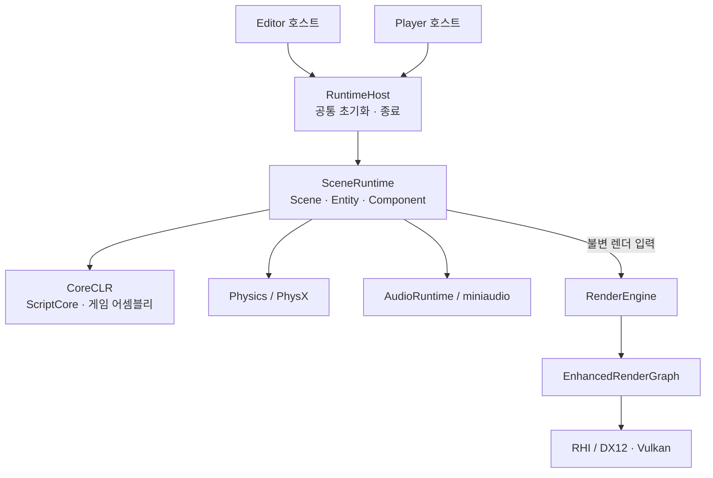
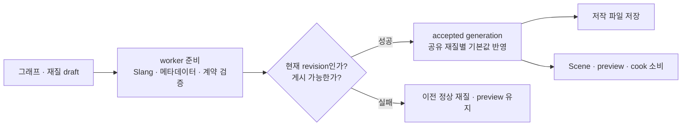
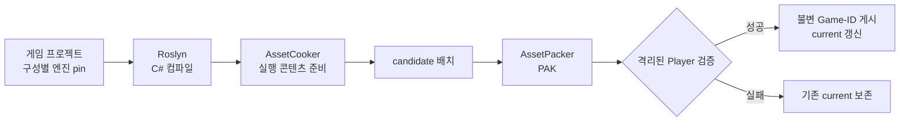

# CreatorEngine 기술설명서

이 문서는 CreatorEngine의 현재 구현을 처음 읽는 개발자를 위한 구조 안내입니다. 개별 기능의 API 전체나 미래 설계는 분야별 문서로 연결합니다.

**기준:** 2026-10-10, master `08d13459a15caa50459bf8b662ee75878afa5635`. 작업 폴더의 미커밋 RG8·GCCE 변경은 기준에 포함하지 않습니다. 이 문서 작성 과정에서는 커밋된 소스·빌드 설정·기존 검증 기록을 대조했으며, 새 빌드나 런타임·GPU 검증은 실행하지 않았습니다. 이후 변경은 현재 소스를 우선해 판단하십시오.

## 목차

- [실행 구조와 모듈 경계](#실행-구조와-모듈-경계)
- [씬 수명과 자원 소유권](#씬-수명과-자원-소유권)
- [작업 실행과 애니메이션](#작업-실행과-애니메이션)
- [렌더링과 RenderGraph](#렌더링과-rendergraph)
- [재질 저작과 실행](#재질-저작과-실행)
- [모델과 텍스처 파이프라인](#모델과-텍스처-파이프라인)
- [에디터의 리소스 자동 처리](#에디터의-리소스-자동-처리)
- [C# 스크립팅과 리플렉션](#c-스크립팅과-리플렉션)
- [물리·오디오·UI](#물리오디오ui)
- [프로파일링과 명령 서비스](#프로파일링과-명령-서비스)
- [빌드·배포·게임 패키징](#빌드배포게임-패키징)
- [구현과 검증의 경계](#구현과-검증의-경계)

## 실행 구조와 모듈 경계

Editor와 Player는 별도 호스트이며 같은 SceneRuntime·RenderEngine·Physics 기반을 사용합니다. Editor의 창·메뉴·저작 서비스는 런타임 위에 놓입니다. Player는 에디터 편집 계층을 링크하는 구조가 아닙니다.

| 모듈 | 책임 |
|---|---|
| [Utility_Framework](../Engine/Utility_Framework/) | 공용 타입·컨테이너, 작업 실행, 로깅, 직렬화와 리플렉션 기반 |
| [SceneRuntime](../Engine/SceneRuntime/) | Scene·Entity·Component, 스크립트 호스팅, 애니메이션·오디오와 렌더 프록시 발행 |
| [Physics](../Engine/Physics/) | PhysX backend, 시뮬레이션과 쿼리·접촉 결과 |
| [RenderEngine](../Engine/RenderEngine/) | 렌더 씬, 재질 프로그램, 콘텐츠 소비, RenderGraph와 RHI |
| [RuntimeHost](../Engine/RuntimeHost/) | 호스트 공통 초기화·종료와 서비스 연결 |
| [EngineDiagnostics](../Engine/EngineDiagnostics/) | 프로파일 수집, 캡처와 진단 데이터 |
| [CommandService](../Engine/CommandService/) | 개발용 명령 등록·실행 계약 |
| [Editor](../Editor/) | 워크스페이스, ViewportHost, 씬·재질·자산 편집과 제품 회귀 |



소스 폴더 이름과 링크 경계는 일치하지 않을 수 있습니다. 실제 경계는 `.vcxproj`의 소스 편입·참조와 [include 경계 검사](../scripts/check_include_boundary.py)를 함께 읽습니다. 부트스트랩 연결은 [EngineBootstrap.h](../Engine/RuntimeHost/EngineBootstrap.h)에 있습니다.

## 씬 수명과 자원 소유권

### Scene → Entity → Component

SceneManager가 GameThread의 `gc::domain`과 Scene root를 관리합니다. Scene은 Entity를, Entity는 Component를 명시적으로 trace합니다. Component에서 owner로 돌아가는 관계는 약한 신원이며, 엔티티 인덱스·generation·계층 규칙은 기존 SceneStore 계약을 유지합니다.

객체 생성은 domain을 받는 factory와 임시 root를 사용합니다. Entity에 Component를 게시한 뒤 스케줄러에 등록하며, 실패 시 등록과 소유권을 되돌립니다. GC 대상에 일반 `new`·스택 생성·`unique_ptr` 소유를 섞지 않습니다. 리플렉션의 저장 속성과 GC trace는 서로 다른 계약이므로 저장 제외 필드도 강한 참조라면 trace해야 합니다.

`SceneManager.cpp`에는 250μs·16단위 예산의 `collect_step` 호출이 있습니다. 이는 요청 예산이며 실제 프레임 비용의 상한을 측정한 결과가 아닙니다. Play/Stop 복원과 종료 수명은 별도 실행 검증 대상입니다.

소스: [SceneManager](../Engine/SceneRuntime/SceneManager.cpp), [Scene](../Engine/SceneRuntime/Scene.h), [Entity](../Engine/SceneRuntime/Entity.h). 세부 계약: [GCCE 통합](design/GCCEIntegration.md).

### 자산과 GPU 수명

GCCE는 Scene 그래프 범위입니다. 자산 캐시·AssetDepot, `ownership_cpp`의 불변 자원 소유자, 네이티브 SDK 객체와 GPU 제출 수명을 대신하지 않습니다.

자산 교체는 새 결과를 준비·검증한 뒤 accepted owner를 게시합니다. 기존 프레임은 자신이 참조한 세대를 계속 보유합니다. CPU 포인터가 살아 있거나 제출 함수가 반환됐다는 사실만으로 GPU 사용 완료를 판단하지 않습니다. allocator·descriptor·transient 자원의 반환은 관련 큐 완료 신호와 연결합니다.

관련 문서: [GPU 메모리 수명](design/RhiGpuMemoryLifetimeDesign.md), [자원 소유권](design/ResourceOwnershipDesign.html), [표시 경로의 소유권과 대기량](design/OwnedBoundedPresentation.md).

## 작업 실행과 애니메이션

[`thread_pool`](../Engine/Utility_Framework/ThreadPool.cpp)과 [`job_scheduler`](../Engine/Utility_Framework/JobScheduler.h)는 enkiTS 워커를 공유합니다. Editor·Player 공통 부트스트랩이 풀 수명을 관리하며, Scene 교체마다 풀을 새로 만들지 않습니다.

자산 준비, 썸네일, 애니메이션 포즈, Foliage·AI 작업, PSO 컴파일과 명령 기록 등이 공용 기반을 소비합니다. Render·Presentation과 장시간 대기하는 전용 루프는 작업 풀과 구분합니다. 자산 준비 worker가 직접 편집 객체를 수정하는 대신, 완료된 소유 결과를 해당 owner의 경계에서 받아 게시합니다.

애니메이션은 포즈 평가를 태스크·청크로 실행하고 LOD와 CPU 버짓을 적용합니다. HUD·진단 카운터는 선택과 비용을 관측합니다. 기하 LOD와 애니메이션 평가 LOD는 다른 기능입니다. 스케줄러 단일화 자체를 CPU 성능 향상의 증거로 보지 않습니다.

세부 문서: [JobScheduler 설계](design/JobSchedulerDesign.md), [작업 스케줄러 이관](plans/TaskSchedulerUnificationPlan.md), [애니메이션 계획과 수용 기록](plans/AnimationSchedulerPlan.md).

## 렌더링과 RenderGraph

### 백엔드와 패스

Editor의 Scene·Game·재질 미리보기와 ImGui 표시는 DX12로 고정되어 있습니다. Player의 런타임 설정은 DX12·Vulkan을 선택하며, RHI와 공용 패스에는 두 backend 구현이 있습니다. DX11은 Lattice 독립 예제·ProfilerViewer의 표시용 경로이며 메인 Scene Renderer backend가 아닙니다.

렌더 입력은 SceneRuntime의 프록시 경계에서 RenderEngine으로 전달됩니다. Slang으로 준비한 프로그램과 실제 재질 바인딩을 공용 패스가 사용하며, RenderGraph가 실행 순서·상태 전이·수명을 컴파일합니다.

### 그래프 컴파일

현재 [`EnhancedRenderGraph`](../Engine/RenderEngine/Render/Graph/EnhancedRenderGraph.h)는 선언 순서 호환 모드, explicit single-writer와 explicit versioned 모드를 갖습니다. 리소스 버전의 producer·consumer와 RAW/WAR/WAW 관계로 live DAG를 구성하고, 유효성 검사·불필요 패스 컬링·의존성 순서·배리어·자원 사용 구간을 처리합니다.

선언 순서 보존 정책도 의존성을 만족해야 하며, 이를 위반하면 오류를 반환합니다. 호환 모드가 남아 있다는 사실을 모든 소비자가 explicit-versioned로 옮겨졌다는 뜻으로 해석하지 않습니다.

리소스를 갱신하는 선언에서 반환한 버전 handle을 이후 consumer에 전달해야 합니다. 이전 버전 handle을 다시 읽는 것과 같은 물리 자원에 접근하는 것은 다른 선언 의미를 갖습니다. compiled 결과와 진단 snapshot은 그래프 오류·뷰어 분석에도 사용합니다.

### 최적화와 채택 조건

- **Transient aliasing:** 단일 전체 순서의 수명 증명과 DX12 배치·회수 경로가 있습니다. 기본 OFF이며 다중 큐 실행에 같은 증명을 재사용하지 않습니다.
- **병렬 기록:** 독립 recording target과 의존성 wave를 사용합니다. 명시적인 owner-thread 기록 부작용이 있는 그래프는 owner 기록을 유지합니다.
- **큐 실행:** graphics·compute 배치, 큐별 상태·hazard 계획, release/acquire와 완료 수명 처리가 구현되어 있습니다. `render.queue.mode 0|1|2`로 기본/owned graphics/compute overlap 요청을 구분합니다.
- **측정 기반 fallback:** 측정 누락·미지원 상태·불충분한 이득은 직렬 경로를 유지합니다. normal frame과 진단 capture의 비용 이력은 구분합니다.

RG8은 master에 구현이 있지만 제품 수용은 진행 상태이며 기본 OFF입니다. 과거 종료 문서의 done 판정은 후속 구조 감사에서 철회됐습니다. 통합 hazard 실행 변경의 소스 착지를 전체 성능·overlap 수용으로 표시하지 않습니다. 일반 cross-queue read 공유, subresource별 독립 스케줄링과 다중 큐 aliasing은 현재 구현 범위로 주장하지 않습니다.

정본: [렌더 로드맵](plans/RenderPhaseRoadmap.md), [RenderGraph 계획](plans/RenderGraphDependencySchedulingPlan.md). 근거: [RG7·RG8 구조 감사](analysis/RenderRg7Rg8StructuralAudit20261009.md), [RG8 통합 실행 경계](analysis/RenderRg8UnifiedExecution20261009.md).

### 메시렛·LOD·HZB

Lattice Scene 경로는 sealed geometry chunk를 메시렛 토폴로지로 준비하고, 지원되는 DX12 기기에서 mesh shader surface·shadow 제출을 사용합니다. 예산·layout·기기 조건이 맞지 않으면 indexed 경로를 유지합니다.

| 기능 | 현재 단위와 동작 |
|---|---|
| 프러스텀 컬링 | mesh shader에서 변형된 메시렛 정점이 같은 clip 평면 밖인지 보수적으로 검사 |
| 기하 LOD | CPU가 저장된 coarse LOD의 화면 오차를 계산해 실제 index level을 선택 |
| 그림자 LOD | 카메라 LOD와 별도 LOD0 제출 유지 |
| HZB | 현재 프레임의 occluder depth와 pyramid를 사용한 draw 단위 거절 |
| 토폴로지 캐시 | geometry·LOD 신원으로 재사용하며 생성 전 예산 초과 시 indexed fallback |

`CREATOR_LX_MESHLETS=0`과 `CREATOR_LX_HZB=0`은 비교·복귀 경로입니다. Scene host identity는 18이며 예전 Scene cooked 제품은 다시 cook해야 합니다. GPU LOD 선택, meshlet 단위 HZB·압축·cone culling, Vulkan meshlet 제품 수용과 전체 성능 이득은 이 구현의 완료 범위가 아닙니다.

소스: [MaterialGraphSceneLod.h](../Engine/RenderEngine/MaterialGraphSceneLod.h), [MaterialGraphSceneHost.cpp](../Engine/RenderEngine/MaterialGraphSceneHost.cpp), [GpuMeshletVisibility](../Engine/RenderEngine/GpuMeshletVisibility.cpp). 실행 기록: [LX 기하 통합](analysis/LatticeGeometryIntegration20261009.md).

## 재질 저작과 실행

### 정본과 소비 관계

| 데이터 | 소유 내용 |
|---|---|
| `.shadergraph` | 노드·링크·그래프 파라미터와 연결된 Surface Settings |
| 재질 `.asset` | 그래프 GUID, 기본값, 텍스처 참조와 재질 플래그 |
| MeshRenderer | 재질 자산 참조와 인스턴스 override |
| 편집 세션 | draft, 비공개 컴파일 후보와 마지막 정상 미리보기 |
| 생성 제품 | `.shadermeta`·Slang 및 컴파일·쿠킹된 프로그램의 소비 계약 |

Material Node Editor는 씬 선택과 독립적으로 재질 자산을 열고 만들 수 있습니다. Inspector에서 여는 그래프는 base 자산을 편집하며, 메시의 instance override와 구분합니다. 그래프 변경은 LX 컴파일·메타데이터·바인딩 검증을 거쳐 accepted generation으로 게시됩니다. GPU pipeline 준비는 기존 비동기 렌더 경로를 따릅니다.



공유 그래프의 재질들은 각각 자신의 기본값으로 검증합니다. stale 완료·호환되지 않는 override·예산 초과·컴파일 실패가 다른 재질을 부분 교체하지 않도록 게시를 제한합니다. 마지막 정상 프레임은 기존 소유자를 보유합니다.

### 현재 편집 동작

master에는 편집 안정화 후 자동 Apply·Save하는 후속 작업이 포함되어 있습니다. 초기 [재질 저작 설계](design/MaterialAssetAuthoring.md)의 수동 Apply/Save 절차는 이 후속 자동화와 함께 읽어야 합니다. 명시적 API는 남아 있고, 새 재질을 선택한 메시로 할당하거나 씬을 저장하는 행동은 별도입니다.

노드·링크·레이아웃은 그래프 문서 Undo/Redo를 사용합니다. 모든 재질 metadata 조작이 같은 Undo 범위에 들어간다고 가정하지 않습니다. 미리보기의 Opaque/Masked 지원을 투명 재질 전체 미리보기 지원으로 확대하지 않습니다. 다중 파일 저장은 충돌 검사·rollback을 갖지만 파일시스템 전체 원자 transaction은 아닙니다.

소스: [MaterialGraphWindow.cpp](../Editor/EngineGUIWindow/MaterialGraphWindow.cpp), [Material.cpp](../Engine/RenderEngine/Material.cpp). 세부 문서: [Slang 생성](design/MaterialSlangCodegen.md), [Scene cook](design/MaterialGraphSceneCook.md), [자동 편집 검증](analysis/AutomaticResourceEditingValidation20261010.md).

## 모델과 텍스처 파이프라인

### 모델

glTF는 fastgltf·simdjson, FBX는 ufbx로 읽습니다. MikkTSpace 탄젠트와 meshoptimizer 기반 geometry 처리, 임베디드 이미지·독립 텍스처의 정체성 및 cook generation을 관리합니다. 런타임 자산은 AssetDepot와 모델 세대 소유권을 통해 소비합니다.

모델 재임포트는 worker에서 준비한 뒤 기존 MeshRenderer·Animator 참조를 갱신합니다. 논리적 모델·메시 신원, 재질 편집과 애니메이션 시간 보존을 목표로 하며 누락·비호환 메시를 무조건 교체하지 않습니다. native cooked model 토폴로지와 LX sealed chunk의 정점 번호가 다를 수 있으므로 메시렛 remap을 무조건 공유하지 않습니다.

### 텍스처

임포트 설정과 원본을 입력으로 DirectXTex 도구 경로가 decode·mip·변환·압축을 수행합니다. 결과는 `.cetex`의 CECT2 description·payload로 준비합니다. BC5 normal reconstruction처럼 재질 소비 계약도 함께 다룹니다.

Editor는 원본·설정의 변경을 준비하며 Player는 cooked texture를 읽습니다. Player에 decode·mip·압축을 남겨 실패를 런타임 cook으로 복구하는 방식이 아닙니다. 내장 blue noise도 authored mip을 보존한 cooked resource로 배포합니다. stb의 이미지 코덱 경로는 정리됐지만 SDF 폰트의 `stb_truetype`은 사용합니다.

캐시·cook 신원은 원본과 설정·producer 계약을 반영합니다. 실패한 cook은 기존 accepted 출력을 유지합니다. 포맷 왕복·제한된 GPU fixture·Player 패키지 통과 기록을 전체 이미지 품질 코퍼스나 모든 backend 압축 포맷 수용으로 확대하지 않습니다.

소스: [TextureImportSettings](../Engine/RenderEngine/Experiment/Cooked/TextureImportSettings.h), [TextureCookProducer](../Engine/RenderEngine/Experiment/Cooked/TextureCookProducer.cpp), [TextureCooker](../Engine/RenderEngine/Experiment/Cooked/TextureCooker.cpp), [AssetCooker](../Tools/AssetCooker/). 현재 실행 범위: [텍스처 파이프라인 검증](analysis/TexturePipelineValidation20261009.md). 초기 경계 분석: [TextureCodecBoundaryDesign](design/TextureCodecBoundaryDesign.md).

## 에디터의 리소스 자동 처리

Editor의 asset watcher와 공통 대기 저장, worker 준비와 owner-thread 게시가 연결되어 있습니다. 설정 편집은 일정 시간 안정화한 뒤 저장하고, 준비된 결과만 현재 세대에 반영합니다.

| 입력 | 자동 처리 | 실패·보존 기준 |
|---|---|---|
| 텍스처 설정·원본 | 저장 → 비동기 cook → 열린 씬 소비 owner 교체 | GUID·원본과 이전 정상 결과 유지 |
| 모델 원본·메타 | worker 재임포트 → renderer·animator 세대 갱신 | 신원·편집 유지, 누락 메시 거부 |
| shader·include·shadermeta | worker 컴파일 → 프로그램 교체 | stale·컴파일 실패·계약 비호환 거부 |
| 재질 그래프 | 안정화·컴파일 → 자동 Apply·Save | 정상 preview, 디스크 충돌 검사 |
| 프리팹 편집 씬 | snapshot 변화 → 자동 저장·기존 instance 갱신 | 기존 override·Undo 정책 유지 |
| 게임 C# 소스 | 변경 감지 → 비동기 빌드 → 재로드·재연결 | 컴파일 실패 시 이전 코드·인스턴스 유지 |
| 렌더 프로필·일반 메타 | 공통 저장 대기열 → 기존 typed 갱신 | 원자 파일 게시·충돌 거부 |

창을 숨기거나 선택을 바꾸는 것과 작업 수명을 분리합니다. 종료 시 대기 저장과 worker를 관련 서비스 해체 전에 정리합니다. 모델·재질·스크립트의 불변 후보가 현재 document/revision과 맞지 않으면 게시하지 않습니다.

모든 외부 파일의 변경이 즉시 화면에 나타난다는 보장은 아닙니다. 준비·GPU pipeline 지연·실패·충돌 상태가 존재하며, 씬 전체 저장과 자산 할당은 별도 사용자 행동입니다.

소스: [EditorAssetDatabase](../Editor/EngineEntry/EditorAssetDatabase.cpp), [EditorScriptAuthoring](../Editor/EngineEntry/EditorScriptAuthoring.cpp), [App](../Editor/EngineEntry/App.cpp). 실제 Debug host에서 확인한 소비자와 미실행 범위는 [자동 처리 기록](analysis/AutomaticResourceEditingValidation20261010.md)을 참고하십시오.

## C# 스크립팅과 리플렉션

### 관리 코드

CoreCLR host가 .NET 10 `ScriptCore`와 게임 어셈블리를 로드합니다. ScriptCore는 네이티브 엔진 API의 C# 표면이며 Roslyn source generator가 바인딩 관련 코드를 생성합니다. 공개 CLR/native 신원은 generation을 포함한 값 handle이고 네이티브 GC 참조 자체를 ABI로 전달하지 않습니다.

게임 소스는 `Assets/Script/**/*.cs`를 읽습니다. 자동 빌드는 중복 파일 알림을 내용 비교로 합치고, 빌드 도중 소스가 바뀌면 다시 준비합니다. 성공하면 기존 `PrepareForReload → ReloadScripts → RestoreAfterReload` 경로로 컴포넌트를 재연결합니다. 직렬화 필드 보존과 임의의 비직렬화 런타임 상태 전체 보존은 다릅니다.

엔진의 ScriptCore·제너레이터 변경은 엔진 빌드 범위입니다. 배포본의 게임 컴파일은 포함된 Roslyn·참조 어셈블리·런타임을 사용하며 별도 NuGet 복원이나 사용자 native plugin ABI를 제공하지 않습니다.

### 리플렉션과 저장

reflgen이 `[[reflgen::reflect]]` 선언에서 타입 서술자를 생성합니다. 엔진 등록소와 `schema_of<T>`가 씬·프리팹 저작 YAML, Inspector, property 명령과 Component 목록에 연결됩니다. 런타임 캐시처럼 저장하지 않을 필드는 `[[reflgen::ignore]]`로 제외합니다.

저작 텍스트는 ryml 기반 YAML이며, 쿠킹된 실행 문서는 별도 바이너리 계약을 사용합니다. 텍스트 parser를 모든 프레임이나 source-free Player의 실행 데이터 소비에 반복 적용하지 않습니다. 저장·복원 계약을 바꾸면 기존 자산·신원·실패 복구도 함께 확인해야 합니다.

소스: [ScriptCore](../ScriptCore/), [ScriptCore.Generators](../ScriptCore.Generators/), [reflgen overlay port](../ports/reflgen/portfile.cmake). 설명: [리플렉션 정본](design/ReflectionDesign.md), [직렬화 계획](plans/SerializationPlan.md).

## 물리·오디오·UI

### 물리

PhysX를 engine backend 경계에서 사용합니다. 컴포넌트의 body·shape 신원과 Scene lifecycle을 연결하고 시뮬레이션 이후 결과를 소비합니다.

C# `ContactStream`은 owner·self/other shape role·phase로 구독을 등록하고 `PostPhysics`에서 빌린 결과 span을 읽습니다. SDK callback에서 CLR을 호출하지 않으며 native 결과를 frame batch로 전달합니다. shape role은 기존 collision layer와 별개이고 Scope 종료 때 구독·binding을 제거합니다. 결과 span의 수명은 해당 소비 경계에 한정됩니다.

접촉 스트림 구현은 complete manifold API나 물리 재설계 전체 완료를 뜻하지 않습니다. [PhysicsContactExecutionContract](design/PhysicsContactExecutionContract.md), [ScriptCore/ContactStream.cs](../ScriptCore/ContactStream.cs), [Physics API 계약](design/PhysicsAPIContract.md)을 참고하십시오.

### 오디오

`AudioRuntime`·PlaybackService·AudioHost가 miniaudio backend를 사용합니다. direct clip/preset, SoundGraph, Scene 소유 emitter/listener와 cooked byte source를 지원합니다. FMOD 제품 의존은 은퇴했고 device/offline/null 동작을 구분합니다.

Windows 제품 빌드, 실제 장치, Editor 전이와 제한된 Player 패키징의 수용 기록이 있습니다. 기록의 장치·시간·fixture 범위를 모든 환경의 음질·driver underrun 보증으로 확대하지 않습니다.

소스: [AudioRuntime](../Engine/SceneRuntime/Audio/AudioRuntime.cpp), [AudioHost](../Engine/SceneRuntime/Audio/AudioHost.cpp). 출처: [miniaudio](../ThirdParty/miniaudio/PROVENANCE.md). 수용 기록: [Windows 오디오 검증](analysis/Phase22AudioWindowsAcceptance20261007.md).

### UI와 텍스트

Scene 소유 UI의 렌더 프록시와 값 타입 제출을 사용합니다. SDF 경로는 TTF/OTF의 필요한 글리프를 `stb_truetype`으로 생성하고, 불변 TextLayout과 atlas owner를 유지합니다. 글리프 추가가 기존 제출 프레임의 픽셀을 덮어쓰지 않도록 새 texture snapshot을 게시합니다.

Game/Player overlay는 UI pass, Scene/Camera/World Canvas는 sprite 평면 경로를 사용합니다. UTF-8 입력 처리·커닝·줄바꿈·정렬이 구현되어 있으나 복잡한 문자 shaping·전체 UI 재설계·모든 화면 품질 수용을 뜻하지 않습니다. ImGui 에디터 폰트와 Scene SDF 폰트는 별도 경로입니다.

소스: [FontAsset](../Engine/RenderEngine/FontAsset.cpp). 계약과 미검증 범위: [SDF 텍스트](design/SdfTextRendering.md), [UI 계획](plans/UISystemRedesignPlan.md).

## 프로파일링과 명령 서비스

CPU/GPU 구간·frame·queue·counter를 수집하며 `.ceprof`로 저장·열기와 지속 녹화 경로를 갖습니다. 메모리 수동 snapshot은 프로세스·힙·자산 객체·주소 지도와 A/B 비교를 제공합니다. 모든 native·managed·GPU 할당의 소유자 추적을 완성한 것은 아닙니다.

별도 `ProfilerViewer.exe`가 캡처 decode·range load·집계와 Win32/D3D11/ImGui 표시를 담당합니다. 엔진은 계측·수집·저장을 소유하고 뷰어는 Scene이나 엔진 RHI를 초기화하지 않습니다. 선택적 DX capture helper와 `.cedx` 경로는 일반 profiler 수집과 구분합니다.

Editor/Player의 개발용 명령 서비스와 Commandlet은 같은 목적의 도구가 아닙니다. 라이브 명령은 실행 중인 owner 경계로 작업을 전달하고, Commandlet은 자동화된 절차를 수행합니다. Shipping Player의 개발용 서비스·진단은 빌드에서 분리합니다.

소스: [EngineDiagnostics](../Engine/EngineDiagnostics/), [CommandService](../Engine/CommandService/). 설명: [연속 녹화](design/ProfilerContinuousRecording.md), [독립 뷰어](design/ProfilerViewerProcess.md), [메모리 프로파일러](plans/MemoryProfilerPlan.md), [명령 서비스 계획](plans/EditorAutomationCLIPlan.md).

## 빌드·배포·게임 패키징

### 개발 환경과 산출물

Windows x64, C++23 preview·MSVC v145·VS 18 계열 MSBuild, .NET 10을 사용합니다. native 의존성은 vcpkg manifest·baseline과 저장소 고정 ThirdParty로 복원합니다. Vulkan 헤더·Slang과 nethost 자료는 저장소에 고정되어 있으며 Vulkan 실행에는 드라이버 로더가 필요합니다.

```text
Bin/x64-<Configuration>/
  Editor/             CreatorEditor.exe + CreatorEditor.runtime.dll
  Player/             Player.exe + Player.runtime.dll
  Tools/              AssetCooker · AssetPacker · CreatorBuildTool · ProfilerViewer
  Runtime/Common/     공용 native 의존성
  Runtime/Editor/     Editor 전용 의존성
  Runtime/Manifests/   호스트 import·ABI·해시 기록
  Managed/            구성별 관리 어셈블리
  Resources/          엔진 리소스
Build/Obj/            프로젝트별 중간 파일
Build/Lib/            구성별 정적 라이브러리
```

작은 EXE가 DLL 검색 경로를 정하고 host runtime DLL을 로드합니다. 정적 엔진 라이브러리는 그 DLL에 링크됩니다. EXE만 복사하는 대신 실행 번들의 전체 배치를 유지합니다. 경로 정본은 [EngineOutput.props](../EngineOutput.props), 중간물·구성은 [Directory.Build.props](../Directory.Build.props)에 있습니다.

### 게임 제작 흐름

CreatorBuildTool은 독립 C# 실행 파일입니다. 엔진 유지보수자가 `publish-engine`으로 호스트·도구·리소스·ScriptCore·Roslyn·private .NET runtime과 라이선스를 배포합니다. 게임 제작자는 이 배포본으로 기존 프로젝트를 연결하고 컴파일·패키징합니다.



`select-engine`은 구성별 pin을 저장합니다. 엔진 ID·API·hash·Debug/Release·Shipping 구성을 일치시켜야 합니다. 성공한 candidate만 게시하며 `--skip-verify`는 미검증 candidate를 남기고 current를 갱신하지 않습니다. `Project` 입력은 외부 프로젝트용, `Workspace`·`Tracked`는 checkout의 Dynamic_CPP용입니다.

현재 pin/open adapter를 정식 `.creatorproject` parser·Launcher·MSI 제품화로 보지 않습니다. 명령과 실제 예제는 [BuildTool 사용법](../BuildTool/README.md)과 [배포 가이드](../Tools/distribution/README.md)를 기준으로 합니다.

### 개발자 검증

[CONTRIBUTING.md](../CONTRIBUTING.md)에 환경과 최소 검사 절차가 있습니다. `EngineAsan=true`는 native ASan 진단 스위치, `EngineShipping=true`는 별도 `x64-Release-Shipping` 산출물과 Player 개발 서비스 분리를 사용합니다. Debug non-unity는 include 자급성과 편입 문제 확인에 사용합니다.

공개 GitHub Actions의 [website workflow](../.github/workflows/website.yml)는 소개 페이지 배포용이며 엔진 빌드·GPU 회귀 CI가 아닙니다. 변경 영역에 맞는 [회귀 검사](../Tools/regression/README.md), [DX12 검증](../Tools/dx12-validation/README.md), [프로파일링 검증](../Tools/profiling-validation/README.md)을 선택합니다.

## 구현과 검증의 경계

| 영역 | master 구현 | 추가로 구분할 범위 |
|---|---|---|
| Editor·백엔드 | DX12 Editor, DX12/Vulkan RHI·Player 경로 | Editor Vulkan 전환을 지원 기능으로 표시하지 않음; Player/backend별 수용은 별도 |
| RenderGraph | 의존성·버전, 기록·수명과 opt-in 큐 실행 | RG7 aliasing·RG8 큐 최적화 기본 OFF; RG8 통합의 제품·성능 채택 미완료 |
| LX geometry | 메시렛 프러스텀, CPU LOD, draw HZB와 fallback | GPU LOD·meshlet HZB·전체 GPU-driven/DXR 수용·성능 이득 |
| 재질 | 자산 기반 그래프 저작·생성 제품·자동 게시 | 모든 조작·투명 preview·Blender 전 품질 대조의 완료는 별도 |
| 텍스처 | DirectXTex 도구 cook, cooked Player 소비·자동 편집 | 전체 포맷·이미지 품질 코퍼스와 모든 GPU 소비자 수용 |
| C# 자동 재연결 | 파일 감지·빌드·직렬화 필드 복원 | Debug 실행 기록을 Release/Shipping·임의 상태 복원으로 확대하지 않음 |
| GCCE | Scene 그래프 tracing·root·점진 수집 | 미커밋 후속 테스트·문서와 성능 주장은 기준에서 제외 |
| 오디오 | miniaudio 제품 전환과 Windows 수용 기록 | 장치·시간·음질 및 underrun 측정 범위 |
| 물리·UI·진단 | contact stream, SDF, 별도 profiler viewer 등의 소스 경로 | 분야별 계획 전체 종료·전 환경 실행 성공 |
| 배포 | 컴파일·cook·PAK·Player 검증·게시 | Launcher·MSI·정식 프로젝트 파일·일반 native plugin ABI |

네트워크 fixed tick·replication, C# 렌더 파이프라인 저작, Hybrid RT/Path Tracing 등 계획서의 목표는 구현 기능 목록에 포함하지 않습니다. 현재 범위는 [문서 색인](README.md), [렌더 정본](plans/RenderPhaseRoadmap.md), [개발 대시보드](RefactoringPlanDashboard.html)에서 분야별로 확인합니다. 과거 분석은 해당 커밋·환경의 기록이며 최신 전체 회귀 통과를 대신하지 않습니다.
