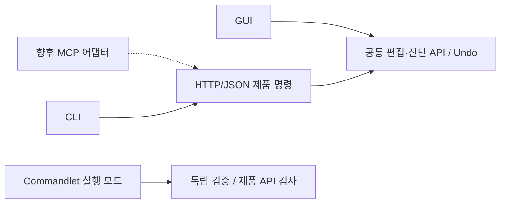

# 엔진 명령 표면 도표 — 2026-09-06

현재 작업 트리의 시드와 등록, 런타임 registry를 대조한 표다. 제품 작업은 공통 편집·진단 API로, 검증은 프로세스 범위 Commandlet으로 실행한다.
[구조 및 검증](CommandSurfaceImplementation.md) · [처분표](CommandSurfaceDisposition.tsv) · [종결 검토](Phase14_5Closure.md)

## 1. 실행 표면

| 표면 | 정식 명령 | 별칭 포함 | 실행 경로 |
|---|--:|--:|---|
| Editor 제품 | 98 | 105 | console·batch·HTTP/JSON; `wait`는 HTTP 실행 제외 |
| Player 제품 | 7 | 7 | Development Player registry; 전용 5개 + 공통 `help`·`quit` |
| 등록형 Commandlet | 100 | 100 | `--commandlet` / `--commandlet-script` |
| 독립 Commandlet | 3 | 3 | 같은 실행 모드, 별도 진입점 표 |

Editor 제품과 Commandlet 103개의 이름 집합은 겹치지 않는다. 제거한 이름은 14개다. MCP 서버는 후속 범위이며 HTTP discovery와 결과를 연결하는 어댑터로 추가한다.

## 2. Editor 제품 명령 — 98개

모든 제품 명령이 `CommandResult`를 반환한다. JSON `parameters` 지원 58개, Undo 선언 21개다. `()`는 인자 없는 스키마다. 빈 칸은 positional `args` 사용이다. 동작에 따라 인자 구성이 달라지는 명령에 허위 스키마를 만들지 않았다.

`Immediate`·`Frames`·`Long`은 스케줄링 분류이며 실행 시간 보장이 아니다. Undo 선언은 편집 작업에만 적용된다. 저장·리로드·관리 코드 실행 등 서비스 작업은 별도 수명과 실패 결과를 갖는다.

### ai — 1

| 명령 | 별칭 | 인자 | 비용 | Undo | JSON parameters | 동작 |
|---|---|---|---|:-:|---|---|
| `ai.status` | - | `[오브젝트]` | Immediate | — | — | AI 레지스트리 등록 수를 낸다(오브젝트를 주면 그 하나) |

### animator — 2

| 명령 | 별칭 | 인자 | 비용 | Undo | JSON parameters | 동작 |
|---|---|---|---|:-:|---|---|
| `animator.param` | - | `<오브젝트> <파라미터> <bool\|float\|int\|trigger>` | Frames | ● | `target,name,type` | Animator 파라미터를 저작한다 |
| `animator.status` | - | — | Frames | — | `()` | Read live Animator palettes and product publication metrics |

### assets — 2

| 명령 | 별칭 | 인자 | 비용 | Undo | JSON parameters | 동작 |
|---|---|---|---|:-:|---|---|
| `assets.modeldiag` | - | — | Immediate | — | `()` | 모델 소비 계수를 읽는다(상태를 바꾸지 않는다) |
| `assets.unload` | - | — | Frames | — | `()` | 사용하지 않는 에셋 캐시 정리 |

### bt — 1

| 명령 | 별칭 | 인자 | 비용 | Undo | JSON parameters | 동작 |
|---|---|---|---|:-:|---|---|
| `bt.status` | bt.reset | — | Immediate | — | `()` | 행동 트리 지표(트리 수·틱 누계·프레임당 경계 통과) |

### camera — 1

| 명령 | 별칭 | 인자 | 비용 | Undo | JSON parameters | 동작 |
|---|---|---|---|:-:|---|---|
| `camera.editor` | - | `match \| follow [on\|off] \| status` | Frames | — | — | 에디터 카메라를 게임 카메라와 같은 시점으로 |

### cli — 2

| 명령 | 별칭 | 인자 | 비용 | Undo | JSON parameters | 동작 |
|---|---|---|---|:-:|---|---|
| `cli.drain.budget` | - | `[<시간ms> <개수>]` | Immediate | — | — | 서비스 큐 드레인 예산을 읽거나 바꾼다(LC5 · SLO 게이트의 변이용) |
| `cli.echo.args` | - | `<인자>` | Immediate | — | — | tokenizer가 만든 토큰을 길이와 함께 되비춘다(LC0 parser golden) |

### commands — 3

| 명령 | 별칭 | 인자 | 비용 | Undo | JSON parameters | 동작 |
|---|---|---|---|:-:|---|---|
| `commands.describe` | - | `<이름>` | Immediate | — | — | 명령 하나의 descriptor 상세를 낸다 |
| `commands.list` | - | `[경로]` | Immediate | — | — | 등록 명령 snapshot 을 TSV 로 낸다(소스 스크래핑 대체) |
| `commands.selftest` | - | — | Immediate | — | — | registry 무결성을 판정한다(이름 중복·요약 누락·descriptor 부재) |

### component — 3

| 명령 | 별칭 | 인자 | 비용 | Undo | JSON parameters | 동작 |
|---|---|---|---|:-:|---|---|
| `component.add` | - | `<오브젝트 이름> <컴포넌트 타입>` | Frames | ● | `target,type` | 오브젝트에 컴포넌트를 붙인다 |
| `component.list` | - | `[filter]` | Immediate | — | `filter=` | 등록된 컴포넌트 타입을 로그에 남긴다 |
| `component.remove` | - | `<target> <component>` | Frames | ● | `target,component` | Remove an optional component with Undo |

### crash — 1

| 명령 | 별칭 | 인자 | 비용 | Undo | JSON parameters | 동작 |
|---|---|---|---|:-:|---|---|
| `crash.status` | - | — | Immediate | — | `()` | 크래시 덤프 기록자 등록 여부와 덤프 경로를 확인한다 |

### dump — 2

| 명령 | 별칭 | 인자 | 비용 | Undo | JSON parameters | 동작 |
|---|---|---|---|:-:|---|---|
| `dump.list` | - | `[limit]` | Immediate | — | `limit:integer=10` | 크래시 덤프 목록을 최대 limit개 조회한다 |
| `dump.show` | - | `[limit]` | Immediate | — | `limit:integer=10` | 덤프 목록과 최신 덤프 요약을 조회한다 |

### dx12 — 1

| 명령 | 별칭 | 인자 | 비용 | Undo | JSON parameters | 동작 |
|---|---|---|---|:-:|---|---|
| `dx12.live` | - | `on\|status` | Immediate | — | `action=status` | EnhancedRenderer 메인 런타임 상태 |

### game — 1

| 명령 | 별칭 | 인자 | 비용 | Undo | JSON parameters | 동작 |
|---|---|---|---|:-:|---|---|
| `game.pak` | - | — | Long | — | — | Release Player 패키지를 빌드·검증 후 Build/Staging에 게시한다 |

### gc — 2

| 명령 | 별칭 | 인자 | 비용 | Undo | JSON parameters | 동작 |
|---|---|---|---|:-:|---|---|
| `gc.collect` | - | — | Frames | — | `()` | 관리 힙 확정 수집(씬 전환이 자동으로 부르는 그 경로) |
| `gc.stats` | gc.delta | — | Immediate | — | `label=` | 관리 힙 지표를 낸다(gc.delta는 직전 대비 증감) |

### gpu — 2

| 명령 | 별칭 | 인자 | 비용 | Undo | JSON parameters | 동작 |
|---|---|---|---|:-:|---|---|
| `gpu.baseline` | - | — | Frames | — | `()` | 현재 상태를 기준선으로 삼는다 |
| `gpu.census` | gpu.delta | `[라벨]` | Frames | — | `label=` | VRAM과 엔진 에셋 수를 로그에 기록 |

### help — 1

| 명령 | 별칭 | 인자 | 비용 | Undo | JSON parameters | 동작 |
|---|---|---|---|:-:|---|---|
| `help` | - | `[명령]` | Immediate | — | — | 명령 목록 또는 명령 하나의 상세를 낸다 |

### lifecycle — 3

| 명령 | 별칭 | 인자 | 비용 | Undo | JSON parameters | 동작 |
|---|---|---|---|:-:|---|---|
| `lifecycle.dump` | - | `[파일]` | Immediate | — | `path=lifecycle_trace.tsv` | 기록을 TSV로 쓴다(기록 0건이면 실패로 끝난다) |
| `lifecycle.registry` | - | — | Frames | — | `()` | 생명주기 등록 수와 대기 중인 초기화 수를 조회한다 |
| `lifecycle.trace` | - | `on [틱프레임]\|off\|clear\|status` | Frames | — | — | 생명주기 호출 순서를 받아 적는다 |

### log — 1

| 명령 | 별칭 | 인자 | 비용 | Undo | JSON parameters | 동작 |
|---|---|---|---|:-:|---|---|
| `log.flush` | - | — | Immediate | — | `()` | 로그를 디스크에 즉시 반영 |

### mem — 4

| 명령 | 별칭 | 인자 | 비용 | Undo | JSON parameters | 동작 |
|---|---|---|---|:-:|---|---|
| `mem.delta` | - | `[라벨]` | Immediate | — | `label=` | 기준선 대비 CRT 블록·바이트 증감(기준선이 없으면 지금을 기준선으로 삼는다) |
| `mem.hook` | - | `on\|stack\|off\|top\|status` | Immediate | — | — | CRT 할당 훅 — 호출 계수, stack 은 귀속까지(디버그 CRT 전용) |
| `mem.reset` | - | — | Immediate | — | `()` | churn 누계와 기준선을 0으로 — 구간 측정용 |
| `mem.stats` | - | `[라벨]` | Immediate | — | `label=` | CRT 현재 live 블록·바이트를 찍는다(누계는 mem.hook 이 따로 센다) |

### model — 3

| 명령 | 별칭 | 인자 | 비용 | Undo | JSON parameters | 동작 |
|---|---|---|---|:-:|---|---|
| `model.load` | - | `<경로>` | Long | — | `path` | 모델을 에셋으로 임포트한다(fbx/gltf/glb/obj) |
| `model.loadcached` | - | `<모델 경로>` | Long | — | `path` | 에디터 드롭 경로(LoadCachedModelShared)로 모델을 연다 |
| `model.place` | - | `<이름>` | Frames | ● | `model` | 임포트한 모델을 활성 씬에 배치한다 |

### object — 9

| 명령 | 별칭 | 인자 | 비용 | Undo | JSON parameters | 동작 |
|---|---|---|---|:-:|---|---|
| `object.create` | - | `<이름> [타입]` | Frames | ● | `name,type=Empty` | 빈 오브젝트를 만든다(Empty/Light/Camera/Mesh) |
| `object.delete` | - | `<target>` | Frames | ● | `target` | Delete an object subtree with Undo |
| `object.describe` | - | `<name-or-id>` | Immediate | — | `target` | Read object identity and name |
| `object.duplicate` | - | `<오브젝트> [새 이름]` | Frames | ● | `target,name=` | 오브젝트를 복제한다(에디터 Ctrl+D와 같은 원시 함수) |
| `object.parent` | - | `<자식> <부모 \| ->` | Frames | ● | `target,parent` | 오브젝트의 부모를 바꾼다(-는 씬 루트로 올린다) |
| `object.properties` | - | `<target> <component>` | Immediate | — | `target,component` | Read reflected component fields and values |
| `object.property` | - | `<오브젝트> <컴포넌트> <필드> <값>` | Frames | ● | `target,component,field,value:value` | 리플렉션으로 프로퍼티를 설정한다 |
| `object.rename` | - | `<name-or-id> <new-name>` | Immediate | ● | `target,name` | Rename through the shared editor undo transaction |
| `object.transform` | - | `<이름> <px py pz> [rx ry rz] [sx sy sz]` | Frames | ● | `target,position:vec3,rotation:vec3=0 0 0,scale:vec3=1 1 1` | 변환을 지정한다(회전은 도) |

### pipeline — 1

| 명령 | 별칭 | 인자 | 비용 | Undo | JSON parameters | 동작 |
|---|---|---|---|:-:|---|---|
| `pipeline.nodes` | - | — | Immediate | — | `()` | 라이브 파이프라인의 노드 조립 결과를 한 줄씩 낸다 |

### pix — 1

| 명령 | 별칭 | 인자 | 비용 | Undo | JSON parameters | 동작 |
|---|---|---|---|:-:|---|---|
| `pix.capture` | - | `begin\|end\|status` | Frames | — | `action=status` | PIX 주입 실행의 명시적 GPU 캡처 경계 |

### play — 2

| 명령 | 별칭 | 인자 | 비용 | Undo | JSON parameters | 동작 |
|---|---|---|---|:-:|---|---|
| `play` | stop | — | Frames | — | `()` | 에디터의 재생·정지와 같은 동작 |
| `play.state` | - | — | Immediate | — | — | 재생 상태(gameStart·paused·씬 로드)를 낸다 |

### prefab — 6

| 명령 | 별칭 | 인자 | 비용 | Undo | JSON parameters | 동작 |
|---|---|---|---|:-:|---|---|
| `prefab.create` | - | `<오브젝트 이름> <프리팹 이름>` | Frames | — | — | 오브젝트로 프리팹을 만들어 저장한다 |
| `prefab.instantiate` | - | `<프리팹 이름> [인스턴스 이름]` | Frames | ● | `prefab,name=` | 프리팹을 씬에 소환한다 |
| `prefab.objectguid` | - | `<오브젝트 이름>` | Immediate | — | — | 오브젝트의 프리팹 objectGuid를 낸다 |
| `prefab.overrides` | - | `<오브젝트>` | Immediate | — | — | 프리팹 인스턴스에 기록된 오버라이드를 나열한다 |
| `prefab.status` | - | — | Immediate | — | — | 프리팹 등록·캐시 상태를 낸다 |
| `prefab.update` | - | `<소스 오브젝트> <프리팹 이름>` | Frames | — | — | 기존 프리팹을 소스 오브젝트로 갱신한다 |

### profile — 1

| 명령 | 별칭 | 인자 | 비용 | Undo | JSON parameters | 동작 |
|---|---|---|---|:-:|---|---|
| `profile.stats` | - | — | Immediate | — | `()` | 프로파일러 자체 비용과 용량 소진(교란 없음) |

### quit — 1

| 명령 | 별칭 | 인자 | 비용 | Undo | JSON parameters | 동작 |
|---|---|---|---|:-:|---|---|
| `quit` | exit | — | Immediate | — | — | 호스트를 종료한다 |

### render — 4

| 명령 | 별칭 | 인자 | 비용 | Undo | JSON parameters | 동작 |
|---|---|---|---|:-:|---|---|
| `render.backend` | - | `status` | Immediate | — | `action=status` | 부팅 시 고정된 scene/ImGui RHI 조회(변경은 Settings) |
| `render.matmode` | - | `<오브젝트> <opaque\|transparent>` | Immediate | ● | `target,mode` | 오브젝트 재질의 렌더링 모드를 바꾼다 |
| `render.rtinfo` | - | — | Immediate | — | `()` | 창·뷰포트·추종 텍스처 크기를 나란히 찍는다 |
| `render.shadowinfo` | - | — | Immediate | — | `()` | 그림자 캐스케이드 계산 결과를 출력한다(스냅샷 검증용) |

### scene — 15

| 명령 | 별칭 | 인자 | 비용 | Undo | JSON parameters | 동작 |
|---|---|---|---|:-:|---|---|
| `scene.bonedump` | - | `[개수]` | Frames | — | — | 대조 덤프 — 뼈 오브젝트 이름 vs 스켈레톤 뼈 이름(조회 실패 진단) |
| `scene.ddol` | - | `<이름>` | Frames | — | — | 오브젝트를 DontDestroyOnLoad로 — 씬 이송 경로 시험용 |
| `scene.dump` | - | `[라벨]` | Immediate | — | — | 활성 씬의 오브젝트 계층을 로그에 남긴다 |
| `scene.flag` | - | `[<dirtytraversal\|bonecache> [0\|1]]` | Immediate | — | — | 씬 진단 플래그를 읽거나 바꾼다(인자 없으면 전부 조회) |
| `scene.hierarchycheck` | - | — | Frames | — | `()` | 씬 계층의 불변식을 전수 점검한다(고아·쌍불일치·순회미도달) |
| `scene.load` | scene.switch | `<경로>` | Long | — | — | 씬을 로드한다(활성 씬은 그대로) |
| `scene.new` | - | `[이름]` | Frames | — | — | 빈 씬을 만들어 활성화한다(기능 테스트 씬 저작용) |
| `scene.save` | - | `<경로>` | Frames | — | — | 활성 씬을 .creator로 저장한다 |
| `scene.select` | - | `<오브젝트 이름>` | Immediate | ● | `target` | 오브젝트를 에디터 선택으로 지정한다 |
| `scene.selection` | - | `<라벨>` | Immediate | — | — | 단일 선택과 복수 선택을 따로 낸다(둘의 어긋남을 드러낸다) |
| `scene.sparseresolver` | - | `0\|1\|print` | Frames | — | — | X5 dirty-root sparse resolve·A/B 검사 |
| `scene.transformdigest` | - | `[라벨]` | Frames | — | — | 활성 씬 전체의 트랜스폼 값 다이제스트(저장·재로드 대조용) |
| `scene.transformpull` | - | `[print]` | Frames | — | — | X6 C# 즉시 pull 계측 스냅샷을 조회한다 |
| `scene.transformstats` | - | `[0\|1\|print]` | Frames | — | — | X0 UI/Spatial·단계·구성·프레임 topology 계측 |
| `scene.transformwritestats` | - | `[0\|1\|print]` | Frames | — | — | X1 로컬 쓰기 publish 출처 계측 |

### script — 6

| 명령 | 별칭 | 인자 | 비용 | Undo | JSON parameters | 동작 |
|---|---|---|---|:-:|---|---|
| `script.add` | - | `<오브젝트> <타입>` | Frames | — | — | C# 스크립트를 오브젝트에 부착한다 |
| `script.fields` | - | `<id>` | Frames | — | `instance:integer` | 스크립트의 노출 필드와 현재 값을 확인한다 |
| `script.invoke` | - | `<타입> <메서드> [인자]...` | Long | — | — | 표식된 static 메서드를 호출한다([EngineCallable] 없는 것은 거부) |
| `script.reload` | - | — | Frames | — | — | 게임 스크립트 어셈블리를 다시 로드한다(핫리로드) |
| `script.set` | - | `<id> <인덱스> <값>` | Frames | — | `instance:integer,index:integer,value` | 노출 필드 값을 바꾼다 |
| `script.status` | - | — | Immediate | — | — | CLR 상태와 활성 스크립트 수를 확인한다 |

### tag — 4

| 명령 | 별칭 | 인자 | 비용 | Undo | JSON parameters | 동작 |
|---|---|---|---|:-:|---|---|
| `tag.add` | - | `<name>` | Immediate | ● | `name` | Add and persist a project tag with Undo |
| `tag.has` | - | `<name>` | Immediate | — | `name` | Query a project tag |
| `tag.list` | - | — | Immediate | — | `()` | Read project tags and layers |
| `tag.remove` | - | `<name>` | Immediate | ● | `name` | Remove and persist a project tag with Undo |

### ui — 7

| 명령 | 별칭 | 인자 | 비용 | Undo | JSON parameters | 동작 |
|---|---|---|---|:-:|---|---|
| `ui.anchor` | - | `<오브젝트> <minX> <minY> <maxX> <maxY>` | Frames | ● | `target,minX:number,minY:number,maxX:number,maxY:number` | 앵커를 직접 지정한다 |
| `ui.hitbox` | - | — | Frames | — | — | 버튼의 rect와 클릭 판정 상자를 나란히 출력한다 |
| `ui.pos` | - | `<target> <x> <y>` | Frames | ● | `target,x:number,y:number` | UI anchored position을 편집한다 |
| `ui.rect` | - | `<오브젝트\|*>` | Frames | — | — | 오브젝트 이하의 worldRect·sizeDelta·앵커·배율을 출력한다 |
| `ui.screenpos` | - | `<target> <x> <y>` | Frames | ● | `target,x:number,y:number` | UI 화면 위치를 편집한다 |
| `ui.size` | - | `<target> <x> <y>` | Frames | ● | `target,x:number,y:number` | UI 크기를 편집한다 |
| `ui.status` | - | — | Immediate | — | — | UI 계층·캔버스 연결 상태를 낸다 |

### undo — 2

| 명령 | 별칭 | 인자 | 비용 | Undo | JSON parameters | 동작 |
|---|---|---|---|:-:|---|---|
| `undo` | redo | — | Frames | ● | `()` | 에디터의 Ctrl+Z / Ctrl+Y와 같은 호출 |
| `undo.state` | - | `<라벨>` | Immediate | — | — | 편집 스택과 게임 스택의 Undo 깊이를 따로 낸다 |

### wait — 1

| 명령 | 별칭 | 인자 | 비용 | Undo | JSON parameters | 동작 |
|---|---|---|---|:-:|---|---|
| `wait` | - | `<프레임>` | Immediate | — | — | 지정 프레임만큼 다음 명령을 미룬다 |

### window — 2

| 명령 | 별칭 | 인자 | 비용 | Undo | JSON parameters | 동작 |
|---|---|---|---|:-:|---|---|
| `window.info` | - | — | Immediate | — | `()` | 엔진이 인식하는 클라이언트 크기를 출력한다 |
| `window.resize` | - | `<너비> <높이>` | Frames | — | `width:integer,height:integer` | 창 클라이언트 크기를 바꾼다(해상도 검증용) |

## 3. Commandlet — 103개

검증 완료 후 역할이 끝난 일회성 하네스는 제거한다. 현재 제품 계약을 지키는 회귀·측정 Commandlet은 유지한다. 코퍼스 요구사항과 실제 실행 성공은 별개다. 모든 정상 반환 경로는 terminal 결과를 내며, `crash.test`의 유효한 입력은 덤프 검증을 위해 프로세스를 의도적으로 종료한다.

| 명령 | 인자 | 비용 | 검증 |
|---|---|---|---|
| `animator.scene.probe` | — | Frames | Animator 컨트롤러 그래프를 scene reflection YAML로 왕복시킨다 |
| `asset.guid.rename.probe` | — | Frames | 자산 GUID가 이름 변경을 건너 보존되는지 본다(재질 왕복 포함) |
| `assets.generation` | `<project root>` | Long | UUIDv8 model generation closure·원자 cache publish/retire 검증 |
| `assets.generationcorpus` | `<content root>` | Long | 현재 MBC4 model corpus generation cold-load 검증 |
| `assets.identity` | — | Long | 자산 identity(UUID·epoch·프로필) 전수 계약을 판정한다 |
| `assets.modelbench` | `<dir\|-> <반복> [cooked\|author]` | Long | 모델 로드·저작 트랜잭션 시간과 peak working set을 잰다 |
| `assets.modelrender` | — | Frames | 모델 렌더 배선(mesh·재질 해석)을 판정한다 |
| `assets.scenemodel` | `[reload <모델 이름>]` | Frames | 활성 씬의 모델 소비가 typed generation handle로 서 있는지 본다 |
| `assets.sidecar` | — | Long | 모델 sidecar v2 스키마를 전수로 판정한다 |
| `blackboard.authoring.probe` | `<이름> [empty\|noname]` | Frames | Blackboard 저장·재로드 왕복으로 키 값이 살아 돌아오는지 본다 |
| `collisionmatrix.authoring.probe` | `[escape]` | Frames | 충돌 행렬 저장·재로드 왕복과 설정 루트 이탈 거부를 본다 |
| `crash.test` | `[av\|abort\|terminate\|throw]` | Immediate | 의도적인 프로세스 종료로 덤프 경로를 검증한다 |
| `dx12.decal` | — | Frames | 데칼 패스 검증(상자 판정·하늘 게이트·원본 혼합 3종·배칭) |
| `dx12.descriptorheap` | — | Frames | descriptor version recycler 검증(completion·Abort·격리·넘침) |
| `dx12.fog` | — | Frames | 볼류메트릭 포그 검증(산란·누적 투과율·시간축 히스토리·합성) |
| `dx12.forward` | — | Long | DX12 forward 패스를 격리 씬에서 리드백으로 판정한다 |
| `dx12.forwardshade` | — | Long | DX12 forward 셰이딩 결과를 리드백으로 판정한다 |
| `dx12.gbuffer` | — | Frames | GBuffer 패스 검증(입력조립·MRT5·깊이·그래프 배리어) |
| `dx12.gizmoicon` | — | Frames | 기즈모 아이콘 패스 검증(빌보드 회전·알파 상한·배칭) |
| `dx12.gizmoline` | — | Frames | 기즈모 라인 패스 검증(도형 정점 수·픽셀·드로우 병합) |
| `dx12.gizmoscene` | — | Frames | Gizmo 씬 연결 검증(밀봉 복사·4패스 체인·타깃 공유) |
| `dx12.grid` | — | Frames | 그리드 패스 검증(라인·셀 내부·밀도·카메라 반응) |
| `dx12.ibl` | — | Frames | IBL 생성 체인 검증(rect→cube·조도·프리필터·BRDF LUT) |
| `dx12.iblshade` | — | Frames | IBL 앰비언트 소비 검증(끔=검정·조도 방향성·금속 정반사) |
| `dx12.parallel` | — | Frames | 커맨드 기록 병렬화 검증(링 원자성·순차 대비 동일성) |
| `dx12.post` | — | Frames | DX12 후처리 패스를 리드백으로 판정한다 |
| `dx12.psocache` | `[파일]` | Frames | PSO 캐시 자가 검증(2회차 컴파일 0건) |
| `dx12.rendergraph` | — | Frames | 렌더 그래프 검증(순서·흐름·배리어·컬링·실행) |
| `dx12.resize` | — | Frames | 크기 추종 검증(DX11 정책·DX12 리사이즈·리사이즈 후 렌더) |
| `dx12.scene` | — | Long | 씬 연결 검증(카메라 스냅샷·메시 업로드·실제 드로우) |
| `dx12.selftest` | `<texture-path> [output]` | Frames | DX12 브링업 자가 검증(삼각형 렌더 → PNG) |
| `dx12.shadowquality` | — | Frames | 그림자 품질 검증(경사 비례 편향·캐스케이드 경계 블렌딩 A/B) |
| `dx12.skinning` | — | Frames | GBuffer 스키닝 검증(본 이동·가중 혼합·비스킨드 불변) |
| `dx12.skybox` | — | Frames | 스카이박스 패스 검증(면 방향·원평면 밀어넣기·전면 커버) |
| `dx12.ssao` | — | Frames | DX12 SSAO 패스를 리드백으로 판정한다 |
| `dx12.ssgi` | — | Frames | DX12 SSGI 패스를 리드백으로 판정한다 |
| `dx12.ssr` | — | Frames | SSR 패스 검증(반사 발생·금속 마스크·두께 게이트·비트플래그) |
| `dx12.sss` | — | Frames | SSS 패스 검증(번짐·축 분리·표면 추종·에너지) |
| `dx12.ui` | — | Frames | DX12 UI 패스를 리드백으로 판정한다 |
| `dx12.wireframe` | — | Frames | 와이어프레임 패스 검증(변·내부 비채움·인스턴싱·메시 캐시) |
| `experiment.animevent` | `seed\|verify` | Frames | 애니메이션 이벤트·루프 오버라이드의 소유 이관을 판정한다 |
| `experiment.animmask` | — | Frames | AvatarMask 트리 생성을 legacy 재귀와 A/B로 대조한다 |
| `experiment.animpose` | `<0..1> [클립]` | Frames | 클립의 특정 지점 포즈를 고정 계산해 판정한다 |
| `experiment.animtick` | — | Frames | Animator 틱 경로의 패리티를 판정한다 |
| `experiment.boneresolve` | — | Frames | 본 이름 해석 창구를 전수 A/B로 대조한다 |
| `experiment.catalog` | `[Derived부모]` | Frames | CEMF catalog — 전 GUID 해석·내용 검증·폐포 위상 순서 |
| `experiment.cooked` | `[경로]` | Long | 쿠킹 포맷 왕복 무손실·거부 동작(경로를 주면 실자산 왕복까지) |
| `experiment.editorsurface` | — | Frames | 에디터 표면 질의(클립 축·mesh 축)의 A/B 동치를 판정한다 |
| `experiment.foliage` | `seed <asset-directory> <model-path> \| verify` | Frames | Foliage 메시의 experiment 핸들 합류를 합성으로 판정한다 |
| `experiment.matcook` | `[루트 재질 모델]` | Long | 재질 의존 폐포 — standalone 재질 + 모델의 임베디드 texture 추출 |
| `experiment.matruntime` | `[edit \| seed <asset-directory> <texture-path>]` | Frames | 런타임 MaterialInstance 경로를 판정한다 |
| `experiment.scenecook` | `[루트 씬]` | Long | scene/prefab 의존 추출 — 자기참조 제외·못 그린 참조 계수 |
| `experiment.skinbounds` | — | Frames | 스킨 팔레트의 유한성·인덱스 범위·크기 상한을 판정한다 |
| `foliage.authoring.probe` | `<이름> [escape]` | Frames | Foliage 저작 트랜잭션 왕복과 루트 이탈 거부를 본다 |
| `inputmap.authoring.probe` | `<save\|verify> <이름>` | Frames | 입력 액션맵 저장·재기동 왕복으로 payload 복원을 본다 |
| `inputmap.corpus.probe` | — | Long | 입력 액션맵 코퍼스를 전수로 읽어 계수를 낸다 |
| `lifecycle.stress` | `destroy\|churn\|reentrant [개수]` | Frames | 수명 경로를 흔든다(reentrant는 순회 한복판) |
| `material.corpus.probe` | `<이름> ...` | Long | standalone material identity/reference 왕복 |
| `object.rootref` | `<오브젝트> [루트\|-]` | Frames | Bone형 same-scene root 참조를 설정/조회한다 |
| `prefab.corpus.digest` | `<라벨> <이름> ...` | Long | prefab identity/override 왕복 digest |
| `profile.selftest` | — | Frames | CPU 프로파일러 특성화 검사(중첩·멀티스레드·프레임경계·용량초과) |
| `reflect.golden` | `[출력 경로]` | Long | 등록된 전 타입의 직렬화 출력을 골든 문서로 쓴다 |
| `render.livecheck` | `[너비 높이]` | Immediate | resize·다중 뷰·표시 슬롯 회전 회귀 판정 |
| `rhi.uploadsegments` | `<model-path> <texture-path>` | Frames | DX12/Vulkan 완료점 기반 업로드 세그먼트 공통 검증 |
| `scene.executiongraph` | `probe\|bench <N> [samples]` | Frames | X4 packed projection 불변식·compile 비용 검사 |
| `scene.hierarchymutation` | `probe` | Frames | X3 reparent 검증·대칭성·topology version 검사 |
| `scene.proxybench` | `<프레임수> [등록수]` | Long | X8 정지 dirty-queue 커밋 비용(선택: 합성 등록수) |
| `scene.proxydirty` | `probe` | Frames | X8 frame-persistent render dirty mask·generation 검사 |
| `scene.sparseresolver.check` | `probe\|bench [arguments]` | Long | Scoped transform regression |
| `scene.transformbulk` | `probe <pose-model-path> <rebind-model-path>` | Frames | X7 Animator pose·Physics world batch·Socket barrier 검사 |
| `scene.transformdomains` | `probe` | Frames | X2 UI/Spatial 독립 dirty gate·paused/subtree 검사 |
| `scene.transformpull.check` | `probe` | Long | Scoped transform regression |
| `scene.transformwritestats.check` | `probe` | Long | Scoped transform regression |
| `scene.traversalbench` | `<오브젝트수> <프레임수> [flat\|wide\|deep\|skeleton]` | Long | X0 Release 벤치(0=현재 씬) |
| `serialize.bench` | `boot \| scene <경로> [반복] \| prefab <이름> [반복]` | Long | 직렬화 경로별 시간을 잰다 |
| `serialize.nodeequal` | — | Frames | 저작 노드 구조 비교 규칙을 판정한다(맵 키 순서 무시가 의도) |
| `serialize.rymlerror` | — | Frames | ryml 에러 정책이 abort를 막는지 판정한다 |
| `shadermeta.probe` | — | Frames | ShaderMeta 실자산 수용과 잘못된 문서 거절을 함께 판정한다 |
| `terrain.authoring.probe` | `<이름> <텍스처\|->` | Frames | Terrain writer 트랜잭션 회귀 검사 |
| `ui.navprobe` | — | Frames | UI 내비게이션 저작 계층을 세워 탐색 결과를 판정한다 |
| `vk.decal` | — | Long | Decal 공용 패스 — GBuffer snapshot·depth-read·MRT blend 대조 |
| `vk.deferred` | — | Frames | Deferred 공용 패스 — GBuffer consume·fullscreen DX12/Vulkan 대조 |
| `vk.fog` | — | Frames | VolumetricFog 공용 패스 — 3D scatter/history/composite 대조 |
| `vk.forward` | — | Frames | Forward+ 공용 패스 — compute·buffer·blend·mesh DX12/Vulkan 대조 |
| `vk.gbuffer` | — | Long | GBuffer 공용 패스 — MRT5·texture·sampler·mesh DX12/Vulkan 대조 |
| `vk.gizmoicon` | — | Frames | 실제 Camera Gizmo PNG — 2D SRV·root instance 픽셀 대조 |
| `vk.gizmoline` | — | Frames | GizmoLine 공용 패스 — line-list 전체 RGBA DX12/Vulkan 대조 |
| `vk.grid` | — | Frames | 그리드 패스를 Vulkan 으로 — dx12.grid 와 픽셀 대조(5d) |
| `vk.ibl` | — | Frames | IBL 생성기를 Vulkan 으로 — 면·밉·LUT DX12 픽셀 대조 |
| `vk.parallel` | — | Frames | Vulkan RenderGraph 병렬 command pool·제출·픽셀 검증 |
| `vk.post` | — | Frames | PostChain 공용 패스 — bloom/tonemap/vignette/FXAA 대조 |
| `vk.selftest` | `<model-path> <texture-path> [output]` | Frames | Vulkan 골격 자가 검증(디바이스·중립 서비스 경로·스왑체인 → PNG) |
| `vk.shadow` | — | Frames | Shadow 공용 패스 — depth array·mesh DX12/Vulkan 대조 |
| `vk.skybox` | — | Frames | 스카이박스를 Vulkan 으로 — 큐브 SRV·정적 샘플러 픽셀 대조 |
| `vk.ssao` | — | Frames | SSAO 공용 패스 — depth/normal compute·filter DX12/Vulkan 대조 |
| `vk.ssgi` | — | Frames | SSGI 공용 패스 — Hi-Z·temporal·filter·composite 대조 |
| `vk.ssr` | — | Frames | SSR 공용 패스 — ray hit·metal/thickness/bitmask 픽셀 대조 |
| `vk.sss` | — | Frames | SSS 공용 패스 — 2축 blur·depth gate 전체 픽셀 대조 |
| `vk.ui` | — | Frames | UI 공용 패스 — layer·blend·texture batch DX12/Vulkan 대조 |
| `vk.wireframe` | — | Frames | WireFrame 공용 패스 — non-solid fill·skinning DX12/Vulkan 대조 |
| `experiment.matmigrate` | — | 독립 진입점 | 합성 검사와 실제 제품 경로 검사 |
| `experiment.matresolve` | — | 독립 진입점 | 합성 검사와 실제 제품 경로 검사 |
| `experiment.matscript` | — | 독립 진입점 | 합성 검사와 실제 제품 경로 검사 |

## 4. Player 제품 — 7개

Shipping에서는 명령 서비스·소켓이 빌드에서 제외된다. 아래는 Development 제공 범위다.

| 명령 | 인자 | 동작 |
|---|---|---|
| `help` | `[명령]` | 명령 목록 또는 명령 하나의 상세를 낸다 |
| `player.move` | `<이름> <x> <y> <z>` | 오브젝트의 로컬 위치를 옮긴다(재시작 없이 반영된다) |
| `player.object` | `<이름>` | 오브젝트 하나의 위치·회전·크기를 낸다 |
| `player.objects` | `[이름 조각]` | 활성 씬의 오브젝트 이름을 나열한다 |
| `player.scene` | — | 활성 씬 이름과 오브젝트 수를 낸다 |
| `player.status` | — | 프레임 수·재생 상태·명령 큐 깊이를 낸다 |
| `quit` | — | 호스트를 종료한다 |

## 5. 제거 및 분리

| 이름 | 정리 결과 |
|---|---|
| `cli.probe.timing` | 종료된 LC0 지연 계측 제거; HTTP 요청 timing 사용 |
| `commands.dump` | 종료된 등록 스냅샷 제거; `commands.list` 사용 |
| `dx12.bench11` | 완료된 DX11/DX12 비용 비교와 전용 구현 제거 |
| `dx12.encoderbench` | 완료된 encoder 선택 벤치와 전용 구현 제거 |
| `dx12.forwardscale` | 광원 수별 시간 비교 제거; `dx12.forwardshade` 픽셀 비교 유지 |
| `dx12.postscale` | Uber/분리 패스 시간 비교 제거; `vk.post` 픽셀 비교 유지 |
| `dx12.ssaoscale` | 시간 비교 및 제품 SSAO의 옛 참조 PSO·셰이더 제거 |
| `experiment.animlive` | 제품 진단 `animator.status`로 이전 |
| `experiment.matparity` | 폐기된 legacy material packer의 종료된 대조 검사 제거 |
| `perf.reflect` | 종료된 CT7 측정 및 소비자의 측정 전용 준비 제거; `reflect.golden` 유지 |
| `selftest` | 통합 검증 진입점 제거; 별도 Commandlet 실행 경로 사용 |
| `tag.authoring.probe` | 제품 `tag.list/has/add/remove`로 이전 |

| `animator.state` | 사용하지 않는 상태·스크립트 강제 실행 하네스 제거; 정상 Animator 전이 경로 유지 |
| `animator.exit` | 사용하지 않는 강제 상태 종료 하네스 제거 |

| 제품 | 제품 인자 | 검증 Commandlet | 검증 인자 |
|---|---|---|---|
| `scene.sparseresolver` | `0\|1\|print` | `scene.sparseresolver.check` | `probe` / `bench <N> <frames>` |
| `scene.transformpull` | `[print]` | `scene.transformpull.check` | `probe` |
| `scene.transformwritestats` | `[0\|1\|print]` | `scene.transformwritestats.check` | `probe` |

`assets.scenemodel`은 코퍼스 검사 및 reload 검증이므로 Commandlet으로 이동했다. `animator.param`과 `render.matmode`는 공통 GUI 편집 API 및 Undo 경로를 사용한다.

### 명시적 경로를 받도록 바꾼 검사 — 6종

| 명령 | 현재 입력 | 유지한 검사 조건 |
|---|---|---|
| `experiment.foliage` | `seed <asset-directory> <model-path>` 또는 `verify` | 명시한 typed 모델로 Foliage fixture 게시·소비 검사 |
| `scene.transformbulk` | `probe <pose-model-path> <rebind-model-path>` | 서로 다른 skeleton 모델; pose 모델 bone 2개 이상 |
| `dx12.selftest` | `<texture-path> [output]` | 입력 텍스처의 GUID·owner 및 shader/material/RHI 계약 |
| `vk.selftest` | `<model-path> <texture-path> [output]` | 실제 모델·텍스처로 Vulkan 업로드·렌더 검사 |
| `rhi.uploadsegments` | `<model-path> <texture-path>` | 16 MiB를 초과하는 실제 mesh 업로드와 완료점 계약 |
| `experiment.matruntime` | `seed <asset-directory> <texture-path>`, `edit` 또는 인자 없음 | 재질 instance·proxy·texture owner; 검사 대상 부재는 실패 |

명령 본문이 Gunner/SU/scene.glb/Cube 텍스처를 임의로 선택하지 않는다.
소비 스크립트의 코퍼스 기본값과 독립 기대값은 별개다. `verify-model-typed-consumers.ps1`에
다른 모델·씬을 지정할 때는 `ExpectedPoseDigest`도 명시해야 한다.

### 남아 있는 코퍼스 기준

| 대상 | 현재 등록·성격 | 의존성 |
|---|---|---|
| `assets.generationcorpus` | Commandlet | Gunner/SU 포함 여부와 메시·재질·텍스처·애니메이션 개수 |
| `assets.scenemodel` | **제품 등록에 잔존** | Gunner를 포함한 씬의 embedded texture 추가 단정; §6 참고 |
| 스킨 pose·coverage 소비 스크립트 | 전용 회귀 시나리오 | 지정 씬·모델 및 독립 pose/픽셀 기대값 |
| 내장 shader/meta fixture | 엔진 계약용 검사 입력 | 엔진의 기본 셰이더와 자가 검사 셰이더 |

코퍼스 파일 부재는 검사 통과나 기능 미구현의 증거가 아니다.

## 6. 결과 계약과 검증 경계

- 종료 상태: `succeeded`, `invalid_arguments`, `preconditions_failed`, `failed`, `cancelled`, `timed_out`, `internal_error`. 미보고 상태와 void 어댑터는 제거했다.
- 결과는 소유형 값이다. 프로파일러·GPU·파이프라인·메모리·스크립트 필드와 검증 계수는 측정 지점에서 직접 수집하며 로그 재파싱으로 만들지 않는다.
- 없는 CLR 인스턴스·모델·검사 코퍼스, 잘못된 숫자 및 지원하지 않는 동작은 실패 상태를 반환한다. Release에서 Debug CRT 지표를 0으로 보고하지 않는다.
- `assets.identity`는 예상 벡터 대신 실제 계산 UUID를 반환하여 독립 언어 대조를 유지한다.
- `dx12.selftest`의 material authoring round trip 실패와 누락된 canonical 코퍼스는 통신/명령 표면 정리 완료로 해결됐다고 간주하지 않는다. 최신 실행 판정은 [종결 검토](Phase14_5Closure.md)에 기록한다.
