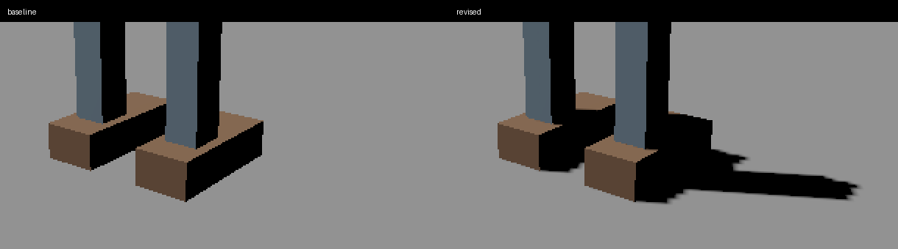
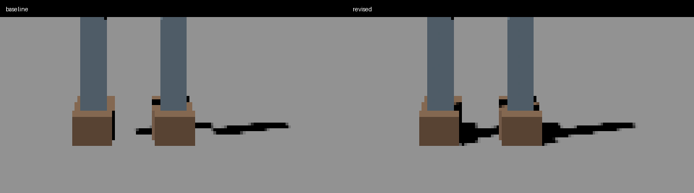

# CSM correctness and optimization

Base: `033858a7d22451ff93aa54a3947c6990b59f53a7`.

## Implemented scope

- Keep a separate legacy shadow-caster input before camera-frustum rejection. Select the union of camera-visible objects and conservative shadow casters before the bounded Graph seal, using the same receiver planner and settings as CSM. Unrelated offscreen objects do not consume the Graph draw budget; relevant offscreen casters retain shared geometry preparation. Diagnostic visible-draw pose replay also updates the corresponding shadow inputs.
- Validate sealed mesh layout and palette before reading them for bounds. Carry local bounds centers. Enclose affine transforms (including shear) and the convex hull of bone-transformed source bounds. Cache legacy world bounds once per view preparation. Typed fixtures without supplied bounds derive them from their immutable POSITION bytes.
- Keep stable sphere fitting, snap in light-space XY, pad the fit for snapping, overlap receiver ranges for cascade blending with matching CPU/shader behavior at positive, negative and zero splits, and include upstream caster bounds in the light-depth range. Unproject corners correctly for perspective and orthographic cameras.
- Separate shadow distance from camera far plane: default 200 world units, configurable with `SetShadowDistance`. This is an engine default, not a measurement of the user's scene scale.
- Default constant bias is 0.5 shadow texels, converted to world distance and then normalized by each light-depth range. `SetBiasTexels` uses these units. The existing `SetBias` entry point retains compatibility with the old normalized-depth knob at a four-radius depth span, including diagnostic negative bias. Slope tangent remains bounded in the shaders.
- Pack the selected directional-light index plus one in `splitDepths.w`; deferred, forward, graph surface, and graph volume consumers apply CSM only to that light. Zero preserves first-light ownership in old isolated fixtures. Surface shadow sampling stops beyond the configured shadow distance.
- Graph draws carry conservative cascade visibility. Skip constants for rejected cascades and avoid repeated pipeline/material binding for consecutive compatible chunks. Do not instance unrelated world-geometry buffers.
- Legacy sort, batch boundaries, work partition boundaries, and cost estimate share geometry/skinning/alpha-texture grouping. Partition on complete groups and whole cascade multiples.
- Vulkan render-target tables belong to frame slots. Owned slice views survive until the owning slot's fence completes; shutdown releases all tables after GPU retirement.

## Fog review

The legacy volumetric fog path deliberately receives the last-cascade matrix and samples layer 2. In `FogScatter.slang`, the computed shadow/cloud visibility currently feeds only a commented-out sun term; the active light loop does not consume it. Changing that policy would introduce new fog lighting behavior and is outside this surface-CSM correction. The separate MaterialGraph volume path actively samples CSM and now respects selected-light ownership.

## Deferred phase: persistent shadow-depth cache

No shadow-content cache is enabled by this change. `EnhancedShadowPass::Declare` creates a graph texture and clears its layers every frame. Texture allocation pooling and shared skinned geometry are not depth-content reuse.

The bounded follow-up belongs to the shadow renderer owner and needs:

1. A persistent depth-map owner per view/light with explicit graph import state and GPU retirement. The graph's transient texture identity cannot act as a content-validity token.
2. Exact invalidation for camera/view identity, cascade matrices and coverage, light identity/direction, caster addition/removal, world transform, palette content, geometry generation and LOD, alpha/coverage/material texture content, and shadow settings. Graph program/instance changes must participate too.
3. A deliberately small first mode: full-map reuse only when every dependency is unchanged, otherwise redraw all cascades. Partial static/dynamic composition requires a separate depth-composition design.
4. Cache-on/off image equivalence across each invalidator, multiple views and frames in flight, plus measured hit rate, memory and GPU time. Acceptance requires a benefit over invalidation/bookkeeping cost.

This needs a separate implementation and validation slice; silently retaining pooled depth would produce stale shadows.

### Bounded implementation proposal

The owner is `EnhancedShadowPass`, with one cache entry per stable render-view identity and selected-light identity. Entry states are Empty, PendingSubmission, Valid and Retiring. A miss records and clears a persistent three-layer D32 texture; the entry becomes reusable only after successful recording/submission, never after an aborted frame. A hit imports that texture into the new graph and skips depth recording, while current-frame light ownership and sampling constants are still refreshed. Track the actual final resource state and submission completion point. Retire replaced/resized resources after their last reader completes. Device/backend changes discard all entries.

Start with whole-map reuse only, opt-in, capped at one view (48 MiB for 3 x 2048 x 2048 x 4 bytes). Use the existing ordered graphics queue for read/write sequencing; unsupported queue ownership or missing dependency generations forces a miss. Do not add partial-cascade reuse, static/dynamic depth composition, approximate matrix comparisons or camera-motion heuristics in this first mode.

The exact key comprises view/projection and all cascade matrices/coverage/settings; selected producer light identity/direction; ordered caster identities and add/remove membership; world transforms; palette contents/pose versions; immutable model generation, mesh and LOD; coverage flags/cutoff/sidedness; material/program/instance generation; and alpha texture/sampler/content generation. Keep strong owners for immutable dependencies to prevent pointer reuse from masquerading as identity. A resource handle or `Texture*` alone is not a content version. Any producer without reliable immutable identity must supply a version (or force redraw); introducing those producer contracts is an explicit prerequisite, not a guessed cache key.

Acceptance has two stages: (1) cache disabled, collect proposed hit/miss reasons without changing rendering; (2) enable reuse and require depth plus final-color equivalence against cache-off for every invalidator, first frame, aborted submissions, view destruction/recreation, two alternating views and three frames in flight on DX12/Vulkan. Measure key construction CPU cost, warm static-scene shadow GPU time, hit rate and peak retained memory. Keep caching disabled by default unless the saved depth work exceeds bookkeeping cost. This plan is independent of the correctness PR and requires its own reviewed implementation.

## Validation record

The baseline worktree is detached at the base SHA above. The main worktree is isolated from the user's dirty checkout, binaries and running editor. Existing dependency outputs are read without restoring or modifying them.

- Standalone `csm_math_probe.cpp`: passed perspective/orthographic corner reprojection, light-space microtranslation and integer-texel stepping, conservative clip intersection, offscreen caster distinction, negative and zero split boundaries, and pre-budget receiver selection.
- Revised isolated DX12 Debug and Release builds: passed. Revised Vulkan Debug probe build: passed.
- Baseline control: the original shadow test failed fixture 3 with depth `0.4` instead of `1.0`. Its fixture mutates source vertices/indices while retaining the same immutable model generation. With only a distinct generation per fixture, unchanged baseline engine code passed all 42 shadow frames and 114 decal frames, including fixture 6, with validation zero. The revised test preserves the original pixel assertions and adds sealed-index identity assertions.
- Expanded Vulkan Debug and Release shadow/decal aggregates: each exit 0, 45 shadow frames and 114 decal frames, validation zero and encoder drops zero. The queue-gated lifetime regression verified three genuinely pending frames and nine retained depth slices before readback. Logs: `csm-partition-vulkan-Debug.log`, `csm-partition-vulkan-Release.log`.
- Expanded DX12 Debug and Release shadow/decal aggregates: each exit 0, 45 shadow frames and 114 decal frames, validation zero with GPU validation enabled. Logs: `csm-partition-dx12-Debug.log`, `csm-partition-dx12-Release.log`.
- All four expanded runs use workers 0/2/4/5/6/8 with actual shadow slice counts 1/2/4/5/6/6. The six- and eight-worker cases assert seven graph record units (six shadow slices plus one readback), proving two partitions per cascade. Spatially separated geometry groups retain 384 instances / 192 batches in every mode, and every depth-map pixel matches serial output. This replaces the earlier four-worker-only coverage, which did not exercise intra-cascade partitioning.
- Pre-budget selection sealed two relevant draws from 4100 candidates. Malformed layout/palette rejection and bounds/bias/ownership/overlap contracts passed. Renderer code is unchanged from independently reviewed `cac4817687fd1e45d3d412e0cfc7927f438bcb97`; subsequent changes concern tests, gate expectations and this evidence. `git diff --check` passed.
### Native contact and moving-camera acceptance

An owned 640 x 480 DX12 fixture renders a floor and two foot/ankle proxy meshes through the actual Shadow, GBuffer and Deferred passes. Baseline and revised executables use the same geometry, light, camera and shader-on/off pairs. Each completed 32 frames with validation zero. The close view uses a 55-degree perspective camera, near 0.05 / far 1000; the boundary view uses far 60. Eight close samples move the camera in 0.002-unit increments. Eight boundary samples place the ground receiver at view depths 5.13319 through 5.68202, crossing the measured split 5.40683.

Coverage is measured on reconstructed floor pixels against independent ray/box intersections. A pixel counts as shadowed when luminance drops by more than 10% relative to the paired shadow-disabled render. The contact region is within 0.1 world units of the foot footprint. This is a controlled proxy scene, not a claim to reproduce the user's original screenshot assets or scale.

| Measurement (mean over eight frames) | Baseline | Revised |
|---|---:|---:|
| Close-view expected shadow detected | 1.27% | 100% |
| Close foot-contact shadow detected | 2.88% | 100% |
| Boundary-view expected shadow detected | 69.59% | 99.94% |
| Boundary foot-contact shadow detected | 51.13% | 100% |
| Near-cascade constant bias, world units | 0.507 | 0.00846163 |
| Near-cascade texel width, world units | 0.0825195 | 0.0169233 |

Revised contact detection is 100% in every close and boundary frame; baseline boundary contact detection ranges from 23.89% to 90.57%. Visual inspection of both full frames and nearest-neighbor enlarged crops confirms the baseline contact gap and the restored revised shadow. Pixel-sized shadow edge steps remain visible. Revised shadowed pixels outside the geometric hard-shadow reference occupy 0.32% of the close floor ROI and 0.25% of the boundary ROI; this includes the PCF footprint and should not be interpreted as an acne-only measure.

Local evidence: `Build/CsmAcceptance.cpp`, `Build/analyze_csm_acceptance.py`, `Build/CsmAcceptanceVisual/frames.csv`, and `Build/CsmAcceptanceComparison/` (paired PNGs, close/boundary GIFs and `coverage.json`). The baseline worktree has the identical native fixture. Functional captures ran with GPU validation and overlapping owned workloads; their timestamp columns are retained for diagnostics but are not performance evidence.
### Remaining acceptance limits

Functional GPU readbacks and submission counts do not establish a measured performance speedup. No before/after GPU timing claim is made. The user's original near-foot/ankle artifact has not been reproduced in an isolated scene with matched camera, geometry scale, lighting and material settings. The controlled native contact and boundary comparison above is complete; original-user-scene validation and isolated before/after performance capture remain outstanding. The current tests cover projection/bias contracts, GPU depth pixels, alpha/skinning and serial/parallel equivalence instead.

DX12 Debug volume (33 frames), refraction (24), subsurface (12) and full raster aggregates completed with exit zero and their pixel assertions intact. The shadow/decal gate had stale raster expectations (56 composition / 12 generation frames): unchanged baseline source intentionally validates generation step 11 without submitting a GPU frame, producing 55 / 11. The gate now expects those exact counts and documents the skipped submission; no pixel assertion was relaxed. Additional Release aggregate results are reported in PR #115 without altering renderer/test inputs. The isolated AddressSanitizer engine compile completed, but the probe link failed with LNK2038 `annotate_optional` (existing ryml/c4core libraries use 0; instrumented MSVC code uses 1). No ASan runtime pass is claimed and existing dependencies were not rebuilt. Malformed layout/palette rejection is covered by the native Scene input regression. Vulkan Debug and Release expanded shadow/decal executions both passed with validation zero and encoder drops zero.

Graph camera visibility is conservative: relevant offscreen graph casters may still incur shared surface preparation. A separate per-pass surface visibility contract can remove that work without losing shadow casters.
