# 엔진 동기화 구조 분석

분석 기준: 2026-09-07, `master`, `f84f32b841a4ba7a6db9276588849fa2ebe48085`.

이 문서는 현재 실행 구조를 설명한다. 범용 JobSystem/태스크 그래프 도입을 위한 판단은 마지막 절에 구분했다. 엔진 실행 코드는 변경하지 않았다.

## 1. 범위와 결론

조사 범위는 엔진 소유 C++ 실행 경로, Editor/Player 호스트, DX12/Vulkan 제출·표시, 자산 로딩, 물리·AI·애니메이션, 관리 코드의 엔진 진입·재개 경계, 종료 경로다. `Engine`, `Editor`, `Player`의 스레드 생성·대기·잠금·큐 사용을 검색하고 주요 생산자부터 소비자까지 추적했다. `ScriptCore`와 관련 관리 코드도 확인했다. 테스트 전용 경로와 호출이 확인되지 않은 잔존 선언은 제품의 상시 실행 경로에 합산하지 않았다.

이것은 **소스 기반 구조 분석**이다. 모든 공유 필드의 race-free 증명이나 동적 데드락 재현 결과가 아니다. PhysX, FMOD, CoreCLR, STL 병렬 알고리즘, 그래픽 드라이버 내부 스케줄러는 외부 경계로 취급한다. 현재 바이너리의 CPU 점유·대기 시간·프레임 성능은 측정하지 않았다.

핵심 결론:

1. 현재 엔진은 단일 프레임 배리어 구조가 아니다. GT, RT, 표시 스레드, RHI 스레드가 큐와 스냅샷으로 분리된 파이프라인이다.
2. 그 내부에는 애니메이션 풀 전체 대기, Foliage의 fork-join, 물리 결과 대기, AI 수명 회수, GPU 슬롯 재사용 대기가 공존한다.
3. 직렬 경계 중 일부는 계산 의존성이고, 일부는 객체 수명·단일 작성자·GPU 자원 재사용 계약이다. 동일한 `Wait()`로 치환하면 안 된다.
4. 범용 태스크 그래프 런타임 적용은 구조적으로 가능하다. 다만 그래프 실행기 외에 지정 스레드 실행, 외부 완료 신호, 실행 인스턴스 수명, 종료 계약이 필요하다.
5. `Core.ThreadPool`에는 완료 이벤트의 세대 혼합 가능성과 예외·종료 계약 부재가 있다. 워크스틸링 deque로의 교체만으로는 해결되지 않는다.

용어: **GT**는 OS 메시지 루프와 시뮬레이션을 수행하는 게임 스레드, **RT**는 전용 Scene 렌더 스레드, **PT**는 PresentationThread, **RHI**는 프로세스 공용 제출 스레드다. 아래 실선 화살표는 호출 순서·제출·데이터 전달을 의미한다. CPU를 멈추는 대기는 노드나 간선에 명시했다. 점선은 다음 프레임/완료 신호/상호 배제 관계다.

## 2. 전체 스레드 지도

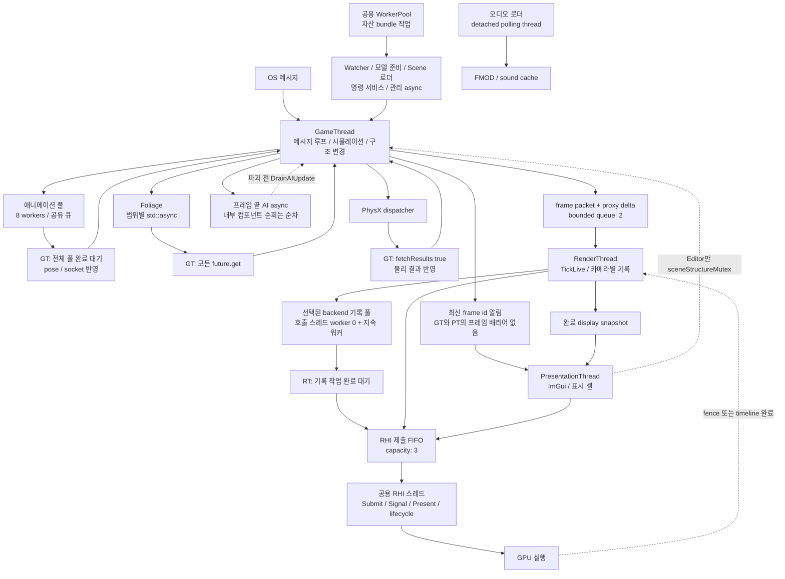

전체 도식의 GT로 돌아가는 선은 전체 프레임이 재시작된다는 뜻이 아니라 해당 호출 지점으로 반환함을 나타낸다. 실제 GT 순서는 다음 절에 있다. DX12와 Vulkan 풀은 선택된 backend 경로에 따라 사용되며, 모든 풀이 항상 동시에 실행된다는 의미가 아니다.

| 실행 주체 | 생성·작업 단위 | 동기화·완료 | 핵심 소유권 / 근거 |
|---|---|---|---|
| GT | `CoreWindow::Then`의 메시지 없는 반복 | 일반 C++ 호출 순서 | 활성 Scene 구조, 시뮬레이션, packet 생산. S01–S04 |
| PT | 호스트별 `StartPresentationThread` | mutex+CV, 최신 frame id, 종료 join | ImGui 셸·표시. Editor는 구조 변경 구간과 추가 mutex. S02–S03 |
| RT | `StartRenderThread` | 큐 mutex+CV, capacity 2, drain 후 join | `TickLive`, render-owned 상태. S10 |
| RHI | 첫 client 등록 때 생성 | 공용 FIFO, ticket CV, owner drain, 마지막 client에서 join | native queue 호출과 lifecycle. S12 |
| 애니메이션 | `ThreadPool(8)` | 전역 task count+event | 워커 계산 후 GT가 pose/socket 반영. S06–S07 |
| 공용 CPU/로딩 풀 | `WorkerPool::Startup` | 같은 ThreadPool 구현 | 기본 worker 수는 active logical processor 수. 확인된 소비자는 bundle 로딩. S08 |
| Foliage | 컴포넌트마다 범위별 async | 모든 future 회수 | 범위별 instance 원소 갱신. S09 |
| AI | Scene의 단일 future | 다음 FixedUpdate에서 ready poll, 구조 파괴 전 blocking get | raw component snapshot 수명. 데이터 불변 스냅샷은 아님. S15 |
| 물리 | PhysX 자체 dispatcher | `simulate` 직후 `fetchResults(true)` | 결과 회수 후 엔진 Transform 반영. S16 |
| Scene 로더 | `std::async` | future ready poll 후 활성화 예약 | 새 Scene 생성 외에 기존 DDOL 접근도 있음. S17 |
| 모델 준비 | 저우선순위 전용 worker | mutex+CV, ready release/acquire, cancel | 준비 결과를 GT가 분할 적용. S18 |
| directory watcher | 전용 I/O worker | overlapped I/O, stop event, CancelIoEx+join | 변경 알림을 GT 큐로 전달. S19 |
| PSO 비동기 API | `DX12PSOManager::Request` | shared future poll, 종료 시 회수 | 구현과 self-test 사용 확인. 제품 프레임의 해당 API 호출은 미확인으로 별도 분류. S20 |
| 명령 서비스 | accept thread+client workers | socket 대기, GT command queue, 결과 CV | 네트워크 worker에서 엔진 명령 본문을 직접 실행하지 않도록 호스트가 중계. S21 |
| 관리 async | CoreCLR pool 등 | SynchronizationContext.Post → GT drain | 기본 await 재개와 native engine API thread guard. S22 |
| 오디오 로더 | `std::thread` 후 detach | 1초 polling, sound cache shared_mutex | 정상 stop/join 프로토콜 없음. S23 |
| 부팅 진행 창 | Win32 전용 UI thread | Close에서 회수 | 엔진 메인 창 표시 전 닫는 경계. S01, S24 |

주의: `AssetLoadJob`에는 `ThreadPool(16)` 정의가 있지만 조사한 제품 소스에서 인스턴스 생성·소비 호출을 찾지 못했다. `DataSystem::m_DataThread`도 선언 외 사용을 찾지 못했다. 따라서 **실제 활성 16-thread 자산 풀**로 집계하지 않는다. 앞선 대화의 “별도 자산용 16개 풀이 존재한다”는 표현은 정의의 존재와 활성 실행을 구분하지 못한 것이므로 여기서 정정한다.

## 3. GT 프레임의 실제 순서

`CoreWindow::InitializeTask().Then()`은 이름과 달리 태스크 그래프 실행기가 아니다. 초기화 함수를 직접 호출하고, `PeekMessage`가 비었을 때 프레임 함수를 직접 실행한다. `Delegate::Broadcast()`도 콜백 목록을 잠금 안에서 복사한 후 호출 스레드에서 순차 호출한다. 이벤트 broadcast를 비동기 작업 제출로 해석하면 안 된다. S01, S25.

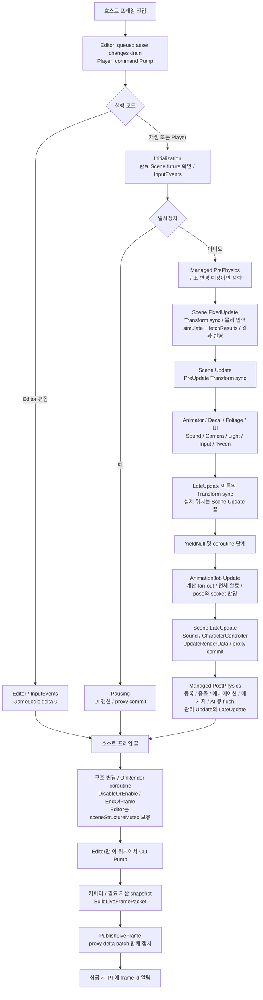

이 도식의 GameLogic 내부 상세는 재생 경로를 펼친 것이다. Editor 편집 모드의 `GameLogic(0)`도 같은 Scene Update/애니메이션/LateUpdate 호출 구조를 사용한다. `delta=0`이 작업 제출 부재를 뜻하지 않는다. 일시정지는 `Pausing()` 후 시뮬레이션을 반환하지만 호스트 프레임 끝 처리와 packet 발행은 계속된다. S02–S05.

순서상 특히 중요한 점:

- `TransformSyncPoint::LateUpdate`는 **AnimationJob보다 앞인 Scene::Update 끝**에 있다. 이름을 근거로 “애니메이션 뒤 전체 Transform sync”라고 그리면 현재 구현과 다르다. 애니메이션의 후속 갱신은 pose publication/socket write/targeted resolution 계약까지 추적해야 한다.
- 물리는 `PhysicsManager::Update` 안에서 입력·보류 변경 적용 → PhysX → 결과 반영 → 충돌 처리 순서다. 현재 호출 구조에는 simulate와 fetch 사이에 다른 엔진 작업을 실행하는 구간이 없다.
- managed post-physics는 native `GameLogic` 뒤다. 이를 native Update와 같은 위치로 합치거나 앞당기면 관측 순서가 바뀐다.
- Editor CLI는 `EditorMain::Update` 뒤, Player command Pump는 시뮬레이션 앞이다. 두 호스트의 명령 적용 시점은 동일하지 않다.

## 4. 계산 작업과 수명 경계

### 4.1 애니메이션

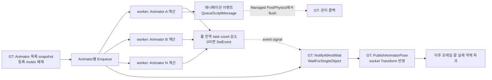

워커는 pose만 계산하는 순수 함수가 아니다. Animator 재생 시간, controller 상태, pose 버퍼를 변경하고 clip event 경로는 ScriptComponent를 찾아 관리 메시지를 큐에 넣는다. 이 때문에 raw pointer 수명과 상태 소유권을 유지해야 한다. 모델 generation은 잡 안에서 shared ownership으로 붙들지만 Animator 자체의 수명은 현재 동기 join 창에 의존한다. `RenderScene`이 AnimationJob을 멤버로 소유하고 `RenderScene::Finalize`가 animation pool을 회수한다. S06, S26, S32.

### 4.2 AI와 파괴

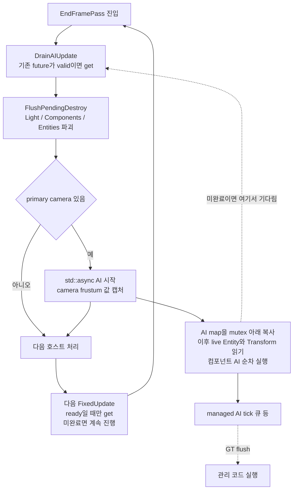

`DrainAIUpdate`는 Scene 소멸과 hierarchy detach에도 존재한다. 이것은 snapshot에 들어 있는 raw pointer의 **파괴 중첩을 제한**한다. 그러나 AI가 다음 GT 시뮬레이션과 겹치는 동안 Transform·bounds를 읽는 것까지 불변화하지 않는다. `AIManager::InternalAIUpdate`의 map mutex는 map 복사까지만 보호한다. 따라서 “snapshot을 썼으므로 AI가 thread-safe”라는 결론은 성립하지 않는다. 공유 값 접근 경쟁 여부는 별도 필드 단위 감사·동적 재현이 필요하다. S15.

### 4.3 Foliage, Transform, 물리

| 영역 | 현재 분해 | 필수 경계 | 범용 실행기로 옮길 때의 의미 |
|---|---|---|---|
| Foliage | component별 범위를 최대 `2 * hardware_concurrency + 1`개로 분할, async 후 모든 get | instance 배열 변경·재할당과 계산 창 분리 | persistent executor + parallel-for의 직접 후보. 현재 여러 component의 계산도 component별 join으로 끊김 |
| packed Transform | dirty root 정렬·겹침 병합 후 preorder range 순차 루프 | 부모 world 값, UI→Spatial 순서, dirty/worldChanged 전달 | disjoint subtree 계산 후보. 단일 큰 chain은 의존성이 남음. 공용 metrics·dirty 쓰기를 함께 분리해야 함 |
| legacy Transform | root 자식에 `std::execution::par` | 호출 반환 시 완료 | 이미 병렬인 fallback. 주석만 보고 packed 경로도 병렬이라고 판단하면 안 됨 |
| 물리 | PhysX dispatcher 내부 작업 | fetchResults 후 engine result commit | adapter로 외부 계산 완료를 연결할 수 있으나, 현재의 동기 wrapper를 분리해야 중첩 가능 |
| tangent 생성 | 메시가 여러 개면 STL `execution::par`, 이후 결과 수집 | 메시별 결과 후 notes/stats 병합 | import CPU 그룹 후보. 하나면 직렬 실행하는 경계 유지 |

S09, S16, S27. “후보”는 무수정 병렬화 승인이나 측정된 이득을 의미하지 않는다.

## 5. GT → RT → RHI → GPU → 표시

### 5.1 frame packet과 proxy delta

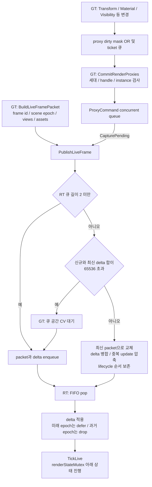

capacity 2는 **대기 큐**의 상한이며 실행 중 submission은 별도다. 합친 delta가 65536을 넘을 때 큐 공간을 기다리는 분기가 있지만, 개별 입력 batch 자체의 절대 상한을 이 코드가 모두 검증한다고 확대 해석하지 않는다. proxy pending 큐도 이 capacity와 동일한 bounded 큐가 아니다.

RT가 느리면 일반적으로 최신 frame을 병합한다. **모든 GT frame이 RT frame·GPU frame·표시 frame과 1:1 대응하지 않는다.** shutdown 검사도 published = consumed + coalesced + pending처럼 이 의미에 맞춰야 한다. S10–S11.

### 5.2 명령 기록과 완료의 세 단계

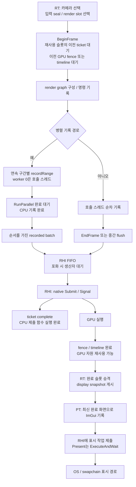

- **기록 완료**: CPU가 command list/buffer를 채웠음.
- **ticket 완료**: RHI 스레드가 제출 함수를 실행했음. GPU 완료가 아니다.
- **GPU 완료**: fence/timeline이 도달함. 이때 transient graph, upload, descriptor, retired resource 등의 재사용 조건이 충족된다.
- **표시**: 완료 화면을 PT가 셸에 담고 Present를 수행함. GT의 frame id 알림 자체는 GPU 완료 알림이 아니다.

`DrainSubmissions(owner)`는 queued/running CPU 제출만 기다리고, `Drain(owner)`는 등록된 GPU retirement도 기다린다. retirement가 붙지 않은 제출까지 `Drain()`만으로 GPU idle이 보장되는 것은 아니며, lifecycle에서는 backend의 명시 GPU drain 작업을 사용한다. S12–S14.

DX12/Vulkan 명령 풀은 둘 다 단일 실행 배치의 `m_job`, `m_pending`, `m_generation`을 가진다. 임의 다중 호출자용 재진입 executor가 아니다. graph의 기록 구간은 정적으로 나누고 워커 순서로 제출 순서를 보존한다. 워크스틸링을 붙일 때에는 logical record unit과 실제 worker id를 분리하고 allocator/list의 독점 사용을 보장해야 한다.

카메라별 `frameContext`가 재사용되는 draw/light 벡터를 가리키므로 현재 `TickLive`는 뷰 입력 준비와 기록을 카메라별 순차 수행한다. 카메라 노드를 그래프에 병렬 배치하려면 뷰별 입력 저장소부터 독립시켜야 한다. GPU 진행 슬롯이 차면 일부 live 경로는 대기 대신 해당 기록을 건너뛰고 기존 완료 화면을 유지한다. `BeginFrame`의 실제 슬롯 재사용 대기와 이 상위 admission 결정을 구분해야 한다.

### 5.3 backend별 화면 전달 비용

| backend live 경로 | GPU 완료 후 화면 전달 | JobSystem으로 해결되지 않는 부분 |
|---|---|---|
| DX12 | 완료 슬롯의 interop token 게시 → 표시 셸에서 공유 texture 열기 | GPU 완료와 공유 texture/descriptor 수명 계약 |
| Vulkan | timeline 완료 → MapReadback → CPU TonemapToRgba8 → SubmitCpuFrame → 표시 셸의 texture 업로드 | readback/복사/upload 비용. CPU 톤매핑을 잡으로 분리해도 전송 자체는 남음 |

따라서 두 backend의 PT 입력을 모두 같은 zero-copy GPU snapshot 경로로 해석하면 안 된다. Vulkan의 `PromoteCompleted`에는 완료 확인뿐 아니라 CPU 영상 변환 작업도 포함된다. 순수 완료 확인과 이 후속 계산을 분리하는 것이 외부 completion adapter 설계의 한 사례다. S30.

### 5.4 표시와 Editor 구조 잠금

Editor PT는 `m_sceneStructureMutex`를 잡고 `PresentFrame()` 전체를 호출한다. 그 안에는 ImGui 기록과 backend Present 경로가 포함된다. GT는 모델 적용·Scene 전환·파괴·EndOfFrame 구간에서 같은 mutex를 잡는다. 따라서 이 잠금은 실질적으로 UI 읽기뿐 아니라 표시 호출 지연을 GT 구조 변경에 전달할 수 있다. 반대로 GT가 이 잠금을 잡은 채 AI 회수를 기다리면 PT도 함께 지연될 수 있다.

그러나 GT의 일반 시뮬레이션과 packet 캡처 전체가 이 mutex 아래 있는 것은 아니다. 그러므로 **Scene 구조 수명 보호를 일반 데이터 동시 접근 보호로 확대 해석하면 안 된다.** Player PT에는 같은 Editor 구조 잠금이 없고 표시 셸 위주로 움직인다. S02–S03.

## 6. 로딩·명령·관리 코드의 전달 구조

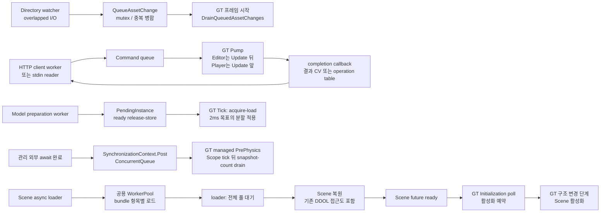

Scene async loader를 완전히 분리된 불변 준비 작업으로 분류할 수는 없다. `LoadSceneAsyncAndWaitCallback`는 background lambda 안에서 active Scene의 DDOL hierarchy transaction, 역직렬화·remap·재바인딩 경로를 사용한다. atomic active Scene 포인터는 포인터 값 전달을 보호할 뿐 내부 Entity 컨테이너를 보호하지 않는다. 로딩 중 실행 가드와 실제 외부 호출 조건까지 검증해야 안전성을 단정할 수 있다. 그래프 이관 때 분리할 후보는 “자료 읽기·decode”와 “Scene/등록·이벤트 반영”이다. S17.

모델 배치는 더 명확한 준비/반영 모델이다. worker는 `PendingInstance::Prepare`, GT는 ready 확인 후 적용한다. 취소는 cooperative이며 이미 실행 중인 decode 자체를 강제 중단하지 않는다. 2ms는 적용 루프의 목표 deadline이지 모든 내부 함수 실행 시간의 강제 상한은 아니다. S18.

관리 코드의 `Post`는 thread-safe 큐로 재개를 보낸다. `Drain`은 진입 시 큐 건수만 처리해 재게시가 한 프레임을 무한 점유하지 않게 한다. off-GT `Send`는 교착을 피하기 위해 거부한다. `Task.Run` 본문이나 `ConfigureAwait(false)` 뒤가 자동으로 GT가 되는 것은 아니며 native API 진입 guard가 별도로 있다. native JobSystem이 CoreCLR pool까지 자동 대체하는 구조는 아니다. S22.

명령 서비스의 동기 결과 대기는 client worker에 있고, GT Pump가 완료 callback을 호출한다. timeout은 작업 자체의 취소와 다르다. 비동기 operation 경로는 operation table에 완료를 기록한다. 네트워크/표준입력 대기를 일반 CPU worker에 그대로 넣으면 실행 자원이 묶인다. S21.

## 7. 잠금·완료 계약 지도

| 경계 | 보호하는 것 | 보호하지 않는 것 / 영향 |
|---|---|---|
| animation registry mutex | Animator 등록 목록 복사·변경 | Animator 필드 전체와 객체 생존은 별도 join 계약 |
| Transform dirty mutex | dirty root publication/snapshot | Scene packed 배열의 무제한 다중 작성자 접근 |
| render registry dirtyMutex | dirty ticket·mask·등록 metadata | commit 후 component callback의 임의 동시 실행 |
| AI map mutex | map 복사·등록 | 복사된 포인터의 필드 불변성 |
| sceneStructureMutex | Editor GT 구조 변경과 PT PresentFrame 상호 배제 | 일반 시뮬레이션 전체, 모든 GUI 필드 접근 |
| renderQueueMutex | packet enqueue/pop, 큐 통계 | RenderScene 내부 상태; pop 후 별도 RT 소유 |
| renderStateMutex | TickLive 및 일부 진단·제어 접근 | UI 전용 상태나 GPU 실제 실행 완료 |
| displayLifetimeMutex | 완료 display snapshot·표시 자원 접근/무효화 경계 | snapshot을 반환한 후 모든 외부 객체의 임의 사용 |
| RHI impl mutex | queue, owner, retirement metadata | GPU 실행; 제출 작업 본문은 잠금 밖 실행 |
| RHI ticket mutex+CV | 해당 CPU 제출 작업의 결과 | GPU completion |
| backend fence/timeline | 이전 제출의 GPU 완료 | GT/RT frame 전체 일치 |
| cache별 mutex/shared_mutex | DataSystem, PSO, texture, sound 등 개별 저장소 | 하위 객체의 수명·불변성까지 자동 보장하지 않음 |
| Delegate spinlock | 콜백 목록 복사·수정 | 콜백 본문과 raw subscriber 수명 |
| ClrHost spinlock queues | AI tick / script message 전달 | enqueue 주체의 live Scene 읽기 |
| profiler registry mutex | 등록 thread 목록·TLS 포인터 회수 | worker EventBuffer 쓰기와 collector 읽기의 완전한 handoff |

현재 코드에서 추적된 대기 전파:

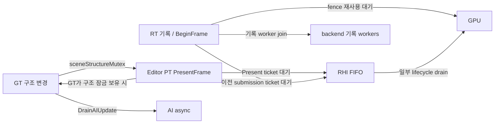

이 그림은 **조건별 대기 방향을 모은 지도**다. GT↔PT의 양방향은 mutex 획득 경쟁을 뜻하며 동시에 성립하는 교착 증명이 아니다. `renderStateMutex → displayLifetimeMutex` 같은 중첩과 PT의 display 조회도 존재한다. 완전한 lock-order 증명은 별도 필드·모든 호출 경로 감사가 필요하다.

## 8. 종료 구조

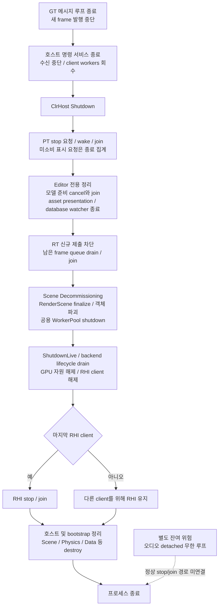

호스트별 세부 순서는 동일하지 않다. 위는 공통 골격에 Editor 정리를 펼쳤다. Editor는 App::Finalize에서 CLI를 먼저 종료하고 EditorMain::Finalize로 들어간다. Player의 최종 순서는 PlayerMain::Finalize를 따르며 `ShutdownLive` 뒤에 `GetImGuiHost().Shutdown()`도 호출한다. RHI의 client 수는 Scene renderer 외 표시 셸도 포함할 수 있어, `ShutdownLive`만으로 즉시 공용 RHI thread가 사라진다고 단정하면 안 된다. `RenderScene::Finalize`에서 애니메이션 풀을 먼저 회수하고, 이후 Scene Decommissioning이 객체 파괴와 공용 WorkerPool 종료를 진행한다. S02–S03, S12, S24, S32.

현재 `Scene::EndFramePass`는 기존 AI를 회수한 뒤 조건이 맞으면 새 AI를 시작한다. 이 함수가 씬 전환·Decommissioning에도 사용되므로, 종료 감사에서는 첫 drain뿐 아니라 **새 AI 발행 조건과 최종 Scene destructor의 drain**까지 포함해야 한다. S15.

## 9. 확인된 설계 문제와 추가 검증이 필요한 위험

아래 “확인”은 구현/실행 순서로 확인한 설계 성질을 의미한다. 실제 실행에서 크래시나 hang을 재현했다는 뜻은 아니다.

### 9.1 Core.ThreadPool 완료 이벤트 경쟁 — 구현상 가능, 영향 큼

`Enqueue`의 `taskCount.fetch_add`와 `ResetEvent`, worker의 `fetch_sub`와 `SetEvent`가 하나의 세대/상태 전이로 묶이지 않는다. 다음 실행 순서가 가능하다.

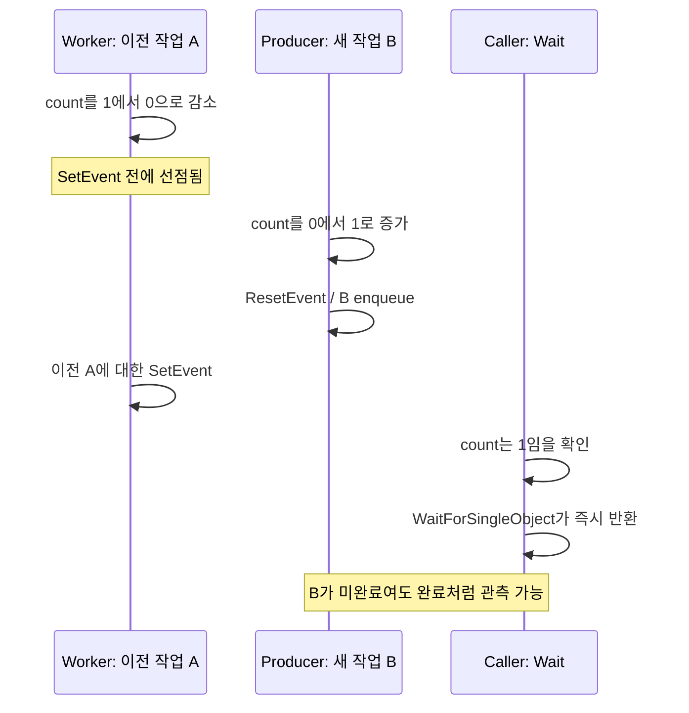

이는 동일 생산자가 순차로 작업을 제출하더라도 worker가 제출 사이에 count를 0으로 만들 수 있어 배제되지 않는다. atomic count와 OS event를 함께 쓴다는 사실만으로 batch barrier가 되지 않는다. 애니메이션의 수명·commit 계약이 이 완료 판단에 의존한다는 점에서 단순 성능 문제가 아니다. S07.

추가 계약 문제:

- callable 생성 또는 queue push 예외가 나면 먼저 증가한 count를 rollback하지 않는다.
- worker의 `task()` 예외에 대한 catch와 completion guard가 없다. 정상 완료 통지가 누락되거나 미처리 예외 경로로 간다.
- destructor는 exit flag를 먼저 세우고 worker를 깨운다. pending 작업 drain을 보장하지 않고, 취소 완료를 관측할 handle도 없다.
- Enqueue와 shutdown 경합을 거부하는 admission 상태가 없다.
- 워커가 자기 풀의 `NotifyAllAndWait`를 호출하면 자기 작업이 count에 포함된다. 구조화된 자식 join 의미가 아니다.
- 생성자에서 worker를 시작한 뒤 init/exit callback setter를 제공한다. worker 시작 전 callback 설정·동기화 계약이 없다. 제품에서 setter 사용은 검색되지 않았지만 범용 API로는 결함이다.
- 기본 우선순위는 `THREAD_PRIORITY_HIGHEST`, 기본 worker 수는 논리 프로세서 수다. 다른 풀/전용 스레드와 공통 CPU 예산이 없다. 실제 starvation 정도는 미측정이다.

### 9.2 오디오 종료 — stop/join 부재 확인

SoundLoaderThread는 `while(true)`로 돌고 detach된다. `_isSoundLoaderThreadRunning`은 thread 생존이 아니라 `LoadSounds` 함수 실행 구간에서만 토글된다. destructor의 polling은 thread 종료를 기다리는 것이 아니다. 초기값 true이고 로드가 한 번도 발생하지 않는 조건에서는 polling이 끝나지 않을 수 있고, false를 보고 destructor가 진행해도 detached loop는 계속 `this`와 FMOD 상태에 접근할 수 있다. S23.

범용 런타임으로 옮길 때에는 주기적 서비스의 stop 요청, 현재 I/O 완료, 재예약 금지, 소유자 해제를 하나의 수명 계약으로 표현해야 한다.

### 9.3 RHI retirement polling — 유휴 busy-loop 가능 확인

RHI Run의 `wait_for(1ms, predicate)` predicate에 `!retirements.empty()`가 들어 있다. GPU 미완료 retirement만 있고 실행할 queue entry가 없으면 predicate가 계속 true이므로 1ms 대기를 하지 않고 완료 조회 루프를 반복할 수 있다. 단순히 “1ms polling”이라고 설명하면 부정확하다. 실제 CPU 비용은 미측정이다. S12의 213–235행.

### 9.4 공유 상태 위험 — 구조 확인, 데이터 경쟁 재현은 미수행

- **AI live 읽기:** map snapshot 이후 Entity/Transform/bounds 읽기가 GT와 중첩 가능하다. 객체 수명 barrier가 값 접근 동기화를 대체하지 않는다.
- **Editor UI:** PT 구조 mutex는 GT의 일반 Update와 packet 캡처 전체를 포괄하지 않는다. GUI가 읽고 쓰는 필드별 ownership/queue 적용 여부를 확인해야 한다.
- **Scene 비동기 로드:** background DDOL/active Scene 접근이 존재한다. 새 Scene 전용 작업이라는 가정으로 다른 잡과 동시 실행하면 안 된다.
- **프로파일러:** thread registry mutex와 EventBuffer producer/collector 소유권이 분리되어 있다. `BeginEvent`의 vector resize/쓰기와 `Tick`의 버퍼 읽기·count reset이 명시적 sealed handoff로 묶이지 않았다. 관련 주석은 옛 CB/CE 프레임 배리어를 안전 근거로 설명하지만 현재 GT/RT/PT는 그 배리어 구조가 아니다. 실제 등록·기록하는 스레드 조합까지 확인해야 하며, 워커 수 증가 전에 관측 계층의 동시성도 검토해야 한다. S28.
- **명령 stdin 종료:** CancelSynchronousIo 후 500ms 완료 대기, 실패 시 detach fallback이 남아 있다. 선택적 stdin 경로의 잔여 수명 위험이다. S21.

이 항목들은 이번 작업에서 수정하지 않았다. 잠금 추가나 순서 변경은 외부 동작을 바꾸므로 별도 구현·회귀 검증 대상으로 남긴다.

## 10. 범용 태스크 그래프 런타임에 요구되는 구조

현재 동기화 분석에서 도출되는 요구 사항이다. 아래는 **제안 구조이며 현재 구현이 아니다.**

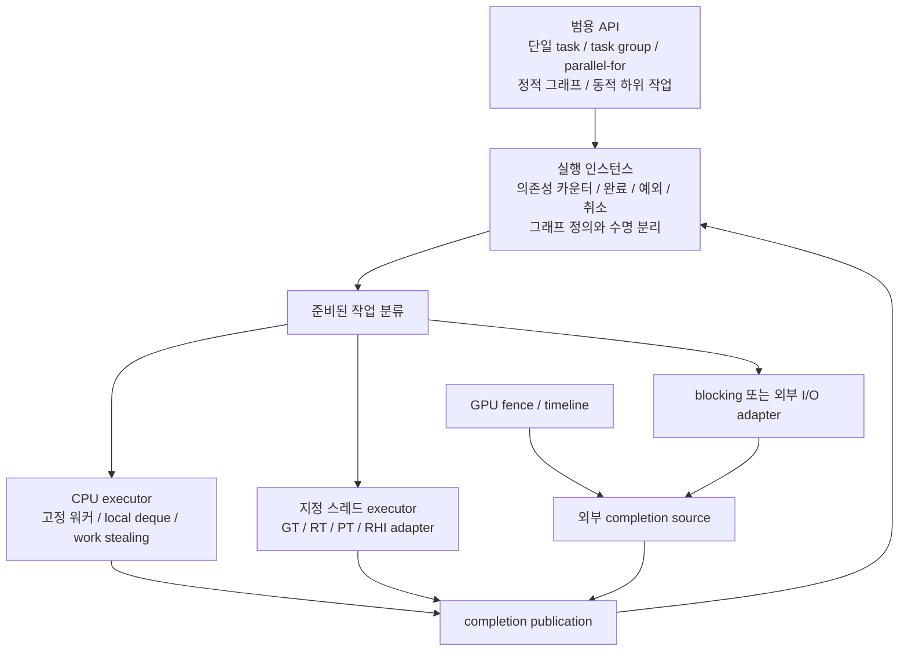

| 현재 경계 | 범용 런타임에 필요한 기능 | 단순 스레드 풀 교체로 해결 여부 |
|---|---|---|
| animation/asset 전체 풀 대기 | 실행별 TaskGroup 완료와 정확한 publication | 아니오 |
| Foliage async fan-out | parallel-for, grain size, persistent workers | 주요 부분 가능 |
| 부모→자식 Transform | 의존성 또는 subtree 분할, serial cutoff | 작업 분해 수정 필요 |
| raw pointer 작업 창 | structured lifetime 또는 generation/ownership token | 아니오 |
| GT pose/Scene 반영 | 지정 스레드 continuation, frame-budget pump | 아니오 |
| RT 기록 작업 | 작업별 command context, 논리 제출 순서 | 풀만 바꾸면 순서·소유권 위반 가능 |
| GPU 완료 | 외부 completion source, 자원 retirement | CPU 완료 카운터로 대체 불가 |
| 최신 frame 병합 | mailbox/admission 정책 | 그래프 의존성 밖의 명시 정책 필요 |
| RHI FIFO 및 lifecycle | serial executor, owner generation, drain | 임의 stealing 대상 아님 |
| HTTP/I/O/managed await | 외부 완료·지정 스레드 재개 adapter | CPU 워커에서 blocking하면 역효과 가능 |
| shutdown | admission close → drain/cancel → join → resource destroy | 명시 수명 모델 필요 |

권장 분리는 **그래프 정의 → 실행 인스턴스 → ready-task 실행기**다. 단일 작업·task group은 불필요한 그래프 구성 비용 없이 제출할 수 있게 하고, 반복 그래프는 topology를 재사용하되 실행마다 카운터·결과·취소 상태를 분리한다. CPU 작업은 워크스틸링으로 배분하고 스레드 소유권·외부 완료는 adapter로 연결한다.

외부 종속 축소 범위도 분리해야 한다. Core.ThreadPool의 PPL 큐를 없애더라도 `ProxyCommandQueue`와 Editor texture import queue 등의 `concurrency::concurrent_queue`, STL 병렬 실행, PhysX/CoreCLR 내부 실행 자원은 남는다. 새 런타임의 핵심을 표준 C++와 플랫폼 대기 계층으로 작성하는 일과, 엔진 전체의 기존 동시성 종속을 단계적으로 치환하는 일은 별도 범위다.

성능 이득의 구조적 원천은 새 thread 생성 축소, 여러 CPU 작업군의 worker 예산 공유, 정적 분배의 긴 꼬리 완화, 불필요한 전체 완료 대기의 세분화다. 물리/Scene의 실제 선후 관계, GPU 실행 시간, 외부 I/O 대기 자체가 그래프로 사라지는 것은 아니다. 현재 소스만으로 이득의 크기나 우선순위를 수치로 확정하지 않는다.

## 11. 확인 방법과 검증 상태

- PowerShell 파일 검색으로 thread/async/parallel/mutex/spinlock/CV/event/future/queue 호출을 조사하고, 위 source map의 실제 함수 본문을 읽었다.
- `Tools/regression/verify-frame-orchestration.ps1`: **PASS**. Runtime 단일 프레임 순서와 두 호스트 호출 관계를 검사하는 정적 gate다. 동시성 안전성 증명은 아니다.
- Mermaid 블록 구문 및 source map 파일 경로는 문서 작성 후 별도 검사했다. 결과는 아래 검증 기록에 남긴다.
- 실행 파일을 새로 빌드하거나 엔진을 실행하지 않았다. shutdown/ASan/lifecycle/렌더 stress gate는 존재 여부와 성격을 확인했으며 실행 성공으로 보고하지 않는다.
- `verify-shutdown-order.ps1`의 설명에는 옛 `Dx11Main`/CB 용어가 남아 있다. 현재 호스트 RT/PT 소스와 대조해야 한다.
- 이전 Transform 메모는 탐색 단서로만 사용했다. 현재 구조는 이 문서 기준 commit에서 다시 확인했고 과거 성능 수치를 재사용하지 않았다.

### 문서 검증 기록

Mermaid 11개 블록 parser 검사 PASS. source map의 상대 파일 링크는 존재 여부를 검사했다. HTML/SVG 시각 렌더링 검증이나 엔진 런타임 검증을 수행했다는 뜻은 아니다. 문서 도구는 임시 디렉터리에 설치했고 저장소 패키지/빌드 설정은 변경하지 않았다.

## 12. 소스 근거 지도

행 번호는 위 기준 commit의 번호다. 링크는 저장소 내 상대 경로이며 이후 코드 변경으로 행 번호가 이동할 수 있다.

| ID | 소스와 위치 | 확인 내용 |
|---|---|---|
| S01 | [CoreWindow.h](../../Engine/Utility_Framework/CoreWindow.h) 69–98; [App.cpp](../../Editor/EngineEntry/App.cpp) 232–325 | GT 루프, asset/CLI drain, packet 발행 |
| S02 | [EditorMain.cpp](../../Editor/EngineEntry/EditorMain.cpp) 252–468, 492–610 | PT, 구조 mutex, 프레임 끝, 종료 |
| S03 | [PlayerMain.cpp](../../Player/PlayerMain.cpp) 275–490; [PlayerApp.cpp](../../Player/PlayerApp.cpp) 265–309 | Player PT, command pump, packet 발행 |
| S04 | [RuntimeFrame.cpp](../../Engine/SceneRuntime/RuntimeFrame.cpp) 16–91 | 관리 pre/post, pause, Physics/GameLogic 순서 |
| S05 | [SceneManager.cpp](../../Engine/SceneRuntime/SceneManager.cpp) 328–547; [Scene.cpp](../../Engine/SceneRuntime/Scene.cpp) 2557–2790 | 활성화·시뮬레이션·파괴 단계 |
| S06 | [AnimationJob.cpp](../../Engine/SceneRuntime/AnimationJob.cpp) 37–193, 532–537, 645–650 | Animator snapshot, fan-out/join, pose와 event |
| S07 | [Core.ThreadPool.h](../../Engine/Utility_Framework/Core.ThreadPool.h) 20–150; [Core.CountingSemaphore.h](../../Engine/Utility_Framework/Core.CountingSemaphore.h); [Core.Thread.h](../../Engine/Utility_Framework/Core.Thread.h) | task count/event, semaphore, OS thread 수명 |
| S08 | [WorkerPool.h](../../Engine/Utility_Framework/WorkerPool.h) 27–61; [DataSystem.cpp](../../Engine/RenderEngine/DataSystem.cpp) 1661–1692 | 공용 풀과 실제 bundle 소비 |
| S09 | [FoliageSystem.cpp](../../Engine/SceneRuntime/FoliageSystem.cpp) 35–73; [FoliageComponent.cpp](../../Engine/SceneRuntime/FoliageComponent.cpp) 315–403 | 매 component async 범위 분할 |
| S10 | [EnhancedSceneRenderer.cpp](../../Engine/RenderEngine/Render/Scene/EnhancedSceneRenderer.cpp) 807–858, 3923–4180, 4396–4570, 4626–4654 | RT 큐·epoch·발행·상태 소유 |
| S11 | [ProxyCommandQueue.h](../../Engine/RenderEngine/ProxyCommandQueue.h) 45–173; [Scene.cpp](../../Engine/SceneRuntime/Scene.cpp) 1895–2089; [ProxyCommand.cpp](../../Engine/SceneRuntime/ProxyCommand.cpp) | dirty commit, queue, epoch 처리 |
| S12 | [RHISubmissionThread.h](../../Engine/RenderEngine/RHI/RHISubmissionThread.h) 117; [RHISubmissionThread.cpp](../../Engine/RenderEngine/RHI/RHISubmissionThread.cpp) 178–297, 357–574, 591 이후 | capacity 3, ticket/retirement/lifecycle |
| S13 | [DX12DeviceResources.cpp](../../Engine/RenderEngine/RHI/DX12/DX12DeviceResources.cpp) 515–537, 598–879, 1383 이후 | slot fence, submit, Present, GPU drain |
| S14 | [VulkanDeviceResources.cpp](../../Engine/RenderEngine/RHI/Vulkan/VulkanDeviceResources.cpp) 655–664, 759 이후, 1222–1291, 1518 이후 | timeline, submit, lifecycle, Present |
| S15 | [AIManager.cpp](../../Engine/SceneRuntime/AIManager.cpp) 34–87; [Scene.cpp](../../Engine/SceneRuntime/Scene.cpp) 361, 851–855, 1624, 2559–2562, 2753–2790 | AI snapshot, ready poll, lifetime drain |
| S16 | [Physx.cpp](../../Engine/Physics/Physx.cpp) 165–173, 441–453; [PhysicsManager.cpp](../../Engine/SceneRuntime/PhysicsManager.cpp) 76–105 | dispatcher, simulate/fetch, GT 반영 |
| S17 | [SceneManager.cpp](../../Engine/SceneRuntime/SceneManager.cpp) 387–414, 936–1268 | async load, DDOL 접근, 활성화 |
| S18 | [EditorModelPlacement.cpp](../../Editor/EngineEntry/EditorModelPlacement.cpp) 25–134, 175–315 | 준비/GT 적용, ready, 취소·join |
| S19 | [EditorDirectoryWatcher.cpp](../../Editor/EngineEntry/EditorDirectoryWatcher.cpp) 193–281, 340–365, 589 이후; [DataSystem.cpp](../../Engine/RenderEngine/DataSystem.cpp) 1496–1528 | I/O 취소, asset 전달 |
| S20 | [DX12PSOManager.cpp](../../Engine/RenderEngine/RHI/DX12/DX12PSOManager.cpp) 275–299, 580–590, 681–727 | async API, poll, 잠금 밖 future 회수 |
| S21 | [CommandService.cpp](../../Engine/CommandService/CommandService.cpp) 133–266, 599 이후; [EditorCommandServiceHost.cpp](../../Editor/EngineEntry/EditorCommandServiceHost.cpp) 194–250; [ConsoleCommandSystem.cpp](../../Editor/EngineEntry/ConsoleCommandSystem.cpp) 487–510, 4594–4645; [PlayerCommandService.cpp](../../Player/PlayerCommandService.cpp) | socket/command/result, stdin 종료 |
| S22 | [GameThreadSynchronizationContext.cs](../../ScriptCore/GameThreadSynchronizationContext.cs); [ScriptRegistry.cs](../../ScriptCore/ScriptRegistry.cs) 538, 690; [Native.cs](../../ScriptCore/Native.cs) 341–393; [ClrHost.cpp](../../Engine/SceneRuntime/ClrHost.cpp) 2984–3017, 3161–3171 | 관리 재개와 엔진 진입 경계 |
| S23 | [SoundManager.cpp](../../Engine/SceneRuntime/SoundManager.cpp) 10–44, 99–141; [SoundManager.h](../../Engine/SceneRuntime/SoundManager.h) 107–114 | detached loader, 상태 flag와 종료 불일치 |
| S24 | [EngineBootstrap.h](../../Editor/EngineEntry/EngineBootstrap.h) 178–246; [ProgressWindow.h](../../Editor/EngineEntry/ProgressWindow.h); [App.cpp](../../Editor/EngineEntry/App.cpp) 168–180 | bootstrap/호스트 수명 |
| S25 | [Delegate.inl](../../Engine/Utility_Framework/Delegate.inl) 93–146 | snapshot과 동기 callback |
| S26 | [AnimationEventBridge.cpp](../../Engine/SceneRuntime/AnimationEventBridge.cpp) 145 이후 | worker clip event → 관리 메시지 큐 |
| S27 | [Scene.cpp](../../Engine/SceneRuntime/Scene.cpp) 4119–4360, 4723 이후, 4936–5048; [TangentGeneration.cpp](../../Engine/RenderEngine/Experiment/Import/TangentGeneration.cpp) 347–382 | dirty range, fallback, targeted pull, import 병렬 |
| S28 | [Profiler.cpp](../../Engine/EngineDiagnostics/Profiler.cpp) 52–76, 96–169, 253–300; [Profiler.h](../../Engine/EngineDiagnostics/Profiler.h) | TLS 기록과 수집, registry 잠금 |
| S29 | [EnhancedRenderGraph.cpp](../../Engine/RenderEngine/Render/Graph/EnhancedRenderGraph.cpp) 691–818; [DX12CommandListPool.cpp](../../Engine/RenderEngine/RHI/DX12/DX12CommandListPool.cpp) 81–184; [VulkanCommandBufferPool.cpp](../../Engine/RenderEngine/RHI/Vulkan/VulkanCommandBufferPool.cpp) 93–147 | 정적 기록 분배, 단일 배치 join |
| S30 | [EnhancedSceneRenderer.cpp](../../Engine/RenderEngine/Render/Scene/EnhancedSceneRenderer.cpp) 587 이후, 911–1010, 4934–4994, 5095–5195, 5250–5281; [ImGuiDx12Shell.cpp](../../Editor/HostImGuiPresentation/RHI/DX12/ImGuiDx12Shell.cpp) 451–687; [ImGuiVulkanShell.cpp](../../Editor/HostImGuiPresentation/RHI/Vulkan/ImGuiVulkanShell.cpp) 410–527 | GPU 완료 승격, 뷰 저장소, 표시 |
| S31 | [AssetJob.cpp](../../Engine/RenderEngine/AssetJob.cpp); [AssetJob.h](../../Engine/RenderEngine/AssetJob.h); [DataSystem.h](../../Engine/RenderEngine/DataSystem.h) 323 | 호출 미확인 잔존 풀/스레드 선언 |
| S32 | [RenderScene.cpp](../../Engine/RenderEngine/RenderScene.cpp) 17–32; [RenderScene.h](../../Engine/RenderEngine/RenderScene.h) 133 | AnimationJob 소유와 풀 회수 |
