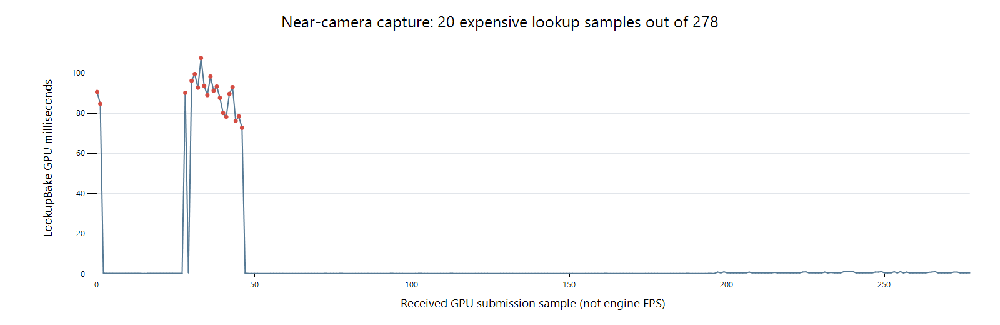

# MAT-9 — 근접 카메라 이동 프레임 저하 조사

2026-10-01. **원인은 화면별 IBL lookup 재계산으로 좁혀졌다.**
이 문서는 원인 조사와 근사 후보 실험이다. 모델 FPS 개선이나 MAT-9 성능 수용 완료를 뜻하지 않는다.
제품 샘플 수·캐시 판정·쿠킹 형식은 이번 조사에서 변경하지 않았다.

## 1. 사용자 캡처

`Dynamic_CPP/2026-10-01-1633.ceprof`, SHA-256
`49fad1df161d15de24544a9ad3f1b5ce00bb4bdb35c788a826f57ae8a521ebe2`.
파일 형식은 현재 `ProfileCaptureFile.cpp`의 v1 레코드와 CRC를 검증하여 읽었다.

- 보존된 engine frame 11388..11987, 600개, 약 5.221초.
- `complete=false`, `unacked=2`, dropped event 0. 마지막 미수집 스트림과 경계 조각을
  전체 완료 데이터로 취급하지 않았다. 아래는 실제 받은 유효 span의 통계다.
- Scene view 1의 lookup bake GPU span 278개. 전체 패스 구성 47개가 일치하는
  제출만 묶는 다른 계산에서는 273개가 남으며, 동일한 spike를 확인했다.
- 이 파일에는 모델·카메라 좌표·viewport 해상도·실행 바이너리 SHA가 없다.
  사용자 보고를 Debug/근접 카메라 조건의 근거로 삼으며, 이 파일로 정확한 카메라 궤적을 복원하지 않는다.
- 현재 정상 Debug runtime은 15:17:33 빌드, SHA
  `f93b7f3b9bd84f0747f067caac841b275ec0684f7aea3d79c752e7b14e12ed1a`로
  직전 host 10 검증 기록과 같다. 파일 생성 시각보다 앞선 빌드다.
  캡처 자체에 실행 SHA가 없으므로 당시 프로세스의 동일성을 확정한 것은 아니다.

| GPU 구간 | 표본 수 | 평균 ms | 중앙값 ms | p95 ms | 최대 ms |
|---|---:|---:|---:|---:|---:|
| LookupBake 전체 | 278 | 6.890 | 0.394 | 87.704 | 107.506 |
| LookupBake < 2ms | 258 | 0.510 | 0.392 | 1.076 | 1.280 |
| LookupBake > 20ms | 20 | 89.196 | 90.442 | 107.506 | 107.506 |
| LX.Scene.Color, 동일 47-pass 제출 | 273 | 0.150 | 0.126 | 0.198 | 0.217 |
| LX.Scene.LookupCapture, 동일 제출 | 273 | 0.142 | 0.110 | 0.223 | 0.234 |

20개 spike는 72.819..107.506ms다. 최종 color shading, GBuffer 또는 shadow보다
**그 color shading이 소비할 IBL 응답을 만드는 compute pass**에 시간이 집중된다.
캡처에 SSS/refraction/volume bake 패스는 나타나지 않는다. 박막 단독 원인으로 특정할 근거도 없다.

CPU에도 별도 비용이 있다. `ProfilerWindow` 평균 3.040 / p95 21.690 / 최대 33.575ms,
그 내부 `ProfilerTimeline` 평균 2.489 / 최대 30.021ms다.
`GameSceneLockWait` 평균 5.737 / 최대 38.188ms가 함께 관측됐다.
이들은 inclusive 구간이므로 서로 더하지 않는다. 프로파일러 UI와 씬 잠금 대기는
입력 반응을 악화시킬 수 있지만 GPU lookup의 약 90ms spike를 없애는 대체 해법은 아니다.
`DXGIPresent` 평균 0.346 / 최대 0.708ms다.

## 2. 현재 계산 경로와 캐시

현재 `MaterialGraphSceneLookup.slang::LXSceneLookupBake`는:

1. 현재 픽셀의 material/view 입력 11개 `float4`를 이전의 **동일 화면 픽셀**과
   `asuint`로 비교한다. 44개 float가 비트 단위로 같아야 이전 sample을 복사한다.
2. miss이면 BRDF 방향 적분 1024회 및 Fresnel 평균 64회를 수행한다.
3. 반사 radiance가 필요하면 다시 BRDF proposal 1024회와, v5 환경에서 environment
   proposal 4096회를 MIS로 결합한다. coat 등 활성 lobe에 추가 계산이 있을 수 있다.
4. source가 존재하면 각 radiance 조회에서 방향→위경도 변환과 4개 float texel의
   bilinear reconstruction을 수행한다. diffuse는 준비된 irradiance가 있으면 재사용한다.

`SceneLookupCache::Prepare`의 CPU key는 view/scene epoch, 크기, 환경 resource와 generation,
importance/source identity를 보존한다. 카메라 이동으로 이 소유권을 무조건 파기하는 구현은 아니다.
하지만 shader의 동일 화면 픽셀 검사에는 reprojection 또는 각도 허용 오차가 없다.
카메라 이동으로 view, 화면의 표면 위치, texture/normal 입력이 변하면 다시 계산한다.

따라서 **카메라 정지 시 싸고, 조금 움직였을 때 큰 적분 작업이 다시 발생하는 구조**가
캡처 분포와 일치한다. 가까이 갈수록 covered pixel 수가 늘어날 수 있으므로 miss 비용도 커진다.
이 마지막 면적 관계는 현재 구조에서의 예측이며, 첨부 파일에는 coverage 통계가 없어
실제 면적별 기울기나 정확한 invalidation 수를 측정했다고 주장하지 않는다.

## 3. 근사 후보를 실제 실행

제품 shader를 복사한 별도 diagnostic root에서 실험했다. 제품 기본값을 덮어쓰지 않았다.
고정 forest/autumn 26조건, 같은 triangle soup·64×64 camera·strength 0.35,
기존 344개 공통 interior pixel, Cycles 131072 samples seed 0/11을 유지했다.
RMS 1%, p95 normalized 1%, max normalized 5%의 기존 상한을 바꾸지 않았다.

| BRDF / environment sample 수 | 고정 이미지 상한 만족 | 최대 상대 RMS | 판단 |
|---|---:|---:|---|
| 제품 1024 / 4096 | 26/26 | 0.4959% | 이번 제품 재실행도 기존 HDRI 상한 통과 |
| 1024 / 1024 | 22/26 | 1.6202% | 금속·이방성·박막 일부 이탈 |
| 256 / 1024 | 22/26 | 2.2444% | 금속·이방성 이탈 |
| 256 / 4096 | 26/26 | 0.9822% | 제한된 BRDF 근사 후보; 오차 여유가 작음 |

각 조건은 scene epoch를 매번 바꾸어 9 frame을 실행했다. 총 4회 × 234 frame이며
전체 출력은 finite이고 정상 종료했다. timing 실행에서는 GPU validation을 껐다.
따라서 로그의 validation=0을 GPU validation on 검증과 혼동하지 않는다.
제품 root의 26조건은 원래 acceptance reader도 통과했다. diagnostic shader root는
그 reader에서 의도적으로 거부되므로 **후보의 제품 수용 완료를 선언하지 않는다**.

초기 전체 frame timestamp는 준비/제출 사이의 공백이 포함될 수 있어 개선율에 사용하지 않았다.
측정 도구에 `IRHIGpuProfiler` 기반 패스별 query를 추가하고, 전체 query 시작도 graph 실행 직전으로 옮겼다.
이후 동일한 네 조건을 제품→후보 3개→제품 반복 순으로 다시 실행했다.
각 36 frame, `LX.Scene.LookupBake`의 직접 timestamp를 7개 warm 표본으로 비교했다.
새 도구가 만든 네 조건의 **전체 RGBA 이미지가 이전 같은 variant 실행과 byte 일치**했다.

| LookupBake 중앙값 ms | 제품 A | env 1024 | BRDF 256 + env 1024 | BRDF 256 + env 4096 | 제품 A 반복 |
|---|---:|---:|---:|---:|---:|
| autumn metal | 4.102 | 26.357 | 10.803 | 17.457 | 3.837 |
| forest metal | 14.147 | 12.117 | 10.938 | 16.584 | 20.116 |
| forest anisotropic | 4.450 | 17.065 | 11.216 | 20.541 | 4.438 |
| forest thin film | 15.199 | 9.281 | 25.020 | 9.996 | 15.905 |

**일괄 샘플 축소는 이 실행에서 전체 재질의 속도 개선을 입증하지 못했다.**
GPU 전력 상태/클럭도 각 실행에서 변했다. NVML 200ms 간격 표본은 pass별 GPU clock과
정확히 동기화된 값이 아니므로 GPU 시간에 클럭 비율을 곱해 보정하지 않았다.
컴파일된 kernel의 register/occupancy 변화와 clock/scheduling 기여도를 아직 분리하지 않았다.
이 표를 일반적인 speedup 또는 실제 모델 FPS로 환산하지 않는다.

특히 256/4096 후보는 고정 이미지 품질을 만족했지만, 모든 재질을 빠르게 만든 것은 아니다.
전체 화면·grazing view·texture/normal map·Special·이동 이력은 이 후보의 수용 범위에 포함되지 않는다.

## 4. 권장 최적화 순서

### A. 환경 proposal radiance를 한 번 준비해 공유

4096개의 environment proposal 방향은 환경 identity/generation에 종속되고
카메라·재질·화면 픽셀마다 달라지지 않는다. 현재 반복하는 source bilinear/위경도 조회를
그 방향별로 한 번 준비하여 쓰는 것이 첫 구현 후보다.

- 5120개 방향 전체의 `float4` radiance라면 논리 데이터는 80KiB다.
- 현재 importance texture의 두 번째 row를 source cache로 그대로 간주하면 안 된다.
  그 row의 기존 radiance 의미와 decoded-source reconstruction을 구분해야 한다.
  새 resource 또는 명시된 cook version/recipe로 표현한다.
- RGB·원래 방향/PDF·MIS count/가중·금속 F82·박막 LUT를 보존한다.
- intensity scaling, HDRI 교체, 손상 cache 거부, generation/fence/재저장 경로를 포함한다.
- 동일 shader reconstruction의 GPU 준비 경로 또는 CPU reconstruction 오차를 검증한다.
  현재 단계에는 실측 speedup이 없다.

### B. BRDF 응답 근사를 제한된 경로부터 적용

256-sample 후보는 실측한 품질 범위에서 가능한 근사다. 하지만 현재 방식대로 숫자만
바꾸는 것으로 안정적인 속도를 얻지 못했다. kernel 코드 크기·register/occupancy와
고정 work를 함께 비교한 후 선택해야 한다.

- 우선 isotropic/Core의 directional albedo·Fresnel response를 LUT 또는 저차 basis로
  준비하는 방향을 검토한다. 복잡한 입력을 하나의 2D GGX LUT로 대체하지 않는다.
- 환경 반사 적분도 prefilter/split-sum과 Fresnel basis로 근사하여, 이동할 때마다
  4096 방향을 다시 평가하는 비용을 줄이는 것이 목표다. BRDF 적분만 줄이고
  환경 적분은 그대로 남기는 안으로 전체 문제를 해결했다고 세지 않는다.
  저차 근사가 맞지 않는 재질/각도에서는 검증된 정확 경로를 보존한다.
- IOR·F82 tint, 이방성 view azimuth, thin-film thickness/IOR는 추가 축 또는 fallback이 필요하다.
- texture마다 변하는 roughness/color/normal 입력도 유지한다.
- 이번 26조건에 이어 grazing angle·roughness/IOR·film sweep과 같은 상한을 검증한다.
- 현재 4096 environment bank를 전역으로 줄이는 안은 22/26 결과 때문에 기본값으로 채택하지 않는다.

### C. 카메라 이동 시 IBL 이력 재사용

동일 화면 좌표의 bit equality를 완화하는 것만으로는 재투영 문제가 해결되지 않는다.
세계 위치/depth와 이전 camera를 이용한 reprojection, 표면/소유권 및 material generation
일치, normal/depth/roughness 기반 rejection이 필요하다.

- 재사용 대상은 준비된 IBL 응답이다. geometry/depth/direct lighting은 현재 frame에서 계산한다.
- 거울·낮은 roughness·박막의 급격한 각도 변화에는 더 엄격한 판정과 fallback을 둔다.
- camera cut, 새로 보인 표면, HDRI/texture/material 변경에서 잘못된 이력을 거부한다.
- 시간에 걸친 refinement를 쓰면 sample 품질/완료 상태를 별도로 보존해, 정지 후 낮은 품질이
  bit cache에 영구히 남지 않도록 한다.
- 검증은 정지 이미지뿐 아니라 느린 이동·회전·disocclusion·material 편집 시 잔상/색 변화와
  실제 render completion FPS를 포함한다. phase 완료 기준을 낮추지 않는다.

위 A→B→C는 조사 당시의 구현 후보 순서다. **2026-10-01 사용자 결정**으로 현재 제품
1024/4096을 유지하고 4.25/MAT-9를 열린 상태로 남긴다. RenderGraph·RHI·필요한 시간축 기반을
진행한 뒤 GPU-driven 설계에서 CPU 배칭/제출과 IBL 재사용·갱신을 함께 정하고 실제 후속 구현 뒤
같은 품질 상한과 Debug/Release 이동 카메라 성능을 재판정한다. 설계만으로 gate를 닫지 않는다.
현재 user capture만으로 LUT/reprojection의 speedup을 보장하지 않는다.
[정본 결정](../plans/BlenderMaterialGraphPlan.md), [통합 체크포인트](MAT9IntegrationCheckpoint20261001.md)를 따른다.
프로파일러 timeline의 visible-range clipping/cache와 씬 잠금 유지 시간은 별도 CPU 개선 항목으로 남긴다.

## 5. 산출물 및 이번 변경 범위

- [캡처·후보·타이밍·shader hash 데이터](MAT9NearCameraPerformance.json).
- 캡처 parser: `Build/Obj/mat9-near-camera-analyze.py`.
- variant generator 및 실행: `Build/Obj/mat9-near-camera-variants.py`,
  `mat9-near-camera-pass-runs.ps1`, `mat9-near-camera-{summary,pass-summary}.py`.
- 전체 품질/초기 timestamp: `Build/Obj/Mat9NearCamera-{reference,env1024,ggx256-env1024,ggx256-env4096}-timing`.
- 새 pass timestamp: 같은 label의 `-pass` 및 `reference-repeat-pass`.
- 각 실행의 `pass-timing.csv`, `mat9-near-camera-*-pass-clocks.csv`, 정상 종료 로그.
- `Tools/regression/material_matched_image_probe.cpp`에 측정용 pass query만 추가했다.
  Release probe 빌드와 해당 실제 실행을 확인했다. 제품 Editor/renderer/shader 변경은 없다.
- 직전 host 10의 589-file snapshot을 다시 확인했다. 변경은 이 측정 도구 한 파일이며,
  제품 소스 drift는 0이다. 원본 캡처와 기존 다른 세션 변경도 보존했다.

MAT-9는 진행 중이다. 이번 조사로 실제 모델의 moving-camera 성능 수용을 완료 처리하지 않는다.
