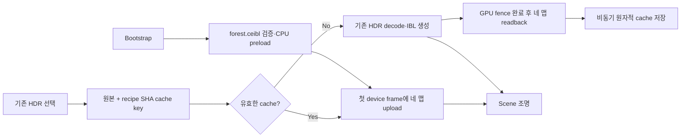

# MAT-9 박막 가시광 근사와 HDRI 쿠킹·캐시

2026-09-30. 사용자 요청에 따른 구현과 실측 기록이다. **MAT-9는 progress,
PHASE 4.25 완료 공수는 32/34일**을 유지한다. 이 기록은 전체 재질의 rendered
parity나 최종 성능 상한 수용을 뜻하지 않는다.

## 1. 박막 구현

기존 650/550/450nm 평가를 가시광 색 응답의 **Fourier LUT + 3차 Airy 간섭 항**으로
교체했다. 금속 경계에는 film-relative F82 응답을 적용한다.

- Blender 5.1.1의 Fourier XYZ 데이터 512×6과 CIE 1931 XYZ 473행을 고정했다.
  `Tools/blender/generate-thin-film-sensitivity.py`가 linear Rec.709 작업 공간의
  Slang float 및 독립 CPU double 표를 결정적으로 생성한다. 표의 숫자 데이터는 12KiB다.
- `PrincipledThinFilm.slang`은 s/p 편광, 굴절·복소 금속 경계 위상 및 F82 크기를 계산한다.
  세 간섭 차수의 감도 조회는 s/p 사이에서 공유한다. 직접광과 재질 IBL bake가 같은 함수를 쓴다.
- diffuse attenuation에는 dielectric view Fresnel을 사용한다. metallic weight를 중복
  적용하던 부분을 수정했다. GGX multiple-scatter 보상은 박막 아래 substrate의 Fss를
  사용한다. 이 두 보정의 이미지 기여를 LUT 변경과 분리해 측정했다.
- thickness=0, film IOR=1, dielectric과 film IOR가 같은 경우의 기존 제어 조건을 유지한다.
  박막을 사용하지 않는 feature mask에는 LUT·간섭 코드가 포함되지 않는다.
- Scene host identity를 `lx-scene-host:2`로 올려 이전 셰이더 제품 캐시가 재사용되지 않게 했다.
  이전 쿠킹 제품은 새 의미 계약으로 재쿠킹해야 한다.

소스·라이선스는 `Tools/blender/fixtures/thin-film-sensitivity-5.1.1/NOTICE.md`에 기록한다.
Blender의 [감도 사전 계산](https://github.com/blender/blender/blob/v5.1.1/intern/cycles/doc/precompute/thin_film_table.py),
[Fourier 표](https://github.com/blender/blender/blob/v5.1.1/intern/cycles/scene/shader.tables)는 Apache-2.0,
[경계 평가](https://github.com/blender/blender/blob/v5.1.1/intern/cycles/kernel/closure/bsdf_util.h)는
BSD-3-Clause다. 해당 고지와 라이선스를 함께 보존했다.

## 2. 고정 Blender 이미지 대조

[기존 비교](MAT9BlenderImageComparison.md)의 triangle·normal·UV tangent·camera·light·입력을
유지했다. Blender 5.1.1 Cycles 1,024 samples, 64×64, 내부 공통 mask 345픽셀의 scene-linear
RGB relative RMS이며 후처리·그림자를 제외한다.

| 박막 구현 단계 | 평행광 relative RMS | 흰색 환경광 relative RMS |
|---|---:|---:|
| 기존 RGB 3파장 | 18.348% | 15.646% |
| LUT·F82만 교체 | 15.897% | 15.326% |
| dielectric diffuse attenuation 보정 | 2.826% | 1.659% |
| substrate Fss 보상까지 적용한 현재 구현 | **2.835%** | **1.352%** |
| Blender 시드 0/11 간 변동 | 0.00636% | 0.22359% |

마지막 결과의 Debug/Release 각각 24장·400,495개 검사·GPU validation 문제 0건을 확인했다.
24개 재질 이미지와 3개 geometry 진단 이미지의 `.f32` 바이트가 구성 간 모두 일치한다.
박막 외 재질은 기존 결과를 유지한다. 최종 박막 차이는 줄었지만 시드 변동보다 크므로
**Blender 일치도 최종 수용은 남는다**. Core rough 평행광의 기존 1.941% 차이도 남는다.

근거:

- `Build/Obj/Mat9Images-Release-film-spectral-v4`: 최종 Release 비교·native 로그·이미지.
- `Build/Obj/Mat9Images-Debug-film-spectral-final`: 동일 Debug 캡처.
- 기존 두 중간 결과는 `Mat9Images-Release-film-spectral-v2`, `-v3`에 보존한다.

### 숫자·IBL 회귀

| 검증 | 결과 |
|---|---|
| Layered | GPU/CPU 216,776개, furnace 5,712개, 컴파일 14개·거부 8개 |
| Special | GPU/CPU 202,049개, furnace 4,410개, 컴파일 28개·거부 22개 |
| Layered/Special 최대 정규화 오차 | 1.1920929e-6 |
| 재질 IBL bake·소비, Debug/Release 각각 | 19,351개 검사·18,240 GPU 성분·152점·3 frame·6 compile |
| IBL 최대 정규화 오차 | 5.45189e-6 |

역사적 RGB 3파장 numeric golden을 덮어쓰지 않았다. 새 spectral golden 1,960/4,410행은
명시적으로 고정하고, 박막 입력이 없는 사례는 역사적 golden과도 같아야 한다.
CPU oracle는 복소 경계 진폭을 사용하며 GPU의 실수 전개와 계산 경로를 분리한다.
최신 IBL CPU oracle에도 substrate Fss·dielectric diffuse 계약을 적용했다.

### 직접 파장 적분으로 본 한계

`measure-thin-film-spectrum.py`는 359~831nm를 1nm 간격으로 적분하며 infinite Airy
응답과 3차 응답, LUT 3차 응답을 따로 비교한다. IOR·두께·시야각·dielectric/metal 경계의
2,646개 RGB 성분을 측정했다.

- LUT와 직접 적분 3차 사이의 최대 절대 채널 차이: **0.002071511**.
  film IOR=3, 두께=1nm, cosine=1, substrate IOR=1.5의 blue였다.
- 3차와 infinite Airy 사이의 최대 절대 채널 차이: **0.124654848**.
  film IOR=1.5, 두께=100nm, cosine=0.05, substrate n=0.3/k=3/F82=0.7의 red였다.

두 번째 수치는 강한 grazing 반사에서의 차수 절단 한계다. LUT 보간 오차나 전체 BSDF의
relative RMS로 해석하지 않는다. RGB 입력으로 복원하는 금속 광학 특성과 RGB 조명의
분광 정보 한계도 남는다. 원시 측정은 `Build/Obj/thin-film-spectrum.json`에 있다.

## 3. 박막 GPU 비용 A/B

RTX 4070 Ti, Release DX12, validation off, 동일 64×64 SceneHost probe를 사용했다.
비교 root는 `1eed7d421313b4791a54f99ee2b89714349a1bfb`의 세 Principled 셰이더 파일로만
교체했다. 나머지 셰이더와 C++ harness·기하·입력은 현재와 같다. GPU 작업을 겹치지 않고
두 실행을 순차 수행했다. 재질마다 첫 준비 1회 + 재사용 8회를 측정한다.

GPU timestamp 범위는 material prepare의 IBL 작업부터 render graph·readback까지다.
CPU Slang compilation은 `program_prepare_ms`, CPU frame 준비는 `frame_prepare_ms`에
별도로 기록한다. 아래 warm은 repeat 1~8의 median이다.

| 사례 | 기존 warm GPU | 현재 warm GPU | 차이 | 기존/현재 첫 GPU frame |
|---|---:|---:|---:|---:|
| Core base, 평행광 | 0.174784ms | 0.173936ms | -0.000848ms | 4.770 / 2.741ms |
| 박막, 평행광 | 0.190960ms | 0.245824ms | +0.054864ms | 13.936 / 36.012ms |
| Core base, furnace | 0.171376ms | 0.171056ms | -0.000320ms | 7.737 / 7.762ms |
| 박막, furnace | 0.175712ms | 0.278000ms | +0.102288ms | 30.533 / 73.248ms |

현재 박막의 warm 비용은 이 probe에서 각각 약 28.7%/58.2% 늘었다. 첫 frame에는 재질
lookup bake와 PSO 최초 준비 영향이 포함된다. Core 수치의 작은 감소를 성능 개선으로
주장하지 않는다. 64×64 결과는 1080p·다중 조명·큰 화면 점유율·이동 카메라의 FPS 수용을
대체하지 않는다. 최초 박막 준비와 화면 점유율에 따른 비용이 후속 MAT-9 측정 대상이다.

원시 CSV는 `Build/Obj/ThinFilmTiming-isolated-old/timing.csv`,
`ThinFilmTiming-isolated-new/timing.csv`, 집계는 `thin-film-timing-isolated-summary.json`.
각 실행 24 cases·3,548,695개 검사를 통과했다. 이 실행의 validation은 의도적으로 off다.

## 4. 기본 forest HDRI와 기존 HDRI 경로

`forest.exr`는 사용자 선택에 따라 **엔진의 기본 환경**으로 사용한다. Blender 설치 전체의
보편적 기본값이라고 단정하지 않는다. Blender 5.1.1 설치 파일과
[공식 파일](https://github.com/blender/blender/blob/v5.1.1/release/datafiles/studiolights/world/forest.exr)의
LFS SHA-256이 일치한다. Greg Zaal / Poly Haven
[ninomaru_teien](https://polyhaven.com/a/ninomaru_teien), CC0 고지를 함께 배포한다.

`Resources/Environment`에는 EXR·decoded float 원본을 넣지 않는다. 다음 쿠킹 결과와
설명·라이선스만 저장한다.

| 항목 | 값 |
|---|---|
| 파일 | `forest.ceibl`, 35,843,184 bytes (34.183MiB) |
| Source SHA-256 | `bdf2298244affa0f85509380fd130ac6d4dfaa3c856df065998f7f4c1a93dc0d` |
| Recipe SHA-256 | `0a326fd77ba342609eb2a30938614476ac578929c77ea2dc7d2226ac9a662e62` |
| Artifact SHA-256 | `8c004884368a36ece50bf9e046aaf96f0d47b3e3232a024582eae7dc68b05579` |
| Environment | RGBA16Float cube 512, 7 mip |
| Irradiance | RGBA16Float cube 64, 1 mip, E/π |
| Prefilter | RGBA16Float cube 512, 6 mip |
| BRDF lookup | RGBA16Float 512×512, 1 mip |
| 색 공간 | linear Rec.709 |

`CookedEnvironment`의 `CEIBL001` 형식에는 원본·recipe identity, 크기, 네 맵의 모든
face/mip와 payload SHA-256이 포함된다. 불일치·잘못된 크기·길이·checksum을 검증하고
완료된 CPU 이미지만 게시한다. 쓰기는 임시 파일 뒤 원자적 교체로 완료한다.



기본 환경은 bootstrap에서 쿠킹 데이터를 미리 읽고, 첫 device frame에 texture cache로
올린다. EXR decode·환경 IBL 재생성은 하지 않는다. IBL 생성 shader/PSO도 실제 cache
miss 때까지 만들지 않는다. 일반 렌더 파이프라인의 cold compilation은 별도로 남아 있다.

기존 `.hdr` 경로도 최초 생성 후 같은 형식으로 저장한다. cache key는 원본 내용 SHA-256,
shader 및 재귀 include 내용, 크기·format·색 공간·적분 설정·알고리즘 버전에서 만든 recipe
SHA-256이다. algorithm/convention C++ 의미를 바꾸면 recipe 버전도 올려야 한다.
Editor cache는 **`<Project>/Saved/Editor/Cache/Environment/<source>-<recipe>.ceibl`**이다.
GPU 완료 fence 뒤에 모든 face/mip를 읽고, 디스크 checksum·쓰기는 비동기로 수행한다.
종료 시 GPU idle을 보장한 소유자가 남은 제출 capture·writer를 마무리한다.
여러 HDR 선택이 앞 capture의 완료 전에 들어와도 각 작업의 identity·출력 경로를 보존한다.

## 5. HDRI 검증·실측

- 오프라인 forest cook: GPU validation on, 네 맵·모든 face/mip의 upload→readback
  roundtrip 바이트 일치. cold `generated_ms=3692.15`, upload/readback 50.444ms.
  generation에는 decode·device·pipeline 준비와 GPU wait가 포함된다.
- 기존 autumn HDR cook: cold 983.016ms, upload/readback 28.790ms, roundtrip exact.
  해당 측정의 GPU validation은 off다.
- 완성된 cache의 파일 읽기·checksum·layout 구성은 forest 146.317ms,
  autumn 150.292ms였다. 후속 forest warm metadata 검사는 142.729ms였다.
  이 값들은 GPU upload·Scene FPS·전체 앱 시작 시간을 포함하지 않는다.
- 원본 불일치, shader recipe 변경, payload 1 byte 손상은 모두 cache miss/거부로 확인했다.
- **실제 isolated Editor:** DX12 Debug/Release 및 Vulkan Release에서 default cooked
  upload→HDR 최초 생성·저장→forest 복귀→HDR cache hit를 확인했다. warm 선택 뒤 파일
  checksum이 유지된다. 손상된 `.ceibl` 선택을 거부해도 이전 환경이 ready·rendering이다.
- Release DX12의 HTTP 선택부터 frame fence까지 HDR cold 1149.68ms / warm 346.37ms,
  Vulkan Release는 795.78ms / 315.60ms였다. HTTP scheduling·frame 준비를 포함하므로
  순수 GPU upload A/B로 해석하지 않는다. Vulkan default stage 220.06ms는 **이미 초기
  준비가 끝난 이후**의 fence 시간이다. DX12 최초 default stage 13.53초와 Vulkan 로그의
  최초 전체 준비에는 전체 파이프라인 cold compilation이 포함된다.

runtime evidence는 `Build/Obj/EnvironmentRuntime-{Debug,Release,Vulkan-Release}`의
응답·stage JSON·HTML log와 `environment-runtime-*.log`에 보존한다. 세 실행은 정상
종료했다. Vulkan snapshot은 backend=vulkan, 검증 문제 0, RHI failure/order 0/0이었다.
Vulkan 종료 stderr의 기존 profiler abandoned=1/retained=1은 별도 profiler 상태로 남긴다.

Editor 전체 Debug/Release 빌드 및 C# BuildTool Release 빌드를 통과했다.
Release 링크의 MSVC LNK1000은 CreatorEditor의 incremental LTCG cache `.iobj/.ipdb`를
Build/Obj 내 별도 위치에 보관한 뒤 전체 relink하여 해결했다. 소스 오류로 보고하지 않는다.
Editor/Player 빌드 배치와 GamePackager에 common Environment resource 복사를 연결했다.
**이번 변경의 새 Player 패키지 실행은 하지 않았다**. 패키징 복사 코드는 C# 빌드로 검증했다.

## 6. 재현

```powershell
# 숫자·직접 적분·고정 이미지
& C:/Python313/python.exe Tools/blender/generate-thin-film-sensitivity.py --check
& C:/Python313/python.exe Tools/regression/measure-thin-film-spectrum.py Build/Obj/thin-film-spectrum.json
& Tools/regression/verify-principled-layered.ps1
& Tools/regression/verify-principled-special.ps1
& Tools/regression/verify-material-ibl-bake.ps1
& Tools/regression/measure-material-blender-images.ps1 -Configuration Release -Label spectral-new

# forest의 EXR decode는 cook miss일 때만 Blender로 실행한다.
# warm hit는 Blender 없이 native cache 검증 후 종료한다.
& Tools/AssetCooker/cook-environment.ps1 -Configuration Release
& Tools/AssetCooker/cook-environment.ps1 -Configuration Release -SkipBuild `
    -Source Dynamic_CPP/Assets/HDR/autumn_field_puresky_1k.hdr `
    -Output Build/Obj/EnvironmentCooker/autumn.ceibl
```

각 `.ceibl`과 함께 `.cook.json`도 자동 갱신한다. live runtime은 JSON을 읽지 않고
binary identity/checksum을 검증한다. EXR 임시 RGBA32F는 Build/Obj에서만 사용하고 삭제한다.
라이선스는 원본의 고지를 별도로 함께 배포해야 한다.

runtime 재현은 위 Editor 빌드 후 별도 Project에 Assets/ProjectSetting을 복사하고 현재
DefaultPassShader를 배치한다. `render.backend`를 dx12 또는 vulkan으로 지정하고 다음처럼
시작한다. 사용자 작업 Project에서 이 검증을 실행하지 않는다.

```powershell
$session = '<absolute isolated session directory>'
$editor = (Resolve-Path Bin/x64-Release/Editor/CreatorEditor.exe).Path
Start-Process -FilePath $editor -WindowStyle Hidden -WorkingDirectory (Split-Path $editor) `
    -ArgumentList @('--development-project',"`"$session/Project`"",'--command-service','--smoke-offscreen')
# Project/Library/CommandService/endpoint.json 생성 후:
& Tools/regression/verify-environment-runtime.ps1 -Configuration Release -SessionDirectory $session
```

도구는 default·HDR·손상 거부를 검증하고 해당 isolated Editor를 종료한다.
timing은 `CREATOR_MAT9_TIMING=1`, `CREATOR_DX12_VALIDATION=off`를 설정한
MaterialMatchedImageProbe의 별도 shader root 실행으로 재현한다. 사용한 환경 변수는
각 실행 후 복구해야 한다.

## 7. 남은 MAT-9 판정

1. 박막의 잔여 rendered 차이·grazing 차수 절단을 재질별 오차 상한으로 판정한다.
2. Special transport·texture/factor/normal-map·원래 area-light/HDRI grid를 대조한다.
3. Deferred/Forward route parity 및 실제 화면 점유율·다중 조명·이동 카메라·tier별
   cold/warm 성능 상한을 판정한다. 이번 작은 probe의 수치를 FPS gate로 대신하지 않는다.

이전 사용자 질문인 LX texture node 표시 이름 공통화와 ImGui scale 원인 분석은 이번
박막·환경 쿠킹 범위에 추가하지 않았다.
