# 렌더 파이프라인 구조와 프레임 플로우

CreatorEngine 의 **렌더 패스 · 렌더러 · 머테리얼** 구조와, 한 프레임을 그리기 위한 실행
흐름을 순서도로 정리한 문서다. 모든 다이어그램은 Mermaid 로 작성했다.

기준 코드:

| 층 | 정본 파일 |
|---|---|
| 렌더러 | [EnhancedSceneRenderer.h](../../Engine/RenderEngine/Render/Scene/EnhancedSceneRenderer.h) · [.cpp](../../Engine/RenderEngine/Render/Scene/EnhancedSceneRenderer.cpp) |
| 파이프라인 기술 | [EnhancedLivePipelineDesc.h](../../Engine/RenderEngine/Render/Core/EnhancedLivePipelineDesc.h) |
| 렌더 그래프 | [EnhancedRenderGraph.h](../../Engine/RenderEngine/Render/Graph/EnhancedRenderGraph.h) |
| 패스 기반 | [EnhancedRenderPass.h](../../Engine/RenderEngine/Render/Graph/EnhancedRenderPass.h) |
| 패스 구현 | [Render/Passes/](../../Engine/RenderEngine/Render/Passes) |
| 머테리얼 저작 정본 | [Material.h](../../Engine/RenderEngine/Material.h) · [Experiment/](../../Engine/RenderEngine/Experiment) |
| 머테리얼 밀봉 | [ExperimentMaterialSealing.h](../../Engine/RenderEngine/Render/Scene/ExperimentMaterialSealing.h) |
| 씬 프록시 | [RenderScene.h](../../Engine/RenderEngine/RenderScene.h) |

---

## 1. 전체 계층 — 무엇이 무엇을 소유하는가

렌더는 **게임 스레드가 값을 밀봉하고 렌더 스레드가 그것만 소비하는** 단방향 구조다.
렌더 스레드는 `Scene` · `Camera` · `Material` 같은 살아 있는 게임 객체를 읽지 않는다.

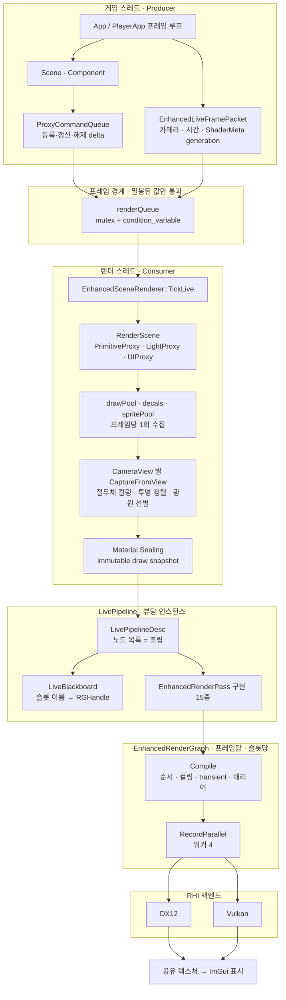

### 스레드 규약

| 규약 | 강제 지점 |
|---|---|
| `BuildLiveFramePacket` 은 게임 스레드 고정 | `frameProducerThread` assert |
| `TickLive` 는 소비 스레드 고정 | `frameConsumerThread` assert |
| 패킷은 **발행 순서대로 정확히 한 번** 소비 | `frame.frameId > consumedFrameId` assert |
| 렌더 스레드는 `DataSystem` · 자산 파일을 다시 읽지 않음 | ShaderMeta 를 패킷에 generation+value 로 밀봉 |

---

## 2. 프레임 렌더 플로우 — 한 프레임의 전 과정

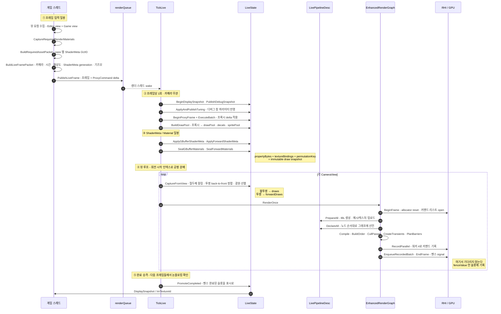

### 핵심 설계 판단

- **④에서 GPU 를 기다리지 않는다.** 예전 동기 `WaitForGpu` 는 프레임당 33 ms 를 먹어
  총 대기를 58 ms 로 만들었다. 실제 GPU 는 3.7 ms 였다. 지금은 펜스 값만 슬롯에 적고
  다음 프레임들에서 논블로킹으로 확인해 표시로 승격한다.
- **②는 카메라 수와 무관하게 1회.** `BuildDrawPool` 은 카메라를 보지 않는 수집이고,
  뷰는 그 풀을 절두체로 거르기만 한다.

---

## 3. 렌더 패스 구조

### 3-1. 패스의 계약 — 선언과 기록의 분리

`EnhancedRenderPass` 는 기존 `IRenderPass` 를 상속하지 않는다. 그쪽은 "이 패스가 지금 다
그린다"를 전제하는데, 그래프 위에서는 선언과 기록이 나뉜다.

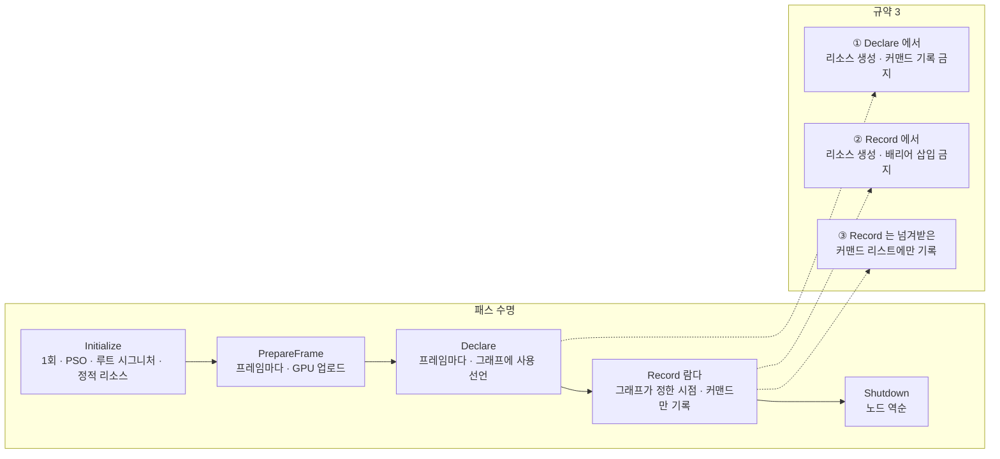

이 분리가 필요한 이유는 둘이다. **배리어를 그래프가 유도하려면** 기록 전에 사용 계획을
알아야 하고, **기록을 워커가 병렬로 돌리려면** 기록이 순수해야 한다.

### 3-2. 파이프라인 조립 — 노드 목록이 순서를 정한다

예전에는 `RenderOnce` 안 200 줄이 "무엇을 어떤 순서로 잇는가"를 직접 적었고, 같은 사실
"SSS 는 Forward 뒤"가 `Initialize` · `Shutdown 역순` · `PrepareFrame` · `Declare` 네 곳에
따로 적혀 있었다. 셋은 틀려도 컴파일러가 침묵했다.

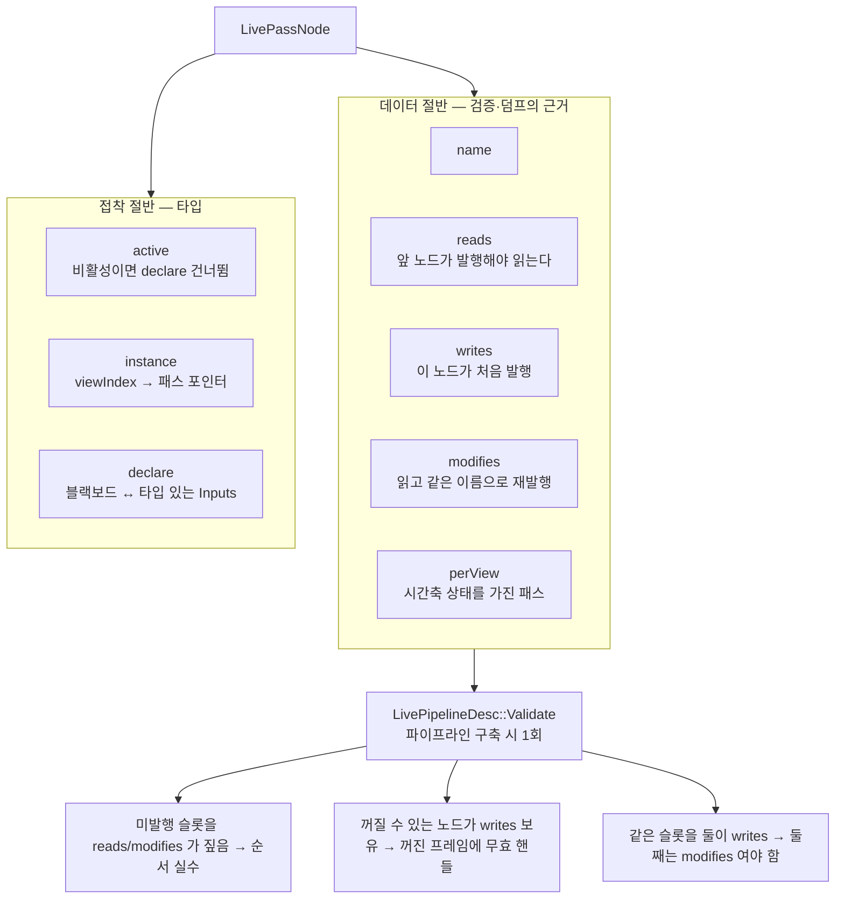

> **`modifies` 규약이 하는 일**: 꺼질 수 있는 노드는 `modifies` 만 가질 수 있다.
> 노드가 꺼져도 블랙보드 슬롯 값이 그대로 남아 뒤 노드가 이어받는다.
> 예전 `X.GetOutput().IsValid() ? X : 이전값` 폴백 체인이 통째로 사라진 자리다.

### 3-3. 패스 노드 그래프 — 실제 배선

노드 목록의 **순서가 곧 실행 순서**다. `BuildPipelineDesc` 가 짜 둔 목록을 그대로 돈다.

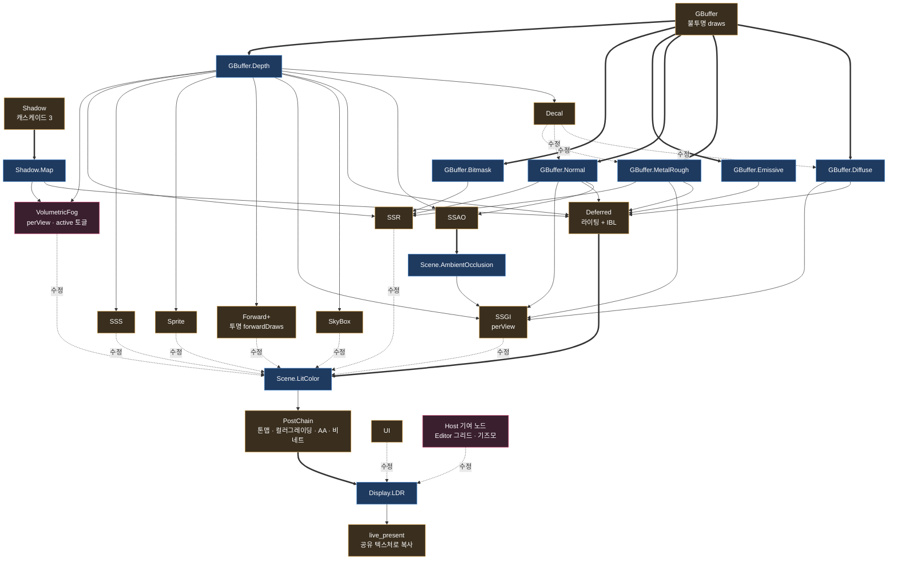

| 표기 | 뜻 |
|---|---|
| `==>` 굵은 화살표 | `writes` — 슬롯을 처음 발행 |
| `-.수정.->` 점선 | `modifies` — 읽고 같은 이름으로 재발행 |
| 실선 | `reads` — 앞 노드가 발행한 것을 읽음 |

**슬롯 요약**

| 슬롯 | 발행자 | 수정자 |
|---|---|---|
| `Shadow.Map` | Shadow | — |
| `GBuffer.*` 6종 | GBuffer | Decal — Diffuse · Normal · MetalRough |
| `Scene.AmbientOcclusion` | SSAO | — |
| `Scene.LitColor` | Deferred | SkyBox → SSGI → Forward+ → Sprite → SSS → SSR → Fog |
| `Display.LDR` | PostChain | UI → Host 기여 노드 |

**`perView` 패스**: SSGI · VolumetricFog. 프레임을 넘겨 상태를 잇는다 — 히스토리 2장과
재투영 행렬. 공유하면 각 카메라가 상대의 히스토리를 읽어 잔상이 남는다.

**Host 기여 경계**: Editor 는 `IRenderFeatureContributor` 로 UI 뒤 · `live_present` 앞에
자기 노드를 끼워 넣는다. Player 는 기여자를 설치하지 않으므로 그 노드 자체가 서지 않는다.

### 3-4. 렌더 그래프 내부 — Compile 과 RecordParallel

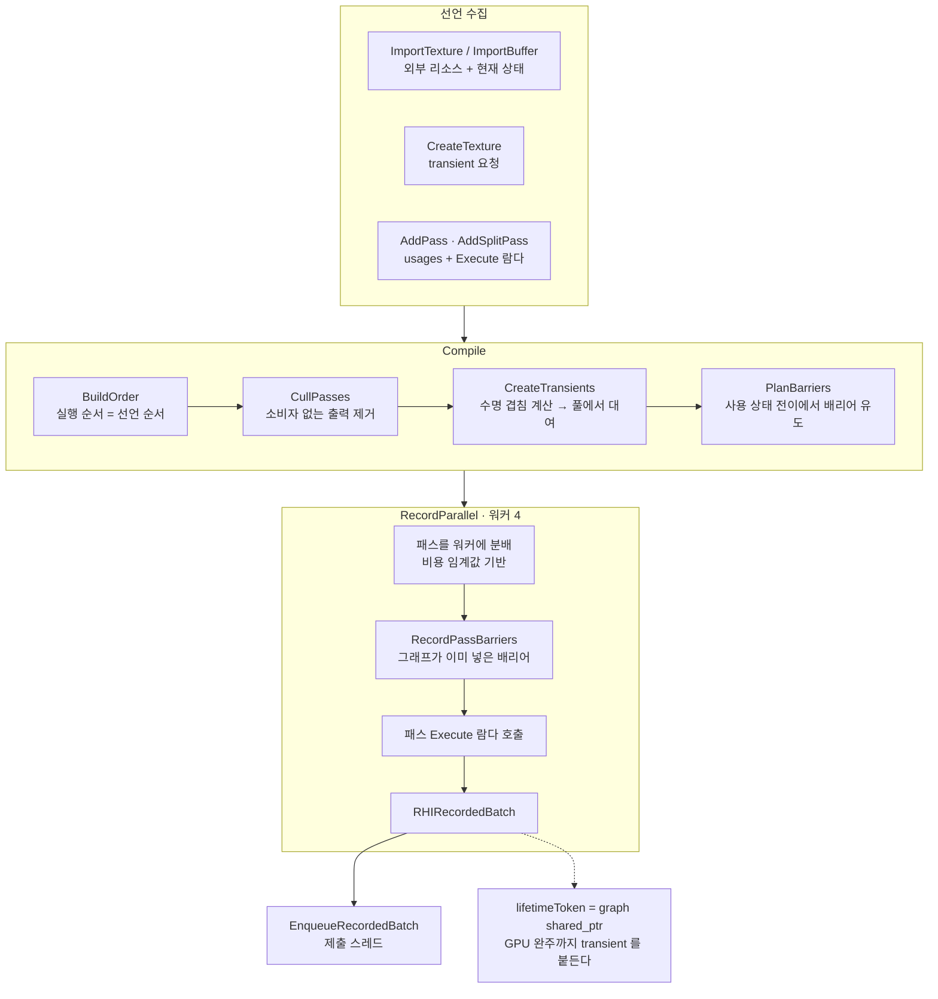

> **컬링 주의**: 최종 결과를 소비하는 선언이 없으면 그래프가 체인을 통째로 걷어낸다.
> `live_present` 의 복사가 그 소비 역할을 한다.

---

## 4. 렌더러 구조 — 뷰 · 슬롯 · 표시

`EnhancedSceneRenderer` 는 정적 인터페이스이고, 실체는 `LiveState` 가 든다.

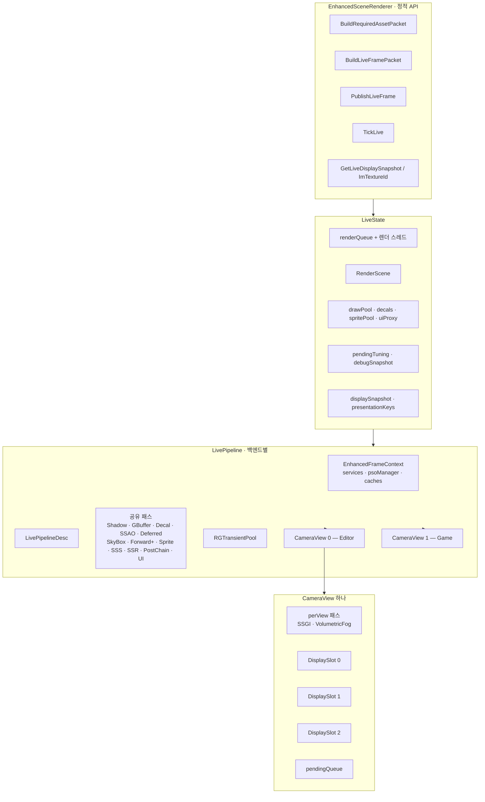

### 표시 슬롯 회전 — 뷰당 3개 · 표시 1 + 인플라이트 2

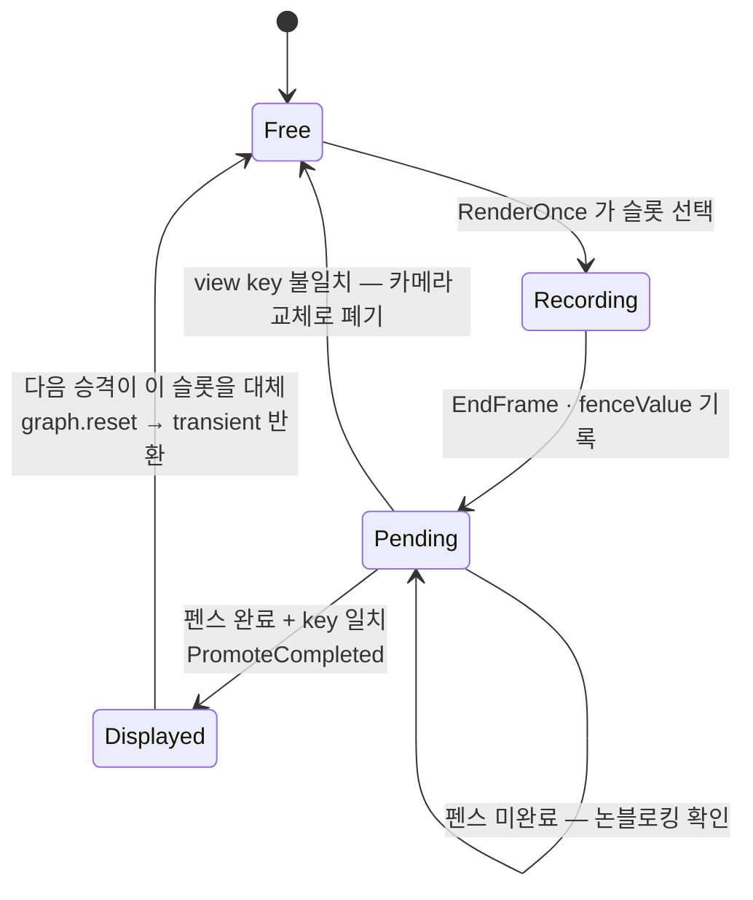

- `pendingQueue` 가 2 이상이면 그 프레임의 렌더를 건너뛴다 — `framesInFlight` 증가.
- `graph.reset()` 시점이 곧 **transient 텍스처가 풀로 돌아가는** 시점이다. GPU 완주 전에
  놓으면 사용 중인 리소스를 재사용하게 된다.
- 뷰 루프는 `viewRotation++ % cameraCount` 로 시작 인덱스를 돌린다 — 인플라이트 한도에
  걸릴 때 한 뷰만 계속 굶는 것을 막는다.

---

## 5. 머테리얼 구조

### 5-1. 자산에서 GPU 까지의 전 경로

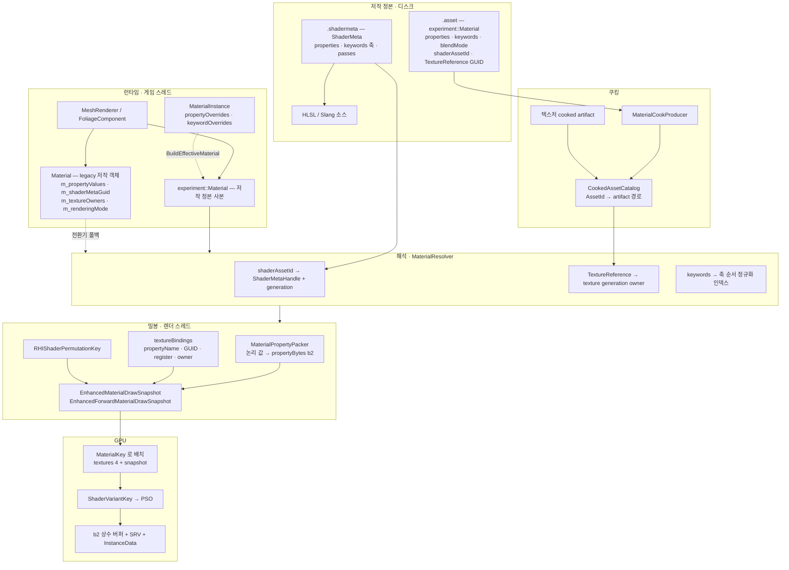

### 5-2. 텍스처 해석 우선순위 — fail-closed

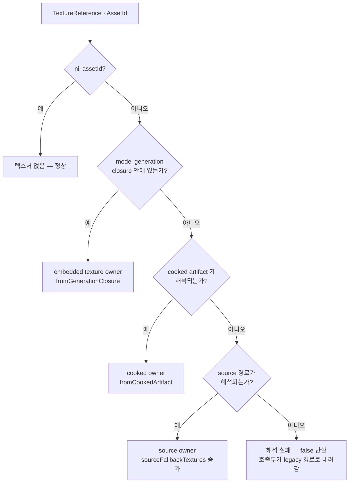

> 폴백은 **관측 가능해야** 한다. `ResolvedMaterialNotes` 가 cooked / source / generation
> 건수를 센다 — cooked 가 늘 비고 조용히 source 로 도는 상태는 "느리지만 동작하는"
> 모습이라 아무도 알아채지 못한다.

### 5-3. 프레임 밀봉 결정 — 어느 경로로 seal 하는가

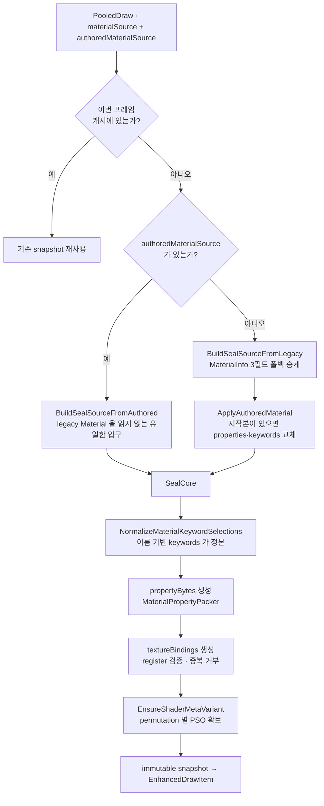

### 5-4. 왜 스냅샷인가 — 렌더가 게임 객체를 들지 않는 이유

`EnhancedDrawItem` 은 `Material*` · `Mesh*` 를 **신원으로 쓰지 않는다**.

| 예전 | 지금 | 이유 |
|---|---|---|
| `Material*` 를 draw packet 에 실음 | `EnhancedMaterialDrawSnapshot` 값 복사 | 수명·스레드 규약이 얽힘 |
| `Mesh*` 포인터로 정렬 | `geometryKey` — 자산 신원 ⊕ 메시 인덱스 | 주소는 할당 순서라 실행마다 순서가 달라짐 |
| `Texture*` 배열 순서 = shader register | `EnhancedMaterialTextureBinding` 에 register 명시 | 배열 순서가 register 를 암묵적으로 뜻하면 조용히 밀림 |
| Shadow 패스가 `draw.mesh` 역참조 | `boundRadius` 를 값으로 실음 | 패스가 게임 자료구조를 읽는 마지막 자리 |

**바이트 레이아웃 계약**은 `static_assert` 로 고정한다 — `EnhancedLight` 64 B,
`EnhancedForwardMaterialFlowSnapshot` 32 B, `InstanceData` 96 B. HLSL 쪽과 어긋나면
값이 조용히 밀려 "재질이 이상하다"로만 드러난다.

---

## 6. 드로우 수집 — 프록시에서 배치까지

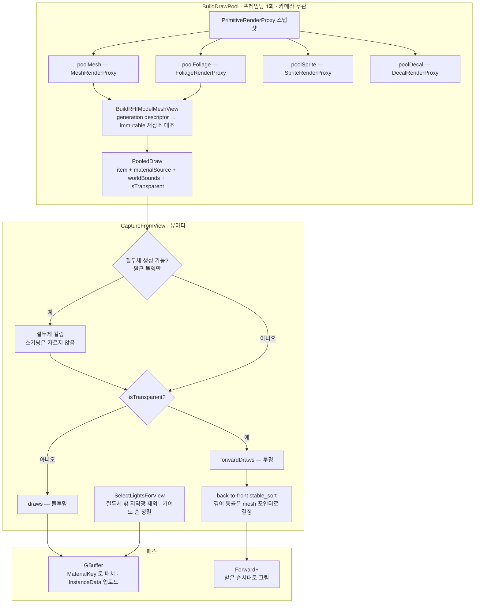

**투명 정렬의 동률 처리**: 같은 원점을 쓰는 투명면 — 십자 빌보드, 같은 피벗의 유리
여러 장 — 은 깊이가 정확히 같다. 비교자가 `false` 만 돌려주면 순서가 미정이라 프록시
스냅샷 순서가 바뀔 때마다 앞뒤가 뒤집혀 깜빡인다. 정렬을 넣은 이유가 "순서를
고정한다"인데 그 자리에서 새는 셈이라, 동률은 포인터로 가른다.

---

## 7. 한눈에 보는 데이터 흐름

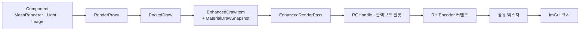

각 화살표는 **값 복사 경계**다. 오른쪽 층은 왼쪽 층의 객체를 포인터로 붙들지 않는다.
`RenderProxy → PooledDraw` 만 예외로 `shared_ptr` 을 들고, 그것도 `BuildDrawPool` 의
안정된 프레임 경계 동안 generation owner 의 수명을 보장하기 위해서다.
