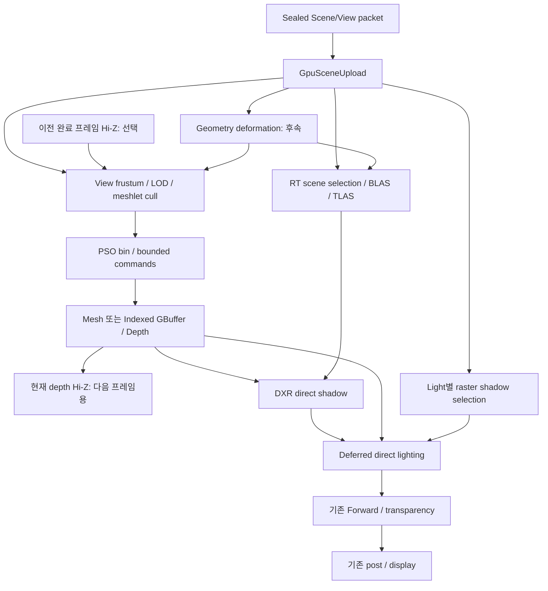

# EnhancedSceneRenderer 기반 Meshlet·Mesh Shader·DXR 상세 배선 계약

**설계 결정 2026-10-01 · GPU-1/GPU-3 상세 계약 · 구현/빌드/GPU 런타임 미검증.**
목표는 기존 Scene 렌더러의 프레임·뷰·표시 수명을 유지하면서 GPU-driven 래스터와
DXR 직접광 그림자를 같은 RenderGraph에 연결하는 것이다. 이 문서의 새 타입·Pass·API는
제안 계약이며 현재 존재하는 구현으로 읽지 않는다. GPU-2 확률 조명 설계와 GPU-9의
기능별 구현 공수 확정은 별도다. 실제 구현 공수는 전부 미산정(`days: null`)이다.

## 1. 현재 연결 지점과 책임

| 현재 소스 | 확인한 사실 | 설계상의 연결 |
|---|---|---|
| `Engine/RenderEngine/Render/Scene/EnhancedSceneRenderer.cpp`, `BuildPipelineDesc` | Shadow/GBuffer와 LX Scene GBuffer 수정 노드를 조립한다 | 새 native Pass와 기존 geometry route를 같은 LivePipelineDesc에 조립 |
| `Engine/RenderEngine/Render/Scene/EnhancedSceneRenderer.h`, `EnhancedLiveFramePacket` | 프레임 입력 계약의 기존 위치 | 같은 sealed frame에서 GPU scene 입력을 생성 |
| `Engine/RenderEngine/RHI/RHIEncoder.h` | indexed indirect와 buffer barrier/copy 계약이 있다. Mesh 명령은 GPU-driven 구현 슬라이스에서 추가 중이며 RT는 별도다 | 중립 명령·capability·resource 계약을 먼저 추가 |
| `Engine/RenderEngine/RHI/RHIResourceTypes.h`, `RHIMeshBinding` | Vertex/Index slice, stride, attribute mask를 전달 | 기존 indexed fallback 보존; 별도 meshlet/RT binding 도입 |
| `Engine/RenderEngine/Mesh.h`, `Vertex` | legacy vertex stride 96B를 정적 단정한다 | 기존 ABI 유지; cook stream의 layout ID로 해석 |
| `Engine/RenderEngine/Experiment/Import/ImportedScene.h` | `buildMeshlets` 옵션이 있다 | 옵션 존재를 meshlet cook/제품 소비 구현의 증거로 세지 않음 |

EnhancedSceneRenderer는 view, frame-in-flight, submission ticket, fence 완료, 표시 승격,
graph lifetime을 소유한다. GPU scene owner는 geometry/material 세대와 frame별 binding을
소유한다. native Pass는 알고리즘·입출력을, RenderGraph는 의존·배리어·실행 순서를,
RHI는 백엔드 객체·명령·capability 변환을 소유한다. C#은 기존 목표 IR로 Pass 구성과
설정만 저작한다. 별도 GPU-driven renderer나 별도 제품 실행 그래프를 만들지 않는다.

## 2. 목표 그래프

첫 슬라이스는 정적 opaque·비변형 메시, 한 directional light, full-resolution 단일
hard-shadow ray/pixel이다. stochastic/denoise/temporal RT는 후속이다. 그래프 그림의
deformation은 후속 연결이며 첫 슬라이스 선행 구현이 아니다. 기존 Forward의 직접광
그림자는 raster 경로를 유지한다. DXR 출력 소비는 Deferred opaque receiver로 한정한다.

Mesh Shader는 래스터 geometry 단계이고 DXR은 BLAS/TLAS를 탐색하는 별도 단계다.
Mesh Shader 출력 topology를 RT 입력으로 직접 재사용하지 않는다. 양쪽은 공통 geometry
세대에서 각각 meshlet stream과 triangle geometry를 참조한다. clustered RT geometry,
SER, vendor 전용 기능, RT reflection/AO는 첫 계약 범위 밖이며 개별 확장 게이트를 둔다.

## 3. 공통 프레임·세대 계약

제안 `GpuSceneFrameKey = {sceneId, sceneGeneration, sourceFrameId, deviceEpoch}`.
제안 `GpuViewKey = {viewId, viewGeneration, width, height, projectionGeneration}`.
CPU owner handle은 `{slot:uint32, generation:uint32}`이며 shader는 검증된 frame-local
uint32 dense index를 소비한다. handle slot을 raw GPU 주소나 TLAS InstanceID로 쓰지 않는다.
frame packet seal 뒤 Render/CommandBuild/RHI 스레드에서 GameObject·Material을 다시 읽지 않는다.

| 제안 record | 필수 필드/의미 |
|---|---|
| GeometryRecord | geometry handle, layout ID, topology generation, LOD table, vertex/index/meshlet ranges, local bounds, RT eligibility |
| InstanceRecord | stable handle, geometry/material dense index, current/previous object-to-world, normal transform, bounds, visibility/layer mask, transform/deformation generation |
| MaterialRecord | sealed material generation, shader generation, texture/sampler owner handles, coverage mode, alpha cutoff, double-sided flag, supported raster/RT route |
| MeshletRecord | vertex-remap offset/count, local triangle offset/count, source primitive-remap offset, local sphere, optional normal cone |
| DrawBinRecord | pass/view/PSO key, mesh/indexed mode, visible-record range, command offset/count/capacity |
| RtGeometryRecord | BLAS geometry ordinal, triangle source range, position stream, primitive remap, material index, opacity flags |

GPU record packing은 구현 시 fixed-width scalar·명시적 padding·16B 경계로 정의하고
C++/Slang reflection layout 일치 gate를 통과해야 한다. float3의 암묵 padding에 의존하지 않는다.
64-bit CPU generation을 shader에서 임의로 잘라 비교하지 않는다. CPU seal이 full generation을
검증하고 GPU table에는 frame-local index와 필요할 때 검증 tag를 게시한다.
frame-local index는 그 packet의 tables와 함께만 유효하다. missing/stale handle은 seal 실패이며
잘못된 주소를 읽거나 material 0으로 조용히 치환하지 않는다.

## 4. cook·geometry·Meshlet ABI

기존 Vertex/Index와 별도 meshlet streams를 같은 geometry asset generation에 저장한다.
제안 cook header는 schema version, source hash, cooker version, layout ID, LOD count,
stream offsets/sizes, bounds convention, primitive-remap version, checksum을 가진다.
파일은 little-endian fixed-width 형식이며 count×stride와 offset+bytes를 overflow 검사한다.
unknown schema/layout, 범위 위반, checksum 실패는 meshlet route 거부 후 유효한 indexed
데이터로 fallback한다. indexed 데이터까지 잘못되면 asset load 실패다.

초기 meshlet profile은 최대 64 vertices/126 triangles, uint32 vertex remap,
triangle당 uint8 local index 3개와 명시적 padding이다. profile은 하드웨어 최댓값이라는
뜻이 아니며 cook version에 포함한다. shader/디바이스 output·threadgroup 한도를 별도로
검증하고 미지원 profile은 fallback한다. primitive remap은 triangle별 source primitive ID를
보존한다. Mesh Shader의 group-local primitive ID와 BLAS PrimitiveIndex를 같은 ID로 가정하지 않는다.
submesh/material 경계와 LOD 경계를 넘는 meshlet 생성은 금지한다.

첫 구현은 원본 triangle order를 보존한 RT index stream과 LOD0 BLAS를 사용한다.
래스터 LOD도 LOD0에 고정해 첫 parity를 판정한다. 후속 LOD 변경은 raster/RT 각각의
선택과 silhouette 오차를 표시한다. RT proxy LOD를 쓸 경우 asset 설정·진단·비교 gate가
필수이며 자동으로 낮은 LOD를 선택하지 않는다.

skinning/morph/displacement 후속은 compute deformation이 만든 position 및 raster 속성
stream을 같은 deformation generation으로 게시하고 bounds·BLAS 갱신 뒤 두 경로가
소비한다. Mesh Shader 내부에서만 수행한 변형을 DXR에서도 반영됐다고 간주하지 않는다.
첫 슬라이스에서 변형 caster가 있으면 해당 light의 DXR 그림자를 raster로 전환한다.

## 5. 가시성·Hi-Z 계약

세 집합은 독립이다: camera raster candidates, light별 shadow casters, RT scene instances.
camera frustum/Hi-Z 탈락은 TLAS나 shadow caster 제외 사유가 아니다. 첫 RT scene은
같은 scene에서 layer mask에 맞는 활성 shadow-casting triangle instance 전체를 포함한다.
distance pruning과 ray-volume pruning은 후속으로 별도 보수성 증명이 필요하다.

첫 raster 경로는 frustum만 적용한다. bounds는 affine transform의 비균일 scale과 shear를
포함해 보수적으로 변환한다. near-plane 교차·invalid bounds·NaN·singular transform은
culled로 판정하지 않고 indexed 보수 경로 또는 명시적 instance 오류로 처리한다.
normal-cone cull은 첫 구현에서 끈다. 후속은 double-sided/mirrored/deformed mesh에서 끄고
변환·winding을 증명한 정적 single-sided mesh에만 허용한다.

Hi-Z는 현재 GBuffer depth로 만든 pyramid를 완료 fence 뒤 history로 게시한다. 현재 depth를
그 depth를 생성하는 cull의 입력으로 연결하지 않는다. depth convention은 view metadata로
운반한다: reversed-Z pyramid=min, standard-Z pyramid=max. 화면상의 보수 rect가 덮는
모든 필요한 texel을 검사하고 bounds의 nearest depth가 저장된 farthest occluder보다
완전히 뒤일 때만 reject한다. clear/background depth는 reject 근거가 될 수 없다.

이전 Hi-Z는 동일 view/projection/해상도와 유효 generation에서만 사용한다. 첫 안전 구현은
카메라 및 occluder 변화가 없는 경우에만 활성화하고 이동·spawn/despawn·alpha/LOD 변경,
camera cut·resize·projection 변경 때 전체 occlusion reject를 끈다. 동적 scene의 reprojection/
conservative dilation은 후속이다. stale history에서 frustum-only로 돌아가는 것은 정상 동작이다.

## 6. 배치·indirect·기존 Pass 연결

PSO bin key는 pass kind, shader/layout generation, coverage, double-sided/winding,
vertex attribute profile, depth/blend format, mesh/indexed route를 포함한다. material/texture
index는 record 데이터로 전달하되 서로 다른 shader generation을 같은 PSO로 합치지 않는다.
CPU가 sealed packet에서 허용 PSO bins와 최대 dispatch 수를 만든다. GPU는 bin별 visible
meshlet 목록·command arguments·bounded count만 작성한다. GPU가 PSO 객체를 선택하지 않는다.

초기 Mesh Shader는 amplification stage 없이 meshlet당 한 group을 실행한다. 각 bin은
visible list의 base offset을 바인딩하고 DispatchMesh indirect arguments의 group count를
읽는다. device limit를 넘으면 여러 command와 base-offset record로 분할한다. 순서 의존
transparent draw는 기존 CPU indexed 정렬 경로를 유지한다.

capacity는 준비 시 worst-case candidate 합으로 확보한다. count는 항상 capacity 안으로
clamp하며 모든 command는 재설정한다. reserve가 실패하면 제출 전에 CPU indexed 경로를
선택한다. 실행 중 overflow는 GPU flag를 남기고 GPU fallback branch가 해당 bin 전체를
unculled indexed indirect draw로 실행한다. 부분 mesh draw와 fallback draw를 함께 실행하지
않도록 mode flag로 상호 배제한다. 이 GPU fallback이 구현/검증되기 전에는 입력 상한으로
overflow를 불가능하게 만들고 초과 입력을 제출 전 CPU route로 전환한다. CPU readback을
같은 프레임 route 선택에 쓰지 않는다.

GBuffer/Depth/Shadow의 입력 geometry front-end만 교체하고 기존 pixel shader의 coverage,
normal/tangent, UV, material generation, GBuffer semantic, depth convention을 유지한다.
한 instance/submesh는 pass별 Mesh 또는 Indexed 한 경로만 소유한다. LX Scene host 및
특수 MaterialGraph route는 mesh variant 검증 전 기존 indexed 경로를 유지한다. shared depth와
GBuffer에 쓰는 기존 LX/Decal 노드는 RG2 version/Modify 계약으로 합친다. mesh 전용 별도
GBuffer를 숨겨 기존 Deferred 입력과 중복시키지 않는다.

## 7. DXR 직접광 그림자 계약

첫 기능은 directional light 한 개의 opaque receiver에 대한 hard visibility다. GBuffer depth로
world position을 복원하고 geometric normal 기반 scale-aware origin bias를 적용한다.
ray는 light 방향으로 쏘고 scene world-bounds로 정한 유한 max distance를 사용한다.
invalid/background pixel은 visibility=1이다. hit=0, miss=1의 단일 visibility texture를 쓴다.
opaque triangle만 지원하므로 closest-hit에서 0, miss에서 1을 기록하며 first-hit 종료를
사용한다. masked/transparent/special coverage caster가 관련 layer에 존재하면 해당 light의
전체 효과를 raster shadow로 전환한다. caster를 조용히 TLAS에서 빼지 않는다.

Deferred는 해당 light의 direct diffuse/specular에만 visibility를 한 번 적용한다. ambient,
IBL, emissive에는 곱하지 않는다. selected light의 raster shadow와 DXR shadow를 중복 곱하지
않는다. 다른 light와 Forward/transparent receiver는 기존 raster shadow를 사용한다.
RT 실패/미지원 시 raster shadow 결과가 이미 유효하도록 graph fallback producer를 준비한다.
정책 변경은 frame seal에서 확정하고 실행 중 PSO/route를 임의로 교체하지 않는다.

BLAS key는 deviceEpoch, geometry generation, topology/LOD, deformation generation,
build flags다. 정적 BLAS는 완료 뒤 재사용한다. TLAS는 frame slot마다 독립 버전이며 dense
instance table이 transform·mask·BLAS owner와 함께 봉인된다. InstanceID는 frame-local
24-bit 범위 안에서만 사용하고 초과면 제출 전 실패/fallback한다. trace mask는 8-bit이며
넓은 엔진 layer mask를 임의 truncation하지 않고 sealed mapping을 만든다.

AS update는 최초 ALLOW_UPDATE build와 동일 topology/count/flags 등 백엔드의 update
조건이 맞을 때만 한다. topology·opacity flag 변경은 rebuild다. material scalar 변경은
AS를 자동 rebuild하지 않되 coverage 변경은 eligibility/AS flags를 재판정한다. 첫 구현은
compaction·in-place update·async build를 끈다. AS scratch는 build 간 비중첩 또는 명시적
barrier로만 재사용하고 BLAS 주소 변경은 새 TLAS 세대를 요구한다.

제안 shader table은 raygen 1/miss 1/opaque hitgroup 1부터 시작한다. geometry/material table은
전역 binding으로 읽고 local root 데이터는 첫 구현에서 비운다. alignment·stride·shader
identifier·table 주소 검증은 backend가 담당한다. RT PSO와 shader table은 같은 generation으로
봉인하며 shader reload 실패 시 마지막 정상 세대를 유지한다. ray query 지원은 독립 capability로
남기고 첫 DispatchRays 경로의 암묵 대체로 사용하지 않는다.

## 8. RenderGraph 리소스·동기화 계약

| Pass | Read | Write/Modify | 반드시 필요한 edge |
|---|---|---|---|
| GpuSceneUpload | sealed CPU packet | scene/geometry/material GPU buffers | upload copy → shader/AS input |
| Deform (후속) | source geometry/bones | deformed vertices/bounds | deformation → cull, BLAS build |
| Cull/Bin | scene/view/bounds, optional history Hi-Z | visible lists/bin count | UAV write → command producer |
| CommandBuild | bins/counts | indirect arguments/count/mode | UAV write → indirect argument read |
| Mesh/Indexed geometry | visible list/geometry/material/arguments | depth/GBuffer versions | raster write → depth/sample reads |
| HiZBuild | final opaque depth | pyramid/history candidate | 각 mip producer → 다음 mip; history 완료 게시 |
| BLASBuild | position/index, scratch | BLAS version | build write → TLAS build input |
| TLASBuild | BLAS versions/instance desc, scratch | TLAS version | AS build write → ray traversal read |
| RtDirectShadow | final depth/normal/TLAS/light | direct visibility | trace write → Deferred sampled read |
| Deferred | GBuffer/raster shadow/RT visibility | lit color | 선택 light의 유일한 visibility source |

위 이름은 제안 semantic usage다. RHI에는 IndirectArgumentRead, AccelerationStructureBuildInput,
ASBuildWrite/ASRead, scratch UAV usage를 표현할 확장이 필요하다. DX12 AS resource state와
UAV ordering, Vulkan AS build/traversal stage·access를 각 backend가 변환한다. AS를 일반
texture state로 위장하지 않는다. build/read가 같은 state여도 메모리 의존 edge는 생략하지 않는다.
AS owner와 indirect count buffer를 graph가 알아야 하며 Pass가 숨은 fence를 삽입하지 않는다.

첫 제품 실행은 RG6 단일 graphics queue cutover를 선행으로 받는다. RG2 version/Modify가
기존 GBuffer 수정 체인에 필요하다. subresource 모델이 아직 없으면 Hi-Z mip마다 별도
texture resource를 써서 edge를 표현한다. multi-queue는 Q0 및 필요한 RG7~9 이후이며,
copy/deform/build/trace 간 signal/wait와 queue ownership까지 graph가 계획한 경우만 켠다.

## 9. RHI 제안 표면과 지원 행렬

| 제안 표면 | 입력·실패 계약 |
|---|---|
| QueryGpuFeatureSupport | meshShader/meshIndirect/indexedIndirect/indirectCount/RT pipeline/rayQuery/AS update와 실제 limits를 독립 반환 |
| CreateMeshPipeline | MS/선택 AS/PS shader generation, bindings, RT formats; IA layout 없는 별도 desc |
| ExecuteIndirect | typed signature, argument/count buffer slice, stride, max count; alignment/range/지원 검증 |
| DispatchMesh | direct group counts; mesh pipeline과 binding 검증 |
| Create/QueryASBuildSizes | typed triangle/instance desc, flags, size/alignment; opaque AS handle 반환 |
| BuildAccelerationStructure | source/destination/scratch/geometry owner handles; update 허용 조건 검증 |
| CreateRayTracingPipeline/ShaderTable | immutable shader generation과 opaque table handle |
| DispatchRays | table handle, TLAS binding, dimensions; shader/table/device generation 검증 |

원시 D3D12/Vulkan 객체·GPU 주소는 Pass/C# 계약에 노출하지 않는다. command signature는
backend layout generation에 종속되며 재생성/retirement 대상이다. unsupported API의 빈 no-op
성공은 금지하고 structured error를 반환한다. 리소스 생성 실패는 Prepare/seal 시 fallback을
선택한다. device loss는 scene 오류와 구분하고 deviceEpoch 변경으로 모든 GPU owner를 무효화한다.

| Mesh 지원 | RT pipeline 지원 | 기본 route |
|---|---|---|
| 없음 | 없음 | 기존 indexed raster + raster shadows |
| 있음 | 없음 | 검증된 Mesh raster + raster shadows |
| 없음 | 있음 | indexed raster + 적격 scene의 DXR direct shadows |
| 있음 | 있음 | Mesh raster + 적격 scene의 DXR direct shadows |

DX12는 실제 MeshShaderTier/RT tier·shader model·indirect 지원을 조회한다. Vulkan은
VK_EXT_mesh_shader, VK_KHR_acceleration_structure/VK_KHR_ray_tracing_pipeline와 의존
feature/extension·limits를 조회한다. extension 문자열만으로 지원 판정하지 않는다.
기능 페이즈의 runtime acceptance는 DX12다. Vulkan 실행·capability/fallback 대조는
[PHASE 4.9](../plans/BackendParityPlan.md)가 소유하며 DX12 기능 완료를 역으로 막지 않는다.
Mesh 지원만으로 RT나 성능 향상을 추정하지 않는다.

## 10. 게시·abort·retirement

수명 상태는 Candidate → Sealed → Recorded → Submitted(ticket) → Completed → Retired다.
Candidate의 allocation/PSO/BLAS/table 생성 중 실패하면 candidate만 폐기하고 기존 정상
frame과 owner를 유지한다. seal은 geometry/material/PSO/AS/table의 전체 generation closure를
검증한다. 기록 실패는 제출하지 않고 AbortFrame으로 candidate cache 변경을 롤백한다.

제출 성공 ticket을 받은 뒤에만 owner last-use와 history candidate를 commit한다. Submitted
owner를 CPU frame 번호만으로 해제하지 않는다. 같은 BLAS/material을 여러 view/queue에서
사용하면 모든 관련 ticket 완료가 retirement 조건이다. 부분 제출이 있었다면 이미 제출된
ticket을 보존하고 미제출 부분만 abort한다. queue별 완료 정보 없이 하나의 fence 수치 최댓값으로
다른 queue 완료를 추정하지 않는다.

Hi-Z는 Completed 후 view key가 맞을 때만 승격한다. resize/view close/scene reload는
관련 제출을 drain하거나 deferred retirement에 등록한 뒤 새 generation으로 교체한다.
slot reuse는 그 slot의 GPU 참조가 끝난 뒤만 허용한다. BLAS eviction은 이를 참조하는 TLAS와
trace의 ticket 완료까지 지연한다. memory pressure가 owner를 강제 즉시 해제하는 것은 금지다.

## 11. 구현 슬라이스와 회귀 게이트

아래 ID는 GPU-9에서 구현 공수를 산정할 후속 슬라이스이며 현재 활성 원장의 일수를 늘리지 않는다.

| ID | 변경·입력 | 완료 증거 | 공수 |
|---|---|---|---|
| GD0 | capability·typed RHI·cook schema; 기존 fallback 유지 | unsupported 조합/잘못된 slice 거부, DX12 기존 route 회귀 | null |
| GD1 | 정적 meshlet cook·direct Mesh GBuffer; RG6 소비 | indexed 동일 scene depth/coverage/material 비교, primitive remap | null |
| GD2 | GPU frustum/bin/indirect; GD1 | CPU oracle visible set, capacity 경계/초과 fallback, validation 0 | null |
| RT0 | 정적 BLAS/TLAS·RHI/table; GD0와 RG6 | CPU ray-triangle oracle와 hit/miss·instance remap 비교 | null |
| RT1 | DXR directional hard shadow·Deferred 합성; RT0 | off-camera caster, direct-only 적용, unsupported coverage 전체 light fallback | null |
| HY0 | GD2+RT1 같은 frame/graph | mesh on/off × RT on/off 4조합, multiview·두 in-flight frame·reload/abort/retire | null |
| GD3 | 안전 Hi-Z/history; GD2 | depth convention·near plane·cut/resize/moving occluder에서 누락 0 | null |
| HY1 | 변형·Masked·LOD·RT update 후속 | 변형 세대 일치/alpha coverage/LOD 오차·AS update/rebuild 판정 | null |

GD와 RT 가지는 공통 GD0/RG6 뒤 독립 착수할 수 있다. HY0에서 결합하며 GPU-2 완료나
C# CSRP 전체 완료를 선행으로 묶지 않는다. RHI 인터페이스를 한 번에 전체 교체하지 않고
각 소비 슬라이스와 DX12/Vulkan unsupported 처리까지 buildable 단위로 추가한다.

필수 fixture는 빈 scene, meshlet 최대/초과, mirrored/nonuniform transform, double-sided,
두 material/PSO generations, 카메라 밖 caster, 제거/재추가 instance, missing meshlet cook,
masked caster, 두 view와 두 in-flight frame, resize, shader reload 실패, allocation 실패,
기록 abort, device loss다. fault injection은 unsafe count/address/generation/AS edge 삭제를
반드시 잡아야 한다. 단순히 shader가 컴파일됐다는 이유로 gate를 닫지 않는다.

정적 opaque raster 비교는 동일 asset/LOD/camera/resolution/material/light에서 interior
depth·attribute를 수치 비교하고 silhouette boundary는 별도 coverage로 보고한다. tolerance는
fixture별 승인된 baseline 파일에 고정한다. RT shadow는 raster와 픽셀 일치를 요구하지 않고
CPU 기하 oracle·bias fixture로 판정한다. bias 변화로 생긴 contact 오차는 따로 기록한다.
runtime gate는 Editor Scene/Game view 및 DX12 GPU validation 0, fallback 선택 이유 표시,
owner 조기 해제 0을 포함한다. Vulkan native 비교 결과는 PHASE 4.9에서 RenderDoc으로 기록한다.

성능은 동일 바이너리/asset/resolution/warmup/기록 길이로 4 route 조합을 비교하고 CPU
prepare/record, cull/bin, AS build, raster, trace, 합성, 전체 GPU critical path의 p50/p95,
peak VRAM, upload bytes, rejected meshlets, rebuild count를 남긴다. BLAS cold build와 warm
reuse를 분리한다. 성능 수용 예산은 목표 하드웨어 baseline 측정 후 GPU-9에서 확정한다.
현재 문서로 FPS 개선이나 기능별 구현 완료를 주장하지 않는다.

## 12. 계획 판정과 근거

### 셰이더 교차 탐색 전환의 실험 게이트

[DxrShaderTraversalExperimentPlan.md](../plans/DxrShaderTraversalExperimentPlan.md)의
H-V/H-R/H-S/H-F 가설과 EXP-0~4로 기존 Volume/굴절/SSR/SSGI/Fog의 DXR 전환을 평가한다.
AS 비용을 포함한 전체 frame·정확도·수명 결과로 효과별 채택 여부를 판정한 뒤 본 계약을
확장한다. 현재는 후보 실험이며 확정 route가 아니다. directional hard-shadow 첫 슬라이스는
유지한다. volume event 순서/inside winding·매질 적분은 DXR 교차만으로 대체되지 않는다.
실험 공수는 미산정이고 결과 보고서는 실행 후 작성한다.

GPU-1/GPU-3의 공통 상세 설계 산출물은 본 문서로 작성했다. 기술 설계 작성과 실제
capability probe/빌드/성능 수용을 구분하며 GPU-1/GPU-3 원장 상태는 진행으로 둔다.
GPU-2는 미착수, GPU-9는 미완료다. GPU-9는 GPU-2 교차 자원 계약, 실제 지원 probe,
baseline 기반 예산, GD/RT/HY 구현 공수와 실행 순서를 확정해야 닫힌다. 기존 5.5일 설계
예산을 후속 구현 공수로 전환하지 않는다.

- [RenderPipeline 목표 구조](RenderPipelineTargetArchitecture.md)
- [GPU 기능 계획](../plans/GpuFeaturePlanningPlan.md)
- [RenderGraph 실행 계획](../plans/RenderGraphDependencySchedulingPlan.md)
- [Microsoft Mesh Shader 사양](https://microsoft.github.io/DirectX-Specs/d3d/MeshShader.html): Mesh raster 단계와 direct/indirect dispatch 계약.
- [Microsoft DXR 사양](https://microsoft.github.io/DirectX-Specs/d3d/Raytracing.html): triangle AS, instance·build/update·shader table·trace 계약.

위 backend 규칙은 공식 사양을 근거로 한 설계다. 현재 프로젝트 SDK/device에서 모든
기능이 지원된다는 확인은 없으며 GD0의 실제 probe가 그 판정을 소유한다.

## 2026-10-06 구현 진행 정정

위 문서는 제안 계약이며 구현 완료 증거가 아니다. indexed indirect는 이미 master에
통합되었고, meshlet 저작/세대 저장, GPU LOD 및 mesh dispatch의 코드 통합 상태와
fallback 범위는 [GPU-driven 구현 계획](../plans/GpuDrivenGeometryImplementationPlan.md)을
따른다. 이 작업에서는 DXR를 추가하지 않는다. 빌드·셰이더 컴파일·GPU 실행 검증은
수행하지 않았으며, native HZB와 shadow visibility는 별도 순서로 연결한다.
