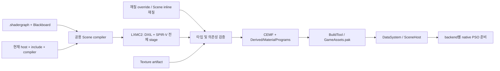

# Material Graph: Scene cook / package / Player

## 1. 구현 계약

`MaterialGraphSceneCompiler`가 Editor 준비와 AssetCooker의 Scene shader 생성 계약을 함께 소유한다.
그래프 IR에서 bound source를 만들고 현재 `MaterialGraphSceneHost.slang`, include 의존성,
permutation, strict math, fine derivative, entry/profile과 compiler identity를 검증한다.



Core/Layered의 stage set은 각 backend의 Scene VS, GBuffer, Color, Lookup0/1,
Shadow VS/PS다. SSS·refraction·Volume feature에 필요한 PS/CS를 추가한다.
순수 Volume은 shadow caster stage를 요구하지 않는다. 지원하지 않는 공간 의존 Volume은
쿠킹에서 거부한다. DXIL과 SPIR-V 중 하나만 포함한 결과도 완전한 Scene product로 받지 않는다.

`semanticKey`의 `|lx-scene-host:2`와 정확한 stage/profile 집합으로 Scene 산출물을 구분한다.
2는 가시광 Fourier 박막 모델을 포함한다. 이전 3파장 모델의 Scene product는 재쿠킹한다.
LXMC2의 checksum, bound source, typed resource table과 byte budget 검증도 유지한다.
일반 단일 VS/PS용 `PipelineSlot`은 여러 pass가 있는 product를 거부하며 이전 PSO를 보존한다.

## 2. 자동 쿠킹과 게시

```text
AssetCooker --asset-root <Assets> --output <new-directory>
  --shadergraph <graph.shadergraph> --texture <image>
  [--material <instance.asset>] [--scene <scene.creator>]
  [--material-shader-root <DefaultPassShader>]
```

기본 shader root는 `<Assets>/Shaders/DefaultPassShader`다. 생성 source의 캐시는
`<Assets>/../Library/LXSceneCook/<graph GUID>.slang`이다. 출력 파일은 기존 GUID 기반
`Derived/MaterialPrograms/<prefix>/<GUID>.lxmaterial`과 CEMF에 포함된다.
`--material-program-root`는 기존 검증 산출물의 명시적 입력 경로로 유지한다.
자동 compiler root와 함께 지정할 수 없다. Player Scene은 일반 단일 pass 결과를 거부한다.

standalone `.asset`의 Lattice identity는 sidecar와 같아야 한다. Scene의 inline 재질은
nil material identity를 허용한다. 두 경로 모두 graph와 texture override GUID를 manifest
의존성으로 수집한다. 실제 쿠킹한 MaterialProgram, exposed numeric parameter의 타입·유한 값,
exposed/active Texture parameter와 Texture artifact를 검증한 뒤 게시한다.
의존성을 만족시키는 source sidecar만 있고 artifact가 없으면 실패한다.

BuildTool은 `.shadergraph`를 `--shadergraph`로 자동 수집하고 `MaterialPrograms/*.lxmaterial`의
GUID 경로와 개수·해시를 검증한다. 모델 generation·재질·Scene 및 기존 shader 입력의
패키징 계약을 유지한다. 실패한 cook/package는 기존 게시 결과와 current pointer를 보존한다.
쿠킹 과정에서 Base 아래 생긴 Library 캐시는 두 런타임 mount의 복사 대상에서 제외한다.

compiler identity는 절대 source/include 경로를 포함한다. 동일 입력 경로와 compiler 설정에서
반복 쿠킹의 바이트 일치를 검증하며, 다른 위치로 옮긴 프로젝트의 바이트 일치를 보장하지 않는다.

## 3. Player 소비

Player의 DataSystem은 cooked graph generation과 typed instance를 읽고 texture owner를 준비한다.
MeshRenderer의 inline 재질 post-load도 `lattice_material`을 DataSystem에 전달한다.
처음 적재한 LX 문서가 잘못되면 재질을 비우며 기본 ShaderMeta 재질로 바꾸지 않는다.
SceneHost는 `LoadSceneShaders`로 완전한 bytecode를 복사하고 native PSO worker에 제출한다.
Scene 재질의 source 읽기·Slang 컴파일 job은 제출하지 않는다. pending PSO는 계속 poll하며
전체 ready 뒤 같은 Scene generation 선택 및 graph completion/fence 게시 계약을 사용한다.
incomplete stage 집합은 이전 shader set을 보존한다.

공용 고정 pass/transport shader의 기존 RHI 준비 경로는 유지한다. 따라서 `sceneCompiles=0`은
Scene 재질 specialization의 컴파일 0회이며 모든 runtime shader 준비가 제거됐다는 의미가 아니다.
Player는 cooked Scene ready 시 `[lx.scene.program] source=cooked ... sceneCompiles=0`을 출력한다.

`Player --smoke N --smoke-offscreen`과 BuildTool `package-game --smoke-offscreen`은
작은 숨겨진 창으로 실제 render/promotion을 검증한다. 일반 실행 창 설정에는 적용되지 않는다.
`--smoke-promotions N`은 필요한 실제 화면 게시 횟수를 지정한다. 기본값은 기존 2회이며,
LX 패키지 검증은 비동기 PSO 준비 뒤 실행까지 확인하기 위해 24회를 요구한다.

## 4. 검증

`Tools/regression/verify-material-scene-cook.ps1 -SkipDependencyRestore`:

- VS18/v145 Debug/Release probe·AssetCooker 빌드.
- Core/Layered 두 그래프, PNG 하나, standalone instance 하나, inline Scene 하나의 5 artifact.
- 같은 경로에서 재쿠킹한 전체 artifact와 manifest 바이트 일치.
- unknown parameter, missing graph, missing texture artifact, 다른 재질 identity,
  missing host, unknown node의 6가지 거부와 accepted 결과 해시 보존.
- loose와 encrypted PAK의 complete DXIL/SPIR-V 집합 일치, 두 backend의 stage loader,
  incomplete set 거부와 이전 bytecode 보존.
- native D3D12 cooked Scene 각 24프레임·57,185개 검사·10,746 GPU 성분,
  Scene compile 0회·WARNING 이상 GPU validation 0건.
- 588 source SHA-256 변경 0개.

실행 로그와 SHA snapshot은 `Build/Obj/MaterialProductProbe/scene-cook-*`에 있다.
`Tools/regression/verify-material-scene-package.ps1 -Configuration Debug|Release`도 통과했다.
현재 소스로 Player와 CreatorEditor의 두 구성 전체를 빌드하고, 별도 프로젝트·engine distribution을
게시한 뒤 실제 `package-game`의 자동 cook→encrypted PAK→Player→current pointer 게시를 검사했다.

- Core/Layered program 2개·standalone instance 1개·inline LX Scene·실제 모델/HDR을 포함한다.
- 패키지 artifact 14개/derived file 17개, CEMF entry 16개/source identity 110개.
- 실제 MeshRenderer에서 Core cooked Scene ready 응답과 Scene specialization compile 0회.
- 각 화면 게시 24회, cooked Scene document 1개·텍스트 파서 호출 0회·managed lifecycle 성공.
- Player 종료 후 runtime entry와 PAK의 manifest SHA-256 일치.
- 각 실행의 615 source SHA-256 변경 0개. Debug 검증 이후 검증 스크립트의 임시 경로만 줄였고,
  Release는 변경한 스크립트로 실행했다. 최초 Release 시도의 loader error 206은 긴 검증 경로로
  발생했으며, 짧은 격리 경로에서 재실행했다. 긴 Windows 경로 지원을 완료한 것으로 세지 않는다.

`scene-package-<Configuration>-root.txt`가 각 독립 검증 디렉터리를 가리킨다.
그 안의 `package.log`, `package-live.log`, `source-hashes.json`과 게시한 package manifest가
제품 실행 증거다. 화면 게시 전 대기 중의 game/display frame 수는 성능 수용 지표로 사용하지 않는다.

동작 검증 뒤 `SceneCookProducer.h` 한 파일의 들여쓰기·줄바꿈과 namespace 닫는 주석을
저장소 `.clang-format`에 맞췄다. HEAD 대비 코드 차이는 기존 검증에 사용한
`materialGraphEdges` 필드 하나뿐임을 공백/namespace 주석을 제외하여 확인했다.
따라서 위 실행 당시의 SHA snapshot과 최종 헤더 SHA는 다르다. 포맷 후 재빌드·실행으로
기록하지 않으며, 최종 format 검사와 비교는 `scene-cook-format-evidence.json`이 소유한다.

현재 compiler로 기존 authored 경로도 Debug/Release 회귀를 완료했다. 각 구성의 결과:

| 경로 | 검사 | GPU 성분 | graph/frame |
|---|---:|---:|---:|
| 전체 raster / Scene / generation | 21,079,764 | 3,899,966 | Scene 56 / generation 12 |
| Shadow + Decal 누적 | 295,801 | 290,898 | 42 + 114 |
| Volume | 35,028 | 57,840 | 33 |
| Refraction | 185,068 | 155,877 | 24 |
| SSS | 119,415 | 108,072 | 12 |

모두 WARNING 이상 GPU validation 0건이다. 일반 product 121개·10 shader·60 GPU 성분,
runtime 43개/동시 8 GUID, 기존 preverified AssetCooker의 두 구성 각 3종 거부·accepted 해시 보존,
cooked consumer 각 7개/compiler 호출 0회, BuildTool 46개 검사도 통과했다.

대시보드 JS 전체 파싱과 Vite 문서 빌드도 통과했다. 전체 dashboard checker의 미산정
`days:null` 24행 및 PHASE 4.6 meta 불일치 1건은 현재와 HEAD의 출력이 같다.
이 전역 checker는 실패 상태로 기록하며 이번 수정의 통과로 세지 않는다.

## 5. 범위

MAT-7의 실제 Editor Scene/Game 교체·저장 후 재개방·수명과 native Vulkan 전체 Scene
통합 검증은 [MaterialGraphProductIntegration.md](MaterialGraphProductIntegration.md)의
후속 Debug/Release 실행으로 완료했다. SPIR-V stage loader 검사와 실제 native 실행 증거는
구분한다. 마지막 GBuffer shader 수정 후 이 문서의 자동 cook gate도 다시 통과했다:
588 source 변경 0개·반복 바이트 일치·6종 거부/accepted 해시 보존·DX12 cooked Scene 각
24 frame/Scene compile 0회/validation 0개. 새 cook의 Vulkan encrypted Scene도 각
24 frame/Scene compile 0회/validation 0개다.
성능 수용·구적법 수렴·Blender rendered parity는 MAT-9, artist 표시/preview는 MAT-8,
LX canvas/HTTP는 LX-3/LX-3H가 소유한다.
