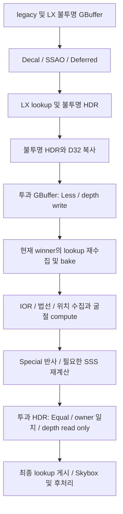

# Material Graph 실제 Scene 투과·굴절

**2026-09-29 · MAT-7 완료. Opaque/Masked coverage의 단일 투과 표면.**

## 1. Scene 합성 순서

`SceneHost`는 transmission feature `0x0800`을 Special Forward로 선택한다.
최초 GBuffer에서는 투과 draw를 제외하여 뒤쪽의 legacy 및 LX Core/Layered/SSS
표면이 실제 깊이 검사와 조명을 통과하게 한다. 불투명 HDR을 완성한 뒤 복사하고,
같은 GBuffer·D32에 가장 가까운 투과 표면을 기록한다.

최초와 최종 lookup은 같은 frame 자원을 순서대로 사용한다. 각 pass의 읽기·쓰기를
RenderGraph에 선언하며, 제출 성공 뒤 최종 lookup만 다음 프레임에 게시한다.
HDR 복사본을 읽어 대상 HDR의 읽기·쓰기 피드백과 자기 표면 샘플링을 피한다.
live pipeline의 Color node도 HDR 및 5 GBuffer MRT·depth 변경을 명시한다.

## 2. 계산 계약

- MAT-5 `SpecialForwardSurface`의 독립 금속·유전체·glass 반사와 transmission energy
  budget을 소비한다. glass integral과 BTDF 정규화는 compute에서 1024개 표본으로 계산한다.
  fragment는 적분하지 않는다.
- 뒤쪽 면에서는 법선은 coverage가 한 번만 뒤집고, 굴절 IOR은 역수,
  film IOR은 원래 transmission IOR로 나눈다. base Specular IOR Level과 glass IOR을 분리한다.
  Specular Tint와 Thin Film 입력도 glass bake에 전달한다.
- 매끈한 유리는 Snell 방향 하나를, 거친 유리는 32개 GGX 방향의 Fresnel·BTDF 가중
  radiance 평균을 사용한다. 각 ray는 최대 64개 구간을 탐색하고 깊이 교차를 8회 좁힌다.
- IOR 1은 시선 방향을 유지한다. 전반사의 0 방향에는 transmitted radiance를 넣지 않는다.
  screen miss 및 가림의 앞쪽 깊이는 현재 환경맵으로 돌아가며, 환경맵이 없으면 0이다.
- Screen depth/HDR는 같은 frame의 완성된 불투명 장면이다. 투과 표면도 Masked alpha와
  double-sided coverage를 사용하고, 실제 winner의 owner가 일치할 때만 합성한다.
- 배경 깊이에서 계산한 SSAO는 투과 표면에 적용하지 않는다. 투과 표면의 authored AO는
  local reflection/diffuse에 사용하고, transported transmission/SSS에는 중복 적용하지 않는다.

## 3. 자원과 소유권

`SceneRefractionSample`은 glass single/albedo, average/validity, environment,
raw transmission, transported radiance/hit fraction의 float4 5개, **80 B**다.
capture는 position/IOR 및 normal/film IOR의 RGBA32F 2개다.
HDR RGBA16F·D32 복사까지 **124 B/픽셀**, 기본 프레임 refraction 예산은 **512 MiB**다.
독립 금속/유전체 반사는 기존 Special 자원 **224 B/픽셀**을 공유하며 별도 512 MiB 예산을 지킨다.
lookup의 기존 2 GiB 예산도 유지한다.

frame은 device·upload recording·descriptor token·graph epoch와 immutable owner를 보관한다.
실패한 준비는 이전 accepted frame을 교체하지 않는다. graph callback이 frame을 소유하고,
복사본은 해당 graph가 소유한다. GPU 완료·submission retirement 뒤 device 종료 전에 해제한다.

shadow를 포함한 Surface Core/Layered는 generation당 PSO 9개, SSS 또는 transmission은 11개,
SSS와 transmission을 함께 사용하면 13개 모두 ready여야 선택된다.
capture·color·compute는 DXIL과 SPIR-V를 검증하고 활성 backend만 native PSO로 설치한다.

## 4. 검증

재현 gate는 `Tools/regression/verify-material-scene-refraction.ps1`이다.
source SHA-256을 고정하고 VS18/v145 Debug/Release 빌드 후 GPU validation을 켜서
refraction, 기존 SSS, 전체 raster/Scene 회귀를 실행한다. 각 runtime의 수치와 source drift를 확인한다.
2026-09-29 최종 실행에서 **567개 source SHA-256 변경 0개**, VS18/v145
Debug/Release 빌드와 native D3D12 runtime을 통과했다.

| 실행 | Debug | Release |
|---|---:|---:|
| 굴절 graph frame | 24 | 24 |
| 가시 투과 픽셀 | 6,642 | 6,642 |
| screen 교차 / miss | 5,646 / 996 | 5,646 / 996 |
| 전반사 / Masked 구멍 | 516 / 378 | 516 / 378 |
| 금속·SSS 혼합 픽셀 | 864 | 864 |
| 예산 실패 / graph reset 거부 합계 | 48 | 48 |
| 독립 rough convolution / 혼합 hit 픽셀 | 78 / 492 | 78 / 492 |
| 굴절 검사 / GPU 성분 | 185,066 / 155,877 | 185,066 / 155,877 |
| 기존 SSS 검사 / GPU 성분 | 119,413 / 108,072 | 119,413 / 108,072 |
| 기존 전체 검사 / GPU 성분 | 21,079,762 / 3,899,966 | 21,079,762 / 3,899,966 |
| 기존 Scene 합성 / generation frame | 56 / 12 | 56 / 12 |
| WARNING 이상 GPU validation | 0 | 0 |

기존 SSS의 새 회귀에서는 이제 지원하는 refraction을 거부하던 검사 1개만 제거했다.
SSS 가시 4,503픽셀·spread 7,638·경계 219,864·Masked 구멍 648과 GPU 성분은 유지된다.
기존 generation의 마지막 정상 재질 유지 7회·abort/pending/stale 거부 각 1회,
generation worker 6회·native PSO worker 24회도 유지된다.

원본 증거는 `Build/Obj/MaterialProductProbe/`의 다음 파일이다.

- `refraction-source-hashes.json`, `refraction-gate-final.log`.
- `refraction-build-Debug.log`, `refraction-build-Release.log`.
- `refraction-gate-refraction-{Debug,Release}.log`.
- `refraction-gate-subsurface-{Debug,Release}.log`.
- `refraction-gate-raster-{Debug,Release}.log`.

C++ 형식·프로젝트 XML·PowerShell 구문·문서 링크·diff whitespace 검사도 통과했다.
대시보드 JavaScript는 파싱 가능하다. 전체 dashboard 검사기의 기존 항목 모양 24건과
PHASE 4.6 산수 1건은 HEAD·변경 전·변경 후가 같아 전체 검사 통과로 기록하지 않는다.
native Vulkan 전체 Scene 및 실제 Editor UI를 실행한 증거로도 사용하지 않는다.

fixture는 실제 `EnhancedGBufferPass`·`EnhancedDeferredPass`·`SceneHost`를 사용한다.
IOR 1, 매끈한/거친 유리, 뒤쪽 면 전반사, 환경 없음, Masked, 금속/SSS 혼합,
Tint/Thin Film과 base Specular Level 0을 순차·1 worker·4 worker로 비교한다.
불투명 HDR·depth 보존, 가장 가까운 투과 depth, 독립 glass/BTDF 적분,
독립 평면 ray 교차 및 rough radiance convolution, Special HDR budget을 검사한다.

## 5. 근사와 완료 경계

단일 closest transmitting surface와 현재 화면에서 보이는 불투명 배경을 연결한 모델이다.
유리 뒤의 두 번째 투과 layer, 닫힌 고체의 두 번째 굴절 경계, 숨은/화면 밖 geometry,
Cycles path transport·굴절 caustics를 구현한 것으로 세지 않는다. 깊이 silhouette과 화면 경계의
유한 탐색 근사, dense Scene 시간·메모리 및 Blender rendered parity 수용은 MAT-9 범위다.
일반 alpha Blended queue의 설치 완료를 의미하지 않는다. 후속
[MaterialGraphSceneVolume.md](MaterialGraphSceneVolume.md)는 닫힌 균질 매질을 설치하며,
굴절 ray의 내부 구간에도 `L + T × background`를 적용한다. 앞면 반사는 기존 계산을 유지하고,
최종 카메라 합성은 closest Surface 깊이에서 멈춰 같은 내부 매질을 이중 적분하지 않는다.

native Vulkan 전체 Scene 및 Refraction Debug/Release 각 24 frame과 실제 Editor
Scene/Game·교체/재개방·수명은 [MaterialGraphProductIntegration.md](MaterialGraphProductIntegration.md),
자동 Scene host cook/package·Player는 [MaterialGraphSceneCook.md](MaterialGraphSceneCook.md)의
후속 실행으로 완료했다. 후처리 품질은 PHASE 4.75, rendered parity·성능 수용은 MAT-9가 소유한다.
