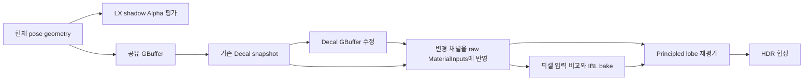

# LX Scene shadow caster와 Decal

## 1. 제품 연결

`EnhancedSceneRenderer`의 Shadow 노드는 기존 shadow pass 뒤에
`SceneHost::DeclareShadow()`를 선언한다. 두 경로가 같은 세 캐스케이드 D32 배열을
사용하며 LX 경로는 기존 깊이를 지우지 않는다. 기존 shadow pass는 graph instance를
제외하고, SceneHost가 선택한 ready/마지막 정상 재질과 현재 world·pose를 사용한다.

Surface 재질은 별도 depth 전용 `LXSceneShadowVS/PS`를 사용한다. 픽셀 shader가
그래프의 Alpha와 numeric override·이미지 샘플링을 평가하고 동일 coverage/cutoff·
양면 정책을 적용한다. 순수 Volume에는 불투명 shadow caster를 만들지 않는다.
geometry 생산은 Shadow와 GBuffer가 공유하며 각 graph에서 한 번만 선언한다.
카메라 가시 목록으로 shadow caster를 잘라내지 않고 light projection의 clipping을 사용한다.

Decal 노드는 기존 `EnhancedDecalPass`가 GBuffer를 수정한 뒤 해당 패스의
기존 diffuse/ORM/normal 사본을 `SceneHost::DeclareDecalInputs()`에 등록한다.
baseline을 위한 추가 texture copy는 없다. graph 수명과 barrier 계획이 사본을
Color/lookup 소비가 끝날 때까지 보존한다. Decal이 없으면 baseline 등록·복사가 없다.

## 2. 재질 입력과 채널 계약

LX 재질을 다시 평가한 뒤, post-Decal과 baseline의 **저장된 채널 값끼리** 비교한다.
색 RGB·AO·roughness·metallic·world normal 중 바뀐 값만 raw 입력을 교체한다.
변경이 없는 채널에는 원래 graph의 full precision 값을 사용한다. graph Alpha,
IOR·specular tint·coat·sheen·anisotropy·thin film·transmission·emission의 독립 입력은 보존한다.
world normal 변경 시 양면 orientation을 중복 적용하지 않는다.

raw 입력을 교체한 뒤 Principled를 평가하므로 금속 Fresnel·색 tint·layer 에너지와
IBL 적분이 같은 변경을 사용한다. 최종 baseColor만 바꾸는 방식으로 처리하지 않는다.
lookup capture도 같은 입력을 사용하여 변경 픽셀을 다시 적분한다.
transmission의 별도 GBuffer/lookup/shading 단계에서는 opaque Decal 입력을 적용하지 않는다.

| 구분 | GBuffer ORM 저장 순서 | Decal texture AO/R/M 처리 |
| --- | --- | --- |
| 기존 재질 | Metallic / Roughness / Occlusion | R/B를 교환 |
| LX 소유자 | Occlusion / Roughness / Metallic | 원래 순서 |

Decal shader는 owner bitmask의 상위 비트로 둘을 구분한다. bitmask가 없는 기존
독립 호출은 기존 순서를 유지한다. 현재 Decal의 diffuse alpha 제곱 블렌드,
normal 출력 alpha 0에 따른 RGB 무변경, ORM의 기존 대상 alpha 블렌드 규칙을 유지한다.
즉 이번 연결을 normal Decal의 블렌드 의미를 변경한 것으로 세지 않는다.

## 3. 검증

`Tools/regression/verify-material-scene-shadow-decal.ps1 -SkipDependencyRestore`는
source SHA-256을 고정하여 Debug/Release의 shadow·Decal·Volume·굴절·SSS·전체 Scene
회귀를 실행한다. native D3D12 GPU validation의 WARNING 이상을 실패로 처리한다.

독립 fixture는 실제 `SceneHost`, `EnhancedGBufferPass`, `EnhancedDeferredPass`,
`EnhancedDecalPass`를 사용한다. Shadow는 세 캐스케이드 전체의 깊이를 읽고,
Decal은 최종 HDR·GBuffer·raw lookup 입력·IBL sample·cache 통계를 읽는다.

- Shadow: Opaque/Masked, Alpha 이미지와 numeric 곱, cutoff, 단면/양면,
  기존 깊이 보존, world 이동, triangle chunk, 현재 skin pose의 밀봉,
  순수 Volume 제외, shadow 비활성, 중복/다른 graph 선언 거부.
- Decal: Core/Layered, diffuse·ORM·동시 적용·normal no-op·투명 no-op,
  LX/기존 채널 순서, unchanged 채널의 정밀도, graph Alpha 보존,
  raw lookup와 derived IBL·최종 lobe HDR, 제거 후 정확한 원래 HDR 복원,
  잘못된 snapshot·중복 선언 거부.
- 각각 순차·1 worker·4 worker로 동일 결과를 비교한다. Decal 기준은
  변경된 GBuffer 값으로 새 reference instance를 렌더하고, 기존 블렌드 수식도 별도로 비교한다.

### 3.1 실행 결과 (2026-09-29)

VS18/v145 Debug·Release 빌드와 native D3D12 실행이 모두 통과했다.
각 실행은 DebugLayer/GPUValidation을 켰으며 WARNING 이상 진단은 0건이다.
576개 source SHA-256을 실행 전후 대조했고 변경은 0개였다.

| 항목 | 각 Debug / Release 결과 |
| --- | --- |
| Shadow | 42 frame · covered 8,856 · 검사 33,230 · GPU 성분 32,256 |
| Shadow + Decal | 156 frame · 누적 검사 295,799 · GPU 성분 290,898 |
| Decal | 114 frame · 변경 1,536 / 보존 3,648픽셀 · 잘못된 선언 거부 72회 |
| Volume 회귀 | 33 frame · 검사 35,026 · GPU 성분 57,840 |
| 굴절 회귀 | 24 frame · 검사 185,066 · GPU 성분 155,877 |
| SSS 회귀 | 12 frame · 검사 119,413 · GPU 성분 108,072 |
| 전체 raster/Scene 회귀 | 검사 21,079,762 · GPU 성분 3,899,966 |
| 기존 Scene 합성 / generation | 56 graph / 12 frame · native PSO worker 25회 |

Shadow + Decal 수치는 같은 실행의 누적 수치이므로 Shadow 검사를 다시 합산하지 않는다.
잘못된 선언 거부는 기대한 실패 복구 fixture이며 GPU validation 오류가 아니다.
기존 전체 회귀의 baseline byte/depth와 current-pose 결과도 유지됐다.

원본 로그는 `Build/Obj/MaterialProductProbe/shadow-decal-gate-final.log`,
개별 native 로그는 `shadow-decal-gate-{shadow-decal,volume,refraction,subsurface,raster}-{Debug,Release}.log`,
source manifest는 `shadow-decal-source-hashes.json`이다. 최종 signature는
`LX_MATERIAL_SCENE_SHADOW_DECAL_GATE_OK sources=576 drift=0 configurations=Debug,Release`다.

같은 변경으로 native Vulkan Debug/Release 준비 gate도 통과했다. source 569개 변경 0개,
Core/Layered generation 2개·그림자를 포함한 Ready 응답 18개·native PSO worker 15회와
각 768픽셀 baseline draw를 확인했다. 검사 수는 Debug 14,273 / Release 10,727개이며,
종료까지 validation WARNING 이상은 0건이다. 자세한 범위는
[Scene generation §6.1](MaterialGraphSceneGeneration.md#61-shadow-caster-추가-후-재검증-2026-09-29)이다.
최종 로그는 `Build/Obj/MaterialProductProbe/shadow-decal-vulkan-gate-final.log`다.

`Editor/CreatorEditor.vcxproj`의 x64 Debug 전체 빌드도 종료 코드 0으로 통과했고
`CreatorEditor.runtime.dll`과 launcher 실행 파일을 만들었다. 원본 로그는
`Build/Obj/MaterialProductProbe/shadow-decal-editor-build-final.log`다.
빌드에는 LNK4075와 LNK4229 경고가 남았다. 이 결과는 실제 Editor Scene/Game 조작,
재개방·교체·수명 검증을 완료한 것으로 세지 않는다.

## 4. 범위

이 경로는 Surface coverage의 depth shadow와 기존 opaque Decal 계약이다.
유색 투과 shadow·매질 shadow map이나 기존 normal Decal 블렌드 개선을 구현했다고
주장하지 않는다. Volume의 광선 내부 감쇠는 별도
[Volume transport](MaterialGraphSceneVolume.md) 계약이다.

전체 비용/근사 수렴/Blender rendered parity는 MAT-9다. MAT-7의 자동 Scene host
cook/package·Player는 [MaterialGraphSceneCook.md](MaterialGraphSceneCook.md), 실제 Editor
Scene/Game·native Vulkan 전체 Scene은 [MaterialGraphProductIntegration.md](MaterialGraphProductIntegration.md)의
후속 실행으로 완료했다. native shader/PSO 준비와 실제 Editor 상태·픽셀 검증은 구분한다.
