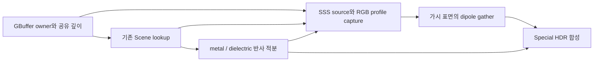

# Material Graph 실제 Scene SSS transport

## 1. 설치 범위

`SceneHost`에 Opaque/Masked surface의 Subsurface Scattering(SSS)을 연결했다.
`MAT-5`의 공용 diffusion profile·Special Forward closure를 사용하며,
`MAT-7`의 실제 GBuffer winner·공유 깊이·HDR 합성 경로에서 실행한다.
SSS feature가 있는 generation은 자동으로 Special Forward를 선택하고,
shadow를 포함한 기본 9개 graphics PSO에 front/back source capture 2개를 추가한다.
11개가 모두 ready인 뒤에 generation을 선택한다.

후속 [transmission/refraction](MaterialGraphSceneRefraction.md)이 단일 표면 Scene transport를 설치했다.
SSS와 transmission을 섞은 generation은 capture 2개를 더하여 PSO 13개를 준비한다.
금속/유전체 반사와 SSS frame 자원은 Special 표면이 공유한다.
[균질 Volume transport](MaterialGraphSceneVolume.md)는 별도 경로로 설치했다.
Blended coverage의 Scene transport는 설치하지 않았다.
필요 자원이 없는 route는 준비 단계에서 진단과 함께 거부한다.
이 문서의 SSS 완료를 Special 전체 또는 MAT-7 전체 완료로 해석하지 않는다.

## 2. 패스와 자원

- Capture는 같은 mesh·pose·coverage·VS와 read-only D32 `Equal`을 사용한다.
  GBuffer owner가 정확히 자기 draw인 fragment만 기록한다.
- 입사 source는 직접광과 environment irradiance의 합이다.
  destination Base Color·SSS weight를 source에 미리 곱하지 않는다.
- Profile에는 RGB Radius·Scale·Subsurface IOR·anisotropy를 반영한다.
  world position·normal·픽셀의 투영 표면적을 함께 기록한다.
  표면적의 fine derivative는 alpha/face coverage discard보다 먼저 계산한다.
- Gather는 **9×9 가시 픽셀**에서 world 거리로 dipole density를 평가한다.
  표면적을 곱한 가중합을 채널별로 정규화한다. 같은 draw owner이며 활성 SSS source인
  이웃만 사용하고, normal 내적이 0.5 미만인 이웃은 제외한다.
- Radius 또는 Scale이 0인 채널과 유효 가중합이 없는 채널은 local source로 돌아간다.
  가려진 픽셀·다른 draw·legacy 재질·배경은 확산에 섞지 않는다.
- 금속과 유전체의 단일/다중 반사 및 environment convolution을 각각 준비한다.
  최종 color에서 MAT-5의 energy budget과 coat/sheen 감쇠를 보존하며,
  destination 색·SSS weight는 한 번만 적용한다.
- SSAO는 local 반사·diffuse에 적용한다. 준비된 SSS source에는 적용하지 않는다.
  기존 cascade shadow binding은 직접광 source 평가에 사용한다.

| GPU payload | 형식 | 픽셀당 크기 |
| --- | --- | ---: |
| incident source + projected area | RGBA32F | 16 B |
| world position + active mask | RGBA32F | 16 B |
| normal + local RGB channel bits | RGBA32F | 16 B |
| realDepth / virtualDepth / attenuation / normalization | RGBA32F × 4 | 64 B |
| metal/dielectric single albedo·average·environment | structured buffer | 96 B |
| filtered irradiance | structured float4 | 16 B |
| **합계** | | **224 B** |

`SceneHostBudget::subsurfaceBytes` 기본값은 **프레임당 512 MiB**다.
이 payload 예산은 기존 Scene lookup·depth·HDR·allocator overhead·동시 인플라이트
프레임을 포함하지 않는다. 1920×1080 payload는 약 443 MiB다.
SSS draw가 없는 frame에는 이 자원을 만들지 않는다.
SSS frame에서는 reflection compute가 현재 LX 가시 픽셀을 평가하므로,
고해상도 dense Scene의 비용이 수용됐다고 주장하지 않는다.

## 3. 준비 실패와 수명

`SceneSubsurfaceResources`가 현재 device·upload recording·descriptor generation을
확인한 뒤 candidate를 준비한다. 전체 성공 후에만 `SceneHost` accepted frame을 교체한다.
예산 부족·shader/PSO·자원 생성 실패는 이전 accepted frame을 보존한다.

Graph callback과 Scene recording/submission owner가 불변 frame과 GPU 자원을 유지한다.
같은 frame을 다른 graph/epoch/recording에 재사용하지 못하도록 검사한다.
GPU 완료와 graph/submission 해제 뒤 자원을 반환하고, device보다 먼저 host를 종료한다.
SSS compute의 초기 설치는 현재 동기식이다. graphics generation 준비는 기존 worker를 사용한다.

## 4. 검증

`Tools/regression/verify-material-scene-subsurface.ps1 -SkipDependencyRestore`가
source SHA-256을 고정하고 Debug/Release 빌드·native D3D12 SSS 및 기존 Core/Layered
전체 raster 회귀를 실행한다. GPU Debug Layer와 GPU Validation을 켠 상태로 검사한다.

검증 장면은 실제 `EnhancedGBufferPass`·`EnhancedDeferredPass`·`SceneHost`를 사용한다.
SSS draw 2개와 앞쪽 legacy occluder, 위치별 다른 texture 색, 점광원, environment,
SSAO 0.25를 포함한다. 순차·1워커·4워커에서 다음을 GPU readback으로 비교한다.

- shared depth bytes와 legacy/background HDR의 정확한 보존.
- 독립 double 계산의 profile·입사 irradiance·world-distance dipole gather.
- 0 Radius 채널·0 Scale·다른 draw 경계·가림 경계.
- 독립 texture alpha로 Masked 구멍의 winner·확산 차단·배경 보존.
- 순수 유전체와 mixed metal의 독립 Special closure 최종 HDR.
- environment 없는 경우와 예산 실패 시 accepted frame 보존.
- 미설치 refraction/Volume route 거부와 WARNING 이상 GPU validation 메시지 0건.

물리값 비교 상한은 `0.0001 * max(1, abs(expected))`,
half HDR 저장 상한은 `0.001 * max(1, abs(expected))`다.
2026-09-29 VS18/v145 Debug·Release 빌드와 native D3D12 실행 결과:

| 검증 | 각 구성의 결과 |
| --- | --- |
| SSS: environment / 0 Scale / environment 없음 / Masked | 4 fixture × 순차/1워커/4워커 = 12 graph |
| 독립 SSS 물리·최종 HDR 검사 | 119,414개 검사 · GPU 108,072성분 |
| 실제 SSS 가시 픽셀 | 4,503픽셀 |
| local source와 다른 nonlocal 성분 | 7,638성분 |
| gather의 owner/화면 경계 제외 | 219,864개 |
| 독립 alpha로 확인한 Masked 구멍 | 648픽셀 |
| 기존 Core/Layered 전체 raster 회귀 | 21,079,762개 검사 · GPU 3,899,966성분 |
| 기존 실제 Scene 합성 / generation 교체 | 56 graph·45,626픽셀 / 12 frame |
| native D3D12 GPU validation | 모든 실행에서 WARNING 이상 0건 |
| source SHA-256 고정 | 562개 · 두 구성 완료 뒤 변경 0개 |

새 capture·reflection/filter shader는 DXIL과 SPIR-V로 검증했다.
실제 SSS 실행은 native D3D12다. Editor Live Tick과 native Vulkan 전체 Scene의
SSS 합성·메모리·수명 확인은 MAT-7 제품 통합 검증에 남는다.
빌드의 기존 `TypeTrait.h` C4189와 SSS probe의 미사용 `table` C4100은 남아 있으며,
warning-free build로 표시하지 않는다.

로그는 `Build/Obj/MaterialProductProbe/` 아래의
`subsurface-build-{Debug,Release}.log`, `subsurface-regression-{Debug,Release}.log`,
`raster-regression-{Debug,Release}.log`, `subsurface-source-hashes.json`이다.
최종 판정은 `subsurface-gate-final.log`의
`LX_MATERIAL_SCENE_SUBSURFACE_GATE_OK sources=562 drift=0 configurations=Debug,Release`다.

## 5. 근사의 한계와 다음 작업

이 구현은 유한한 화면 가시 표면의 normalized dipole 근사다.
숨겨진 표면·뒷면·화면 밖 source·닫힌 solid 내부 경로·다른 draw 사이 확산을 계산하지 않는다.
9×9 지원 영역 때문에 viewport와 투영 크기에 따라 확산의 잘림이 달라질 수 있다.
Blender/Cycles Random Walk와의 pixel parity 또는 dense Scene 실시간 성능 수용은
**MAT-9**에서 판정한다.

후속 transmission/refraction·Volume·LX shadow caster/Decal과 자동 cook/package·Player는
각 Scene 문서의 구현·검증으로 완료했다. 실제 Editor와 Vulkan 전체 Scene 및 native SSS
Debug/Release 각 12 frame의 실행은 [MaterialGraphProductIntegration.md](MaterialGraphProductIntegration.md)가
소유한다. MAT-7은 완료다. LX canvas/HTTP는 LX-3/LX-3H, artist 표시·preview는 MAT-8이 소유한다.
