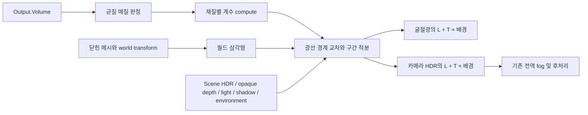

# Material Graph Scene Volume

## 1. 경계와 명칭

`Output.Volume`은 머테리얼의 매질 closure다. 메시가 경계를 정의하며 Volume-only draw는
불투명 GBuffer에 색·깊이를 기록하지 않는다. 기존 렌더 설정 자산은
`SceneRenderProfile` / `SceneRenderProfileComponent` / `.renderprofile`로 명명한다.
`RequestRenderProfileApply()`는 렌더 설정 적용 요청이다. `.volume`, 기존 컴포넌트 이름과
필드에 대한 호환 읽기는 제공하지 않는다. 컴포넌트 UUID와 자산 GUID는 유지한다.

## 2. 설치 경로

`SceneHost`는 생성 재질의 coefficient CS와 Surface stage를 DXIL·SPIR-V로 검증하고
stage별 재질 reflection의 합집합을 사용한다. 같은 이름의 binding이 서로 다르면 실패한다.
Surface와 Volume stage의 미사용 texture 제거 때문에 두 stage에 동일한 resource 목록을
요구하지 않는다. 모든 stage를 합친 결과는 원래 재질 resource/parameter 계약과 일치해야 한다.

`LX_MATERIAL_VOLUME_HOMOGENEOUS`는 Volume closure가 context에 의존하는지 전파하여 결정한다.
재질 숫자 parameter·uniform 연산은 허용하며 texture/UV/normal에 의존하는 Volume은
Scene 설치에서 진단하고 거부한다. Surface의 texture 사용만으로 균질 Volume을 거부하지 않는다.

## 3. 매질과 자원 소유

- 정적 메시의 정확히 같은 위치를 weld하여 UV seam을 허용한다. 각 edge는 두 triangle에
  속하고 방향이 반대여야 한다. 열린/비다양체/퇴화 경계, 특이 world transform, skin은 거부한다.
- 화면당 최대 16 매질·총 128 triangle이다. 교차 배열을 잘라서 부분 렌더하지 않는다.
  한도를 초과하면 이전 accepted frame을 보존한다. Geometry chunk를 나누어도 경계 검사는
  전체 sealed source를 사용한다.
- world triangle은 현재 upload recording 소유의 48 B 구조체다. 계수는 객체별 48 B GPU buffer다.
  프레임 예산은 HDR 8 B/픽셀, triangle/계수 및 정렬된 constant upload를 포함하며 기본 512 MiB다.
- graph epoch, upload recording, descriptor version을 검사한다. reset/다른 recording에서
  재사용하지 않는다. graph pass가 frame을 보유하고 제출 완료에 따라 수명을 회수한다.
- 카메라는 역행렬과 유한 far plane을 요구한다. 카메라 near plane부터 현재 Scene 깊이까지
  적분하고, near plane이 매질 안에 있으면 미래 crossing의 winding으로 초기 내부 상태를 구한다.

## 4. transport

모든 경계 교차를 정렬하며 공유 face/edge 교차를 묶는다. 구간마다 활성 매질의 scattering,
absorption, emission을 합산한다. 균질 extinction과 emission은 해석 적분한다. 단일 산란은
구간별 8 midpoint와 Henyey–Greenstein phase를 사용한다. 직접광은 point/spot 감쇠,
directional cascade shadow 및 경계까지의 매질 투과율을 사용한다. 환경광은 32 방향의
유한 구적법과 매질 투과율을 사용한다.

`L + T × background`를 pre-tone HDR에 합성한다. Surface+Volume의 굴절광은 ray별 매질 적분을
적용하고 앞면 반사는 기존 Surface 계산을 유지한다. 카메라 합성은 가장 가까운 Surface 깊이에서
멈추므로 같은 내부 구간을 다시 적분하지 않는다. 기존 Scene 전역 fog는 별도 후처리 계약이다.

## 5. 검증과 남은 범위

`verify-material-scene-volume.ps1`은 실제 GBuffer·Deferred·SceneHost를 사용하는 native D3D12
Volume fixture와 기존 refraction·SSS·전체 raster 회귀를 Debug/Release에서 실행한다.
source SHA-256을 고정하여 빌드·실행 중 변화를 검사한다. 결과는
`Build/Obj/MaterialProductProbe/volume-gate-*.log`에 기록한다.

2026-09-29 RTX 4070 Ti·VS18/v145에서 574개 source SHA-256 변경 0개로
Debug/Release 빌드와 native D3D12 실행을 통과했다. 순차·1 worker·4 worker로
흡수와 불투명 가림, 발광, 카메라 내부, 중첩 매질, 분리된 닫힌 영역, 음수/비균일 transform·
UV seam·geometry chunk, HG 직접 산란, 환경 산란, Surface+Volume, 밀도 0과 shadow를 비교했다.

| 검증 | Debug | Release |
| --- | --- | --- |
| Volume fixture graph | 33 | 33 |
| HDR·깊이 비교 픽셀 | 8,448 | 8,448 |
| 카메라 내부 / 산란 비교 픽셀 | 108 / 1,728 | 108 / 1,728 |
| 예산 실패·graph reset 거부 | 66 | 66 |
| Volume 검사 / GPU 성분 | 35,026 / 57,840 | 35,026 / 57,840 |
| 기존 굴절 검사 / GPU 성분 | 185,066 / 155,877 | 185,066 / 155,877 |
| 기존 SSS 검사 / GPU 성분 | 119,413 / 108,072 | 119,413 / 108,072 |
| 기존 전체 검사 / GPU 성분 | 21,079,762 / 3,899,966 | 21,079,762 / 3,899,966 |
| 기존 Scene 합성 / generation frame | 56 / 12 | 56 / 12 |
| WARNING 이상 GPU validation | 0 | 0 |

열린 경계·triangle 상한 초과의 이전 frame 보존, spatial Volume 설치 거부,
Surface의 독립 texture와 균질 Volume 허용, stage reflection 합집합·offset 충돌 거부도 검사했다.
MAT-6 codegen gate는 변경된 균질 marker를 포함해 20 graph·13,306개 검사·
DXIL/SPIR-V 93개 컴파일·지정 거부 31개·GPU 3,600성분을 통과했다.

원본 증거는 같은 디렉터리의 `volume-source-hashes.json`, `volume-gate-final.log`,
`volume-build-{Debug,Release}.log`, `volume-gate-{volume,refraction,subsurface,raster}-{Debug,Release}.log`,
`volume-codegen-gate.log`다. native gate 이후 제품 회귀의 `/W4 /WX`에서 확인한 지역 변수
이름 중복 경고는 이름만 변경하여 수정했다. transport·shader·fixture는 변경하지 않았다.
수정 뒤 `/W4 /WX` 제품 빌드와 D3D12 제품 회귀 121개·DXIL/SPIR-V 10개·GPU 60성분,
runtime generation·저장/실패 복구·동시 적재 회귀 43개를 통과했다.
로그는 `volume-product-gate-final.log`다.

명칭 변경을 포함한 전체 CreatorEditor Debug, CreatorBuildTool Debug 및 AssetCooker
Debug/Release 빌드도 통과했다. 관련 로그는 `volume-editor-build-final.log`,
`render-profile-buildtool-build.log`, `render-profile-cooker-{Debug,Release}-build.log`다.
기존 7개 `.renderprofile` 내용은 이전 자산과 정확히 같고, 컴포넌트 UUID는
`54293993-11f7-47a0-a77f-0f5ef2bd88c7`로 유지했다. 활성 코드·도구에는 이전 타입·확장자·
생성 명령이 남아 있지 않다. 생성 명령은 `editor.browser create renderprofile <name>`이다.
새 C++의 저장소 형식 규약, 프로젝트 XML, PowerShell 구문 및 대시보드 JavaScript 파싱도 통과했다.
Editor 빌드 결과를 실제 Scene/Game GUI 조작 검증으로 세지 않는다.

균질 매질의 유한 reference 경로다. 이종 매질/VDB·skinned 경계·다중 산란·여러 굴절 경계,
legacy alpha transparency의 깊이 순서, 전역 fog와 공동 매질 적분을 구현한 것으로 세지 않는다.
전체 Scene 성능·구적법 수렴·Blender rendered parity는 MAT-9다. 실제 Editor Scene/Game과
native Vulkan 전체 Scene·Volume Debug/Release 각 33 frame은
[MaterialGraphProductIntegration.md](MaterialGraphProductIntegration.md), 자동 Scene host
cook/package·Player는 [MaterialGraphSceneCook.md](MaterialGraphSceneCook.md)의 후속 실행으로 완료했다.
