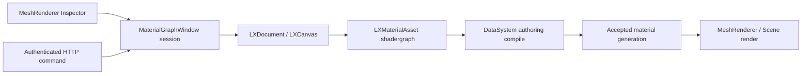

# Material Node Editor

## 1. Editor 진입과 저작 흐름

2026-09-29부터 MeshRenderer Inspector의 재질 이름과 More 메뉴의
`Open Material Node Editor`가 같은 Lattice 창을 연다. 창은 선언 기반 Editor
window registry에 `###Editor.MaterialGraph`로 등록되며 일반 docking/workspace
수명과 메뉴를 사용한다.

- 기존 graph 재질은 GUID가 가리키는 `.shadergraph`를 읽는다.
- 모델 재질은 import 시 실제 PBR 값과 텍스처를 연결한 graph를 만들고, 기본 배치부터
  그 graph로 렌더링한다. 이전 모델 generation에 graph가 없으면 Editor가 source에서 재저작한다.
- 모델 외의 graph 없는 재질은 Principled BSDF → Material Output의 새 문서를 만든다.
  이 경우 Apply 전까지 기존 바인딩을 유지한다.
- 중앙 재질 드롭다운의 `New Material Graph`와 새 문서 아이콘은 현재 MeshRenderer용 별도 문서를 만든다.
- 같은 드롭다운의 `Open Materials` 목록은 열린 문서들을 전환한다. 창을 숨겨도 미저장 문서를 유지한다.

모델 재질의 SoT는 프로젝트
`Assets/Materials/Models/<model UUIDv8>/<material UUIDv8>.shadergraph`다.
model material ID와 source graph ID는 별개의 결정적 UUIDv8이며 `.meta`가 graph ID를 등록한다.
model generation의 PBR 데이터는 최초 graph 생성의 seed이고, 재import는 기존 graph 내용을
덮어쓰지 않는다. graph와 meta는 모델 저작 transaction에서 함께 게시하며 실패 시 신규 파일만 회수한다.

Base Color factor × sRGB Base Color Texture, ORM의 Green/Blue × Roughness/Metallic factor,
data Normal Texture → Normal Map, Emission factor × sRGB Emission Texture를 연결한다.
AO는 별도 Occlusion Texture가 있으면 그것의 Red, 없으면 ORM Red와 strength를 사용한다.
Opaque/Masked/Transparent 정책과 texture alpha, alpha cutoff도 graph에 보존한다.
sampler의 min/mag·mip filter와 U/V address 및 UV0 offset/scale/rotation을 유지한다.
현재 Scene graph transport에는 UV0만 있으므로 UV1 재질의 자동 생성은 명시적으로 실패한다.

모델 parameter node는 `valueSource=socket`을 사용한다. 노드의 output socket 값이
컴파일된 기본값이며 Blackboard는 ID/타입/표시 이름을 제공한다. 같은 ID의 서로 다른
socket 기본값은 진단으로 거부하며 group 내부의 parameter도 같은 규칙을 적용한다.
기존 `valueSource` 없는 graph parameter는 Blackboard 기본값을 계속 사용한다.

MeshRenderer Inspector는 graph 재질 이름과 source, 연결된 texture의 이름·thumbnail,
노출된 color/scalar/vector/bool/int parameter를 표시한다. Inspector 변경은 instance override이며
global Undo/Redo와 Scene 저장에 포함된다. 기존 C# Material API도 identifier로 같은 graph parameter를
변경한다. 캔버스는 source 기본값을 편집하고, 같은 GUID의 Apply는 instance override를 보존한다.
재질 구체/조명 환경을 갖춘 별도 sphere preview는 아직 제공하지 않는다.

model cooking은 material graph를 자동으로 포함한다. model/mesh/material의 manifest 의존성이
graph와 graph resource에 이어지며, BuildTool은 graph가 빠진 오래된 model library를 재저작한다.

저작 순서는 **Save → Apply to Mesh → Save Scene**이다.

| 동작 | 저장/게시하는 내용 |
| --- | --- |
| Save | graph, pin 기본값, property, layout, header 접힘, view와 기존 group/Blackboard/active output metadata를 제품 `.shadergraph`로 저장 |
| Apply to Mesh | 저장한 graph를 검증·컴파일하고 성공한 instance를 MeshRenderer에 적용. global Editor Undo의 한 변경으로 기록 |
| Save Scene | MeshRenderer의 새 inline material 바인딩을 Scene에 저장 |

새 graph의 기본 경로는 프로젝트 `Assets/Materials/Material_<GUID>.shadergraph`다.
`.meta`는 GUID 등록에 계속 사용하며 graph 내용은 `.shadergraph`가 소유한다.
저장 후에도 문서 Undo 이력을 유지하고 저장된 snapshot과 같은 내용으로 Redo하면
dirty가 해제된다. 외부 파일 변경 충돌과 진행 중인 drag preview는 저장을 거부한다.
미저장 문서의 Reload는 UI에서 명시적 버리기 확인을 받으며 HTTP에서는 거부한다.

## 2. Blender형 표현과 LX 경계

상단은 한 줄로 구성한다. 왼쪽에 Editor/Object 선택과 View/Select/Add/Node 메뉴,
중앙에 slot/material 선택·이름·Save/New/Close 아이콘 묶음과 Apply 핀 아이콘,
오른쪽에 스냅과 overlay 토글·드롭다운을 배치한다. Reload는 재질 드롭다운,
Frame All은 View 메뉴와 Home 키에 둔다. Close는 창만 숨기며 문서를 유지한다.
Object → 실제 mesh 이름 → Material breadcrumb는
점 격자 캔버스 위에 투명하게 표시하며 별도 도구줄 높이를 차지하지 않는다.
Principled BSDF는 녹색, Material Output은 붉은색 헤더와 선택 테두리를 사용한다.

헤더는 자체 ImGui child가 소유한다. 메뉴줄과 child 배경은 현재 LXCanvasStyle의
`background`를 공유하고 메뉴줄 경계선과 바깥 여백을 제거한다. 외부 스타일로
배경을 바꾸면 헤더와 캔버스가 같은 색으로 이어진다. 콤보 조작은 표준 BeginCombo를
유지하되 큰 삼각형 대신 작은 꺾쇠를 그린다. 글꼴은 16 논리 픽셀이고 ImGui가
사용자 배율과 monitor DPI를 한 번 적용한다. 아이콘·간격·테두리도 같은 배율이다.

스냅 버튼은 노드 이동의 격자 스냅을 켠다. 여러 노드를 이동하면 드래그한 노드만
격자에 맞추고 같은 이동량을 전체 선택에 적용해 서로의 상대 위치를 보존한다.
스냅 설정은 세션 UI 상태이며 graph 데이터는 기존 이동/Undo transaction을 사용한다.

상단바·breadcrumb·꺾쇠는 공통 Material Symbols Outlined 폰트의 글리프를 사용한다.
Save 메뉴는 `save`, 헤더 저장은 `shield`, 새 문서는 `content_copy`, Apply는 `push_pin`,
overlay는 `join_inner`, 편집기 선택은 `blur_circular`다. 기존 `contrast`, `deployed_code`,
`view_in_ar`, `close`, `expand_more`, `chevron_right`도 재사용한다. 스냅에는 기존
`grid_on`을 사용하며 고정한 원본 폰트에는 자석 글리프가 없다.
아이콘은 실제 glyph bounds를 기준으로 중앙에 놓고 DPI/사용자 배율을 한 번 적용한다.
독립 예제도 Inter와 같은 subset을 실행 파일 옆에 배포하고 공통 merge helper를 사용한다.

Material Node Editor의 창 제목에도 기존 `EditorIcon::Material` 글리프를 표시한다.
표시 이름만 바꾸고 docking/workspace 식별자 `###Editor.MaterialGraph`는 유지한다.

Add 메뉴의 Reroute는 Bool/Int/Float/Vector/Color/Normal/Texture/Sampler/Closure의
9가지 실제 등록 타입이다. 같은 이름을 반복 표시하지 않고 하나의 `Reroute` 하위 메뉴에서
타입을 선택한다. Multiply는 `Multiply (Float)`와 `Multiply (Color)`로 구분한다.
검색은 표시 이름과 등록 타입을 모두 사용하며 각 항목의 ImGui ID는 등록 타입으로
분리한다. 정의 이름이나 저장 파일의 타입은 바꾸지 않는다. 독립 ImGui 예제도 같은
메뉴 함수를 사용한다.

`MaterialGraphPresentation`은 실제 `LXMaterialDefinitions`의 소켓 순서와 타입으로
항목을 등록한다. 색상 picker, float slider, vector, bool, integer, enum, text와
texture preview를 제공한다. 핀의 Y 위치·항목 rect·노드 높이·hit test는 같은
`LXNodeRow` 목록을 사용한다. 연결된 입력의 값 위젯은 비활성화된다.
Principled의 Diffuse/Subsurface/Specular/Transmission/Coat/Sheen/Emission/Thin Film은
개별 펼침 항목이며 연결된 고급 소켓은 자동으로 표시된다.

Material Output에는 Blender의 All/Cycles/Eevee 대상 선택 위젯을 표시하지 않는다.
현재 제품 Scene의 렌더러는 `EnhancedSceneRenderer`다. 참조 schema의 `target=ALL`은
Blender 자료와의 대응을 위한 metadata이며 엔진 렌더러 선택이 아니다.
외부 문서가 지원하지 않는 `target` 값을 넣으면 compiler가 `material_output_target`으로 거부한다.

노드 헤더 접힘과 view는 저장하지만 내부 고급 section 펼침은 세션 UI 상태다.
서로 다른 노드/핀/연결선 스타일은 LXStyleSheet를 사용한다. 창의 기본 스타일은
Blender형으로 통일하며 오른쪽 overlay 드롭다운에서 다음 외부 파일을 Export/Reload한다.

`RuntimeDataRoot/Editor/Styles/Material.lxstyle`

이 파일은 Scene이나 `.shadergraph` 안에 저장하지 않는다. 기본 스타일을 생성한 뒤
외부 파일이 있으면 읽는다. LX의 항목·캔버스는 Engine 타입을 링크하지 않으며
Editor adapter가 texture GUID 해석과 asset drag payload를 연결한다.
이 새 창은 `imgui-node-editor`를 사용하지 않는다. 기존 BT/Animator 창의 의존성
제거는 각 창의 재작성 이후인 LX-4~6 범위다.

Material의 기본 배경은 30 논리 픽셀 간격의 작은 점이다. LXCanvasStyle의
`gridPattern`과 `gridDotRadius`도 `LXS 6` 외부 스타일에 정확히 저장한다.
기존 LXS 1~5 파일은 계속 읽으며, Material 창은 점 패턴 필드가 없던 이전 파일을
점 배경으로 적용한다. 다른 LX 창의 이전 선 격자 기본값은 유지한다.

## 3. 문서·제품 자원 소유권



세션은 EntityHandle과 component instance ID로 대상 MeshRenderer를 매번 해석한다.
삭제되거나 잠긴 대상은 편집/Apply를 거부한다. Save는 LX 예제의 `.lxg` 직렬화가
아닌 `LXMaterialAsset::Save`의 staged roundtrip/backup 경로를 사용한다.
Apply 실패는 현재 정상 material/Scene generation을 바꾸지 않는다.

새 graph는 Editor authoring 경로에서 결정적 Slang과 Scene target bytecode를 생성한다.
Editor를 재시작해도 저장한 source를 authoring compile로 읽을 수 있다.
Player는 기존 cooked catalog/bytecode 경로를 유지한다. 이 저작 fallback은
Player source compile 허용이나 MAT-7의 쿠킹 경계 변경을 의미하지 않는다.

## 4. 열린 문서의 HTTP 편집

실행 중인 Editor의 인증된 CommandService에서 `material.editor`를 사용한다.
UI와 HTTP가 같은 LXDocument와 명령 큐를 소비한다.

```text
material.editor open <object>
material.editor new <object>
material.editor state
material.editor <operation> <document-id> <revision> <args...>
```

`state`는 document ID, revision, dirty, uiFrames, graph GUID, path,
node/pin/link 목록과 표시 geometry를 반환한다. 수정 요청은 **문서 ID와 revision을
모두 일치시켜야** 한다. Reload는 새 문서 ID를 발급해 이전 요청을 무효화한다.

| operation | args |
| --- | --- |
| save / apply / reload / undo / redo | 없음 |
| add | node type |
| connect | output pin ID, input pin ID |
| disconnect | link ID |
| delete | node ID |
| collapse | node ID, true/false |
| property | node ID, key, value |
| value | pin ID, 타입에 맞는 성분들 |

타입 불일치, 잘못된 document/revision, 비유한 수, 존재하지 않는 ID는 무변경 오류다.
변경은 Undo transaction, revision과 dirty를 갱신하며 자동 저장하지 않는다.

## 5. 검증과 남은 범위

`Tools/regression/verify-material-node-editor.ps1`는 격리한 프로젝트의 실제 Editor를
숨긴 창으로 실행하고 인증 HTTP로 조작한다. 실제 창의 ImGui frame 진행,
typed 연결/거부, document/revision 충돌, 정확한 저장 bytes 왕복,
저장 후 Undo/Redo, 접힘 왕복, 외부 변경 보존, compiler 실패의 accepted generation
보존, MeshRenderer Apply의 실제 GBuffer 변화와 새 Editor 재개방을 검사한다.
GPU validation과 정상 종료, Engine/Editor/Lattice source hash 변경 여부도 기록한다.

독립 예제의 `--capture-material <png>`는 같은 MaterialGraphPresentation/LXCanvas를
실제 ImGui/D3D11 backbuffer에서 캡처한다. 이는 스타일 미리보기이며 제품 Editor 창의
스크린샷으로 취급하지 않는다. 예제 자체 검사는 항목/핀 Y 정렬, section 접힘,
compact header와 저장 snapshot/Undo 관계를 검사한다.

2026-09-29 최초 연결의 Editor Debug/Release 빌드와 LX 예제 Debug 빌드/자체 검사를 통과했다.
예제의 view 검사는 DPI 1.0/1.5에서 사용자 배율 1.35 변경도 검사한다.
상단바·점 배경 수정 전 최초 연결의 native DX12 Editor 결과는 다음과 같다.

| 구성 | 검사 | 실제 Scene capture | source SHA-256 변경 | GPU 문제 / 정상 종료 |
| --- | ---: | ---: | --- | --- |
| Debug | 1,298 | 3 | 1,132개 중 0 | 0 / exit 0 |
| Release | 1,298 | 3 | 1,132개 중 0 | 0 / exit 0 |

증거는 `Build/Obj/material-node-editor-{debug,release}-gate-final.log`,
`Build/Obj/MaterialProductProbe/node-editor-{Debug,Release}-root.txt`가 가리키는
격리 프로젝트의 `source-hashes.json`, `responses.jsonl`, `validation.json`과 capture에 있다.
최종 Debug 검사에는 Scene 활성화 직후 카메라/Editor rig 준비 실패의 명시적
`camera.unavailable`을 최대 30초 기다리는 절차를 추가했다. 다른 실패는 계속 거부한다.
Release는 같은 최종 Editor/LX source에서 이 대기를 추가하기 전에 통과했다.

같은 날 상단바·점 배경 수정본은 Editor Debug/Release 빌드와 독립 ImGui 캡처를
확인했다. 예제 자체 검사는 LXS 6 점 패턴/반경 왕복과 LXS 5/4/3 읽기를 통과했다.
실제 숨긴 DX12 Debug Editor에서도 새 상단바가 포함된 Material 창의 ImGui frame
3회를 확인했고 basic validation 문제 0·정상 종료 exit 0이었다.
이 확인은 위 1,298개 제품 렌더 회귀 전체를 다시 실행한 증거는 아니다.
로그는 `Build/Obj/material-header-dots-{editor-debug-build,editor-release-build,selftest,editor-ui}.log`와
`Build/Obj/MaterialNodeEditorPreview.png`다.

그 뒤 헤더의 꺾쇠·아이콘 묶음·자석/overlay 형태와 캔버스 배경 연결도 수정했다.
수정본 Editor Debug/Release 빌드와 숨긴 DX12 Debug Editor의 ImGui frame 3회,
GPU validation 문제 0·정상 종료 exit 0을 확인했다. 예제 자체 검사에서는 스냅 시
다중 선택의 상대 위치 보존과 Undo를 DPI 1.0/1.5 및 LXDocument 경로에서 통과했다.
독립 ImGui 캡처의 빈 헤더와 빈 캔버스 픽셀은 모두 RGB (28, 28, 28)이었다.
증거는 `Build/Obj/material-header-reference-{editor-debug-build,editor-release-build,selftest,editor-ui}.log`,
`Build/Obj/MaterialHeaderReferencePreview.png`와 헤더 영역 발췌
`Build/Obj/MaterialHeaderReferenceBar.png`다.

같은 날 Material Symbols에 Save·Shield·Duplicate·Pin·Overlays·NodeEditor·FrameAll
역할을 추가하고 상단바·경로 표시·꺾쇠를 실제 폰트 글리프로 교체했다.
73개 역할/68개 글리프의 누락 0, 기존 아이콘 정렬 289개 검사 실패 0,
Editor Debug/Release 및 독립 예제 Debug 빌드를 확인했다. 배포된 세 폰트 사본의
SHA-256은 원본과 같았다. 숨긴 DX12 Debug Editor에서 Material 창 ImGui frame 3회,
basic GPU validation 문제 0·정상 종료 exit 0을 확인했다.
로그는 `Build/Obj/material-font-icons-{editor-debug-build,editor-release-build,example-build,alignment,editor-ui,preview}.log`,
독립 ImGui 미리보기와 헤더 발췌는 `Build/Obj/MaterialFontIconsPreview.png`와
`Build/Obj/MaterialFontIconsBar.png`다. 이 검사는 전체 제품 렌더 회귀의 재실행이 아니다.

대시보드 전체 JavaScript 파싱, LX-3/LX-3H 진행 중·MAT-7 완료·MAT 총 34일 유지 검사와
Vite 문서 빌드도 통과했다. 이후 진행률 조사에서 LX-3/LX-3H의 잘못된 `doing` 상태를
정식 `progress`로 수정했다. 알 수 없는 가중치와 미산정 0일의 곱도 NaN이므로 전체 집계가
오염되었던 문제다. checker도 `days:null`을 미산정으로 읽고 실제 페이지 script의 전체·진행 중·
각 phase 진행률을 실행 검사한다. TASKS 435항목, shape 오류 0, meta 불일치 0,
전체 진행률 유한성 검사를 통과했고 `doing`을 주입한 사본은 실패했다.

제품 Editor에서 실제 마우스로 모든 제스처를 다시 조작한 결과와 Vulkan Editor UI
검증은 이 작업의 증거에 포함하지 않는다. 기존 group/Blackboard metadata는 보존하지만
전용 interface/Blackboard 저작 패널은 후속이다. Artist preview/cost badge와 rendered
parity/performance 수용은 기존 MAT-8/MAT-9 범위다.

## 6. Material 창 CPU 비용과 도킹 조사 (2026-09-29)

`PinPosition`의 조건식 `items ? *items : LXNodeItemRegistry{}`는 임시 객체 때문에
정의·문자열·predicate를 가진 레지스트리 전체를 핀마다 복사했다. 양쪽을 lvalue로 바꿔
복사를 제거했다. 이후에도 핀 위치·항목 rect·노드 높이가 같은 visible row 목록을 반복
계산하므로 `RowCacheScope`에서 캔버스 draw 동안 재사용한다. section 변경은 해당 노드를,
등록/predicate 변경과 입력 처리 뒤에는 전체 목록을 무효화한다. scope 종료 시 지워 다음
프레임에 opaque predicate를 다시 평가하며, 저장 문서에는 cache를 포함하지 않는다.

숨긴 native DX12 Editor와 격리한 동일 재질 fixture(노드 6개, 연결 6개)를 인증 HTTP로
열고 닫았다. 각 표본은 ImGui 창 CPU draw 비용이며 실제 사용자 화면의 FPS 측정이 아니다.
Editor 자체의 `editor.panelcost`로 180개 이상 게시 프레임의 평균과 P95를 읽었다.

| 구성 | 수정 전 평균 / P95 (ms) | 수정 후 평균 / P95 (ms) |
| --- | ---: | ---: |
| Debug | 355.294 / 477.433 | 17.973 / 24.638 |
| Release | 10.8564 / 13.2444 | 0.91418 / 1.3194 |

수정 전 Release 표본 중에는 별도 Debug 빌드가 진행되어 CPU 경합이 수치에 영향을 줄 수
있다. 수정 후 측정은 빌드 종료 뒤 실행했다. Debug 복사 제거만 적용한 중간 표본은
239.133ms로, row 계산 재사용이 추가로 필요한 근거였다. 전체 Scene GPU 비용이나 MAT-9의
최종 성능 수용을 이 UI 비용으로 대신 판정하지 않는다.

Debug/Release Editor 빌드와 독립 Debug 예제 자체 검사를 통과했다. 자체 검사는 반복 핀
위치 계산 중 registry 복사 0회, draw scope 내부 predicate 재평가 없음, section 무효화와
다음 프레임 재평가, Output의 대상 선택 항목 부재를 확인한다. 양쪽 비용 측정 실행은 창을
닫은 뒤 UI 비용이 돌아왔으며 정상 종료 exit 0이었다.

도킹 금지 flag나 window class 제한은 현재 Content Browser/Material 선언에 없다.
기본 레이아웃의 숨긴 Debug Editor에서 `editor.nav`로 실제 title drag/drop을 주입해
Material과 Content Browser가 같은 dock node 6에 들어갔다. 사용자 Debug 저장 workspace는
사본만 별도 프로젝트에 복원했다. 큰 창의 dock root 2880×1662, Content Browser 1952×518,
UI 배율 1.2에서도 같은 node 6의 탭 도킹이 성공했다. 사용자 원래 DPI/배율 및 실제 OS
마우스 이동과 동일한 검사는 아니며, 처음 보고된 표시 누락의 직접 원인은 재현으로 특정하지
못했다. 수정본 빌드 뒤 사용자가 "이제 잘 된다"고 확인했다. 작업 공간을 초기화하거나
사용자 파일을 수정하지 않았다.

`editor.dock`는 `movingWindow`, `hoveredWindowUnderMoving`, `dockingPayload`,
`dockNodes[].flags`를 추가로 반환해 이동 payload와 대상의 금지 여부를 읽을 수 있다.
숨긴 창의 큰 해상도 검사에 필요했던 `window.resize`도 활성/보이는 창 검색 대신
엔진 `CoreWindow` 핸들을 사용하도록 수정했다. DPI/창틀 때문에 요청과 실제 client 크기가
다르면 기존 응답에 실제 크기를 계속 보고한다.

증거는 `Build/Obj/material-editor-investigation-{debug-before-valid,debug-after-copy,
debug-after-cache,release-before,release-after-cache}.log`,
`Build/Obj/material-editor-investigation-user-layout2.log`와 대응하는
`Build/Obj/MaterialInvestigation-*`의 비용·도킹 JSON이다. 최종 예제 검사는
`Build/Obj/material-investigation-selftest-final.log`, 대시보드 정상/변이 검사는
`Build/Obj/material-dashboard-nan-{validation,mutation}.log`다.

최종 빌드 후 추가 Release 측정은 사용자의 일반 Debug Editor 실행을 확인해 조사용
프로세스만 종료했다. `release-after-final` 실행은 측정 완료로 세지 않으며 위 표는
정상 종료한 `release-after-cache` 표본이다.

## 7. 창 제목과 Add 메뉴 수정 검증 (2026-09-29)

Material 제목 아이콘과 Add 메뉴 수정본의 제품 Editor Debug 빌드, 독립 예제 Debug
빌드와 자체 검사를 통과했다. 메뉴 목록 검사는 등록 타입과 표시 이름의 유일성,
Reroute 9개, Multiply 2개와 검색 후 타입 보존을 확인했다. 실제 ImGui popup에서
Reroute 9개를 각각 눌러 선택된 등록 타입을 확인했고 각 hover ID의 항목 수는 1이었다.
검사 입력은 격리한 ImGui context에만 주입하며 OS 마우스는 조작하지 않았다.

숨긴 native DX12 Debug Editor는 격리 프로젝트의 graph(노드 6개)를 열어 Material 창
ImGui frame 15회를 확인했고 GPU validation 문제 0, 정상 종료 exit 0이었다.
이 검사는 기존 모델 재질의 변환이나 전체 제품 렌더 회귀를 검증한 결과가 아니다.

증거는 `Build/Obj/material-node-menu-editor-debug-build.log`,
`Build/Obj/material-node-menu-example-interaction-final-build.log`,
`Build/Obj/material-node-menu-selftest.log`, `Build/Obj/material-node-menu-editor-ui.log`와
`Build/Obj/MaterialHeader-Debug-98747e8e`의 격리 프로젝트다.

## 8. 모델 graph SoT 검증 (2026-09-29)

- Editor·AssetCooker Debug와 C# BuildTool 빌드 통과. Release는 이번 변경으로 검증하지 않았다.
- LX 자체 검사 통과: Material graph 102개, compiler 21개. group 안의 socket parameter 기본값,
  서로 충돌하는 기본값 거부, 기존 Blackboard parameter와 정확한 archive 왕복을 포함한다.
- 모델 저작 transaction의 7가지 주입 실패, UUIDv8 identity 충돌 거부, 재import 시 편집된 graph
  byte 보존과 신규 graph/meta rollback 통과.
- 격리 프로젝트의 숨긴 native DX12 Editor에서 94개 검사 통과. CreatorRobot의 graph 4개를 만들고
  실제 배치했으며, Plane의 embedded texture·Inspector/canvas frame·named property 변경과 Undo/Redo,
  graph 저장 왕복·재import 보존·Scene 저장 후 새 Editor 재개방을 확인했다.
- 위 94개 검사의 실제 렌더 대상은 Plane이었다. CreatorRobot은 배치만 검사해, 스킨 모델의
  렌더 정지 회귀를 검출하지 못했다.
- Plane Scene capture 2회에서 graph identity와 effective uniform을 실제 draw에 대조했고 nonfinite·GPU
  validation 문제는 0개였다. 두 Editor 세션 모두 정상 종료했다.
- source-only cook staging에서 모델 2개·재질 graph program 5개·embedded texture 13개·Scene 1개를
  게시했다. `--shadergraph`를 지정하지 않고 모델의 의존성에서 graph를 자동으로 발견했으며
  `unproducedGuidRefs=0`이었다. DXIL/SPIR-V 제품 컴파일과 게시 전 cooked program 재읽기를 통과했다.

검증 중 `material.override`가 graph 재질에 없는 구형 `MaterialInstance::Revision()`을 참조해
ACCESS_VIOLATION을 일으켰다. 응답 생성의 null 참조를 수정하고 같은 named property 변경·Undo를 재검증했다.
모델에서 파생한 graph UUIDv8은 source identity scan과 loose/PAK material program path 검증에서도 허용한다.

증거는 `Build/Obj/model-material-graph-{editor-build-final,cooker-build,lattice-test,authoring-test,
native-test,cook-test,dashboard-test}.log`와 `Build/Obj/MaterialProductProbe/model-sot-Debug-root.txt`가
가리키는 격리 프로젝트에 있다. OS 마우스는 조작하지 않았다. Blender 외형 parity와 Release 수용,
UV1 transport, sphere preview·cost badge는 이 검증의 완료 범위에 포함하지 않는다.

### 모델 배치 후 Scene 렌더 정지 회귀 (2026-09-30)

CreatorRobot 배치 후 ImGui는 계속 실행되지만 Scene의 completed frame이 멈추는 증상을 재현했다.
그래프 geometry sealing이 두 제품 입력을 잘못 거부했다: 가중치 0의 미사용 본 인덱스 `255`,
그리고 기하 법선은 유효하지만 탄젠트가 0인 정점 3개다. 본 팔레트는 양의 가중치에 대해서만
검사하고 GPU에서도 그때만 읽는다. T/B가 모두 없는 프레임은 기존 Normal Map의 기하 법선
fallback을 사용한다. 유효하지 않은 가중치·양의 가중치의 범위 밖 본 인덱스·단일 축이 없는
모호한 프레임·비유한 값·view 방향 0은 계속 거부한다.

Debug GPU mesh probe는 8개 vertex mask·3개 pose, 621,152개 검사·286,140개 GPU 성분 대조를
통과했다. 미사용 `255`, 단일/다중 influence, T/B 없음, mirrored seam 취소와 실패 시 마지막
정상 packet 보존을 포함한다. native model 회귀는 Robot만 남긴 Scene의 4개 graph draw,
실제 depth·유한 capture·completed frame 증가, 저장 후 새 Editor 재개방을 필수로 검사한다.

실제 native DX12 Debug Editor에서 Robot 배치 후 4개 graph draw와 프레임 97→102 증가를
확인했다. 저장한 Scene을 새 Editor에서 재개방한 후에도 4개 graph draw·프레임 49→53 증가,
GPU validation 문제 0·nonfinite 0·정상 종료를 확인했다. 재개방 추가 검사 35개가 통과했다.
클라이언트 창을 2884×1666으로 키운 별도 native Debug 세션에서도 Scene 1828×992의
4개 graph draw·프레임 48→51→53 증가·validation 문제 0·nonfinite 0·정상 종료를
확인했다(추가 검사 39개, basic validation). 실제 표시 이미지는 `robot-large-6/display.png`다.
Scene 전환의 초기 component 등록이 끝나기 전에는 primary camera가 없을 수 있어,
회귀 harness는 카메라 준비를 확인한 후 follow를 설정한다.

증거는 `Build/Obj/model-render-{editor-build,mesh-build,mesh-gpu,reopen-test,large-test}.log`와
`Build/Obj/MaterialProductProbe/ModelSoT-Debug-2d3854bad9/{robot-placed-6,robot-reopened-6,robot-large-6}`다.
Release 빌드·성능 수용을 이번 Debug 기능 회귀의 결과로 간주하지 않는다.

### MAT-8 artist 상태 표시 (2026-09-30)

MeshRenderer Inspector의 Surface는 적용된 material generation이 선택한 Standard/Layered/Special
tier와 Deferred/Forward/Volume 경로를 색상 배지로 보여 준다. 같은 generation의 정적 texture
sample 수와 texture resource 수, 현재 하나의 graph specialization도 표시한다. Layered와
Special은 추가 조명·화면 점유 비용을 문장으로 설명하고 Transparent 재질에는 중첩 위험을 알린다.
내부 register, descriptor, MRT, PSO 선택은 노출하지 않는다.

Material Node Editor의 Material Status는 초안 graph를 분석해 예상 tier·route·샘플 수를 보여
준다. 지원하지 않는 소켓·노드·named UV 등은 실패 이유와 가능한 수정 방향을 표시하고,
실패한 초안을 조용히 다른 재질로 대체하지 않는다. 이 값은 초안의 추정치이며 실제 제품
shader 검증은 Apply가 수행한다. pan/zoom과 값 편집이 document revision을 바꾸므로 분석은
조작이 멈춘 뒤 갱신한다.

Material Preview는 별도의 논리 live view(viewId=3)에서 내장 UV sphere를 렌더한다. Scene Material의
실제 적용 instance/texture owner/generation을 그대로 밀봉하고 동일 Scene shader 경로를 사용한다.
Scene object·sprite·decal·UI는 제외하고 고정 key light와 현재 Scene의 환경을 사용한다.
Surface의 조명·형상은 Scene object와 다르므로 픽셀 일치를 뜻하지 않는다.
Save/Apply 전 초안은 미리보기에 반영되지 않는다. 완료된 요청 instance의 GPU 결과를 캐시하고,
재질/coverage 변경·Refresh·리사이즈 때 갱신한다. 숨긴 뒤 다시 열면 동일 결과를 재게시한다.
Transparent coverage에는 아직 제품 Scene graph replacement가 없어 지원 한계를 설명한다.
Apply/import 실패는 마지막 정상 재질을 유지하며 원인과 수정 방향을 표시한다.

현재 UI의 미리보기는 MeshRenderer Inspector의 기본 접힘 `Preview` 섹션에 있다.
구체와 격자 바닥을 표시하며 노드 창을 닫아도 Inspector의 수요가 유지된다.
노드 창의 보조 패널은 선택 노드 설명과 소켓 정보를 표시한다.
초기 노드 창 미리보기 UI를 이 구성으로 변경한 실제 실행 증거는
[MAT9NodeEditorPerformance](../analysis/MAT9NodeEditorPerformance.md)에 보존한다.

HTTP `material.editor preview on|off|refresh`는 별도 고정 preview 수요를 고정/해제/무효화하며,
`material.editor state`의 preview는 요청 revision·완료 revision/frame·ready·renders를 제공한다.
`render.live.capture <directory> material controlled`는 독립 구체의 실제 GPU attachment를 기록한다.

Debug CreatorEditor 전체 빌드와 기존 Material Node Editor 제품 회귀가 통과했다.
후자는 열린 문서의 편집·저장·재개방 및 실제 Scene/독립 구체 capture 5회에 대한
1,337개 검사(`LX_MATERIAL_NODE_EDITOR_OK`, source drift 0, 정상 종료)다.
구체의 실제 draw/픽셀 변경·완료 이미지 재사용·숨김 후 재게시·실패한 Apply의 정상 generation 보존을 검사했다. 실제 Windows UI로 File Load Scene→Ground Inspector→노드 창 진입과 preview 열기/Refresh를 확인했다. 메뉴는 씬 소유 스레드에 scene.switch를 큐잉하며, 작은 창의 상태/preview 설명은 줄바꿈한다. 증거: Build/Obj/mat8-preview-regression4.log, mat8-preview-menu-build.log, mat8-preview-wrap-build.log 및 MaterialProductProbe/NodeEditor-Debug-5736845a10e7의 5개 최종 capture. Release·성능·Blender rendered parity는 MAT-9에서 판정한다.
