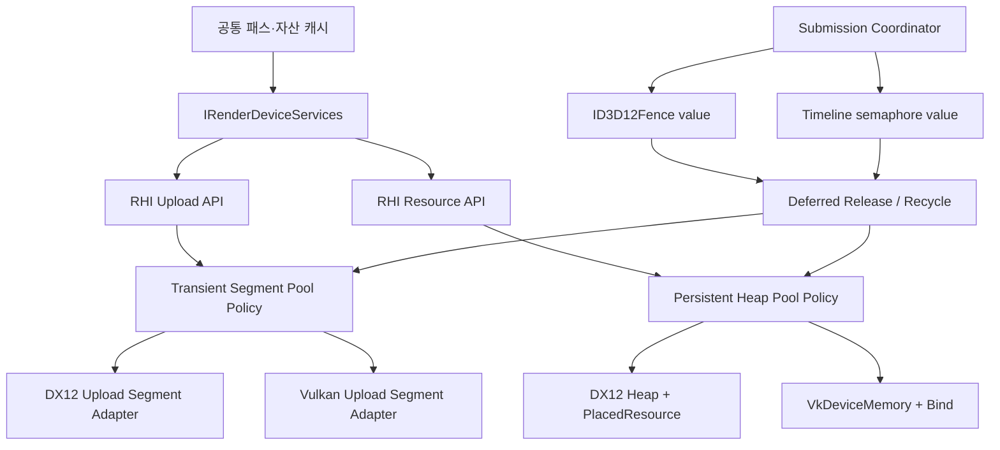
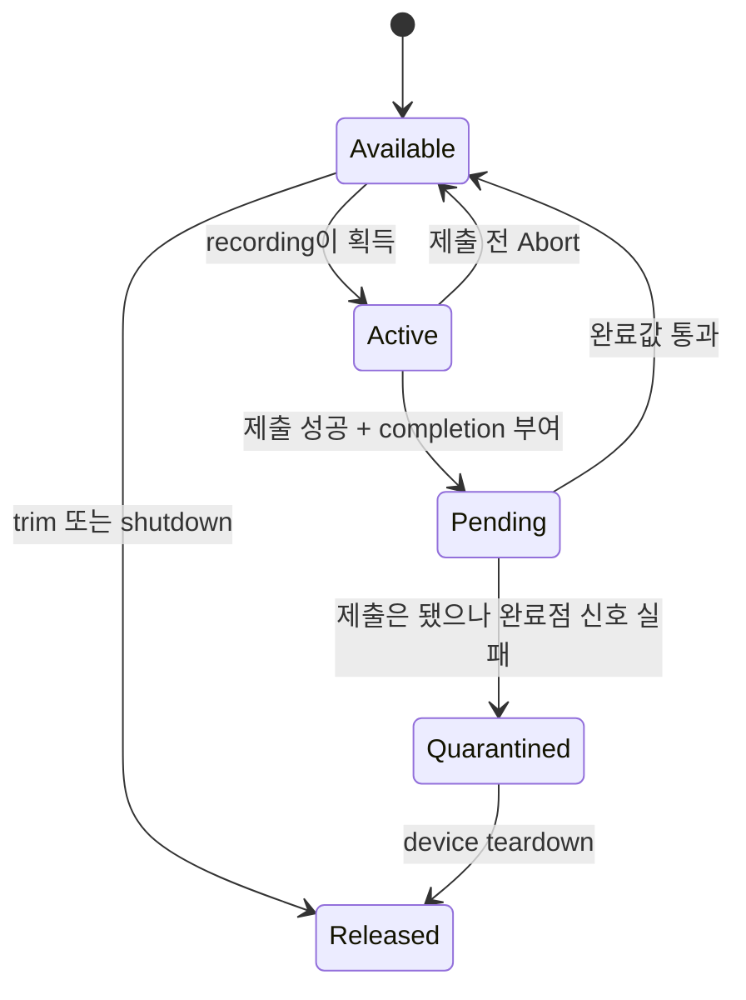
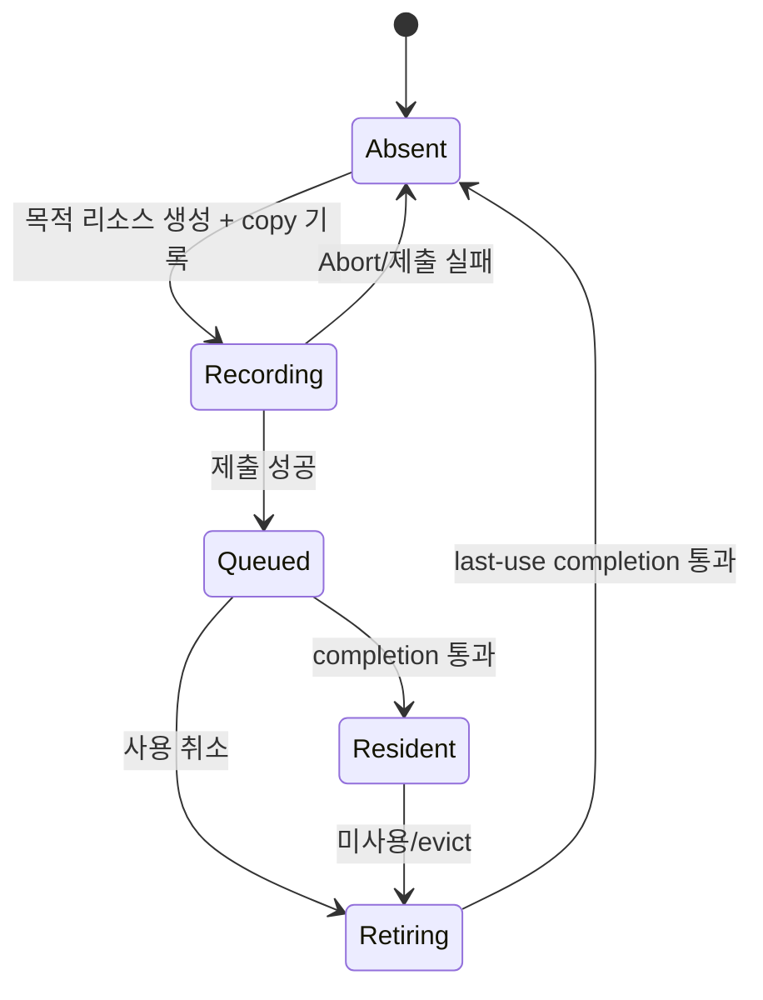

# RHI GPU 메모리·수명 관리 재설계

작성: 2026-08-14

상태: **Slice A~D 및 Slice E-a descriptor versioned recycler 완료 / SBT는 실제 소비 경로 대기**

대상: CreatorEngine RHI, DX12, Vulkan

관련 문서: `RhiBoundaryPlan.md`, `AssetResidencyPlan.md`

대체 범위: 두 문서의 upload ring, frame-count 수명, 향후 placed-resource heap 부분

구현 상태 (2026-08-15):

- Slice A 완료: 의미 기반 요청, all-or-none 배치, recording/completion,
  RHI `AbortFrame`, 제출 coordinator와 cache transaction listener를 배선했다.
- Slice B 완료: DX12/Vulkan 모두 completion-aware
  regular/large segment allocator로 전환했다. Vulkan flush는 command pool
  recycler를 사용하며 더 이상 제출 직후 CPU에서 기다리지 않는다. 일반 세그먼트는
  packed cursor CAS로 lock-free 예약하고, large/best-fit 및 생성만 allocator mutex로
  직렬화한다. 고정 용량 stable-address buffer registry와 generation 기반 free slot
  재활용을 도입해 resolve 중 slot 이동 없이 trim된 세그먼트의 handle 자리도 다시
  쓸 수 있다. worker는 slow path에서 새 네이티브 세그먼트를 만들 수 있다. worker
  allocation context는 CAS retry telemetry가 유의미할 때만 적용하는 후속 최적화다.
  양쪽 백엔드에 실제 메모리 예산 조회, soft-budget 재시도, completion 이후 trim,
  압력 히스테리시스와 정책 telemetry도 배선했다.
- Slice C의 중립 Vulkan mesh 경로 완료: DX12 메시 정점/인덱스는 한 배치로
  예약하고, DX12 메시·텍스처와 Vulkan 메시·텍스처는 Recording → Queued →
  Resident 및 Abort rollback을 따른다. `VulkanMeshCache`는 device-local
  vertex/index buffer를 소유하고 completion-point graveyard에서만 반환한다.
  Vulkan pipeline/encoder에도 RHI vertex input과 동적 binding stride를 연결했고,
  editor `TickLive`의 실제 scene pass와 ImGui Vulkan 표시 경로까지 배선했다.
- 공통 completion retire queue 완료: 네이티브 payload는 각 owner가 보관하되
  완료 전/완료값 일치/quarantine/teardown 판정은 `RHICompletionRetireQueue` 하나를
  사용한다. DX12/Vulkan 메시·텍스처 캐시와 양쪽 ImGui descriptor 묘지를 이관했다.
  프레임 번호는 미사용 퇴출 정책에만 쓰며 실제 파괴는 completion point가 결정한다.
- Slice D persistent resource heap 완료: `RHIPersistentHeapPolicy`가 주소순 map과
  크기순 best-fit index, alignment padding 보존, 인접 block 병합, generation
  handle과 compatibility key를 백엔드 중립으로 관리한다. DX12는
  `ID3D12Heap`/`CreatePlacedResource`, Vulkan은 `VkDeviceMemory`와
  `vkBindBufferMemory`/`vkBindImageMemory`로 연결했다. 메시·텍스처 cache의
  completion graveyard가 native resource를 먼저
  파괴한 뒤에만 block을 반환하며, 빈 세그먼트는 key당 1장만 standby로
  남긴다. 32 MiB 이상, driver dedicated 요구, pool segment 생성/바인드
  실패는 committed/dedicated로 fallback한다.
- 적용 범위는 양쪽 `IRenderMeshCache`의 vertex/index buffer와
  `IRenderTextureCache`의 sampled asset texture다. DX12는 buffer와
  `ALLOW_ONLY_NON_RT_DS_TEXTURES` heap을 분리하고, Vulkan은 memory type에
  buffer/optimal-image class를 더한 compatibility key를 사용한다. 수명 종료점을
  알려 주는 release 계약이 없는 범용 `CreateBuffer`/`CreateTexture` 소비자는
  억지로 pool로 바꾸지 않았다.
- persistent heap의 성장 예산은 DX12 `DXGI LOCAL`의
  `IDXGIAdapter3::QueryVideoMemoryInfo`, Vulkan memory type의 heap에 대한
  `VK_EXT_memory_budget`에서 직접 읽는다. Vulkan 확장이 없으면 heap size를
  estimated budget으로 사용한다. 90%/80% 압력 히스테리시스와 빈 segment
  강제 trim, exact-size dedicated fallback은 두 backend가 같은 공통 정책을 쓴다.
- device-scoped `RHIDeviceMemoryBudgetCoordinator`가 DeviceResources에서 프레임당
  한 번 갱신한 snapshot을 같은 물리 device의 모든 persistent allocator에 배포한다.
  buffer/texture allocator는 owner로 등록하고 segment 성장 전에 공통 growth ticket을
  예약·commit/cancel한다. ticket을 거치지 않는 committed/dedicated allocation도
  snapshot 이후 사용량에 합산하므로 allocator별 독립 판단에 따른 동시 과예약을 막는다.
  실제 budget만 90%/80% pressure 판정에 사용하고 heap-size estimate는 성장 한도와
  telemetry에는 쓰되 pressure 신호로 승격하지 않는다.
- `RHIAssetEvictionPolicy`는 평상시 120프레임 미사용 은퇴를 유지한다. 실제 device
  pressure에서는 3프레임 이상 미사용한 Resident 자산을 LRU 순으로 고르고,
  80% 해제선까지 필요한 바이트와 최소 64 MiB 중 큰 값을 한 번의 texture→mesh
  공유 target으로 사용한다. 이번 프레임 사용 자산과 Recording/Queued 업로드는
  보호하며, 선택된 자산도 즉시 파괴하지 않고 completion retire queue로 보낸다.
- Slice E-a descriptor versioned recycler 완료: 공통 `RHIDescriptorVersionPolicy`가
  Available → Recording → Pending/Quarantined 상태와 slot+generation handle을 관리한다.
  DX12는 recording마다 shader-visible heap page 하나를, Vulkan은 descriptor pool
  version 하나를 점유한다. `FlushCommandList`의 중간 제출도 새 recording/version으로
  전환하며 제출 completion 전에는 reset하거나 덮어쓰지 않는다. 모든 version이
  pending이면 page/pool을 성장시키고, completion 도달 뒤에만 재사용한다.
- SBT versioned recycler는 실제 공통 RT 소비 경로가 생길 때 구현한다는 본문의
  조건을 유지한다.
- 검증: 최종 변경을 포함한 VS18/v145 Debug x64 전체 솔루션 빌드는 오류 0으로
  성공했다. 링크 시 기존 `/DELAYLOAD:vulkan-1.dll` LNK4229가 Player/Editor에
  각각 1건 발생했으며 이번 allocator 컴파일 경고는 0건이다. `rhi.uploadsegments`는 공통 policy,
  DX12 7/7, Vulkan 4/4, Vulkan validation layer clean을 통과했다. 실제
  `scene.glb` 유효 mesh 25개의 21,626,436 B를 DX12에서 64 MiB segment
  1장, placed allocation 50개, 할당 크기 23,658,496 B로 올렸다. 완료점
  직전에는 전체 block이 보존됐고 도달 후 0 B로 병합되며 standby 1장만
  남았다. Vulkan도 segment 1장, pooled allocation 50개, 할당 21,626,944 B였고
  94,308 index draw가 green 105 / blue 3,991 pixel로 유지됐다. 양쪽의
  강제 1 B soft-budget fixture에서 committed/dedicated fallback도 통과했다.
- 2026-08-15 추가 검증: 공통 큐의 완료값 6/7·7/7 경계와 completion 0
  quarantine을 `rhi.uploadsegments`에서 확인했다. DX12 177프레임에서는 실제
  texture 1개 128.0 MiB가 은퇴·회수되어 묘지/격리 0으로 내려왔고, Vulkan은
  130프레임 뒤 texture/mesh 묘지·격리 0, validation 0으로 정상 종료했다.
- texture compatibility pool 실경로 검증: 같은 프로세스에서 `dx12.gizmoicon`과
  `vk.gizmoicon`을 실행해 실제 `CameraGizmo.png`의 중심/투명/외부 픽셀이 각각
  `0.500/0.000/0.000`, 점등 1,346으로 일치했다. DX12는 texture segment 1장,
  pooled/dedicated `2/0`(흰 폴백+아이콘), Vulkan은 `1/0`을 사용했다. 두 backend
  모두 할당 0.1 MiB, 실제 device-local budget 11,228.0 MiB를 보고했고 Vulkan
  validation은 0건이었다. 전용 할당 우회나 budget 0은 이제 두 테스트가 실패시킨다.
- device budget 추가 검증: 공통 계약 테스트가 owner 2개의 합산 ticket 제한,
  commit/cancel, 90% 진입·80% 해제 hysteresis, estimated budget의 pressure 제외를
  통과했다. DX12/Vulkan native persistent heap 테스트도 같은 coordinator를 공유하는
  두 allocator의 segment 성장을 확인했고 `rhi.uploadsegments`는 오류 0,
  Vulkan validation clean으로 종료했다. 이후 실제 PNG 양쪽 테스트도 pooled 경로와
  동일 픽셀 결과를 유지했다.
- pressure eviction 추가 검증: 공통 정책 테스트가 normal 120f, pressure 3f LRU,
  recent/upload-pending 보호와 두 cache의 target 공유를 통과했다. 실제 `scene.glb`
  25개 mesh는 DX12/Vulkan 모두 3프레임 pressure 경로에서 21,626,436 B가 묘지로
  이동했고, completion 직전 보존·도달 뒤 block 병합과 empty trim을 확인했다.
  `dx12.gizmoicon`/`vk.gizmoicon` 실제 PNG 회귀도 오류 0과 동일 픽셀을 유지했다.
- descriptor recycler 추가 검증: `dx12.descriptorheap` 6/6이 completion 경계,
  Abort 재사용, completion 0 quarantine, generation 갱신, page 내 연속 할당,
  중간 제출 version 격리, 완료 뒤 재사용, overflow와 sampler dedupe를 통과했다.
  `vk.selftest`는 GPU 대기 없는 flush 3회로 초기 pool 3개를 모두 pending 상태로
  만든 뒤 네 번째 version을 성장시켜 실제 descriptor set draw를 완료했고,
  `WaitForGpu` 뒤 4개 version 전부가 회수됐으며 validation 오류는 0이었다.
  `dx12.parallel`은 upload 2,048건과 descriptor 1,024건에서 겹침 0건,
  순차/병렬 결과 byte 차이 0과 픽셀 차이 0/65,536을 확인했다.

---

## 0. 결정 요약

CreatorEngine의 업로드 메모리는 더 이상 **프레임 인덱스로 나눈 고정 링 버퍼**를
핵심 수명 모델로 사용하지 않는다. 다음 네 계층으로 분리한다.

1. **Transient Upload Segment Pool**
   - CPU가 쓰고 GPU가 읽는 임시 스테이징 메모리.
   - 선형 할당하고, 제출 완료값이 지난 세그먼트를 통째로 재사용한다.
   - 일반 세그먼트와 대형 전용 세그먼트를 분리한다.
2. **Submission/Lifetime Coordinator**
   - 모든 큐 제출에 단조 증가 완료값을 붙인다.
   - DX12 fence와 Vulkan timeline semaphore를 같은 RHI 완료점으로 번역한다.
3. **Deferred Release Queue**
   - GPU가 마지막으로 사용한 완료점이 지나기 전에는 리소스, 디스크립터,
     스테이징 블록을 파괴하거나 덮어쓰지 않는다.
4. **Persistent Resource Heap Pool**
   - 장기 상주 버퍼·텍스처는 큰 디바이스 메모리 힙 안에서 할당한다.
   - 해제 완료 후 free-list에 반환하고, 인접 빈 블록을 병합한다.

이 구조는 .NET GC의 **세그먼트, 빠른 선형 할당, 대형 객체 분리, 빈 세그먼트
standby** 개념을 차용한다. 그러나 GPU 주소와 디스크립터가 인플라이트 명령에
박혀 있으므로 **이동 압축과 세대 승격은 차용하지 않는다.**

DX12와 Vulkan은 동일한 RHI 계약과 상태 전이를 구현한다. 한 백엔드만 구현된
상태는 이 설계의 완료가 아니다.

---

## 1. 현재 코드에서 확인한 문제

### 1.1 업로드 경로의 비대칭과 고정 상한

| 항목 | DX12 현재 상태 | Vulkan 현재 상태 | 문제 |
|---|---|---|---|
| 기본 용량 | 프레임당 16 MiB 세그먼트 | 프레임당 8 MiB 단일 블록 | 동일 RHI 호출이 백엔드마다 다른 크기에서 실패한다 |
| 부족 처리 | 실패 수요를 기록하고 다음 `BeginFrame`에 세그먼트 하나 추가 | 즉시 무효 슬라이스 반환 | 최초 요청은 실패하며 Vulkan에는 성장 경로도 없다 |
| 대형 요청 | 다음 프레임에 요청 크기 세그먼트를 추가 | 항상 실패 | 현재 프레임의 큰 메시를 구하지 못한다 |
| 회수 기준 | 프레임 슬롯 fence 대기 후 슬롯 전체 reset | 프레임 슬롯 timeline 값 대기 후 offset reset | 중간 제출과 실제 사용 범위를 표현하지 못한다 |
| 동시 할당 | packed cursor CAS | 단순 `m_offset` | Vulkan 구현은 병렬 기록에 안전하지 않다 |

근거가 되는 현재 경로:

- DX12 초기 16 MiB 값: `RenderEngine/RHI/DX12/DX12DeviceResources.cpp`
- DX12 사후 성장: `RenderEngine/RHI/DX12/DX12UploadRing.cpp`
- Vulkan 고정 블록: `RenderEngine/RHI/Vulkan/VulkanFrameAllocators.cpp`
- 공통 표면: `RenderEngine/RHI/IRenderDeviceServices.h::AllocateUpload`

### 1.2 `scene.glb` 대형 메시가 사라지는 직접 경로

현재 DX12 메시 캐시는 정점 버퍼와 인덱스 버퍼를 별도의 호출로 올린다.

```text
Upload vertex staging
  └─ 성공 가능
Upload index staging
  └─ 프레임 세그먼트 부족 → 실패
      └─ 메시 전체가 무효 binding으로 반환됨
```

한 요청이 16 MiB를 넘거나, 같은 프레임의 앞선 업로드가 공간을 소비해 합계가
16 MiB를 넘으면 `DX12UploadRing::Allocate`가 그 프레임 요청을 거절한다. 현재
수정안은 다음 프레임부터 세그먼트를 늘리므로 **실패한 최초 프레임을 복구하지
않는다.** 같은 메시가 여러 패스에서 반복 요청되면 실패 수요도 중복 계상된다.

또한 정점 업로드 성공 후 인덱스 업로드가 실패할 수 있어 목적 리소스 생성,
복사 명령, 통계가 부분적으로 진행될 수 있다. 메시 하나는 정점·인덱스 staging을
**한 번에 예약하는 all-or-none 배치**여야 한다.

### 1.3 제출보다 먼저 resident가 되는 캐시

DX12 메시·텍스처 캐시와 Vulkan 텍스처 캐시는 복사 명령을 기록한 뒤 실제 큐
제출 성공을 확인하기 전에 resident map에 엔트리를 넣는다. 이후 프레임이
Abort되거나 제출이 실패하면 캐시는 GPU에 도달하지 않은 리소스를 정상 상주
리소스로 돌려줄 수 있다.

필요한 상태는 최소 다음 넷이다.

```text
Absent → Recording → Queued(completion) → Resident
                └──────── Abort ─────────→ Absent
Resident → Retiring(completion) → Absent
```

`Queued`는 같은 큐의 뒤 제출에서 사용할 수 있지만 아직 CPU 관점의 완료는 아니다.
교차 큐 소비나 readback은 `Resident`, 즉 완료 확인 이후만 허용한다.

### 1.4 제출 추적의 구멍

`DX12DeviceResources::EndFrame`은 fence를 신호하지만 다음 경로는 네이티브 큐를
직접 호출한다.

- `EnhancedRenderGraph.cpp`의 병렬 command list 제출
- `EnhancedApiOverheadBench.cpp`의 병렬 제출
- `DX12DeviceResources::FlushCommandList`의 중간 제출

직접 제출은 “어느 업로드 세그먼트와 어느 리소스가 어느 완료값에 속하는가”를
한 곳에서 결정할 수 없게 한다. Vulkan `FlushCommandList`는 같은 command pool을
재사용하려고 매번 timeline을 기다려 CPU/GPU 파이프라이닝을 끊는다.

### 1.5 프레임 수 기반 수명은 안전 판정이 아니다

영상에서 설명한 life-count 방식은 고정 인플라이트 수를 잘 지키면 동작할 수
있지만, 다음 경우에는 실제 GPU 완료와 어긋난다.

- 프레임 중간 제출
- GPU stall 또는 device scheduling 지연
- 프레임 Abort
- 향후 copy/compute queue 분리
- 창 최소화 등으로 프레임 진행이 멈춘 상태

따라서 frame count는 캐시의 “얼마나 오래 안 썼는가” 정책에는 사용할 수 있지만,
파괴와 재사용의 안전 판정에는 사용할 수 없다. 안전 판정은 완료값만 담당한다.

---

## 2. 차용할 것과 차용하지 않을 것

### 2.1 .NET GC에서 차용할 것

| .NET 개념 | RHI 적용 |
|---|---|
| 관리 힙 세그먼트 | 큰 네이티브 메모리 블록을 만들고 그 안에서 빠르게 할당 |
| bump-pointer 할당 | transient upload를 현재 세그먼트 cursor 증가로 할당 |
| SOH/LOH 분리 | 일반 요청과 대형 전용 세그먼트를 서로 다른 풀에서 관리 |
| 빈 세그먼트 standby | 완료된 세그먼트를 즉시 파괴하지 않고 재사용 후보로 유지 |
| 임계치 동적 조정 | peak, miss, reclaim lag를 보고 예산과 standby 목표를 조정 |
| allocation context | 필요 시 기록 워커별 chunk를 미리 떼어 CAS 경합을 줄임 |

.NET의 85,000바이트 LOH 기준이나 실제 세그먼트 크기는 런타임 구현값이므로
가져오지 않는다. RHI의 임계치는 GPU 업로드 패턴과 VRAM/host-visible 예산을
측정해 결정한다.

### 2.2 차용하지 않을 것

- **이동 압축:** GPU 가상 주소, descriptor, SBT record, 인플라이트 command가
  기존 위치를 참조할 수 있어 투명 이동이 불가능하다.
- **도달성 추적:** 엔진은 자산 ID, RHI handle, 명시적 소유권으로 수명을 안다.
- **세대 승격:** 일시 데이터와 상주 데이터는 복사 시점부터 목적이 다르므로
  generation이 아니라 서로 다른 allocator를 사용한다.
- **stop-the-world:** 정상 프레임에서 전체 GPU 대기나 `vkDeviceWaitIdle`로
  메모리를 회수하지 않는다.

### 2.3 영상의 관리 기법에서 차용할 것

- 큰 힙을 만들고 내부 free-list에서 재사용한다.
- 해제 블록의 앞뒤가 비어 있으면 즉시 병합한다.
- GPU가 읽는 중인 리소스와 descriptor는 지연 해제한다.
- 제출 뒤의 SBT/descriptor 내용을 CPU가 덮어쓰지 않고 새 버전을 만든다.

단, 고정 life-count 대신 DX12 fence/Vulkan timeline 완료값을 사용한다.

---

## 3. 목표 구조



공통 코드는 “언제 재사용 가능한가”, “어떤 크기 분류인가”, “어떤 블록을
선택하는가”를 결정한다. 백엔드는 네이티브 리소스를 생성하고 요구 정렬과
memory type/heap flag를 결정한다.

---

## 4. RHI 계약

### 4.1 의미 기반 업로드 요청

현재 `AllocateUpload(bytes, alignment)`는 DX12의 256/512 정렬 규칙을 호출부로
노출한다. 다음 의미 기반 요청으로 바꾼다.

```cpp
enum class RHIUploadUsage : uint8_t
{
    Raw,
    ConstantBuffer,
    VertexData,
    IndexData,
    BufferCopy,
    TextureCopy,
    ShaderTable
};

struct RHIUploadRequest
{
    uint64_t       bytes{ 0 };
    RHIUploadUsage usage{ RHIUploadUsage::Raw };
    uint64_t       minimumAlignment{ 1 }; // 호출자가 아는 추가 하한
};
```

백엔드는 다음 식으로 실제 정렬을 넓힌다.

```text
effectiveAlignment = max(request.minimumAlignment,
                         backend.RequiredAlignment(request.usage))
```

DX12 상수/텍스처 배치 규칙과 Vulkan의 device limit은 각각의 adapter 안에 남는다.

### 4.2 배치 예약

```cpp
class IRenderDeviceServices
{
public:
    virtual bool ReserveUploadBatch(
        std::span<const RHIUploadRequest> requests,
        std::span<RHIBufferSlice> outSlices,
        std::string& outError) = 0;

    // 이행 기간 호환 함수. 내부적으로 1개 배치를 호출한다.
    virtual RHIBufferSlice AllocateUpload(
        const RHIUploadRequest& request) = 0;
};
```

배치는 다음을 보장한다.

- `outSlices.size() == requests.size()`가 아니면 호출 자체를 거절한다.
- 모든 요청을 수용할 수 있을 때만 cursor를 한 번 전진시킨다.
- 하나라도 실패하면 세그먼트 cursor와 출력은 바뀌지 않는다.
- 정점/인덱스처럼 함께 살아야 하는 데이터는 반드시 한 배치로 요청한다.
- 배치 내부 조각은 한 세그먼트의 연속 예약에서 `SubRange`로 만든다.

이 규칙으로 “정점 성공, 인덱스 실패”를 구조적으로 없앤다.

### 4.3 완료점

현재 엔진은 graphics queue 하나에서 업로드와 렌더링을 순서대로 제출하므로
첫 구현은 단일 단조 증가 값으로 충분하다.

```cpp
struct RHICompletionPoint
{
    uint64_t value{ 0 };
    bool IsValid() const { return value != 0; }
};
```

향후 copy/compute queue를 분리할 때는 `queueId + value` 또는 완료점 집합으로
확장한다. 그 전까지 다른 큐에서 이 값을 완료 판정에 사용하는 것은 금지한다.

### 4.4 allocator 내부 계약

이 인터페이스는 패스에 노출하지 않고 `IRHIDeviceResources` 구현이 소유한다.

```cpp
class IRHIUploadAllocator
{
public:
    virtual void Collect(uint64_t completedValue) = 0;
    virtual void BeginRecording(uint64_t recordingId) = 0;

    virtual bool ReserveBatch(
        uint64_t recordingId,
        std::span<const RHIUploadRequest> requests,
        std::span<RHIBufferSlice> outSlices,
        std::string& outError) = 0;

    virtual void OnSubmitted(
        uint64_t recordingId,
        RHICompletionPoint completion) = 0;

    virtual void AbortRecording(uint64_t recordingId) = 0;
};
```

`recordingId`는 frame index가 아니다. 한 프레임 안에서 `FlushCommandList`가
여러 번 발생하면 제출 구간마다 새 recording ID를 만든다.

---

## 5. Transient Upload Segment Pool

### 5.1 세그먼트 상태



핵심 불변식은 다음과 같다.

1. `Pending` 세그먼트의 cursor와 바이트는 절대 수정하지 않는다.
2. 제출 시 그 recording이 사용한 모든 `Active` 세그먼트를 seal한다.
3. 중간 제출 뒤의 기록은 새 `Active` 세그먼트를 사용한다.
4. `completedValue`가 retire 값을 지난 뒤에만 `Available`로 돌아온다.
5. frame index는 command allocator 선택에는 쓸 수 있지만 세그먼트 안전 판정에는
   쓰지 않는다.

### 5.2 크기 분류

```text
packedBatchBytes <= largeThreshold
    → Regular pool

packedBatchBytes > largeThreshold
    → Large pool 또는 dedicated segment
```

초기 계측용 기본값은 다음처럼 시작할 수 있지만 확정 상수는 아니다.

| 설정 | 잠정 시작값 | 의미 |
|---|---:|---|
| `regularSegmentBytes` | 16 MiB | 일반 세그먼트 크기 |
| `largeThreshold` | 8 MiB | 일반 풀을 오염시키지 않을 배치 기준 |
| `largeGranularity` | 4 MiB | 대형 세그먼트 반올림 단위 |
| `standbyRegularSegments` | 3 | 생성 비용을 피하기 위해 유지할 빈 일반 세그먼트 |
| `largeCacheBudgetBytes` | 64 MiB | 정상 상태에서 유지할 빈 대형 세그먼트의 총량 |
| `trimDelayCollects` | 8 | 정상 상태에서 재사용 기회를 주는 collect 유예 횟수 |
| `softBudgetBytes` | 동적, 64~512 MiB | 초과 시 collect/trim 후 재시도할 기준 |

DX12와 Vulkan이 같은 숫자를 강제로 쓸 이유는 없다. 두 백엔드는 같은 동작 계약과
테스트를 공유하되 실제 정렬, memory type, 예산은 별도 telemetry로 정한다.

### 5.3 할당 알고리즘

1. 요청들의 실제 정렬을 계산해 한 배치의 packed size를 구한다.
2. 대형이면 완료된 large segment 중 best-fit을 찾는다.
3. 일반이면 현재 active regular segment에서 CAS로 한 번에 예약한다.
4. 맞지 않으면 현재 세그먼트의 남은 꼬리를 기록하고 다른 available 세그먼트를
   즉시 얻는다.
5. available 세그먼트가 없으면 **현재 요청에서 바로 생성**한다. 다음 프레임으로
   미루지 않는다.
6. soft budget을 넘거나 backend pressure가 켜지면 `Collect`와 available trim을
   수행하고 생성 경로를 재시도한다.
7. soft budget은 hard cap이 아니다. 안전하게 회수할 available 세그먼트가 없으면
   overcommit을 계측한 뒤 네이티브 생성 API가 최종 성공/OOM을 결정하게 한다.
8. 크기 합산 overflow나 네이티브 생성 실패 시 기존 cursor와 출력 slice는
   변경하지 않는다.

느린 생성 경로는 allocator mutex로 직렬화한다. 업로드 세그먼트의 RHI handle은
고정 용량 stable-address registry에 등록한다. registry slot 주소는 이동하지 않고,
등록/해제만 직렬화하며 resolve는 lock-free다. trim은 handle generation을 올린 뒤
free slot에 반환하므로 오래된 handle은 무효가 되고 다음 생성은 같은 주소의 slot을
안전하게 재사용한다. DX12와 Vulkan 모두 buffer handle slot을 최대 handle 수로 한 번
고정 할당해 이 조건을 만족하며, 병렬 worker의 네이티브 세그먼트 생성도 slow path
안에서 허용한다.

### 5.4 병렬 기록

DX12와 Vulkan의 일반 세그먼트는 같은 packed cursor CAS 정책을 사용한다. 한 번의
CAS 성공이 배치 전체 범위를 확정하므로 all-or-none 의미를 유지한다. active
세그먼트 교체, large best-fit 및 네이티브 생성만 slow mutex 경로로 보낸다.
`ReserveBatch`만 같은 recording 안에서 병렬 호출한다. recording을 여닫고 제출하거나
Abort하는 owner thread는 해당 recording의 worker를 join한 뒤 경계를 전환한다.

8 worker/64 MiB fixture를 최종 코드로 두 번 실행해 64회 예약당 백엔드별 CAS
재시도 1~6회를
관측했다. 현재 수치로는 worker별 chunk의 내부 단편화와 수명 복잡도를 감수할
이유가 없으므로 allocation context는 넣지 않는다. 실제 프레임 telemetry에서
재시도가 지속적으로 증가하거나 allocator 대기 시간이 병목으로 확인될 때 다음
단계로 .NET allocation-context 방식을 적용한다.

```text
worker context가 64~256 KiB chunk를 세그먼트에서 한 번 예약
    └─ worker 내부 할당은 local cursor만 증가
    └─ chunk 부족 시에만 공통 세그먼트와 동기화
```

Vulkan의 기존 단순 `m_offset`도 공통 CAS cursor로 교체했으므로 두 백엔드 모두
병렬 allocator 계약을 만족한다.

### 5.5 trim

매 프레임 파괴하지 않는다. 정상 상태에서는 다음 조건을 모두 만족하는 세그먼트만
정리한다.

- `Available` 상태
- 최근 8회 collect 동안 사용되지 않음
- regular standby 목표보다 많거나 large cache budget을 초과함

backend memory pressure 또는 allocator의 soft budget 초과 시에는 유예 횟수와
standby/cache 목표를 우회해 `Available` 세그먼트를 즉시 줄인다. `Recording`과
`Pending`은 어떤 압력에서도 trim하지 않는다. 따라서 trim은 안전성이 아니라
성능/메모리 정책이며, 안전성은 completion 판정으로 끝난 뒤에만 실행된다.

예산 입력과 압력 판정은 백엔드가 담당하고 allocator는 같은 정책으로 소비한다.

| 항목 | DX12 | Vulkan |
|---|---|---|
| 실제 예산 | `IDXGIAdapter3::QueryVideoMemoryInfo`; UMA는 local, discrete는 non-local 우선 | upload memory type의 heap에 `VK_EXT_memory_budget` 사용 |
| fallback | 조회 실패 시 soft budget 256 MiB | 확장 부재 시 heap size를 estimated budget으로 사용 |
| soft budget | 현재 segment bytes + 가용 headroom의 1/8, 64~512 MiB clamp | 동일 |
| pressure | 사용량 90%에서 진입, 80% 이하에서 해제 | 실제 budget일 때만 동일; estimated budget은 압력 판정에 쓰지 않음 |

예산은 매 frame begin의 completed fence/timeline 값을 읽은 뒤 갱신한다. 이 순서로
worker join, GPU completion 확인, `Pending → Available`, trim, 새 recording 시작의
경계를 유지한다.

---

## 6. 제출과 Abort의 단일 소유자

### 6.1 Submission Coordinator

모든 제출은 backend `DeviceResources`의 한 함수로 모은다.

```text
Close/End recording
    → native queue submit
    → completion value signal
    → uploadAllocator.OnSubmitted(recordingId, completion)
    → uploadTransaction.OnSubmitted(completion)
    → 새 recordingId 시작
```

- DX12: `ExecuteCommandLists` 뒤 같은 queue에서 `ID3D12Fence::Signal`.
- Vulkan: `vkQueueSubmit2`의 signal 목록에 timeline 값을 함께 넣는다.
- 제출 수락 전 실패: 현재 recording을 즉시 Abort할 수 있다.
- DX12에서 실행 제출 뒤 fence signal이 실패: 안전 완료점을 증명할 수 없으므로
  관련 객체를 `Quarantined`에 두고 device teardown까지 파괴하지 않는다.

다음 직접 호출은 제거하거나 coordinator 내부로 내려야 한다.

- render graph 병렬 제출
- API overhead benchmark 병렬 제출
- 프레임 중간 flush
- 향후 copy queue 제출

### 6.2 Vulkan 중간 제출

현재 Vulkan flush는 제출 직후 timeline을 기다리고 같은 command pool을 reset한다.
재설계 후에는 제출마다 command pool/buffer 세트를 recycler에서 하나 얻는다.

```text
RecordingPool A → submit(value 10) → Pending(10)
RecordingPool B → 즉시 다음 기록
completed >= 10 → Pool A reset 후 Available
```

이렇게 해야 공통 `FlushCommandList`가 Vulkan에서만 CPU/GPU 동기화 지점이 되는
비대칭을 없앨 수 있다.

### 6.3 Abort

- 아직 제출되지 않은 current recording:
  - command recording 폐기
  - `Active` 업로드 세그먼트 즉시 available 반환
  - cache의 `Recording` 엔트리 rollback
- 같은 프레임에서 앞선 flush가 이미 성공한 경우:
  - 앞선 recording은 각 completion에 따라 pending 유지
  - 현재 미제출 recording만 rollback
- native submit 성공 여부가 불명확한 경우:
  - 즉시 반환 금지
  - quarantine 후 device teardown

`AbortFrame`은 DX12 전용 편의 함수가 아니라 RHI 프레임 계약에 포함되어야 한다.

---

## 7. 자산 업로드 트랜잭션

### 7.1 캐시 상태



`GetOrUpload`가 같은 recording 안에서 다시 호출되면 기존 `Recording` 엔트리를
재사용할 수 있다. 다른 recording/스레드에는 제출 여부가 명확한 상태만 공개한다.

### 7.2 메시 배치

메시 하나의 staging은 다음 하나의 배치다.

```cpp
RHIUploadRequest requests[] = {
    { vertexBytes, RHIUploadUsage::VertexData },
    { indexBytes,  RHIUploadUsage::IndexData  }
};

RHIBufferSlice slices[2];
services.ReserveUploadBatch(requests, slices, error);
```

실제 `scene.glb`는 20 MiB짜리 단일 메시가 아니라 유효 mesh 25개의 vertex/index
누적 업로드가 21,626,436 B인 자산이다. 이 요청들이 같은 recording에서 regular
segment를 즉시 확장해 모두 성공해야 한다. 단일 요청 dedicated-large 경로는 별도
20 MiB fixture로 검증한다. 어느 경우에도 “한 프레임 실패 후 다음 프레임에 성장”은
허용하지 않는다.

### 7.3 텍스처 배치

- DX12 footprint와 Vulkan `VkBufferImageCopy`는 backend가 계산한다.
- 여러 mip/array slice의 전체 staging을 하나의 배치로 예약한다.
- regular threshold를 넘으면 양쪽 모두 large segment 경로를 사용한다.
- DX12만 dedicated committed staging으로 우회하고 Vulkan은 실패하는 현재
  비대칭을 제거한다.
- non-coherent Vulkan memory type을 선택한 경우 submit 전에 쓴 범위를 atom
  크기에 맞춰 flush한다.

---

## 8. Persistent Resource Heap Pool

Transient upload 문제를 고친 뒤 buffer와 sampled asset texture를 persistent
pool에 적용했다. render target/depth/UAV texture와 수명 종료점을 알 수 없는
범용 생성 경로는 compatibility와 release 계약이 다르므로 적용 범위에서 제외했다.

### 8.1 공통 정책

```text
HeapSegment
  ├─ allocated block: resource handle + offset + size + alignment
  ├─ free block
  └─ free block
```

- 주소순 free map: 앞뒤 병합용
- 크기순 index: best-fit 검색용
- 할당 시 정렬 padding을 앞/뒤 free block으로 보존
- 파괴 요청 시 즉시 free-list에 넣지 않고 deferred queue로 이동
- completion 통과 후 resource object를 파괴하고 블록을 반환·병합
- 완전히 빈 heap segment는 standby 또는 backend memory budget에 따라 반환

### 8.2 백엔드 매핑

| 공통 개념 | DX12 | Vulkan |
|---|---|---|
| 물리 세그먼트 | `ID3D12Heap` | `VkDeviceMemory` |
| 서브할당 리소스 | `CreatePlacedResource` | `vkBindBufferMemory` / `vkBindImageMemory` |
| 요구 정렬 | `GetResourceAllocationInfo` | `vkGet*MemoryRequirements2` |
| 풀 분류 | `ALLOW_ONLY_BUFFERS` / `ALLOW_ONLY_NON_RT_DS_TEXTURES` | memory type index + buffer/optimal-image class |
| dedicated 조건 | 정책 임계치/특수 리소스 | `requiresDedicatedAllocation` 우선 |
| 해제 | resource object release 후 heap block 반환 | buffer/image destroy 후 memory block 반환 |

공통 allocator가 DX12 heap flag나 Vulkan memory type bit를 해석하지 않는다.
백엔드가 불투명 `compatibilityKey`, 크기, 정렬, dedicated 요구를 만들어 공통
free-list 정책에 전달한다.

### 8.3 이동과 aliasing

첫 구현에서는 살아 있는 리소스를 이동하거나 서로 겹쳐 배치하지 않는다.
DX12 placed-resource aliasing에는 aliasing barrier가 필요하고 Vulkan에도 메모리
alias 규칙이 있으므로, free-list 반환이 완료된 블록만 새 리소스에 쓴다.

나중의 defragmentation은 다음 명시적 이주 트랜잭션으로만 가능하다.

```text
새 블록 할당 → GPU copy → 새 descriptor/version 게시
→ 옛 handle 마지막 사용 completion 대기 → 옛 블록 반환
```

### 8.4 구현된 buffer·texture 수직 슬라이스

- 공통 `RHIPersistentHeapPolicy`: 주소순/크기순 인덱스, best-fit, padding 분할,
  양쪽 병합, empty trim, slot generation, pooled/dedicated 통계.
- DX12 `DX12PersistentHeap`: DEFAULT buffer/샘플 텍스처 전용 heap, allocation info
  정렬, placed resource, 재사용 block의 보수적 aliasing barrier, committed fallback.
- Vulkan `VulkanPersistentHeap`: memory type × resource class compatibility key,
  buffer/image requirements2와 dedicated requirements, device-local segment bind,
  dedicated allocation fallback.
- cache 연동: 양쪽 mesh/texture cache가 allocation을 소유하고 completion queue
  payload로 이동한다. GPU 완료 후 native buffer/image/resource 파괴 →
  block 반환 → 인접 free block 병합 → key당 standby 1장 제외 trim 순서다.
- 예산 source: DX12는 DXGI LOCAL usage/budget, Vulkan은 `VK_EXT_memory_budget`
  heap usage/budget을 사용한다. status에 buffer/texture segment와 source, 압력을
  함께 노출한다.
- 사용 중인 resource는 move/compact하지 않는다. 메모리 압박은 LRU asset eviction,
  completion 뒤 빈 segment trim, 새 할당의 dedicated fallback으로 처리한다. 부분적으로
  빈 segment는 native budget을 즉시 낮추지 않지만 이후 할당의 성장을 막는 free block이
  되며, 실제 budget 감소는 segment가 완전히 비어 trim될 때 일어난다.

---

## 9. Descriptor와 SBT

descriptor는 byte-addressable GPU heap과 네이티브 모델이 다르므로 persistent
resource heap에 억지로 합치지 않는다. 대신 완료점 기반 재활용 정책만 공유한다.

| 대상 | DX12 | Vulkan | 공통 규칙 |
|---|---|---|---|
| transient descriptor | shader-visible descriptor page | descriptor pool/set | 제출 완료 전 reset/overwrite 금지 |
| persistent descriptor | CPU/GPU descriptor free-list | long-lived pool/set | last-use completion 뒤 반환 |
| SBT | buffer record | RT extension buffer record | 제출 뒤 immutable, 새 버전으로 교체 |

현재 엔진에 RT 공통 경로가 없으므로 SBT 구현은 이번 업로드 allocator의 완료
조건이 아니다. 다만 이후 도입 시 단일 가변 버퍼를 제자리 수정하는 설계는
금지한다.

---

## 10. 파일 배치

목표 배치는 다음과 같다. 이름은 구현 중 프로젝트 관례에 맞춰 조정할 수 있으나
의존 방향은 바꾸지 않는다.

```text
RenderEngine/RHI/
  RHIUploadTypes.h
  RHIUploadSegmentPolicy.h/.cpp
  RHISubmissionLifecycle.h/.cpp
  RHIDeferredReleasePolicy.h/.cpp
  RHIPersistentHeapPolicy.h/.cpp
  RHIDescriptorVersionPolicy.h

RenderEngine/RHI/DX12/
  DX12UploadSegmentAllocator.h/.cpp
  DX12SubmissionCoordinator.h/.cpp
  DX12PersistentHeap.h/.cpp

RenderEngine/RHI/Vulkan/
  VulkanUploadSegmentAllocator.h/.cpp
  VulkanSubmissionCoordinator.h/.cpp
  VulkanCommandPoolRecycler.h/.cpp
  VulkanPersistentHeap.h/.cpp
```

다음 구체 타입은 공통 패스와 캐시 표면에서 제거한다.

- `DX12UploadRing`
- `VulkanUploadRing`
- `GetUploadRing()`
- DX12 정렬 상수에 대한 패스 직접 참조

`RHIBufferSlice`는 ring 조각이 아니라 임의 RHI buffer의 범위를 뜻하도록 이름과
주석을 바로잡되 타입 자체는 유지한다.

---

## 11. 구현 순서

각 단계는 **DX12와 Vulkan을 함께 구현하고 함께 검증**해야 닫힌다.

### Slice A — 공통 수명 골격

구현 완료.

1. 의미 기반 `RHIUploadRequest`와 배치 예약 계약 추가
2. 공통 segment state/policy의 CPU 단위 검사 작성
3. completion/recording ID 타입 추가
4. raw queue 제출 위치를 inventory하고 coordinator 경유로 전환
5. RHI `AbortFrame` 계약 추가

### Slice B — 양쪽 transient allocator

구현 완료. CAS fast path, stable registry slot reuse, backend budget과 trim 정책까지
포함한다.

1. DX12 adapter 구현
2. Vulkan adapter 구현
3. Vulkan command pool recycler 구현으로 flush 대기 제거
4. 양쪽 constant/texture upload를 새 API로 전환
5. 양쪽 기존 upload ring 제거

### Slice C — 자산 트랜잭션

현재 DX12 live mesh/texture와 Vulkan texture 소비 경로, 중립
`VulkanMeshCache`, 실제 `scene.glb` indexed-draw fixture 및 editor Vulkan
`TickLive` 연결까지 구현했다. ImGui의 DX12/Vulkan 자산 descriptor와
`VulkanTextureCache`도 미사용 프레임을 완료점 graveyard로 옮기는 경로를 갖는다.
기존 release 지점 전수 조사와 공통 retire queue 통합도 완료했다.

#### Release 지점 전수 조사 판정

| 분류 | 대상 | 판정 |
|---|---|---|
| completion 묘지 | DX12/Vulkan mesh·texture cache 4곳 | 공통 `RHICompletionRetireQueue`로 이관 |
| descriptor 묘지 | DX12/Vulkan ImGui shell 2곳 | 같은 큐로 이관, descriptor와 직접 소유 image를 함께 보관 |
| transient upload/descriptor | segment allocator, versioned page/pool recycler | submission completion 뒤 재사용 |
| render-graph transient | camera display slot의 graph | 해당 slot completion 확인 뒤 `reset` |
| 생성 실패·Abort | cache upload rollback | 제출 전이므로 즉시 반환 유지 |
| pipeline/cache shutdown | pass, IBL, readback, resident cache | owner가 `WaitForGpu`한 뒤 즉시 파괴 유지 |
| 외부 interop | DX12 shared texture/handle | GPU fence만으로 외부 소비 종료를 증명할 수 없어 `ExternalInteropRetired`로 분리, renderer teardown에서만 해제 |

큐는 owner별 인스턴스로 둔다. 중앙 큐에 backend 파괴 callback을 넣으면 cache가
먼저 죽은 뒤 callback이 실행될 수 있으므로, **정책과 상태 전이만 공통화하고
payload 파괴는 살아 있는 owner가 수행**한다.

1. DX12 mesh의 vertex/index batch 예약
2. DX12/Vulkan texture cache의 Recording/Queued/Resident 분리
3. Vulkan `IRenderMeshCache`, vertex input/dynamic stride 및 실제 scene mesh fixture 구현
4. Abort와 제출 실패 rollback 연결
5. 기존 frame-count graveyard를 completion 기반 공통 정책으로 이동

### Slice D — persistent heap

1. ✔ buffer부터 placed/bound suballocation 적용
2. ✔ texture compatibility pool 추가
3. ✔ free-list 병합/empty segment trim 검증
4. ✔ committed/dedicated fallback 및 soft-budget 정책/통계 추가
5. ✔ 실제 backend memory-budget source를 persistent heap에 연결

### Slice E — descriptor/SBT 확장

#### Slice E-a — transient descriptor versioned recycler ✔

1. 공통 `RHIDescriptorVersionPolicy`의 completion/Abort/quarantine/generation 계약
2. DX12 recording 전용 shader-visible heap page와 stale table version 차단
3. Vulkan recording 전용 descriptor pool과 stale request epoch 차단
4. 중간 제출마다 새 version으로 전환하고 완료 뒤에만 reset·재사용
5. page/pool 고갈 시 pending version을 건드리지 않고 새 version 성장

#### Slice E-b — SBT versioned recycler

실제 공통 RT 소비 경로가 생길 때 같은 completion 계약으로 구현한다. 사용처가
없는 범용 SBT allocator를 먼저 만들지는 않는다.

### 남은 구현 목록

우선순위는 다음과 같다.

1. ✔ editor Vulkan `TickLive`와 `IRenderMeshCache` 실제 scene pass 연결.
2. ✔ DX12/Vulkan의 기존 frame-count graveyard와 deferred release 지점을 전수
   조사해 공통 completion-point retire queue로 이동.
3. ✔ Slice D persistent resource heap: 양쪽 백엔드의 buffer/texture
   placed/bound suballocation, compatibility 분리, free-list 병합, empty-segment
   trim, 실제 budget source, committed/dedicated fallback 및 asset cache 연동.
4. 자동 move/compact는 기본 정책으로 넣지 않는다. 재생성 가능한 자산의 명시적
   relocation 경로와 성능 근거가 생길 때 별도 단계로 검토한다.
5. ✔ transient descriptor는 실제 DX12/Vulkan 소비 경로에서 versioned recycler로
   확장했다. SBT는 실제 공통 RT 소비 경로가 생길 때 같은 정책을 적용한다.

---

## 12. 검증 기준

### 12.1 공통 allocator contract test

동일 테스트를 DX12와 Vulkan adapter에 인스턴스화한다.

- usage별 정렬 충족
- 한 세그먼트 경계 직전/직후 배치
- default 크기보다 큰 첫 요청의 즉시 성공
- vertex/index 배치 all-or-none
- 제출 완료 전 세그먼트 재사용 금지
- 완료 직후 재사용
- 제출 전 Abort 즉시 반환
- 중간 제출 뒤 Abort 시 앞선 pending 보존
- regular/large pool 분리
- standby trim과 soft-budget 재시도
- trim 뒤 registry slot 재사용과 old-generation handle 무효화
- 병렬 예약 범위 중복 0
- OOM에서 기존 cursor와 출력 불변

### 12.2 백엔드 검증

| 검사 | DX12 | Vulkan |
|---|---|---|
| API 진단 | debug layer + DRED | validation layer |
| 완료 primitive | fence 값 | timeline semaphore 값 |
| large texture | 128 MiB staging fixture | 동일 fixture |
| multi-submit | wait 없는 3회 flush | wait 없는 3회 flush |
| parallel fast path | 8 worker/64 MiB, 범위 중복 0, worker growth | 동일 fixture와 판정 |
| pressure trim | 강제 16 MiB soft budget, trim/retry/slot reuse/high-water/rollback | 동일 fixture와 판정 |
| Abort | 제출 전/후 | 제출 전/후 |
| 기존 회귀 | `dx12.uploadring`을 새 `rhi.uploadsegments`로 교체 **(2026-09-06 완료 — 구 명령 제거됨)** | `vk.selftest`, `vk.gizmoicon`에 같은 검사 추가 |

### 12.3 `scene.glb` 승인 조건

- 실제 자산의 유효 mesh 25개, 누적 vertex/index 21,626,436 B가 같은 recording의
  **첫 업로드에서 모두 성공**한다.
- 별도 20 MiB 단일 요청도 dedicated-large segment에서 즉시 성공한다.
- “다음 프레임에 커져서 곧 성공” 로그가 없다.
- 메시별 정점·인덱스 업로드가 둘 다 있거나 둘 다 없다.
- 실패/Abort 후 resident cache에 엔트리가 남지 않는다.
- DX12 live scene에서 대형 메시 draw count와 픽셀 결과가 확인된다.
- Vulkan은 동일 CPU mesh를 `IRenderMeshCache`에 통과시키고 실제 vertex/index
  binding으로 indexed draw와 pixel을 확인한다. 이 중립 경로는 완료했지만 live
  route가 생기기 전에는 Vulkan editor scene 동등성을 완료했다고 보고하지 않는다.
- 양쪽 validation/debug message warning 이상 0.

### 12.4 관측값

`dx12.live status`와 Vulkan self-test 로그에 같은 이름으로 출력한다.

```text
upload.activeSegments / activeBytes
upload.pendingSegments / pendingBytes
upload.availableSegments / availableBytes
upload.largeSegments / largeBytes
upload.peakRecordingBytes
upload.slowPathCreates
upload.reuses
upload.tailWasteBytes
upload.batchRollbacks
upload.oomFailures
upload.softBudgetBytes / largeCacheBudgetBytes
upload.trimmedSegments / trimmedBytes
upload.budgetPressureEvents / budgetRetries / budgetOvercommits
upload.registrySlotReuses / registryHighWater
upload.oldestPendingValue
upload.reclaimLag
assetEviction.pressurePasses / pressureRetired / pressureRetiredBytes
assetEviction.pressureProtectedRecent / pressureUploadPending
```

백엔드별 전용 수치가 필요하면 공통 수치 뒤에 별도로 붙인다. 서로 다른 의미의
수치를 같은 이름으로 보고하지 않는다.

---

## 13. 금지 규칙

구현과 리뷰에서 다음을 기계적으로 확인한다.

1. 공통 RHI 헤더에 `ID3D12*`, `D3D12_*`, `Vk*` 타입을 넣지 않는다.
2. `DeviceResources`/submission coordinator 밖에서 raw queue submit을 하지 않는다.
3. `lastUseCompletion > completedValue`인 메모리나 descriptor를 재사용하지 않는다.
4. submit acceptance 이전에 cache entry를 resident로 게시하지 않는다.
5. 제출한 upload/SBT/descriptor 내용을 CPU가 제자리 수정하지 않는다.
6. 대형 요청을 다음 프레임 성장으로 미루지 않는다.
7. DX12만 dedicated fallback을 갖고 Vulkan은 실패하는 비대칭을 허용하지 않는다.
8. 구현 완료를 한 백엔드의 빌드 또는 테스트만으로 판정하지 않는다.

---

## 14. 최종 판정

링 버퍼의 핵심 장점은 선형 할당 자체가 아니라 **언제 앞부분을 다시 써도 되는지
알 수 있다는 것**이다. CreatorEngine은 이미 DX12 fence와 Vulkan timeline으로
그 답을 직접 얻을 수 있다. 따라서 고정 원형 주소 공간과 프레임 슬롯 소유권은
필수가 아니다.

결론은 다음과 같다.

- transient upload에는 **completion-aware segmented arena**를 쓴다.
- persistent resource에는 **free-list + coalescing heap pool**을 쓴다.
- descriptor/SBT에는 **versioned recycler**를 쓴다.
- 세 구조의 안전 판정은 모두 같은 RHI completion point를 쓴다.
- DX12와 Vulkan의 native 구현은 다르지만 계약, 상태, 실패 의미, 검증 기준은
  동일하게 유지한다.

---

## 15. 공식 참고 자료

- [.NET GC fundamentals](https://learn.microsoft.com/en-us/dotnet/standard/garbage-collection/fundamentals)
- [.NET Large Object Heap](https://learn.microsoft.com/en-us/dotnet/standard/garbage-collection/large-object-heap)
- [D3D12 Fence-Based Resource Management](https://learn.microsoft.com/en-us/windows/win32/direct3d12/fence-based-resource-management)
- [D3D12 Memory Management Strategies](https://learn.microsoft.com/en-us/windows/win32/direct3d12/memory-management-strategies)
- [ID3D12Device::CreatePlacedResource](https://learn.microsoft.com/en-us/windows/win32/api/d3d12/nf-d3d12-id3d12device-createplacedresource)
- [Vulkan Memory Allocation](https://docs.vulkan.org/guide/latest/memory_allocation.html)
- [Vulkan Memory Specification](https://docs.vulkan.org/spec/latest/chapters/memory.html)
- [Vulkan Timeline Semaphores](https://docs.vulkan.org/samples/latest/samples/extensions/timeline_semaphore/README.html)
- [참고 영상](https://youtu.be/Sew_XGPAVM4?si=LqQsSUOLymmVfqaZ)
