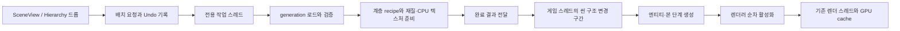

# 모델·Vertex·Mesh·Texture 구조 개선 및 비동기 로딩 계획

작성일: 2026-09-06

상태: **모델 드롭 비동기화 구현·검증 완료 / 나머지 구조 개선은 제안 단계**

기준: HEAD `6b9c2b792860b5f8bb408956990789f3a2d2b1d2` + 현재 작업 트리의 비동기 배치 변경.

> 기준 커밋과 작업 트리를 구분한다. 이번 비동기 배치 구현은 아직 커밋되지 않은 변경을 포함한다.
> 아래 구현 상태는 현재 소스로 확인했고, 실행 결과는 같은 대화에서 수행한 검증을 기록했다.
> 이 문서 작성 자체로 새 빌드·런타임 검증이나 후속 구조 개선이 완료되는 것은 아니다.

## 1. 목표와 적용 원칙

모델을 처음 불러와 씬에 배치할 때 게임 진행이 오래 멈추는 문제를 해결하고,
모델 데이터·CPU 이미지·GPU 자원·씬 인스턴스의 책임을 분명하게 나눈다.

개선은 다음 원칙을 따른다.

1. 제품 경로의 정본은 `assets::ModelAssetGeneration`으로 유지한다. legacy 모델 역변환을 다시 만들지 않는다.
2. 모델 자산은 불변 데이터로 공유하고, 엔티티·애니메이터·수정 가능한 재질은 인스턴스별 상태로 관리한다.
3. CPU 데이터의 수명과 GPU 할당의 수명을 분리한다. 업로드용 비소유 뷰에는 유효한 소유자가 반드시 동반된다.
4. 식별자 전체로 동일성을 판정한다. 해시는 조회를 빠르게 하는 수단으로 사용한다.
5. 한 번에 모든 타입을 바꾸지 않는다. 호출자와 검증 조건이 명확한 단위로 변경한다.
6. 정적 검사, 빌드, 기능 검증, 성능 측정 결과를 따로 기록한다.

관련 계획:

- [ModelAssetBigBangCutoverPlan.md](C:/Users/lance/source/CreatorEngine/docs/plans/archive/ModelAssetBigBangCutoverPlan.md): 보관된 모델 전환 계획. 모델 자산 정본·식별자·직접 소비 계약의 이력.
- [TexturePipelinePlan.md](C:/Users/lance/source/CreatorEngine/docs/plans/TexturePipelinePlan.md): 임포트 정책, cook 트랜스코딩, 런타임 artifact 소비의 소유 문서.
- [ModelImportPipelinePlan.md](C:/Users/lance/source/CreatorEngine/docs/plans/archive/ModelImportPipelinePlan.md): 보관된 모델 임포트 경계와 관련 작업의 이력.

이 문서는 위 계획의 전체 완료 상태를 판정하거나 새로운 PHASE 번호를 배정하지 않는다.

## 2. 현재 구조와 확인된 사실

### 2.1 Assimp와 legacy 모델 잔여 항목

앞선 제품 코드 전수 검사와 cutover 동결 검사에서 Assimp 제품 호출·include 및
제거 대상 모델 역브리지 진입점은 0건이었다. `Model`·`ModelLoader`의 예전 구현을
모델 로딩 경로가 다시 호출하는 상태는 아니다.

그러나 **호출 경로 제거와 타입·선언 잔여 정리는 별개**다.

| 남아 있는 항목 | 현재 위치 | 판단 및 조치 |
|---|---|---|
| 전역 `ModelNode` | `Engine/RenderEngine/Mesh.h` | 자체 선언·생성자·assert 외 소비자가 확인되지 않았다. 참조 재검사 후 제거 후보 |
| `ModelLoader`, `Model` 전방 선언 | `Engine/RenderEngine/DataSystem.h` | 구현을 되살리는 선언은 아니지만 현재 구조를 오해하게 한다. 불필요 선언 제거 |
| `Bone`, `ModelLoader` 전방 선언 | `Engine/SceneRuntime/Entity.h` | 실제 타입 소비 여부를 마지막으로 검사한 뒤 정리 |
| `Model* model = nullptr` | `Engine/SceneRuntime/Animator.cpp` | 사용되지 않는 지역 변수 제거 후보 |
| `UIMesh`, 관련 전방 선언·friend | `Mesh.h/.cpp`, `ImageComponent.h`, `SpriteSheetComponent.h` | 제품 사용이 확인되지 않은 잔여 표면. 참조·등록 검사를 거쳐 정리 |
| Assimp·ModelLoader·예전 fallback 설명 | 일부 주석·진단 문자열 | 현재 호출 경로에 맞게 갱신 |

`experiment::ModelNode`와 `assets::ModelNodeAsset`는 위의 전역 `ModelNode`와 다른 타입이다.
문자열 이름만 같다는 이유로 함께 제거하지 않는다.

전역 `Vertex`와 `Mesh`에는 절차 지오메트리 등의 소비자가 남아 있다.
이들을 legacy 모델 구현과 같은 제거 대상으로 묶으면 안 된다.

### 2.2 Vertex

두 표현이 서로 다른 소비 경로를 담당한다.

| 항목 | 전역 `Vertex` | 모델 자산 정점 |
|---|---|---|
| 표현 | 고정 C++ 구조체 | 속성 마스크와 정점 바이트 배열 |
| 크기 | 96바이트 | 기본 48바이트, 색상 포함 64, 스킨 포함 68, 색상+스킨 84; UV1 추가 시 +8 |
| 접선 | `tangent`와 `bitangent` 각각 float3 | float4 접선 |
| 본 인덱스 | float4 | uint8 4개 |
| 레이아웃 근거 | `sizeof`·`offsetof` assert | `ModelVertexLayout` 표에서 stride·offset·hash 유도 |
| 현재 용도 | sprite quad 등 절차 메시와 Terrain CPU 데이터 | 임포트된 모델의 typed 업로드 |

근거: [Mesh.h](C:/Users/lance/source/CreatorEngine/Engine/RenderEngine/Mesh.h),
[ModelVertexLayout.h](C:/Users/lance/source/CreatorEngine/Engine/RenderEngine/Assets/ModelVertexLayout.h).

**개선 방향:** 96바이트 표현의 역할과 소비자를 명시하고, 절차 지오메트리에 필요한
속성만 가지는 표현으로 점진적으로 전환한다. 모델 정점을 다시 96바이트 구조체로
복원하거나, 모든 정점을 하나의 거대 구조체로 통합하지 않는다.

### 2.3 Mesh

전역 `Mesh`는 CPU 정점·인덱스, 이름, 재질 인덱스, bounds, 실행 중 식별자를 가진다.
GPU 버퍼는 backend cache가 소유한다. 임포트 모델은 `ModelMeshAsset`과
`RHIModelMeshView`를 통해 별도 경로로 업로드된다.

확인한 문제와 한계:

- `const GetVertices()`·`const GetIndices()`는 배열을 복사한다. 비const 오버로드는 const reference를 반환하므로 현재 모든 업로드가 배열을 복사한다고 단정할 수는 없다.
- 생성자에서 bounds를 자동 계산하지 않고 `RecalculateBounds()` 호출에 의존한다. 절차 메시 생성 경로가 이를 빠뜨릴 여지가 있다.
- `Mesh::GenerateLODs()`는 축약 인덱스의 개수만 저장한다. 실제 LOD 인덱스 데이터와 렌더 소비 계약이 완성된 상태가 아니다.
- `Mesh::GenerateLODs()`의 제품 호출자는 확인되지 않았다. `MeshOptimizer`에는 별도의 selftest 소비자가 있다.
- `TerrainMesh`는 CPU 배열과 revision을 가지지만, revision 기반 GPU 갱신 경로가 완성됐다는 근거는 확인되지 않았다.

근거: [Mesh.cpp](C:/Users/lance/source/CreatorEngine/Engine/RenderEngine/Mesh.cpp),
[TerrainMesh.h](C:/Users/lance/source/CreatorEngine/Engine/RenderEngine/TerrainMesh.h).

### 2.4 Texture

`Texture`는 CPU 이미지 소유자이고, `TextureImageView`는 비소유 읽기 뷰다.
DX12·Vulkan cache가 GPU 이미지·descriptor·업로드 및 은퇴 상태를 관리한다.
Material과 밀봉된 프레임 데이터가 Texture 소유권을 유지하는 경계는 보존해야 한다.

| 항목 | 현재 상태 | 문제 또는 개선 필요 |
|---|---|---|
| `m_codecImage` | 공개 `shared_ptr<CodecImage>` | 게시 후 외부 교체를 막는 불변성 계약이 약함 |
| `m_assetId` | 공개 실행 중 식별자 | GPU 캐시 키가 외부에서 바뀔 수 있음. 영속 GUID와 역할도 구분해야 함 |
| CPU 픽셀 유지 | GPU 은퇴 후 재업로드에 사용 | 업로드 직후 일괄 해제하면 안 됨 |
| 모델 임베디드 이미지 | generation의 RGBA 픽셀을 `TextureImage`로 복사 | 디코딩 중복은 아니지만 CPU 이미지 사본은 중복됨 |
| 일반 이미지 로드 | 코덱 산출물을 opaque owner로 보유 | 모든 이미지 로드가 전량 복사하는 구조는 아님 |
| 경로 로더 | raw/shared/unique 반환 함수가 별도 구현 | 압축 포맷·옵션이 서로 다름 |
| 텍스처 이벤트·보조 API | 일부 제품 소비가 확인되지 않음 | 사용처를 확인해 제거하거나 실제 소비 계약을 명시 |

특히 `LoadSharedTexture()`는 파일 stem을 키로 쓰며, 조회는 항상 `Textures`에서 한다.
UI·SpriteSheet는 삽입 대상이 별도 map이므로 조회와 삽입 대상이 어긋난다.
서로 다른 디렉터리·확장자의 같은 이름은 충돌할 수 있고, 용도별 캐시 재사용도 일관되지 않다.

압축을 요청했을 때 raw/shared 경로는 BC1 sRGB, managed 경로는 BC1 UNORM을 사용하며,
압축 옵션도 다르다. 반환 소유권 형태가 색공간·압축 정책을 결정하는 구조를 정리해야 한다.

근거: [Texture.h](C:/Users/lance/source/CreatorEngine/Engine/RenderEngine/Texture.h),
[Texture.cpp](C:/Users/lance/source/CreatorEngine/Engine/RenderEngine/Texture.cpp),
[TextureImage.h](C:/Users/lance/source/CreatorEngine/Engine/RenderEngine/TextureImage.h),
[DataSystem.cpp](C:/Users/lance/source/CreatorEngine/Engine/RenderEngine/DataSystem.cpp).

## 3. 이번에 구현한 비동기 모델 배치

### 3.1 멈춤을 유발하던 경로

SceneView·Hierarchy의 모델 드롭은 UI 처리 중에 다음 작업을 동기로 수행했다.

1. 모델 generation 파일 읽기·검증·이미지 디코딩.
2. 재질 변환과 외부 텍스처 준비, 임베디드 이미지 owner 생성.
3. 엔티티·메시 렌더러·본·애니메이터를 한 번에 생성.
4. 인스턴스 생성 마지막에 전체 `WorkerPools->NotifyAllAndWait()` 호출.

PresentationThread가 UI를 처리하는 동안 씬 구조 mutex를 잡기 때문에,
긴 동기 로드는 게임 스레드의 씬 구조 변경·프레임 종료 진행도 지연시킬 수 있었다.

### 3.2 현재 구현 경계

| 구현 항목 | 상태와 동작 |
|---|---|
| Editor 요청 서비스 | `Editor::ModelPlacement`가 전용 worker와 요청 큐를 관리 |
| CPU 준비 | `PendingInstance::Prepare()`가 씬을 건드리지 않고 generation·계층 recipe·재질·이미지 owner를 준비 |
| 씬 반영 | `PendingInstance::Advance()`를 게임 스레드에서 호출 |
| 반영 예산 | 전체 일반 진행에 2ms 기준, 한 호출 최대 16단계, 렌더러 활성화 최대 2개 |
| 작업 선택 | 한 게임 프레임에는 한 인스턴스의 생성 작업을 진행 |
| 이미지 재조회 제거 | 이미 준비한 재질을 model binding 뒤에 붙여 씬 반영 중 이미지 cache miss 처리를 피함 |
| 애니메이션 바인딩 | 준비한 generation을 Animator에 직접 전달해 같은 요청 안에서 데이터 세대 유지 |
| 텍스처 잠금 | 임베디드 픽셀 복사·owner 생성을 mutex 밖으로 이동하고 삽입 시 기존 owner 재확인 |
| 취소·Undo/Redo | 늦은 완료 결과가 다시 배치되지 않도록 취소 상태를 전달하고, redo는 새 요청으로 처리 |
| 씬 수명 | worker가 `Scene*`·`Entity*`를 보유하지 않음. scene ID와 generation을 포함한 EntityHandle로 적용 대상 확인 |
| 씬·재생 전환 | 대상 씬 또는 모드가 달라진 진행 중 요청을 폐기 |
| 저장 보호 | 생성 도중 Scene 직렬화를 거부하고, 직렬화 성공 뒤에 저장 파일을 열어 기존 파일 보존 |
| 종료 | presentation 종료 후 worker를 회수하고, DataSystem·씬 해체 전에 요청 정리 |

씬 드롭 중에는 배치 위치 표시를 제공하고, 실제 드롭 시 로드를 요청한다.
기존의 동기 모델 전체 프리뷰 생성 방식은 사용하지 않는다.

코드:

- [EditorModelPlacement.cpp](C:/Users/lance/source/CreatorEngine/Editor/EngineEntry/EditorModelPlacement.cpp)
- [ModelSceneInstantiation.h](C:/Users/lance/source/CreatorEngine/Engine/SceneRuntime/ModelSceneInstantiation.h)
- [ModelSceneInstantiation.cpp](C:/Users/lance/source/CreatorEngine/Engine/SceneRuntime/ModelSceneInstantiation.cpp)
- [EditorMain.cpp](C:/Users/lance/source/CreatorEngine/Editor/EngineEntry/EditorMain.cpp)

### 3.3 검증 결과와 해석 범위

환경: Windows, VS18/v145, x64 Debug. 2026-09-06에 수행한 한 번의 회귀 실행에서 다음 값을 확인했다.

| 시나리오 | worker 준비 시간 | 준비 중 진행한 게임 프레임 | 씬 반영 프레임 수 | `Advance()` 최대 시간 |
|---|---:|---:|---:|---:|
| Gunner 첫 로드 | 389.355ms | 91 | 5 | 2.028ms |
| 실행 취소 후 재실행 | 4.516ms | 1 | 6 | 2.552ms |

- 엔티티 66개에 대한 계층 검사: 부모·자식 쌍 불일치, 고아, 순회 미도달, Store 불일치 모두 0.
- typed renderer 2개, 임베디드 텍스처 연결 6개, 누락 0. 최초 배치와 redo 후 모두 통과.
- 취소 후 슬롯 재사용, 진행 중 저장 거부와 기존 파일 보존, 씬/재생 전환 후 잔여 모델 없음 검사 통과.
- 마지막 상태는 완료 2건, 의도한 없는 파일 실패 1건, 취소 3건, pending 0건.
- Debug 빌드와 `verify-mbc-cutover-freeze.ps1`, `verify-model-async-placement.ps1`, `verify-model-typed-consumers.ps1` 통과.
- 문서 최종 검사에서 기록된 빌드 입력 17개 중 16개의 해시가 일치했다. `ConsoleCommandSystem.cpp`에는 검증 이후 변경이 있어 현재 작업 트리 전체의 재빌드·재실행 결과로 보지는 않는다.

이 수치는 **단일 실행의 CPU 준비·씬 반영 관측값**이다. 평균·p95·p99나 전체 프레임 지연,
GPU 첫 업로드, PSO 최초 생성 시간을 검증한 결과로 확대 해석하지 않는다.
`maxApplyUs`는 `Advance()` 호출 구간이며 요청 큐 정리, 취소 회수, 프레임 전체 시간을 포함하지 않는다.

회귀 코드: [verify-model-async-placement.ps1](C:/Users/lance/source/CreatorEngine/Tools/regression/verify-model-async-placement.ps1).

로컬 실행 로그: [stdout.txt](C:/Users/lance/AppData/Local/Temp/creator-model-async-0983a2641eeb449290408166f6df5624/stdout.txt).
임시 로그가 정리되면 회귀 스크립트로 다시 생성한다.

### 3.4 아직 해결한 것으로 보지 않는 범위

1. **2ms는 협조적 예산이다.** 단계 사이에서 시간을 확인하므로 단일 엔티티 생성·콜라이더 처리 등이 오래 걸리면 초과할 수 있다. 취소 정리도 같은 2ms 상한이 적용되는 구조는 아니다.
2. **렌더러 활성화 제한은 게임 프레임 기준이다.** 렌더 스레드가 프레임을 병합하면 한 렌더 프레임에 새 자원이 모일 수 있다. GPU 업로드 예산과 완료 판정을 별도로 설계해야 한다.
3. **취소는 이미 시작한 디코드/I/O를 즉시 중단하지 않는다.** 결과의 씬 적용을 막고 queued 작업을 건너뛴다. 종료 시 실행 중 worker 회수를 기다린다.
4. **전체 모델 로드 API를 비동기로 바꾼 것은 아니다.** OS 파일 드롭의 source import, Terrain/Foliage 일부 경로, MeshRenderer 역직렬화, Animator의 일반 `EnsureAnimationBinding()`, `model.loadcached`·`model.place` 등에는 동기 경로가 남아 있다.
5. **CPU 이미지 이중 보관은 남아 있다.** 복사를 worker와 잠금 밖으로 옮겼지만 generation 픽셀과 Texture용 이미지의 사본을 통합하지 않았다.
6. **배치 완료와 GPU 사용 가능 상태는 별개다.** 현재 완료 표시는 CPU 준비와 씬 구성이 끝났음을 뜻한다.

## 4. 남은 구조 개선 항목

우선순위의 의미: P1은 정확성·수명·사용자 응답성에 직접 관계되는 작업,
P2는 경계 정리·유지보수·추가 성능 개선이다. 아래 항목은 별도 표기가 없으면 미착수다.

### G1. 불필요 타입과 불완전 Mesh API 정리 — P2

**문제:** 제거된 모델 로더의 선언, 전역 ModelNode, 사용되지 않는 UIMesh,
복사를 유발하는 const getter와 완성되지 않은 LOD 표면이 남아 있다.

**변경안:**

- 선언·정의·등록·직렬화·프로젝트 항목의 참조를 대조해 실제 비사용 항목만 제거한다.
- CPU 배열 읽기는 const reference 또는 `span<const T>`로 통일하고 복사가 필요하면 별도 복사 API로 표현한다.
- 절차 메시 생성 완료 시 bounds를 산출하는 factory/Finalize 계약을 만든다. mutable mesh는 갱신 시 bounds/revision 처리도 함께 수행한다.
- LOD가 필요하면 실제 인덱스 데이터, level별 bounds, GPU binding과 선택 기준을 정의한다. 필요하지 않다면 미완성 제품 API를 제거한다.
- Terrain revision 소비와 TerrainLayer 텍스처의 소유/차용 관계는 별도 호출 경로를 확인해 정리한다. 현재 비사용인 경로를 활성 결함으로 단정하지 않는다.

**완료 조건:** 제거 항목 참조 0, 절차 메시 bounds 검증, 배열 읽기에서 암묵 복사 제거,
LOD 유지 여부에 따른 실제 소비·검증 또는 API 제거, 모델과 절차 메시의 렌더 회귀 통과.

### G2. 텍스처 식별자·조회 정책 통합 — P1

**문제:** stem 키 충돌과 용도별 map 조회/삽입 불일치가 있다. 같은 원본을 다른
색공간·압축 정책으로 로드해도 이름만으로 같은 결과를 돌려줄 수 있다.

**변경안:**

- 영속 자산 ID 또는 정규화된 경로를 식별 입력으로 사용한다.
- 이미지 결과가 달라지는 decode/cook 정책과 데이터 generation을 키에 포함한다.
- 용도별 map을 유지하면 조회와 삽입을 동일한 저장소로 라우팅한다. 저장소를 합칠 때는 용도와 이미지 정책을 혼동하지 않는다.
- raw/shared/unique 반환 함수는 공통 로드 구현을 사용하고, 소유권 선택과 포맷 정책을 분리한다.
- 게시 후 이름·ID·픽셀을 외부에서 바꿀 수 없도록 접근 범위를 줄인다.

**완료 조건:** 같은 stem의 서로 다른 파일, 같은 파일의 sRGB/linear 변형,
UI·SpriteSheet 재요청, 동시 중복 요청에서 잘못된 캐시 재사용이 없고 색상 회귀를 통과한다.
정책 어휘는 TexturePipelinePlan의 T0와 공유한다.

### G3. 불변 CPU 이미지 저장소와 요청 중복 제어 — P1

**문제:** 임베디드 텍스처가 generation 픽셀과 Texture 이미지로 중복 저장된다.
잠금 밖 생성은 반영했지만, 동일 키의 동시 miss를 하나의 작업으로 합치는 구조는 아니다.

**변경안:**

- generation과 Texture가 검증된 불변 이미지 저장소를 함께 보유하고, 각 소비자는 읽기 뷰를 얻도록 한다.
- subresource의 offset·pitch·크기와 저장소 수명을 함께 검증한다. 소유권 없는 포인터만 프레임 밖으로 전달하지 않는다.
- 같은 자산·정책·generation의 준비 중 요청을 공유한다. 각 씬 배치 요청의 취소와 자산 작업 전체의 취소는 분리한다.
- 생성·디코드는 잠금 밖, 조회·게시만 잠금 안에서 수행한다. 게시 시 기존 결과와 generation 유효성을 다시 확인한다.
- GPU 은퇴 후 재업로드에 필요한 CPU 저장소는 유지한다. CPU 해제는 재로드 수단·비용과 함께 별도 상주 정책으로 정한다.

**완료 조건:** 대형 이미지의 CPU 사본 수·peak memory가 줄어들고, 동시 요청·취소·
reimport·GPU cache 은퇴 후 재업로드에서 owner 수명과 세대 일관성이 유지된다.
씬 인스턴스의 수정 가능한 Material을 요청 간 무조건 공유하지 않는다.

### G4. RHI 자산 의존 축소와 검증된 업로드 뷰 — P1

**문제:** 공통 `IRenderDeviceServices.h`가 전체 `ModelAssetGeneration.h`를 포함하고,
그 안의 `BuildRHIModelMeshView()`가 generation descriptor 목록을 매번 검색한다.
`RHIModelMeshView::IsComplete()`도 stride와 속성 마스크가 유도하는 크기의 정확한 일치를 검사하지 않는다.

정상 모델 로더에는 별도 검증이 있으므로, 이것만으로 현재 제품 자산이 손상된다고 단정하지 않는다.
다만 새로운 producer와 테스트 입력에 대해서도 경계 자체가 계약을 지켜야 한다.

**변경안:**

- generation → 렌더 업로드 뷰 변환을 자산과 렌더의 접합부로 이동한다.
- RHI 공통 인터페이스에는 필요한 식별자와 업로드 descriptor만 노출한다.
- 메시별 descriptor를 게시 시 연결하거나 사전 인덱싱해 매 프레임 전체 목록 검색을 줄인다.
- factory에서 stride/mask/hash, 바이트 범위, 인덱스 범위, 포맷·정렬을 검증한다.
- `TextureImage::Allocate()`에도 크기 곱셈·누적 overflow, mip 수와 shift 범위, pitch·slice 범위 검증을 추가한다.
- `RHIMeshBinding` 등 하위 결과의 유효성은 필요한 버퍼와 범위까지 포함해 표현한다.

**완료 조건:** 정상 입력의 결과 동일, 잘못된 descriptor의 명시적 거부,
헤더 단독 빌드 및 DX12·Vulkan 업로드 회귀 통과. descriptor 검색 비용은 변경 전후 실측한다.

근거: [IRenderDeviceServices.h](C:/Users/lance/source/CreatorEngine/Engine/RenderEngine/RHI/IRenderDeviceServices.h).

### G5. 지오메트리 종류와 전체 식별자 보존 — P1

**문제:** backend 모델 cache는 전체 `ModelMeshHandle`을 사용하지만,
draw/pass의 geometry map은 `size_t` 해시를 키로 사용한다. 모델과 절차 메시도 같은 숫자 공간을 쓴다.
현재 충돌이 재현된 것은 아니지만, 해시 충돌이 자산 동일성으로 취급될 수 있는 계약이다.

**변경안:** 모델/절차 지오메트리를 구분하는 값 타입과 전체 식별자를 전달한다.
모델은 `{ModelId, MeshId, generation}`, 절차 메시는 별도 실행 중 ID와 필요한 revision으로
동일성을 판정한다. 해시 컨테이너를 사용하더라도 equality는 전체 키를 비교한다.

**완료 조건:** 의도적으로 동일 해시를 만드는 테스트에서 다른 자산이 분리되고,
generation 교체·절차 메시 갱신·pass batch/정렬에서 잘못된 geometry 공유가 없다.

근거: [EnhancedDrawIdentity.h](C:/Users/lance/source/CreatorEngine/Engine/RenderEngine/Render/Graph/EnhancedDrawIdentity.h).

### G6. GPU 준비·부재·실패 상태 분리 — P1

**문제:** 텍스처가 없는 경우와 업로드에 실패한 경우가 fallback entry·에러 문자열로
표현되는 경로가 있다. 유효한 fallback handle만 보면 자원 준비 성공으로 해석하기 쉽다.

**변경안:** `Ready`, `Pending`, `Absent`, `Failed`와 같은 결과 상태를 명시한다.
슬롯 부재의 기본 텍스처, 예산 부족에 따른 다음 프레임 재시도, 실제 포맷/업로드 실패를 구분한다.
시각적 fallback은 상태를 확인한 상위 정책에서 선택한다. 실패가 정상 cache hit로 굳어지지 않게 한다.

**완료 조건:** 이미지 없음·예산 부족·decode 실패·GPU 할당 실패·완료 fence 미도달을
구분하고, 다음 프레임 재시도와 오류 진단이 DX12·Vulkan에서 일관되게 동작한다.

### G7. 공통 프레임 자원 준비 추출 — P2

**문제:** Forward·GBuffer·Shadow에 geometry 확보와 일부 자원 준비 흐름이 반복된다.
backend cache가 중복 업로드를 막더라도 조회·검증·상태 처리의 중복은 남는다.

**변경안:** 프레임에서 필요한 geometry·texture owner·업로드 결과를 한 번 준비하고
pass가 같은 검증된 결과를 사용하도록 한다. pass별 입력 속성, PSO, 셰이더,
resource declaration과 전이 요구는 각 pass에 유지한다.

Material의 Apply → Seal 순서, 후보 PSO 준비 후 교체, 실패 시 마지막 유효 상태 유지,
프레임 소유권과 GPU 완료 기반 은퇴 규약을 보존한다.

**완료 조건:** 업로드·descriptor 조회 횟수와 CPU 시간을 측정하고,
Forward/GBuffer/Shadow의 이미지·material·skinning 결과 및 실패 시 동작이 유지된다.
측정 없이 공통화 자체를 성능 개선 완료로 표시하지 않는다.

### G8. 비동기 배치 후속 안정화와 적용 범위 확대 — P1

**부분 반영:** §3의 SceneView·Hierarchy 경로는 구현·검증됐다.

후속 변경안:

- 준비 중인 자산 요청과 개별 씬 배치 요청을 분리해 중복 로드를 합치고 개별 취소를 유지한다.
- 긴 단일 작업, 취소 회수, queue 처리와 씬 mutex 점유 시간도 측정하고 필요하면 단계별로 나눈다.
- 게임 프레임 활성화 제한과 별도로 실제 렌더 프레임의 업로드 바이트·작업 수·staging memory 예산을 정한다.
- 씬 생성 완료와 GPU 사용 가능 완료를 구분해 UI와 진단에 전달한다.
- OS source import, Terrain/Foliage, 씬 역직렬화·Player 동적 로딩은 각각 호출자와 수명 규약을 확인한 뒤 비동기화한다.
- 생성 중 편집·복제·프리팹 저장 등의 정책을 정리한다. 현재 Scene 저장 거부 규칙이 모든 저작 경로에 적용됐다고 가정하지 않는다.
- reimport와 완료가 교차할 때 요청이 고정한 generation을 유지할지, 새 요청으로 교체할지 명시한다. 한 인스턴스 안에서 세대를 혼합하지 않는다.

**완료 조건:** 대표 소형/대형/스킨 모델의 cold/warm 로드, 반복 취소, 연속 드롭,
씬·재생 전환, 종료 중 작업 회수, GPU 예산 초과를 검증한다. 전체 프레임·씬 잠금·
worker·GPU 준비 시간의 p95/p99와 peak memory를 별도로 보고한다.

### G9. 디코드·압축을 cook 단계로 이동 — P2, 기존 계획 연계

비동기화는 로딩 비용이 게임 스레드를 오래 점유하지 않도록 만든다.
런타임의 디코드·압축 비용 자체를 없애는 작업은 TexturePipelinePlan의 책임이다.

1. **T0:** 자산별 색공간·압축·mip 정책을 정하고 G2의 캐시 키와 연결.
2. **T1a:** GPU 업로드에 적합한 포맷과 subresource를 cook artifact에 저장.
3. **T2:** DataSystem이 artifact를 소비하도록 바꾸고 런타임 원본 디코드 의존을 축소.

기존 계획의 T1b와 codec 경계도 함께 따른다. 별도의 경쟁 텍스처 파이프라인을 신설하지 않는다.
일반 이미지와 모델 임베디드 이미지 모두 정책·artifact·runtime 소비가 연결됐을 때 완료로 판정한다.

## 5. 권장 실행 순서

| 단계 | 범위 | 상태 | 통과 조건 |
|---|---|---|---|
| A0 | SceneView·Hierarchy 비동기 배치 | 구현·검증 완료 | §3의 빌드·실행 결과 |
| A1 | G1 잔여 정리, G2 캐시 정확성, G4 입력 검증 | 제안 | 참조 0, 이름/정책 충돌 검사, 잘못된 입력 거부, 기존 기능 유지 |
| A2 | G3 이미지 저장소·중복 요청 | 제안 | owner 수명, 세대 교체, 동시 요청, 재업로드, 메모리 측정 |
| A3 | G4 RHI 접합부 분리, G5 전체 geometry key | 제안 | header 경계, 강제 충돌, 양 backend 모델·절차 메시 렌더 |
| A4 | G6 상태 구분, G7 공통 자원 준비, G8 GPU 준비 예산 | 제안 | 실제 렌더 프레임 예산과 준비/실패/재시도 관측 |
| A5 | G8 나머지 로드 경로 확대, G9 T0/T1a/T2 연계 | 제안 | Editor·Player 각각의 제품 호출자 연결 및 cold-load 회귀 |

단계는 검증 가능한 변경 단위다. A1 안에서도 잔여 선언 제거, 캐시 키 변경,
입력 검증 강화를 각각 별도 빌드 가능한 변경으로 나눈다.
T0 정책 결정은 G2와 함께 먼저 진행할 수 있으며, cook 구현 전체를 기다릴 필요는 없다.

## 6. 검증 및 완료 기록 규칙

| 검증 층 | 확인할 내용 | 현재 근거 |
|---|---|---|
| 정적 | legacy 제품 호출 0, 경계·소유자·실제 호출자 | cutover 동결 검사 통과; 잔여 선언은 §2.1에 별도 기록 |
| 빌드 | v145 x64 Debug, 헤더 단독 빌드 포함 해당 프로젝트 | 앞선 구현 빌드 통과 |
| 기능 | 배치, 취소, undo/redo, 저장 보호, scene/play 전환 | 비동기 배치 회귀 통과 |
| 데이터·애니메이션 | typed handle, 임베디드 owner, 본·마스크·클립·Foliage 소비 | 모델 소비 및 typed consumers 검사 통과 |
| CPU 성능 | worker 준비 시간, 준비 중 게임 진행, 단계별 씬 반영 시간 | Gunner 1회 실행 결과만 확보 |
| 전체 프레임·GPU | 최초 표시, 업로드·PSO 지연, 실제 렌더 예산, backend별 결과 | 이 비동기 변경에 대한 별도 계측·완료 판정 필요 |

후속 변경마다 다음 내용을 남긴다.

1. 변경한 제품 호출자와 그대로 남은 동기 경로.
2. 데이터·씬·프레임·GPU 자원의 소유자와 해제 시점.
3. 성공·부재·대기·실패·취소·세대 교체의 처리 결과.
4. 실행한 검사와 환경, 측정 구간, 반복 횟수, 실행하지 않은 검증.
5. 해당 단계 완료 여부와 다음 단계로 넘긴 범위.

현재 완료 선언은 **Editor의 모델 드롭 경로 비동기화와 해당 회귀 검증**에 한정한다.
Vertex·Mesh·Texture 전반의 구조 개선과 전체 자산 스트리밍 완료는 G1~G9의 후속 조건으로 관리한다.
