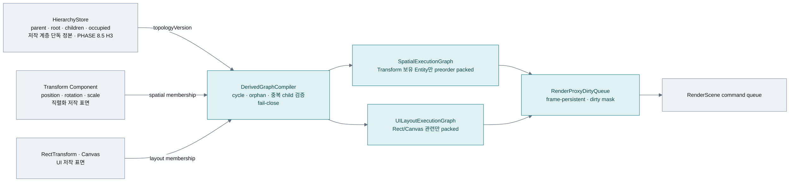
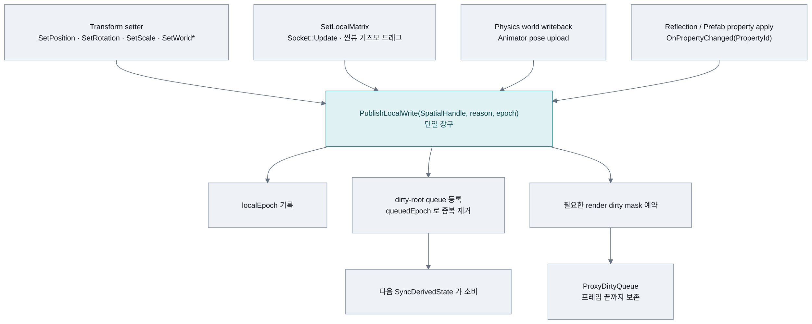
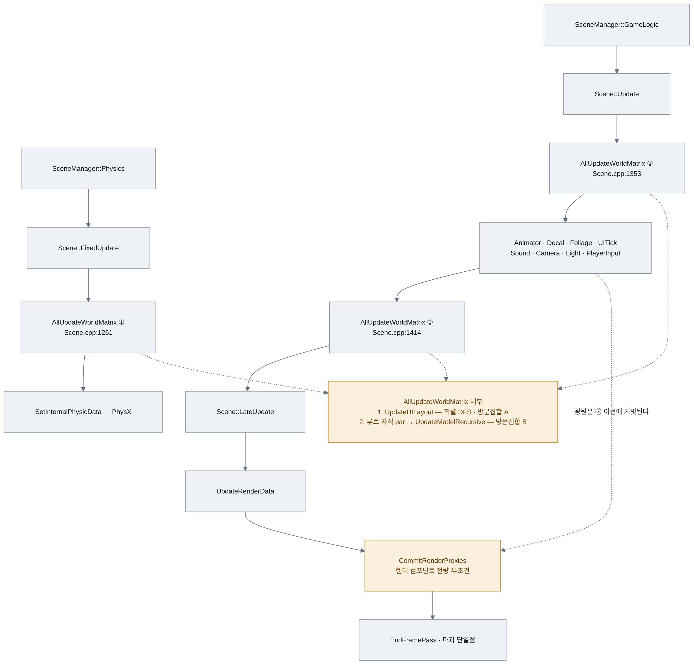
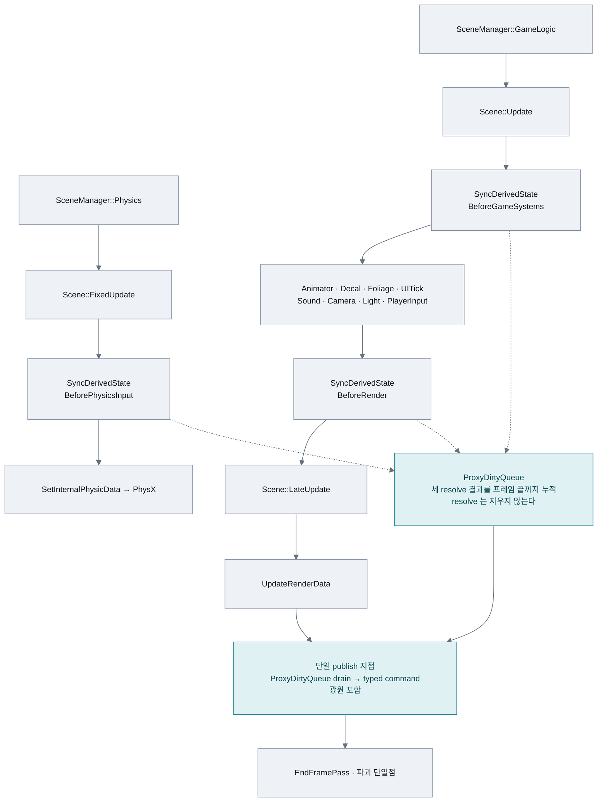
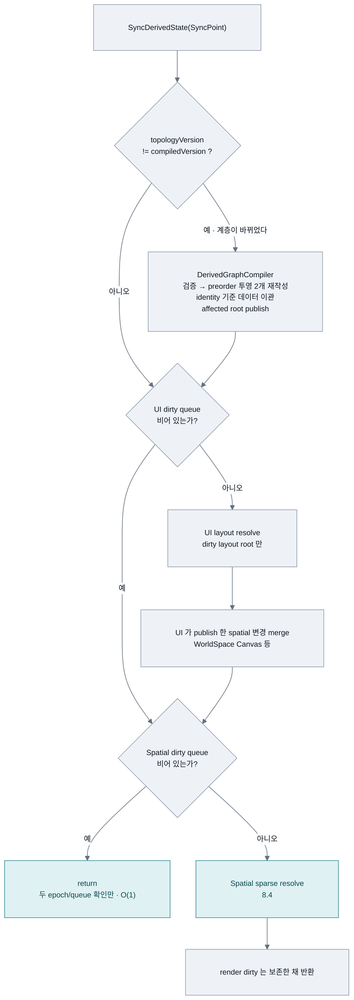
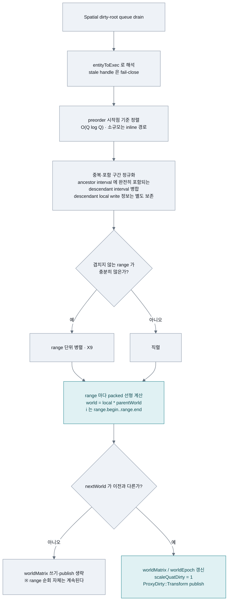
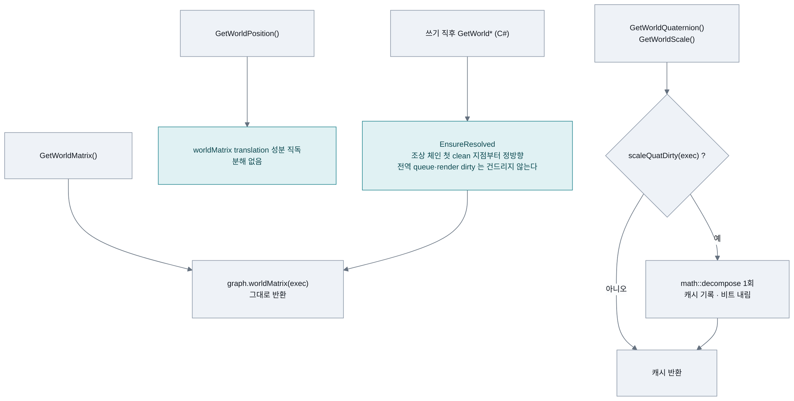
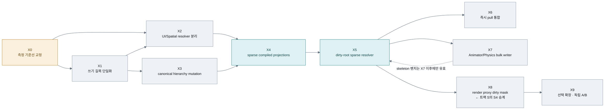

# Transform 갱신 구조·성능 재설계 (PHASE 8.75)

신설: 2026-08-25.
**개정: 2026-08-25 — `TransformExecutionGraphPlan.md`(Sparse Compiled Transform
Execution Graph 제안)를 이 문서로 통합했다.** 1차 실행 계획 T0~T5는 폐기하고
X0~X9로 대체한다. 폐기 근거와 T→X 매핑은 **부록 A**에 남긴다(이 저장소는 틀린
판단을 지우지 않고 정정 이력으로 남긴다).

선행: `SceneGraphRedesignPlan.md` 트랙 S(S1·S1-b+S3·S2)·트랙 H(H0~H3) 완결 — 이 계획은
그 위에서만 성립한다. **트랙 S의 조건부 잔여 S4(프록시 커밋 dirty 게이트)를 X8이
승계한다**(§17).
관련: `AnimationSchedulerPlan.md`(X7) · `PhysicsRedesignPlan.md`(X7) ·
`UISystemRedesignPlan.md`(X2의 UI resolver) · `EditorWorkspaceRedesignPlan.md` PHASE 21.

상태: **X0~X8 완료, X9 선택 확장 중단.** X7의 Windows 제품 바이너리 TSan은 target
비지원으로 미확인이지만 WSL canary와 barrier 모델은 검증했다. X8은 Release 런타임·
변이 게이트까지 완료했다. 이 문서의 옛 성능
수치는 `SceneGraphRedesignPlan` 트랙 S 기록의 재해석이고, X0의 새 계측은 각 단계
검증 결과에 따로 기록한다. §3은 옛 기록을 어떻게 잘못 읽었는지부터 정정한다.

---

## 0. 판정 요약

**S2가 dirty 게이트로 행렬 계산을 걷어낸 뒤에도 남은 비용이 지배적이고, 그 남은 것은
수학이 아니라 순회 자체다.** 다만 그 "순회"는 한 종류가 아니라 **둘**이다(§3.1).

기록된 실측(Release x64 · 4회 중앙값 · `SceneGraphRedesignPlan.md` §트랙 S S2):

| 규모 | 시나리오 | `AllUpdateWorldMatrix` 1회 | 프레임당(×3) |
|---|---|---:|---:|
| 1,000 | 전부 정지 | 255.8µs | **0.77ms** |
| 10,000 | 전부 정지 | 4,058.8µs | **12.2ms** |
| 10,000 | 10% 이동 | 5,292.2µs | 15.9ms |

"전부 정지"는 `mustRecompute`가 전부 거짓이라 `GetLocalMatrix`·행렬곱·`decompose`를
**한 번도 하지 않는** 경로다. 그런데도 이만큼 든다.

⚠ **이 표의 값을 노드 수로 나누지 말 것.** 이 시간에는 UI 레이아웃 DFS와 Spatial DFS가
**둘 다** 들어 있다(§3.1). 노드당 단가는 X0이 두 도메인을 분리 측정하기 전까지 알 수 없다.

### 권장 구조

전역 dirty 게이트 + 전 동적 노드 스윕이 **아니라** 다음이다.

1. `HierarchyStore`는 저작 계층의 단독 정본으로 유지한다.
2. 그 정본에서 프레임 실행용 투영 둘을 별도로 컴파일한다.
   - `SpatialExecutionGraph`: `Transform`을 가진 Entity만 포함한다.
   - `UILayoutExecutionGraph`: `RectTransformComponent`/`Canvas` 관련 Entity만 포함한다.
3. Entity의 안정 슬롯/세대와 실행 배열 위치를 분리한다.
4. 변경된 노드를 dirty-root queue에 한 번만 publish한다.
5. preorder의 연속 서브트리 구간을 이용해 **영향받는 노드만** 갱신한다.
6. 월드 변경 결과는 프레임 끝까지 render dirty queue에 누적하고, 렌더 커밋이
   `Transform | Material | Visibility | LOD` dirty mask를 소비한다.

| 상황 | 폐기된 T1+T2 목표 | 이 계획(X축) |
|---|---:|---:|
| Transform/UI 모두 정지 | Transform O(1), **UI는 O(N) 또는 누락** | 두 도메인 각각 O(1) |
| leaf 1개 이동 | O(N<sub>dynamic</sub>) | O(1) 또는 작은 상수 |
| 무작위 1% 이동 | O(N<sub>dynamic</sub>) | O(Q log Q + A) |
| 부모 1개 + 큰 서브트리 이동 | O(N<sub>dynamic</sub>) | O(영향 서브트리) |
| 전부 이동 | O(N) | O(N), 단 packed 연속 접근 |
| 렌더 커밋 | 전 컴포넌트 또는 후속 설계 필요 | O(변경 proxy) |

`Q`는 중복 제거 전 dirty root 수, `A`는 실제로 월드가 영향받은 spatial node 수다.
**정확한 시간 수치는 아직 측정하지 않았으므로 이 문서에서 보장하지 않는다.**

---

## 1. 현재 구조

```
Transform : Component            TRS 4필드 = 물리 멤버(리플렉션·직렬화 대상)
    │  ResolveStore(): owner → Scene → GetEntityRaw 점유자 확인 → 스토어
    ▼
TransformStore (Scene 소유 SoA)  localMatrix · worldMatrix · dirty · worldChanged
    ▲                            · worldScale · worldQuaternion · worldPosition
    │  슬롯 = Entity::m_index (Scene::AllocateSlot/ReleaseSlot과 1:1)

Scene::AllUpdateWorldMatrix()                              ← Scene.cpp:2573
    ├ UpdateUILayout()                     직렬 · 씬 루트 자식 전체 DFS · 자체 방문집합
    └ std::for_each(std::execution::par, 루트 자식들)
        └ UpdateModelRecursive(index, matrix4x4 model /*값*/, parentChanged, visited*, depth)
```

관련 소스: `Engine/SceneRuntime/Transform.h` · `Transform.cpp` · `TransformStore.h` ·
`HierarchyStore.h` · `Scene.cpp:2173`(Spatial 순회) · `Scene.cpp:2429`(UI 순회) ·
`Scene.cpp:2573`(진입점) · `Scene.cpp:745`(프록시 커밋).

호출 지점 셋: `Scene.cpp:1261`(FixedUpdate 선두) · `1353`(Update 선두) · `1414`(Update 말미).

---

## 2. 비용 해부

### 2.1 한 번의 `AllUpdateWorldMatrix`가 하는 일

| 단계 | 소스 | 성격 |
|---|---|---|
| `UpdateUILayout()` | `Scene.cpp:2429` | **직렬**. 씬 루트의 자식 **전체**를 DFS. `RectTransform`이 없어도 자식 재귀는 계속된다. 자체 `unordered_set<Entity*> visited` |
| 루트 자식 병렬 dispatch | `Scene.cpp:2590` | `std::execution::par` — 분기 수 = 씬 루트의 직계 자식 수 |
| `UpdateModelRecursive` | `Scene.cpp:2173` | 재귀 DFS. 별도 `unordered_set<Entity::Index> visited` |

즉 **방문집합이 두 벌, 순회가 두 벌**이다. 합성 벤치가 만든 `GameObjectType::Empty`
Entity도 UI DFS에서 빠짐없이 방문된다.

### 2.2 Spatial 순회의 노드당 고정비 (X0가 분리 측정할 대상)

`UpdateModelRecursive`의 **스킵 경로**(아무것도 안 움직인 노드)가 노드마다 하는 일:

| # | 항목 | 소스 | 성격 |
|---|---|---|---|
| 1 | `visited.insert(objIndex)` | `Scene.cpp:2201` | `unordered_set` — **노드당 힙 할당 1회** |
| 2 | `math::matrix4x4 model` 값 전달 | `Scene.cpp:2173` 시그니처 | 재귀 호출마다 **64바이트 스택 복사** |
| 3 | `m_Entities[objIndex]` → `unique_ptr` 역참조 | `Scene.h:70` | 노드마다 독립 힙 블록으로 점프 |
| 4 | `GetChildrenIndices()` = `vector<vector<Index>>` | `HierarchyStore.h:111` | 자식 목록마다 또 독립 힙 블록 + `.at()` 경계 검사 |
| 5 | `HasTransform()` + `GetComponent<BoneComponent>()` | `Scene.cpp:2217`·`2229` | 타입 마스크 비트 검사 + 선형 탐색 |
| 6 | 스토어 읽기 3종(`worldChanged`·`dirty`·`worldMatrix`) | `Scene.cpp:2306`~`2329` | SoA가 **배열 3개**라 최소 3개 캐시라인 |
| 7 | 재귀 호출 자체 | — | 프레임·분기 예측 |

②는 계획서 어디에도 적혀 있지 않던 항목이다 — 부모 월드를 값으로 물려주는 것이
최적화처럼 보이지만, 깊이 D의 서브트리에서 64바이트 복사를 D회 한다.

### 2.3 이동 노드의 decompose

`SetAndDecomposeMatrix`(`Transform.cpp:411`)가 값을 쓸 때마다 `math::decompose`를
부른다. 그 구현(`ThirdParty/Mathematics/include/mathematics/transform.hpp:179`)은
`length()` 3회 + 3×3 행렬식 + 쿼터니언 추출 = **sqrt 4회 이상 + 나눗셈**.

- `worldPosition` — **행렬 4행에서 공짜로 나온다.** 분해가 원리적으로 불필요하다.
- `worldQuaternion` · `worldScale` — 실소비가 소수(광원 프록시·카메라·기즈모 등).

즉 이동 노드마다 무조건 내는 sqrt 대부분이 아무도 안 읽는 값을 위한 것이다.

### 2.4 렌더 프록시 전량 무조건 갱신 — X8 이전 기준선

X8 이전에는 `Scene::CommitRenderProxies`가 메시·터레인·폴리지·데칼·스프라이트·
이미지·텍스트를, `LightSystem::Update`가 광원을 **매 프레임 전부** 프록시 커맨드로
밀었다. 움직였는지 묻지 않아 커맨드마다 64바이트 월드 행렬 복사가 실렸다. 이것이
트랙 S의 S4가 겨냥했다가 보류한 자리이며, 현재는 X8의 dirty ticket 최종 커밋으로
대체됐다(§9, §17).

### 2.5 순회 밖 갱신 경로 셋 — 설계 제약

`worldChanged` 플래그가 `dirty`와 **따로** 존재하는 이유이며, 어떤 재설계도 이 셋을
같은 publish 계약에 태우지 않으면 서브트리가 영영 갱신을 놓친다:

| 경로 | 소스 | 하는 일 |
|---|---|---|
| C# 스크립트 즉시 읽기 | `ClrHost.cpp:379` → `Scene::EnsureResolved` | packed parent chain만 앞당겨 갱신, global queue 보존 |
| 물리 writeback | `PhysicsManager` | 시뮬레이션 결과를 직접 반영 |
| 소켓 부착 | `Socket::Update`(매 프레임) | `SetLocalMatrix` 직접 호출 |

`TransformStore.h:37`~`50`의 주석이 이 제약의 원문이다.

### 2.6 Transform 없는 Entity도 스토어 슬롯을 갖는다

`Scene::AllocateSlot()`(`Scene.cpp:140`)이 Transform 보유 여부와 무관하게 모든 Entity
슬롯마다 `TransformStore::GrowOne()`을 호출한다. 현 필드만 합쳐도 Entity당 최소
**약 178바이트**다(matrix 64×2 + vector4 16×3 + uint8 2, vector capacity 제외).

메모리보다 중요한 것은 hot path에 남는 것들이다 — `HasTransform()` 분기,
transform-less Entity 방문, 빈 슬롯 cache traffic, Entity component lookup.

---

## 3. 측정·구조 전제 교정

이 절은 이 계획의 1차 안(부록 A, T0~T5)이 **무엇을 잘못 읽었는지**를 적는다.
소스 확인으로 판정한 것과 아직 미측정인 것을 구분한다.

### 3.1 4,058.8µs는 두 도메인의 합이다 ✅ 소스 확인

벤치(`ConsoleCommandSystem.cpp:1332`~`1356`)는 `Scene::AllUpdateWorldMatrix()` **전체**를
잰다. 그 함수는 `Scene.cpp:2577`에서 `UpdateUILayout()`을 **먼저** 부른다.

따라서 기록된 10,000 정지 씬의 4,058.8µs에는 적어도 다음이 섞여 있다:
UI DFS와 그 방문집합 · Spatial DFS와 그 방문집합 · 루트 병렬 dispatch · Entity/컴포넌트
판정과 간접 참조.

★ 1차 안이 이 값을 통째로 `UpdateModelRecursive`에 귀속시키고 "노드당 406ns"를
계산했다. **그 단가는 두 도메인의 합을 한 도메인으로 나눈 값이라 무효다.**
`UpdateModelRecursive`의 ①~⑦만 분해해서는 기준선을 올바르게 귀속할 수 없다 —
**UI와 Spatial 외곽 구간 분리가 먼저다(X0).**

### 3.2 Transform dirty로 `AllUpdateWorldMatrix` 전체를 반환하면 안 된다 ✅ 소스 확인

`AllUpdateWorldMatrix()`는 이름과 달리 두 도메인을 함께 구동한다.
`TransformStore::dirtyCount == 0`만 보고 함수 입구에서 반환하면
`RectTransformComponent`만 바뀐 프레임, 화면 크기 변경, Canvas scale 변경을 **놓친다.**

반대로 `UpdateUILayout()` 뒤에서 Transform 게이트를 검사하면 정합성은 보존되지만
정지 프레임에도 UI DFS O(N)이 남는다. 이 충돌은 게이트 위치 조정이 아니라
**두 resolver의 분리**로 해결한다(X2).

### 3.3 순서 배열은 데이터 배열을 연속으로 만들지 않는다

현재 `TransformStore`는 `Scene::m_Entities` 슬롯과 평행하다. 별도 `m_traversalOrder`에
Entity 슬롯 인덱스를 넣는 것만으로는 그 배열들이 위상 순서로 재배치되지 않는다.
생성·삭제·free-list 재사용·reparent가 누적되면 `for (Entity::Index i : order)`는
논리적으로 선형이어도 실제 데이터 접근은 **gather**다.

즉 순서 배열이 주는 것은 재귀·방문집합·`vector<vector>` 제거이지 **연속 접근이 아니다.**
자산에 기록되는 Entity 인덱스를 건드리지 않으면서 진짜 packed 접근을 얻으려면
**안정 identity와 실행 위치를 분리**해야 한다(X4).

### 3.4 전역 dirty 하나는 sparse movement를 O(N)에서 구하지 못한다

전역 게이트는 **변경 없음**만 빠르게 판정한다. 하나라도 움직이면 `dynamicBegin..end`
전체를 훑으므로 다음은 여전히 O(N<sub>dynamic</sub>)이다:

- leaf 하나만 움직이는 장면
- 10,000개 중 100개가 서로 다른 가지에서 움직이는 장면
- 카메라·광원·플레이어만 움직이고 배경은 정적인 장면
- 특정 skeleton 하나만 애니메이션되는 다중 캐릭터 장면

공격적인 목표는 **변경 있음**도 영향 범위만 처리하는 것이다(X5).

### 3.5 `parent before child`는 cycle 검증의 결과이지 원인이 아니다

현재 계층 변경은 `Entity::SetParentIndex`, `AttachChildIndex`, `DetachChildIndex`,
`ClearChildren`, `SetChildrenIndices`로 분리되어 있다. 이 API들은 부모/자식 양쪽을
하나의 transaction으로 갱신하지 않으며, reparent cycle을 원천 거부하지 않는다.

위상 배열을 만들었다는 사실만으로 canonical `HierarchyStore`에 cycle이 들어갈 수
없어지는 것은 아니다. **방문집합을 없애는 것이 곧 방어를 없애는 것이 되지 않으려면**
다음 중 하나가 먼저 성립해야 한다:

- 모든 계층 쓰기를 cycle을 거부하는 단일 `Reparent()`로 닫는다(X3).
- 실행 그래프 compiler가 cycle/orphan/중복 child를 검증하고 fail-close한다(X4).

이 계획은 둘 다 한다. 정상 프레임 hot path에서 검사를 없애고, 계층이 바뀌는 드문
compile 시점으로 검사를 **옮긴다**.

### 3.6 moved list에는 프레임 수명 계약이 필요하다 ✅ 소스 확인

첫 번째 resolve에서 움직인 노드가 두 번째/세 번째 resolve에서는 깨끗할 수 있다.
`movedSlots`를 resolve마다 비우면 최종 렌더 커밋이 첫 변경을 **놓친다.** 반대로 프레임
끝까지 무조건 보존하면 파괴·재사용 슬롯의 세대 검사가 필요하다.

또한 `LightSystem::Update`(`Scene.cpp:1406`)는 마지막 `AllUpdateWorldMatrix`
(`Scene.cpp:1414`)보다 **먼저** `RenderScene::UpdateCommand(light)`를 호출한다.
Light를 포함한 proxy publication을 마지막 spatial resolve 이후의 단일 commit 지점으로
모아야 한다(X8).

### 3.7 깊이 밴드와 static partition은 조건부 최적화다

- 깊이 D의 완전한 chain은 각 band 폭이 1이라 병렬성이 없고 barrier만 D개 생긴다.
- skeleton 하나도 **실제 깊이별 폭을 측정하지 않으면** 병렬 이득을 보장할 수 없다.
  (1차 안이 "스켈레톤이 깊이 밴드의 최대 수혜자"라고 썼는데 근거 없는 낙관이었다.)
- `Static` 자식이 movable 부모 아래 있으면 월드 기준으로는 static이 아니다.
- static partition은 `effectiveMobility = max(self, ancestors)` 규칙이나 부착 제한이
  없으면 stale world를 만든다.

따라서 둘 다 핵심 구조가 아니라, sparse resolver가 착지한 뒤 독립 벤치로 판정할
확장 항목이다(X9).

### 3.8 X1의 비용은 작다 ✅ 실측 (2026-08-25)

§7.1이 요구하는 "쓰기 길목 단일화"의 규모를 쟀다. `Transform`으로 한정한
`position`/`rotation`/`scale` 직접 접근은 **29건, 그중 쓰기 12건**이고
**12건 전부 에디터**다(`InspectorWindow.cpp` 9 · `ImGuiDrawHelperRectTransformComponent.cpp` 3).
게임 스크립트가 C#으로 넘어간 뒤라 런타임 우회가 사실상 없다.

⚠ 한정을 뺀 `.position =` 형태의 느슨한 상한은 104건이지만 대부분 PhysX transform,
정점 구조체, 프록시 등 **다른 타입**이다. X1의 0단계는 이 104건을 타입 기준으로
가려 실제 잔여를 확정하는 것이다.

★ 결론: **X1은 대공사가 아니라 12곳 전환**이다. 그래서 X1을 X2보다 먼저 착지시킨다.

### 3.9 아직 재지 않은 것 — topology 변경 빈도 ⚠ 미측정

§8.1은 "topology 변경 시 O(N) 전체 compile"을 초기 구현으로 허용하고, 재개 조건을
*runtime reparent*로 잡는다. 그런데 **엔티티 생성·파괴도 topology 변경이다.**
preorder 배열은 리프 하나를 중간에 삽입하는 것조차 뒤를 전부 밀어야 한다.

총알·이펙트를 매 프레임 스폰하는 씬이면 **프레임마다 O(N) 컴파일**이 되어 지금보다
나빠질 수 있다. 이 수치가 X4의 투자 가치를 결정하고, 크면 incremental compile이
X9 선택지가 아니라 **X4의 전제**가 된다. **X0에서 반드시 잰다**(§12 X0-④).

---

## 4. 외부 엔진 비교 (2026-08-25 소스 판독)

대상: `LuminaEngine-main`(로컬 사본) · `VanishingGround-main`(로컬 사본) · UE5 · Unity.

| 비교 항목 | CreatorEngine | VanishingGround | Unity | UE5 | Lumina | 계획 완료 후 CreatorEngine |
|:---|:---|:---|:---|:---|:---|:---|
| 저장 형태 | 컴포넌트 TRS + Scene SoA(파생) | 객체 AoS, 포인터 트리 | 네이티브 `TransformHierarchy` SoA, **부모가 배열상 항상 앞** | `USceneComponent` AoS + `ComponentToWorld` | EnTT dense pool, `CACHE_ALIGN` 128B | 저작 TRS + packed `SpatialExecutionGraph`/`UILayoutExecutionGraph` projection |
| 갱신 계기 | **프레임당 3회 전수 순회 ×2도메인** | 변경 감지 시 **루트 서브트리 전체 DFS** | 지연 평가 + 계층 dirty 비트 | setter가 즉시 `UpdateComponentToWorld` → 자식 push | **dirty 큐 드레인 O(변경분)** | 도메인별 O(1) gate → dirty-root queue 또는 targeted pull |
| 정지 씬 비용 | O(N)×3 | O(0) — 단, 하나만 움직여도 O(서브트리) | O(0) | O(0) | **O(1)** (`bAnyDirty` 원자 load 1회) | **O(1)** UI/Spatial gate + 빈 proxy dirty queue |
| sparse 이동 | O(N) | O(서브트리) | O(조상 체인) | O(서브트리) | **O(변경분 + 영향 서브트리)** | O(Q log Q + 병합된 영향 range), leaf는 O(1) |
| 순환 방어 | `unordered_set` ×2 + 깊이 제한 | 없음 | 구조상 불필요 | 없음 | 없음(64칸 고정 스택) | `Reparent` transaction/graph compile 경계에서 1회 검증 |
| 병렬 | `execution::par`, **루트 자식 단위** | 없음 | 잡 시스템 | 없음(게임 스레드) | `ParallelFor`(>1000), 평탄/계층 2단 분리 | packed range resolve, 비중첩 병렬은 X9 A/B 통과 시만 유지 |
| 월드 표현 | matrix4x4 + 분해 캐시 3종 | matrix + **역행렬** + basis 3종 | TRS | `FTransform`(SIMD TRS) | `FTransform`, **행렬은 요청 시 합성** | packed local/world matrix + position 직접 읽기 + scale/quaternion 지연 분해 |
| 렌더 전달 | 매 프레임 전량 무조건 | — | — | `MarkRenderTransformDirty` → 움직인 것만 | `MovedTransforms` 채널 드레인 | frame-persistent proxy dirty mask queue + Light 포함 단일 publish |

### 4.1 VanishingGround — 참고가 아니라 반례

`SceneManager.cpp:1034`~`1046`의 `ObjectsMatrixUpdate`에서 `updateCheckSet.clear()`가
**루프 안**에 있어 중복 제거가 죽어 있다. 결과적으로 변경된 오브젝트 하나마다 루트
서브트리 전체를 재계산한다. 게다가 `Transform::UpdateMatrix`(`Transform.cpp:427`)는
dirty를 보지 않고 노드마다 `_worldMatrix.Invert()`(역행렬)와 basis 3벡터 정규화까지
무조건 수행한다. **지금 CreatorEngine 구조보다 나쁘다** — 가져올 것이 없다.

### 4.2 Unity — 배치가 핵심이지만, 그것만으로는 부족하다

Transform 데이터를 **부모가 자식보다 항상 앞에 오는 평탄 배열**에 둔다. 그래서 월드
갱신이 선형 루프가 되고 재귀·방문집합·순환 검사가 없다. `SetParent`가 비싼 것이
그 대가이며, **읽기(매 프레임)를 위해 쓰기(드묾)를 비싸게 만든 의도적 거래**다.

★ 다만 Unity도 배열 순서만 갖고 있는 것이 아니라 **데이터 자체를 그 순서로 packed**
한다. 1차 안이 "순서 배열만 별도로 두면 같은 이득"이라고 썼는데 §3.3이 그것을 반증한다 —
X4가 identity/실행 위치 분리로 이 격차를 메운다.

### 4.3 UE5 — 전수 순회 자체가 없다

setter가 `UpdateComponentToWorld` → `PropagateTransformUpdated`로 자식에 즉시 밀고,
렌더에는 `MarkRenderTransformDirty`로 움직인 프리미티브만 올린다. `FTransform`이
행렬이 아니라 SIMD TRS라 결합이 쿼터니언 곱이고, `Mobility::Static`은 애초에 갱신
대상이 아니다. `FScopedMovementUpdate`가 한 프레임 내 다중 이동을 묶는다.

### 4.4 Lumina — 이식 가능한 아이디어

`Engine/Source/Runtime/Source/World/Entity/Components/TransformComponent.h` ·
`World/Entity/EntityUtils.cpp:1157`(`ResolveAllDirtyTransforms`).

| 장치 | 내용 | 이 계획의 대응 |
|---|---|---|
| `bAnyDirty` 게이트 | 월드 읽기가 원자 load 1회로 "아무것도 안 움직였다"를 판정 | **X2**(도메인별) |
| dirty 큐 드레인 | 스캔이 아니라 O(변경분). 평탄/계층 2단 분리, >1000이면 `ParallelFor` | **X5** |
| `bIsFlat` 즉시 해결 | 부모 없는 엔티티의 setter가 레지스터에 값이 있는 그 자리에서 world=local | X5의 leaf O(1) 경로 |
| `PublishEpoch` | 한 프레임에 Set위치+Set회전+Set스케일 → 큐 진입 1회 | **X1**(`queuedEpoch`) |
| 월드 **행렬을 저장하지 않음** | 64B는 컴포넌트의 1/3이고 그 풀을 훑는 모든 패스가 대신 지불한다 | §10.2 — **기본 목표에서 제외** |
| `static_assert(sizeof == 128)` + `CACHE_ALIGN` | 병렬 resolve의 false sharing 방어가 타입에 박혀 있다 | X9 착수 시 |
| `MovedTransforms` 채널 | 누가 움직였는지를 resolve 출력으로 보고 | **X8** |

---

## 5. 목표와 비목표

### 5.1 목표

1. Transform/UI 정지 프레임의 각 sync point를 O(1)에 가깝게 만든다.
2. sparse movement 비용을 전체 Entity 수가 아니라 실제 영향 범위에 비례시킨다.
3. canonical Entity slot과 asset schema를 보존하면서 실행 데이터만 packed한다.
4. Transform 없는 UI/logical Entity를 spatial hot path와 spatial storage에서 제거한다.
5. C# 즉시 읽기, Physics writeback, Socket, Scene gizmo, Animator를 같은 publish 계약에
   태운다.
6. 계층 cycle 방어를 프레임 순회에서 계층 mutation/compile 경계로 옮긴다.
7. 렌더 전달을 변환 전용 신호가 아니라 명시적 proxy dirty mask로 만든다.
8. 각 슬라이스가 독립적으로 되돌릴 수 있고, 수치로 유지/폐기를 판정하게 한다.

### 5.2 비목표

- Entity 슬롯 인덱스나 `EntityHandle` 형식 변경
- EnTT/Flecs 등 외부 ECS 도입 (`SceneGraphRedesignPlan` 게이트 D 폐지 승계)
- 모든 Component의 generic pool 전환
- Transform 공개 API 전체 일괄 변경
- UI와 spatial hierarchy를 서로 다른 **저작** 트리로 분리
- 첫 슬라이스에서 world matrix 저장을 즉시 제거
- 근거 없이 전체 프레임을 병렬화
- 세 호출 지점을 없애는 것 — 각각 물리 전·게임 시스템 전·렌더 전으로 의미가 다르다

---

## 6. 목표 소유 구조

### 6.1 저작 정본과 실행 투영의 분리



`HierarchyStore`는 저작 트리 **하나**를 유지한다. 실행 그래프 둘은 그 정본을 읽어 만든
파생 projection이며 **디스크에 저장하지 않는다.**

### 6.2 안정 identity와 실행 위치

Entity 슬롯은 자산·핸들·수명 정본이다. 실행 그래프는 별도 위치를 쓴다.

```cpp
struct SpatialExecutionGraph
{
    // 안정 identity ↔ 재컴파일 가능한 실행 위치
    std::vector<ExecIndex>       entityToExec;   // Entity 슬롯 → 실행 위치 (invalid 허용)
    std::vector<EntityHandle>    execToEntity;

    // preorder packed data
    std::vector<ExecIndex>       parentExec;     // 가장 가까운 spatial ancestor
    std::vector<ExecIndex>       subtreeEnd;
    std::vector<math::matrix4x4> localMatrix;
    std::vector<math::matrix4x4> worldMatrix;

    // 변경·캐시 버전
    std::vector<uint64_t>        localEpoch;
    std::vector<uint64_t>        resolvedLocalEpoch;
    std::vector<uint64_t>        worldEpoch;
    std::vector<uint8_t>         scaleQuatDirty;
};
```

구체 타입과 필드 수는 구현 시 조정할 수 있지만 다음 불변식은 바꾸지 않는다:

- `execToEntity[entityToExec[e]] == e`
- `parentExec[i] < i` 또는 parent 없음
- `subtreeEnd[i] > i`
- `[i, subtreeEnd[i])`가 i의 spatial subtree와 **정확히** 일치
- **실행 위치는 디스크나 public handle로 노출하지 않는다**

### 6.3 Transform 없는 중간 노드

저작 hierarchy에는 Transform 없는 UI/logical Entity가 있다. Spatial compiler는 전체
`HierarchyStore`를 topology 변경 시 한 번 읽되, 실행 그래프에는 Transform을 가진
Entity만 넣는다. `parentExec`는 저작 parent가 아니라 **가장 가까운 spatial ancestor**를
가리킨다 — 이는 현재 `UpdateModelRecursive`가 Transform 없는 노드에서 부모 world를
그대로 자식에게 전달하는 의미(`Scene.cpp:2217`~`2225`)와 같다.

★ **WorldSpace Canvas처럼 Rect와 Transform을 둘 다 가진 Entity는 두 projection에 모두
들어간다. 그 경우 `worldMatrix`의 소유자는 Spatial graph 하나다** — UI graph는 rect만
쓰고 월드 행렬을 쓰지 않는다. 프레임 resolve 순서는 현재와 같이 **UI → Spatial**로
유지해, UI driver가 spatial 변경을 publish하면 같은 sync point에서 Spatial이 그 결과를
소비하게 한다.

### 6.4 UI projection

`UILayoutExecutionGraph`도 같은 원칙을 쓴다: Rect/Canvas 관련 노드만 포함 · 가장 가까운
layout ancestor를 parent로 · screen/canvas root dependency를 명시 저장 · dirty layout root와
screen resize epoch를 별도 관리 · `LayoutUISubtree` 즉시 경로와 프레임 resolver가 같은
계산 함수를 공유.

---

## 7. 쓰기 계약

### 7.1 모든 spatial 변경은 `PublishLocalWrite`로 합류한다



현재 `position`·`rotation`·`scale`이 public이라 수동 코드가 setter를 우회할 수 있다.
완료 구조에서는:

1. 수동 엔진/에디터 코드를 getter/setter로 전환한다 — **실측 12곳, 전부 에디터**(§3.8).
2. 물리 멤버를 private로 옮긴다. PHASE 18 이후 리플렉션은 클래스 내부에서 private
   member pointer를 구성할 수 있으므로 매크로가 필요 없다. ⚠ **X1의 0단계에서
   이 가정을 실제 빌드로 확인한다** — 아니면 private 전환을 빼고 진행한다.
3. reflection/prefab 적용기가 property write 뒤 `OnPropertyChanged(PropertyId)`를 부른다.
4. attach 전 deserialize는 초기 dirty 상태로 합류하고, attach 후 runtime apply는 즉시
   publish한다.

**완료 기준은 setter 목록을 세는 것이 아니라 publish 우회 쓰기 0건을 정적 검색과
변이 시험으로 증명하는 것이다.**

### 7.2 `dirtyCount` 대신 queue + epoch

단일 카운터는 동일 노드의 반복 setter, 즉시 pull, 병렬 writer, drain 중 새 write의
경계를 표현하기 어렵다. 계약은 다음과 같다:

- Scene 단조 증가 `publishEpoch`
- 노드별 `queuedEpoch`
- Scene 또는 worker별 dirty-root staging queue
- sync point에서 staging queue를 합치고 중복 제거
- **resolver가 계산을 끝내도 render dirty는 지우지 않는다**

Transform write가 scene thread에만 한정되어 있으면 첫 구현은 비원자 queue로 시작한다.
Animation/Physics job이 직접 publish해야 하면 worker-local queue를 phase barrier에서
merge한다. **모든 노드 setter에 atomic increment를 넣는 안은 cache contention을 실측한
뒤에만** 채택한다.

### 7.3 즉시 월드 읽기

C#의 "쓰기 직후 `GetWorld*`" 계약은 유지한다.

```
EnsureResolved(target)
  1. parentExec chain을 따라 첫 clean ancestor까지 찾음
  2. 그 지점부터 target까지 정방향 계산
  3. target의 world cache/version 갱신
  4. 전역 dirty-root queue와 render dirty는 소비하지 않음
```

즉시 pull이 부모의 새 world를 계산했더라도 그 부모의 **다른 자식**은 아직 갱신되지
않았을 수 있다. 따라서 "이 노드의 world가 최신인가"와 "자식에게 변경을 전파했는가"는
별도 상태다. 현재 `worldChanged` bool이 담당하는 의미를 queue/epoch 계약으로 대체하되,
**targeted pull이 전역 전파 신호를 지우지 않는다**는 불변식을 유지한다.

---

## 8. resolve 알고리즘

### 8.1 프레임 플로우 — X0 착수 전 기준선

아래 그림은 병목을 정한 과거 기준선이다. 완료된 X4~X8에서는 세 publish/resolve 결과를
보존한 뒤 최종 `CommitRenderProxies`가 dirty ticket만 한 번 drain한다.



### 8.2 프레임 플로우 — 목표

세 호출 지점은 삭제하지 않고 **의미를 드러내는 API**로 바꾼다.



### 8.3 `SyncDerivedState` 내부



### 8.4 Spatial sparse resolve



```cpp
for (DirtyRange range : canonicalRanges)
{
    for (ExecIndex i = range.begin; i < range.end; ++i)
    {
        const auto local = ResolveLocalIfNeeded(i);
        const auto parentWorld = HasParent(i)
            ? graph.worldMatrix[graph.parentExec[i]]
            : math::matrix4x4::identity();
        const auto nextWorld = local * parentWorld;

        if (nextWorld != graph.worldMatrix[i])
        {
            graph.worldMatrix[i]  = nextWorld;
            graph.worldEpoch[i]   = currentEpoch;
            graph.scaleQuatDirty[i] = 1;
            renderDirty.Publish(graph.execToEntity[i], ProxyDirty::Transform);
        }
    }
}
```

⚠ **이 동등 비교의 한계를 명시한다.** 64바이트 float 완전 일치 비교라 FP 지터 하나에
무력하고, **range 순회 자체를 줄이지 않고 write·publish만 줄인다.** 정확한 world
equality 기반 branch skip(서브트리 조기 종료)은 X9의 후속이다. 먼저 할 일은 sparse leaf
시나리오를 O(N)으로 되돌리지 않는 것이다.

실제 구현은 authored local 변경, parent world 변경, bone pose upload를 구분해 불필요한
compose를 줄일 수 있다. 다만 **공개 getter를 반복 호출하거나 Entity component lookup을
inner loop에 다시 넣지 않는다.**

### 8.5 topology compile

`HierarchyStore::topologyVersion`이 마지막 compiled version과 다를 때만 실행한다.

1. root에서 canonical hierarchy를 순회한다.
2. occupied/parent-child 대칭, 중복 child, wrong-scene index, **cycle**을 검증한다.
3. preorder로 spatial projection을 만든다.
4. `parentExec`, `subtreeEnd`, identity mapping을 작성한다.
5. UI projection을 별도로 만든다.
6. 기존 execution data를 **Entity identity 기준**으로 새 위치에 이관한다.
7. 새로 생기거나 parent가 바뀐 affected root를 dirty로 publish한다.

초기 구현은 topology 변경 시 O(N) 전체 compile을 허용한다. **단, §3.9의 미측정 항목이
이 판단의 전제다** — X0가 프레임당 topology 변경 횟수를 재고, 그 값이 크면 incremental
compile이 X9 선택지가 아니라 X4의 전제가 된다.

### 8.6 병렬화 우선순위

1. 서로 겹치지 않는 dirty root interval을 병렬 처리
2. 충분히 큰 한 interval은 root 계산 후 큰 child subtree 단위로 task 분할
3. 여러 skeleton의 pose upload/resolve를 batch 병렬 처리
4. **마지막 후보로** 전역 depth band

단일 chain의 부모→자식 의존은 병렬화할 수 없다. **깊다는 사실 자체를 병렬성으로
간주하지 않는다.** task 생성 임계값과 worker 수는 Release 벤치로 결정한다.

---

## 9. render publication

### 9.1 moved slot이 아니라 proxy dirty mask

Transform 이동만으로는 render proxy의 모든 변경을 표현할 수 없다.

```cpp
enum class ProxyDirty : uint8_t
{
    None       = 0,
    Transform  = 1 << 0,
    Material   = 1 << 1,
    Visibility = 1 << 2,
    LOD        = 1 << 3,
    Payload    = 1 << 4,
};
```

- Spatial resolver는 `Transform`만 publish한다.
- 재질/활성/LOD setter와 reflection hook은 해당 bit를 publish한다.
- 같은 proxy의 여러 변경은 mask OR로 합친다.
- 프레임의 세 resolve 결과를 **하나의 frame-persistent queue**에 누적한다(§3.6).
- commit은 proxy generation을 확인한 뒤 한 번만 command를 만든다.

### 9.2 단일 publish 지점

X8에서 `LightSystem::Update`의 매 프레임 `UpdateCommand(light)`와 옛 전량
`Scene::CommitRenderProxies`를 같은 최종 dirty publish 단계로 수렴시켰다.

```
BeforeRender spatial resolve
  → ProxyDirtyQueue drain
  → typed proxy command 생성
  → RenderScene command queue
```

이렇게 해야 마지막 system update에서 움직인 Light도 같은 프레임의 최신 world를 쓰고,
Transform 외 속성 변경도 조용히 유실되지 않는다.

---

## 10. 데이터 표현

### 10.1 첫 착지는 world matrix 유지

- authored local TRS 유지
- packed `localMatrix`/`worldMatrix` 유지
- `worldPosition`은 matrix translation row/column에서 **직접** 읽음(분해 없음)
- `worldScale`/`worldQuaternion`은 `scaleQuatDirty`일 때만 decompose



### 10.2 world TRS 전환은 기본 목표가 아니다

비균일 scale 부모와 회전된 자식의 결합은 **shear**를 만들 수 있다. world를 TRS만으로
저장하고 matrix를 요청 시 합성하면 현재 matrix 곱의 의미와 달라질 수 있다.
(Lumina·UE가 그렇게 하고 있으나, 그 엔진들은 애초에 그 의미론 위에 서 있다.)

메모리 대역이 후속 병목으로 확인되면 다음 순서로 검토한다:

1. 엔진의 행/열 convention에 맞는 affine 3x4 또는 4x3 저장
2. render/physics 경계에서 `matrix4x4` materialize
3. non-uniform scale, negative scale, mirrored hierarchy, socket, bone golden
4. 그 뒤에만 world TRS 실험

Mathematics에 적합한 packed 타입이 없다면 **첫 슬라이스에서 새 타입을 만들지 않는다.**

### 10.3 sparse membership

새 Spatial graph는 Transform 보유 Entity만 저장하고, Entity 전체에는 invalid를 허용하는
작은 `entityToExec` mapping만 둔다(§2.6). 메모리 절감보다 hot-path 제거가 목적이다.

---

## 11. 계층 mutation 계약

### 11.1 단일 `Reparent`

```cpp
enum class ReparentPolicy { KeepLocal, PreserveWorld };

Expected<void, HierarchyError> HierarchyStore::Reparent(
    EntityHandle child, EntityHandle newParent, ReparentPolicy policy);
```

한 호출이 전부 담당한다 — same-scene/generation 검사 · self-parent와 descendant-parent
cycle 거부 · old parent children에서 detach · child parent 갱신 · new parent children에
attach · root propagation · Transform `m_parentID` 호환 저작값 동기 · topology version
증가 · affected UI/spatial root publish.

현재 관측 계약은 `KeepLocal`이다. `PreserveWorld`는 별도 호출자가 명시할 때만 쓰며,
**기존 자산 의미를 일괄 변경하지 않는다.**

### 11.2 raw mutation 폐쇄

`SetParentIndex`, `AttachChildIndex`, `DetachChildIndex`, `SetChildrenIndices`는 migration
기간에는 내부 adapter로 남길 수 있지만, 최종적으로 외부 코드가 조합해 부를 수 없게 한다.
serialization loader도 DTO를 만든 뒤 `Reparent`/bulk-build 단일 경계로 합류한다.

bulk scene load는 매 노드 `Reparent`마다 재컴파일하지 않고, build transaction 종료 시
topology version을 **한 번** publish한다.

---

## 12. 실행 슬라이스



### X0 — 측정 기준선 교정 (P0 · 2일)

변경:

1. `AllUpdateWorldMatrix` 안에 **UI/Spatial 외곽 타이머** 추가.
2. Spatial 내부를 dispatch / visit / local compose / world multiply / decompose로 분리.
3. synthetic topology를 flat fan-out, **wide tree**, deep chain, skeleton-like tree로 확대.
   (현 벤치는 폭 10 BFS 단일 서브트리라 `execution::par` 분기가 사실상 1개다.)
4. **프레임당 topology 변경 횟수**를 생성·파괴·reparent로 나눠 계측(§3.9).
5. 현재 씬의 Transform/Rect/둘 다 없음 비율과 dirty 비율 출력.

완료 기준:

- 4,058.8µs를 UI와 Spatial에 **독립 귀속**한 표
- Release x64에서 4회 이상 반복 중앙값
- 벤치 자체가 어느 도메인을 포함하는지 stdout에 명시
- topology 변경 빈도 수치가 나오고, 그 값으로 X4의 O(N) compile 허용 여부를 판정

#### X0 완료 기록 — 2026-09-01

Release x64, Windows SDK host pack `10.0.11`, warm-up 2회 뒤 4회 표본의 중앙값이다.
stdout은 `build=Release domains=UI+Spatial`을 명시하며, 아래 UI/Spatial은 서로
독립인 wall time이다. Spatial의 visit/compose/multiply/decompose는 병렬 worker CPU
합계로 별도 출력하므로 wall time에 다시 더하지 않는다.

| topology / 10,000개 | 정지 total | UI | Spatial | 10% 이동 total | UI | Spatial |
|---|---:|---:|---:|---:|---:|---:|
| flat | 1,855.85µs | 1,216.20µs | 644.90µs | 1,736.60µs | 1,070.80µs | 665.70µs |
| wide | 3,109.35µs | 1,262.70µs | 1,846.55µs | 3,919.00µs | 1,273.50µs | 2,645.40µs |
| deep | 1,935.60µs | 1,306.55µs | 629.70µs | 2,854.40µs | 1,373.00µs | 1,486.80µs |
| skeleton-like | 1,969.90µs | 1,351.25µs | 618.55µs | 2,759.90µs | 1,381.55µs | 1,338.50µs |

정지 표본의 local compose/world multiply/decompose는 네 topology 모두 0이었다.
과거 4,058.8µs는 타이머가 없던 바이너리의 합계라 소급 분할할 수 없고, 같은 10,000개
규모를 현재 바이너리에서 재측정한 위 표가 교정 기준선이다.

`scene.transformstats 1`로 post-load 기준선을 다시 잡고 두 저작 씬을 각각 602프레임
관측했다.

| 저작 씬 | census Entity | 관측 프레임 | create/frame | destroy/frame | reparent/frame |
|---|---:|---:|---:|---:|---:|
| `FT_Primitives.creator` | 10 | 602 | 0 | 0 | 0 |
| `DX12Validation.creator` | 9 | 602 | 0 | 0 | 0 |

로드 누적 스냅샷에서는 각각 create 11건, create 10건 + reparent 6건이 관측됐다. 따라서
**X4의 O(N) compile은 topology transaction 종료 시 한 번만 허용**한다. 정지 프레임의
polling compile과 loader의 노드별 compile은 금지하고, loader bulk-build 종료 시 한 번으로
합친다. X4 구현 때 실제 compile 시간이 프레임 예산을 넘으면 이 허용을 철회하거나
incremental compile로 내려간다.

구현 진입점은 `scene.transformstats [0|1|print]`와
`scene.traversalbench <N> <frames> [flat|wide|deep|skeleton]`이다. 전자는 reset 이후
window frames, mutation total, per-frame 빈도까지 출력한다.

✅ **X0 계측 기준선이 확보돼 후속 구현 슬라이스를 판정할 수 있다.**

### X1 — 쓰기 길목 단일화 (P0 · 1.5일) ✅ 완료 (2026-09-01)

변경: Transform 수동 쓰기를 setter로 수렴(**실측 12곳, 전부 에디터** — §3.8) ·
reflection/prefab `OnPropertyChanged` 훅 · `PublishLocalWrite` **계측-only** 경로 추가 ·
Physics/Socket/gizmo/Animator writer inventory 작성.

0단계: 느슨한 상한 104건을 타입 기준으로 걸러 실제 잔여를 확정하고, private 전환이
현 리플렉션에서 성립하는지 빌드로 확인한다(§7.1-2).

완료 기준: known writer 전부 publish 계수 증가 · **각 writer 한 곳의 publish를 제거하면
해당 회귀가 RED가 되는 변이 시험** · 아직 resolver 동작은 변경하지 않음.

#### X1 구현·검증 기록

`Transform::position/rotation/scale`은 private로 닫고 기존 YAML 키는 클래스 내부
`reflect()`의 private member pointer로 유지했다. 일반 setter와 값 보존 setter,
`SetLocalMatrix`, hierarchy/reset 경로는 모두 계측-only `PublishLocalWrite`를 지난다.
계측이 꺼져 있으면 atomic toggle 확인 뒤 기존 dirty/resolver 경로로 그대로 돌아가며,
씬 슬롯이 아직 없는 reflection load는 reason 하나를 보류했다가 점유 후 flush한다.

typed deserialize는 **노드에 실제로 존재한 필드**를 쓴 직후 `OnPropertyChanged`를
호출한다. `Meta::ScopedPropertyChangeSource`가 일반 reflection과 prefab patch를 구분한다.
프리팹 갱신 뒤 수동 `SetDirty()`에 의존하던 구멍은 이 훅으로 닫혔고 디스크 필드명과
직렬화 형상은 바뀌지 않았다.

| writer | 실제 진입점 | publish reason/처리 |
|:---|:---|:---|
| C++ API | `Transform` setter/value setter/local matrix | `CppSetter`(호출자가 더 구체적인 reason 지정 가능) |
| C# | `ClrHost` local/world/add setter | `Script` |
| Inspector/undo/reset | `InspectorWindow` 값 setter | `Inspector`; 직접 TRS 대입 0건 |
| typed reflection | `DeserializeObjectFrom` → `OnPropertyChanged` | `Reflection` |
| prefab update/override replay | scoped deserialize → 같은 훅 | `Prefab` |
| Physics writeback | `PhysicsManager` | `Physics` |
| CharacterController 자동 회전 | `CharacterControllerComponent::OnFixedUpdate` | 일반 setter(`CppSetter`); X7 bulk writer에서 Physics 묶음으로 합류 |
| Socket attachment | `Socket::Update` | `Socket` |
| SceneView gizmo/drag preview | `SceneViewWindow` | `Gizmo` |
| Animator socket pose cache | `AnimationJob`의 detached cache | `Animator` 태그; Scene publish 대상은 아니며 실제 부착 객체는 `Socket` 경로가 publish |
| model import/placement | `ModelSceneBridge` | `ModelImport` |
| reparent | `Entity::SetParentIndex` → `Transform::SetParentID` | `Hierarchy` |
| reset API | `TransformReset` | `Reset` |

검증 결과:

- Release `Editor.vcxproj` 컴파일 성공, `CreatorEditor.exe` 링크 성공. 전체 타깃의 마지막
  종료 코드 1은 제품 코드가 아니라 기존 FMOD post-build 기대 경로
  `ThirdParty/Fmod/bin/x64/fmod.dll` 부재다(`lib/x64`에는 존재).
- `scene.transformwritestats probe`: epoch `4→20`, total `16`, invalid handle `0`.
  12 reason 모두 1건 이상(`Reflection`/`Prefab`은 TRS 3필드라 각 3건), probe `PASS`,
  resolver `stable`.
- `verify-transform-write-publication.ps1`: writer inventory 13항목, 각 marker 한 곳을
  메모리 표본에서 제거한 mutation 13/13 `RED`, runtime reason 12/12 `PASS`.
- Release 회귀: transform 값 41개 저장·재로드 `PASS`, prefab 연결 왕복 `PASS`,
  prefab override의 Transform position 보존 `PASS`.
- reflection golden은 직렬화 77/77·실패 0이고 Transform 형상은 동일했으나,
  기존 휘발 `m_instanceID` 정규화가 Release 출력에 적용되지 않고 초기화되지 않은
  `BTBuildGraph.Policy`가 `-858993460→10`으로 달라 전체 diff만 `FAIL`했다. X1 회귀와
  섞지 않고 별도 기존 게이트 부채로 남긴다.

### X2 — UI/Spatial resolver 분리 (P0 · 2일) ✅ 완료 (2026-09-01)

변경: `UpdateUILayout`와 `ResolveSpatialTransforms`를 별도 진입점으로 · `SyncDerivedState`가
둘을 명시 순서로 호출 · **도메인별** O(1) dirty gate.

완료 기준: Transform 정지/UI 변경, UI 정지/Transform 변경을 각각 독립 통과 ·
paused UI 경로와 `LayoutUISubtree` 의미 보존 · 정지 sync에서 두 domain queue-empty
경로 측정 · 해상도 스윕과 UI 레이아웃 골든 통과.

#### X2 구현·검증 기록

`AllUpdateWorldMatrix`는 호환 wrapper가 됐고, 정본 `SyncDerivedState`가
`UpdateUILayout → ResolveSpatialTransforms`를 명시 순서로 호출한다. Scene은 UI와
Spatial에 독립적인 dirty/resolved epoch를 보유한다. 두 값이 같은 정지 sync는 계층에
진입하지 않으며, X0 metrics의 `gate ui/spatial=run|empty`와 각 gate wall time으로
그 경로를 관측한다.

writer 연결은 다음처럼 분리했다.

| 변경 | 올리는 domain | 비고 |
|:---|:---|:---|
| RectTransform setter / reflection·prefab | UI | resolver 내부 부모 dirty·layout scale 전파는 재-publish하지 않음 |
| Canvas scaler / render mode reflection | UI | 화면 크기는 마지막 screen rect와 O(1) 비교해 UI만 dirty |
| Transform setter / reflection·prefab | Spatial | X1 `PublishLocalWrite`가 X2부터 실제 spatial epoch를 올림; reason 계측은 toggle ON일 때만 |
| 활성 AnimationController pose 갱신 | Spatial | bone buffer 직접 쓰기가 Transform setter를 우회하므로 animator당 1회 publish |
| create/destroy/reparent | UI + Spatial | 어느 도메인 계층에 영향을 주는지 사전 단정하지 않고 둘 다 무효화 |

epoch는 resolver **시작 시점 값만** 완료 처리한다. 순회 도중 더 큰 epoch가 publish되면
다음 sync에 남아 동시 write를 잃지 않는다. `AllUIUpdateWorldMatrix`는 UI epoch만
소비해 paused 상태의 Spatial dirty를 보존한다. `LayoutUISubtree`는 즉시 해당 서브트리를
계산하지만 global UI epoch는 소비하지 않아 이후 full layout의 나머지 노드를 건너뛰지
않는다.

검증 결과:

- Release `Editor.vcxproj` 컴파일 성공, `CreatorEditor.exe` 링크 성공. 전체 target의
  종료 코드 1은 기존 FMOD post-build 기대 경로 `ThirdParty/Fmod/bin/x64/fmod.dll`
  부재이며 실행 파일은 정상 생성됐다.
- `verify-transform-domain-gates.ps1`: 정지 `empty/empty`, UI write `run/empty`,
  Spatial write `empty/run`, subtree `immediate + run/empty`, paused UI 소비 뒤
  `empty/run`, 최종 정지 `empty/empty` — 전부 `PASS`.
- X1 재검증: writer inventory 13, mutation 13/13 `RED`, runtime reason 12/12,
  resolver stable `PASS`.
- Release UI 레이아웃 골든: rect 14 + hitbox 1, diff 0 `PASS`.
- Release 해상도 스윕: 7개 해상도 전부 도달, 단정 43건(히트박스 7건) `PASS`.

✅ **UI와 Spatial은 독립 gate로 분리됐고, 정지 sync의 두 queue-empty 경로가
실행 바이너리에서 증명됐다.**

### X3 — canonical hierarchy mutation (P0 · 2일) ✅ 완료 (2026-09-01)

변경: `Reparent` transaction · cycle/same-scene/generation 검증 · `topologyVersion` ·
loader bulk-build transaction.

완료 기준: self/ancestor reparent 거부 · parent/children 대칭 검사 0건 ·
DDOL detach/attach, prefab instantiate, undo/redo 회귀 통과 · mutation 시에만 topology
version 증가(정지 프레임에 증가 0을 계측으로 확인).

구현:

- 런타임 부모 변경을 `Scene::Reparent(EntityHandle, EntityHandle)` 하나로 닫았다.
  child/parent의 scene ID·slot generation·점유 상태를 먼저 검증하고, self·ancestor
  cycle·scene root 이동을 거부한 뒤에만 `detach → parent 기록 → attach` 순서로 commit한다.
- `Entity::SetParentIndex`·`AttachChildIndex`·`DetachChildIndex`·`ClearChildren`·
  `SetChildrenIndices`는 private로 닫고 `Scene` transaction과 `SceneManager` loader만
  저수준 복원을 할 수 있게 했다. 편집기 hierarchy drag, `Entity::AddChild`, 복제,
  prefab instantiate는 전부 handle 기반 transaction을 탄다.
- `topologyVersion`은 실제 create/destroy/reparent commit에서만 증가한다. loader,
  prefab clone tree, DDOL subtree detach/attach는 중첩 가능한 `HierarchyBulkBuildScope`로
  묶어 transaction 하나당 한 번만 증가시킨다.
- DDOL 지정 시 parent 한쪽만 먼저 지우던 mutation을 제거했다. 실제 이탈 시점의
  `DetachEntityHierarchy`가 parent/children 관계와 Scene slot을 한 transaction으로
  분리하고, 목적 Scene의 attach transaction이 다시 대칭 관계를 만든다.

검증 결과:

- Release `Editor.vcxproj` 컴파일 성공, `CreatorEditor.exe` 링크 성공. 전체 target의
  종료 코드 1은 기존 FMOD post-build 기대 경로 `ThirdParty/Fmod/bin/x64/fmod.dll`
  부재이며 실행 파일은 정상 생성됐다.
- `verify-hierarchy-mutation.ps1`: no-change/self/ancestor/stale/cross-scene 거부 뒤
  version delta 0, 성공 reparent delta 1, parent/children mismatch·orphan·duplicate·
  invalid reference 전부 0, bulk delta 1, 정지 sync delta 0 `PASS`.
- 계층 규약 deep/wide 생성·왕복 4종에서 쌍불일치·고아·순회미도달·Store불일치
  전부 0 `PASS`.
- DDOL canvas detach/attach와 C# lifecycle 이탈→재부착 순서 `PASS`. Release headless의
  90프레임이 `Scope.Delay(0.2s)`보다 먼저 끝나던 검사 레이스는 300프레임으로
  안정화했다.
- prefab 왕복, duplicate, nested instantiate와 play selection/undo `PASS`.
- X1/X2, Transform 41개 왕복, UI rect 14+hitbox 1 골든 diff 0, 7개 해상도 43단정,
  prefab override write를 모두 재검증해 `PASS`.

✅ **계층 mutation은 한 transaction으로 수렴했고, X4 compiler가 신뢰할 수 있는
mutation-only `topologyVersion`과 loader bulk-build 경계가 실행 바이너리에서 증명됐다.**

### X4 — sparse compiled projections (P0 · 4일) ✅ 완료 (2026-09-01)

변경: Transform-only packed `SpatialExecutionGraph` · Rect/Canvas-only
`UILayoutExecutionGraph` · Entity↔Exec mapping · nearest spatial/layout ancestor compile ·
preorder/subtree range 불변식 검사.

완료 기준: Transform 없는 Entity가 spatial graph에 0개 · 모든 `parentExec`가 self보다 앞 ·
모든 subtree range가 canonical hierarchy와 일치 · **compile 전후 world/local 값 골든
diff 0** · Entity slot/generation/serialized identity diff 0 · X0의 topology 변경 빈도에서
compile 비용이 프레임 예산을 넘지 않음.

#### X4 구현·검증 기록

- `HierarchyStore`의 canonical preorder를 iterative compiler가 한 번 순회해
  Transform-only spatial projection과 Rect/Canvas-only layout projection을 별도 packed
  배열로 만든다. transformless/layoutless 중간 Entity는 배열에서 빠지되 그 아래 노드는
  각각 가장 가까운 spatial/layout 조상을 `parentExec`로 받는다. Canvas는 두 projection에
  모두 들어간다.
- `ExecIndex`, Entity↔Exec mapping, `parentExec`, `subtreeEnd`, packed local/world matrix
  snapshot은 `Scene.cpp`의 비공개 state에만 둔다. 공개 진단은 `EntityHandle`과 집계만
  반환하며 `reflect()`에는 추가하지 않았다. 따라서 slot/generation/serialized identity는
  바뀌지 않는다. X5 전에는 기존 recursive resolver가 갱신 정본이고 packed 행렬은 compile
  시점 값 보존 검사용 snapshot이다.
- compiler는 mapping 대칭성, membership, parent-before-self, preorder interval nesting,
  canonical hierarchy 대칭성, orphan/unreachable, 고립 cycle을 O(N)에 검사한다. 실패한
  version은 packed state로 publish하지 않는 fail-close이며, 같은 실패 version을 정지
  프레임마다 재시도하지 않는다.
- hierarchy mutation뿐 아니라 Transform/Rect/Canvas의 동적 attach/remove도 같은 topology
  publication을 사용한다. X5가 hot loop에서 쓰는 Bone/MeshRenderer 보조 포인터 cache도
  attach/remove 시 같은 compiler로 다시 잡는다. loader/prefab bulk scope 안에서는 기존 X3
  transaction에 합쳐지고, `SyncDerivedState`가 transaction 종료 뒤 version당 한 번만 compile한다.
- Release `scene.executiongraph probe`: occupied 12, spatial 9, layout 5(동적 Rect attach 포함),
  transformless/nonlayout/mapping/parent-order/range/hierarchy/unreachable/cycle 모두 0.
  nearest spatial/layout, Canvas 양쪽 편입, EntityHandle identity, local/world bit-exact,
  bulk compile delta 1, clean sync delta 0 모두 `PASS`.
- Release `scene.executiongraph bench 10000 4`: spatial 10,005개, 초기 회귀 compile 중앙값
  **4,382.05us**, p95/max **4,955.50us**였다. 최종 현재 바이너리를 15표본×3세트로
  재계측했다. 원격 7커밋 통합·재링크 뒤 최종 15표본×3세트의 중앙값은
  **3,842.4 / 5,854.6 / 8,834.4us**(세트 중앙 **5,854.6us**), 전체 최악 표본은
  **10,065.5us**로 편차가 컸지만 모두 60Hz 예산 **16,666.67us** 안이다.
  X0에서 저작 프레임 topology mutation이 0이었고 load mutation은 transaction으로 합쳐지므로,
  X4의 full O(N) compile 허용을 유지한다.
- `verify-transform-execution-graphs.ps1`를 `run-all.ps1`에 연결했고 Release runtime/static
  gate를 모두 통과했다. `Editor.vcxproj`는 성공했으며 `CreatorEditor.exe`도 링크 성공했다.
  전체 target 종료 코드 1은 기존 FMOD post-build 기대 경로
  `ThirdParty/Fmod/bin/x64/fmod.dll` 부재 때문이다.

✅ **stable Entity identity와 packed 실행 위치가 분리됐고, X5가 방문집합 없는 sparse
resolver를 올릴 수 있는 검증된 두 projection과 compile 비용 상한이 확보됐다.**

### X5 — dirty-root sparse resolver (P0 · 4일) ✅ 완료 (2026-09-01)

변경: node dedupe epoch와 dirty-root queue · range 정렬/포함 제거 · affected range만
packed resolve · **기존 recursive path와 A/B 토글**.

완료 기준: 정지 / one leaf / 1% random / root subtree / 100% 이동을 각각 측정 ·
**one leaf 비용이 전체 Entity 수와 독립임을 규모 1k/10k/100k에서 확인** ·
full movement가 기존 경로보다 퇴행하지 않거나, 퇴행 시 원인을 분리하고 되돌림 ·
transform round-trip/골든 diff 0.

⚠ **skeleton 시나리오는 X7 이후에 다시 잰다.** 뼈마다 publish하면 dirty-root Q가 커져
`O(Q log Q)` 정렬이 지배하는데, 그것을 없애는 것이 X7의 bulk upload다. X5 시점의
skeleton 수치가 나쁘게 나와도 그것을 설계 실패로 읽지 않는다.

#### X5 구현·검증 기록

- `PublishLocalWrite`가 stable `EntityHandle`을 dirty-root queue에 넣고, slot generation과
  enqueue epoch로 같은 resolve 구간의 중복 setter를 한 번만 남긴다. queue와 spatial dirty
  epoch snapshot은 같은 mutex 경계에서 교환하므로 snapshot 뒤 write는 다음 epoch/queue에
  남는다. topology/component membership·Animator 같은 무명시 invalidation은 full resolve로
  승격하며, 대량 개별 write도 queue가 `max(256, spatial/8)`에 닿으면 정렬 대신 full range로
  전환한다.
- dirty handle은 `entityToExec`으로 실행 위치를 찾고 preorder start를 정렬한 뒤 이미 포함된
  자손 range를 제거한다. 각 canonical `[begin, subtreeEnd)`만 순차 packed resolve하며 일반
  Transform inner loop는 public getter나 component lookup 없이 private inline local compose와
  `TransformStore`/packed local·world 배열을 사용한다. Bone은 X7 전까지 compile 시 캐시한
  `BoneComponent*`와 기존 Animator binding 의미를 유지한다.
- `scene.sparseresolver 0|1|print|probe|bench <N> <frames>`를 추가했다. probe에서 정지 queue는
  empty, 같은 leaf setter 2회는 request/range/node `1/1/1`, ancestor+leaf는 `2/1/3`으로
  병합됐다. recursive A/B 뒤 packed full resync의 world matrix는 byte-exact였다.
- Release x64, warm-up 2회 뒤 4회 중앙값의 resolver 시간은 다음과 같다. 단위는 µs이며
  `nodes`는 packed resolver가 실제 처리한 수다.

| N | 정지 | leaf 1개 | random 1% | root subtree | sparse 100% | legacy 100% | full ratio |
|---:|---:|---:|---:|---:|---:|---:|---:|
| 1,000 | 0.000 | 0.200 (1) | 1.200 (10) | 73.200 (1,001) | 68.850 | 280.500 | **0.245** |
| 10,000 | 0.000 | 0.250 (1) | 9.500 (100) | 512.800 (10,001) | 786.900 | 3,353.150 | **0.235** |
| 100,000 | 0.000 | 0.200 (1) | 85.600 (1,000) | 8,869.650 (100,001) | 15,142.350 | 39,627.950 | **0.382** |

  leaf는 세 규모 모두 1 node/1 range이고 0.2~0.3µs라 전체 Entity 수에 비례하지 않았다.
  full movement도 세 규모 모두 기존 recursive path보다 빨라 퇴행 상한 1.10을 통과했다.
- 최종 현재 바이너리 10,000개를 15표본×3세트로 재계측해 세트 중앙값들의 중앙을 취하면
  leaf **0.3us**(legacy **2,105.9us**), random 1% **11.5us**(legacy **1,866.0us**),
  root subtree **806.3us**(legacy **3,881.3us**), 100% 이동 **1,485.4us**(legacy
  **3,923.8us**)이며 full ratio 세트 중앙은 **0.379**다.
- `verify-transform-sparse-resolver.ps1`를 `run-all.ps1`에 연결했다. X1~X5 runtime/static gate,
  deep/wide hierarchy 생성·왕복, Transform 41개 왕복(해시 `24ffce0d089dddc7`), UI rect
  14+hitbox 1 골든, prefab override/round-trip/duplicate/nested를 모두 재검증해 `PASS`였다.
  `Editor.vcxproj`는 성공했고 `CreatorEditor.exe`도 링크됐다. 전체 target 종료 코드 1은 기존
  FMOD post-build 기대 경로 `ThirdParty/Fmod/bin/x64/fmod.dll` 부재 때문이다.

✅ **정지 O(1), leaf N-독립, random sparse range, root/full 상한과 recursive A/B 정합성이
실행 바이너리에서 닫혔다. skeleton batch 성능만 계획대로 X7 이후 재측정한다.**

### X6 — 즉시 pull 통합 (P1 · 1.5일) ✅ 완료 (2026-09-01)

변경: `ClrHost::EnsureWorldMatrix`를 `EnsureResolved(SpatialHandle)`로 대체 ·
targeted pull과 global propagation epoch 분리 · stale handle fail-close.

완료 기준: C# setter 직후 모든 `GetWorld*` 최신값 · **parent 즉시 pull 뒤 sibling
subtree가 다음 global resolve에서 갱신됨** · targeted pull이 render dirty를 지우지 않음.

#### X6 구현·검증 기록

- `Scene::EnsureResolved(EntityHandle)`가 X4 spatial mapping으로 stale handle을 먼저
  fail-close하고, target의 `parentExec` chain을 root→target 순서로 계산한다. authored local이
  바뀐 노드만 private compose를 수행하며, packed local/world와 `TransformStore`의 행렬·분해
  cache를 같은 자리에서 갱신한다. compiler/A/B fallback 중에는 기존 recursive pull을 유지하고
  packed mirror를 unsynchronized로 표시해 다음 sparse global resolve가 full resync한다.
- 각 exec에 `parentWorldEpoch`를 추가해 "내 world cache가 최신"과 "마지막으로 본 parent
  world version"을 분리했다. parent를 먼저 targeted pull한 뒤 sibling을 pull하면 epoch mismatch로
  갱신되며, sibling을 pull하지 않아도 원래 dirty-root queue가 남아 다음 global range에서 갱신된다.
- targeted pull 전후의 dirty-root request 수, force-full 상태, global dirty epoch를 비교하는
  `SpatialPullMetrics`를 추가했다. pull은 queue를 drain하지 않고, world를 쓴 노드의
  `TransformStore::worldChanged`도 내리지 않는다. 당시에는 X8 이전이어서 render dirty 입력이 될
  현재 전파 신호와 X5 queue를 모두 보존하는 경계만 고정했고, 완료된 X8이 이 신호를 최종
  프록시 커밋에 연결한다.
- `ClrHost`의 옛 `EnsureWorldMatrix` 조상 재귀를 제거하고 world position getter,
  world rotation/scale setter·getter, world position setter, 방향축 3종의 9개 진입점을
  `EnsureResolved`로 연결했다. local setter는 기존처럼 publish만 하고, 이어지는 world getter가
  pull한다. 정적 gate는 배선 9개와 옛 helper 0개를 확인하고,
  한 호출을 메모리 표본에서 제거하면 8개로 떨어지는 mutation `RED`를 증명한다.
- Release `scene.transformpull probe`: Script reason의 local/world setter 직후 position/rotation/
  scale/matrix/forward/right/up 모두 `PASS`, queue `1→1`, signal `kept`, path 3개 중 recompute 1,
  world write 1. parent pull 직후 sibling은 의도대로 stale이고 다음 global resolve에서 requests 1,
  range 1, nodes 3으로 갱신됐다. clean pull은 recompute/write 0, 세대가 틀린 handle은 fail-close,
  recursive fallback과 sparse 복귀도 `PASS`였다.
- `verify-transform-targeted-pull.ps1`를 `run-all.ps1`에 연결했다. X1~X6, X5 1k/10k/100k
  성능 상한, deep/wide hierarchy, Transform 41개 왕복(해시 `24ffce0d089dddc7`), UI rect
  14+hitbox 1, prefab override/round-trip/duplicate/nested를 모두 Release exe에서 `PASS`했다.
  `Editor.vcxproj`는 성공했고 `CreatorEditor.exe`도 링크됐다. 전체 target 종료 코드 1은 기존
  FMOD post-build 기대 경로 `ThirdParty/Fmod/bin/x64/fmod.dll` 부재 때문이다.

✅ **C# 즉시 읽기는 packed targeted pull로 수렴했고, pull과 global propagation version이
분리돼 형제 서브트리와 향후 render dirty 입력을 소비하지 않는다.**

### X7 — Animator/Physics bulk writer (P1 · 3일) ✅ 구현·로컬 검증 완료 (2026-09-01)

변경: bone name/index 해석을 skeleton binding 시점에 완료 · Animator pose를 packed local
buffer에 bulk upload · Physics writeback을 같은 publish API에 합류 · 필요하면
worker-local staging queue 추가.

완료 기준: **skeleton bind 이후 per-frame `FindBone` 0회** · animation off/on, skeleton
reload, invalid bone fallback 회귀 · rigidbody/character controller/socket world 골든 ·
job race 검증(TSan).

#### X7 구현·검증 기록

- `Scene::PublishAnimatorPose`가 Animator instance, owner handle, skeleton serial, topology
  version으로 binding을 캐시한다. 최초 bind/reload에서만 packed subtree의 Bone 이름을
  해석하며 유효 인덱스뿐 아니라 `-1`도 캐시한다. steady upload와 off→on 재개는 lookup
  0회이고 skeleton 교체 때만 3개를 다시 해석했다.
- animation worker는 Animator 소유 local/final pose와 socket matrix만 staging한다.
  `NotifyAllAndWait` 뒤 main thread가 Animator pose를 packed local/`TransformStore`에
  일괄 복사하고 animator root를 한 번 publish한 다음 Socket을 반영한다. 기존 배열이
  worker-local staging 역할을 하므로 별도 staging queue는 추가하지 않았다.
- packed global/targeted resolver는 Animator·문자열·bone index를 다시 조회하지 않는다.
  barrier upload가 유효 본의 dirty를 해소하고, 스켈레톤에 없는 본의 명시적 authored
  local은 공통 dirty-compose 경로로 보존한다. `AnimatorSystem`의 pose 계산 전 full-dirty
  호출도 제거했다.
- Physics rigidbody/CCT writeback과 pending CCT teleport는 `ApplyWorldWriteBatch`로 합쳤다.
  batch는 stable handle을 검증하고 parent-first로 local/world mirror를 갱신하며 한 번의
  publish epoch으로 합친다.
- Release `scene.transformbulk probe`에서 최초 `lookups=3/valid=2/invalid=1`, steady와
  off→on `lookups=0`, reload `lookups=3`, invalid authored local 보존을 확인했다. Physics
  parent/child world batch는 `requested=2/accepted=2/epoch=1`, 즉시/전역 결과와 실제
  Socket world 골든이 모두 `PASS`였다. 정적 gate는 pose/Socket Scene write가 worker
  barrier 뒤인지 확인하며 pose commit 한 줄 제거 변이가 `RED`가 되는 계약을 포함한다.
- `verify-transform-bulk-writers.ps1`를 `run-all.ps1`에 연결했다. `SceneRuntime`·`Editor`
  Release 빌드와 `CreatorEditor.exe` 링크는 성공했고, 전체 target 종료 코드 1은 기존
  FMOD post-build 기대 경로 `ThirdParty/Fmod/bin/x64/fmod.dll` 부재 때문이다.

#### X7 TSan 적용성 점검 — 2026-09-01

- Visual Studio 18 Community에 포함된 Windows Clang 22.1.3을 확인하고
  `VC/Tools/Llvm/x64/bin`을 사용자 PATH에 등록했다. 그러나 x64 MSVC target에서
  `-fsanitize=thread` 컴파일은 `unsupported option '-fsanitize=thread' for target
  'x86_64-pc-windows-msvc'`로 종료 코드 1이며 Windows compiler-rt 디렉터리의 TSan
  runtime은 0개였다. [LLVM 공식 TSan 지원 플랫폼 목록](https://clang.llvm.org/docs/ThreadSanitizer.html#supported-platforms)에도
  Windows는 없다.
- WSL2 Ubuntu 24.04에 Clang 18.1.3과 compiler-rt를 설치했다. 의도적으로 공유 정수를
  경쟁 쓰기한 canary는 `WARNING: ThreadSanitizer: data race`와 종료 코드 66을 냈다.
  worker 8개가 각자 Animator staging 슬롯만 쓰고 전부 join한 뒤 main thread가 commit하는
  X7 ownership/barrier 표본은 같은 `-fsanitize=thread`에서 종료 코드 0이었다.
- CreatorEngine은 DX12·MSVC ABI의 Windows 전용 제품이라 WSL Linux TSan으로 실제
  `AnimationJob`/`SceneRuntime` 바이너리를 계측할 수 없다. 따라서 **TSan 도구와 barrier
  모델 검증은 완료했지만 제품 바이너리 TSan PASS를 주장하지 않는다.** 현재 제품 증거는
  `NotifyAllAndWait` 뒤에만 Scene/Socket write가 존재하는 정적 gate, commit 제거 mutation
  RED, Release Animator/Physics/Socket runtime golden이다. Windows TSan 지원 또는 Linux
  가능 SceneRuntime core가 생기면 실제 제품 계측을 재개한다.

### X8 — render proxy dirty mask (P1 · 2.5일 · 트랙 S의 S4 승계) ✅ 완료

변경: frame-persistent proxy dirty queue · Transform/Material/Visibility/LOD/Payload bit ·
**Light 포함 최종 publish 단일화** · proxy generation 검사.

완료 기준: **정지 render commit 비용이 등록 컴포넌트 수와 독립** · 첫/둘째/셋째 resolve
중 어느 지점에서 움직여도 같은 프레임 반영 · material·enabled·LOD 변경이 다음 commit에
반영(각각 CLI 게이트) · 파괴 후 슬롯 재사용이 옛 proxy를 갱신하지 않음.

A/B 자는 S4가 남긴 진입점 `Scene::CommitRenderProxies()`와 `scene.proxybench`가 그대로다.

#### X8 완료 기록 — 2026-09-01

- `ProxyDirty::{Transform,Material,Visibility,LOD,Payload}`를 두고 동일 프록시의 변경은
  frame-persistent queue에서 mask OR로 합쳤다. `CommitRenderProxies()`는 더 이상 종류별
  등록 벡터나 전역 UI 목록을 스냅샷/전수 순회하지 않고 dirty ticket만 drain한다.
- legacy recursive, packed sparse, targeted pull, Physics world batch, UI layout resolve가
  실제 world/layout 변경 시 소유 Entity의 렌더 프록시에 `Transform`을 발행한다. 첫째
  resolve에서 올라온 ticket은 둘째·셋째 resolve에도 유지되고 최종 commit에서 한 번만
  소비된다. `LightSystem::Update`의 조기 `UpdateCommand(light)`는 제거해 Light도 같은
  최종 publish 지점을 탄다.
- Mesh/Terrain/Foliage/Decal/Sprite/Image/Text/SpriteSheet/Light를 씬별 registry에 넣고,
  reflection property·enabled·material·LOD 및 명시 setter가 해당 bit를 발행한다. 이미
  초기화된 DDOL 컴포넌트는 scene 이송의 `OnRemovingFromScene`/`OnAddedToScene`에서 이전
  registry를 떠나 새 registry와 RenderScene에 재등록된다.
- ticket은 component 포인터뿐 아니라 단조 `registration generation`, owner
  `EntityHandle`, component instance ID를 함께 검증한다. 동일 주소를 uncollect/collect해
  옛 ticket과 새 ticket을 동시에 둔 probe에서 `drained=2, stale=1, committed=1`을 확인했다.
- Release x64 `scene.proxybench 128 <등록수>` 최종 실측은 정지 평균이 등록 1개
  **0.06µs**, 256개 **0.08µs**이고 실제 update command는 **0개**였다.
  `scene.proxydirty probe`는 5개 bit 발행을
  ticket 1개로 dedupe(`publish=5, folded=4, mask=0x1f`), 세 resolve 보존, material/enabled/LOD,
  generation 수명을 모두 PASS했다. 핵심 계약 4종 제거 mutation은 4/4 RED였다.
- `verify-render-proxy-dirty.ps1`를 `run-all.ps1`의 X7 다음에 연결했다. Release 에디터는
  링크와 `CreatorEditor.exe` 산출까지 성공했으며 MSBuild 종료 코드 1은 기존과 같은
  `ThirdParty/Fmod/bin/x64/fmod.dll` post-build 필수 파일 부재뿐이다.

### X9 — 선택 확장 (P2 · 4일 · X8 이후)

독립 A/B로만 판정한다: affine 3x4/4x3 world storage · non-overlap dirty-root parallelism ·
큰 subtree task split · effective mobility · depth band · topology incremental compile ·
world equality 기반 서브트리 조기 종료.

**합계 수치로 한꺼번에 승인하지 않는다.** 각 항목이 X8 기준선 대비 독립 이득을 내고
관련 골든을 통과할 때만 유지한다.

---

## 13. 성능·회귀 매트릭스

### 13.1 Transform 시나리오

| 규모/형상 | 변경 | 증명할 것 |
|---|---|---|
| 1k/10k/100k flat | 0% | queue-empty O(1) |
| 1k/10k/100k flat | leaf 1개 | N 독립 비용 |
| 10k wide tree | random leaf 1% | sparse range 비용 |
| 10k deep chain | leaf/중간/root | 의존 깊이와 서브트리 상한 |
| skeleton-like ×1/×16/×64 | animation on/off | batch/parallel 경계 (X7 이후) |
| 10k mixed | reparent 1/100회 | compile 비용과 amortization |
| 10k mixed | **스폰/파괴 N회/프레임** | topology compile이 프레임 예산 안인가(§3.9) |

### 13.2 UI 시나리오

ScreenSpace Canvas 정지/resize · WorldSpace Canvas Transform 변경 · nested Canvas ·
eight-anchor fixture · disabled subtree · canvas 밖 RectTransform ·
`LayoutUISubtree` 즉시 호출 후 global sync.

### 13.3 writer 시나리오

C++ local/world setter · C# local/world setter 후 즉시 getter · reflection property apply ·
prefab override apply · Scene gizmo drag · Physics writeback · Socket attachment ·
Animator pose upload · scene transfer/DDOL restore.

### 13.4 render 시나리오

Mesh/Terrain/Foliage/Decal/Sprite/Image/Text/SpriteSheet/**Light** ·
Transform-only 변경 · Material-only 변경 · enabled/visibility 변경 · LOD 변경 ·
같은 프레임 다중 변경 dedupe · 파괴·재사용·scene switch.

### 13.5 판정 원칙

1. 성능 수치는 **Release x64만** 승인 근거로 쓴다.
2. 평균뿐 아니라 median/p95/max와 warm-up 규칙을 기록한다.
3. **UI와 Spatial 시간을 합산하기 전에 각각 보고한다.**
4. 정적 call-site 수가 아니라 프레임당 실제 호출 횟수를 계측한다.
5. **새 gate가 첫 실행부터 GREEN이면 한 writer를 고의로 제거해 RED를 증명한다.**
6. 문서/정적 검사, build, runtime golden, 성능 측정을 서로 다른 완료 근거로 기록한다.

---

## 14. 위험과 롤백 경계

| 위험 | 방어 | 롤백 단위 |
|---|---|---|
| 실행 위치 재배치가 stable identity로 새어 나감 | `ExecIndex` 비공개 + mapping 골든 | X4 |
| cycle/orphan compile 실패 | `Reparent` 원천 차단 + fail-close compiler | X3 |
| 즉시 pull이 자식 전파 신호 소비 | global queue와 pull version 분리 | X6 |
| 프레임 중 proxy dirty 유실 | frame-persistent mask queue | X8 |
| public/reflection writer 우회 | write funnel + 변이 시험 | X1 |
| sparse queue 정렬 비용이 작은 씬에서 더 큼 | small-count inline/vector path | X5 |
| **topology compile spike(스폰 다발)** | load transaction + X0 실측 → 필요 시 incremental 선행 | X4/X9 |
| packed world의 수치 변화 | old/new A/B와 bit/epsilon 골든 | X4/X5 |
| 병렬 false sharing/race | worker-local queue + threshold + TSan | X7/X9 |
| TRS 전환으로 shear 유실 | 기본 목표에서 제외, affine 우선 | X9 |

각 슬라이스는 기존 recursive resolver를 **A/B fallback으로 유지한 채** 착지한다.
X5 골든과 성능 게이트가 닫힌 뒤에만 `UpdateModelRecursive`와 방문집합을 제거한다.

---

## 15. 이 계획이 하지 않는 것 / 기각

| 안 | 판정 | 근거 |
|---|---|---|
| 엔티티 슬롯 인덱스를 위상 순서로 재배치 | **기각** | 인덱스가 직렬화된다(H3 어댑터). 자산 전량이 깨진다. X4의 identity/exec 분리가 같은 이득을 더 안전하게 준다 |
| 순서 배열만 두고 packed라고 부르기 | **기각** | §3.3 — gather이지 연속 접근이 아니다 |
| ECS(EnTT/Flecs) 도입 | **기각(승계)** | `SceneGraphRedesignPlan` 게이트 D 폐지, 사용자 결정 2026-08-16. Lumina의 장치는 EnTT 없이도 이식된다 |
| 월드를 TRS로 전면 전환 | **범위 밖** | §10.2 — shear 의미론이 달라진다. affine 3x4를 먼저 검토 |
| 방문집합을 세대 스탬프로 교체 | **X4가 대체** | 방문집합 자체를 없애므로 문제가 성립하지 않는다 |
| 3회 호출 지점 제거 | **하지 않는다** | 물리 전·게임 시스템 전·렌더 전으로 의미가 다르다. `SyncPoint` 이름으로 그 의미를 드러낸다 |
| 깊이 밴드 병렬을 핵심에 두기 | **X9로 강등** | §3.7 — deep chain은 밴드 폭 1이라 barrier만 늘고, skeleton 이득은 미측정 |
| Mobility 정적 파티션 | **X9로 강등** | §3.7 — `effectiveMobility` 규칙 없이는 stale world를 만든다 |

---

## 16. 함정

1. **성능 판정은 Release로만.** 같은 조건이 Debug 9,704µs / Release 387µs로 25배
   벌어지고, 개선 폭의 **방향까지** 뒤집힌 기록이 있다(`_ITERATOR_DEBUG_LEVEL=2`가
   방문집합 비용을 부풀린다). 회귀 세트가 Debug exe를 쓰므로 이 함정은 상시다.
2. **게이트가 아끼는 것보다 비쌀 수 있다.** S2 첫 구현이 `IsDirty()`/`ConsumeWorldChanged()`를
   노드마다 불렀는데, 그 접근자가 호출마다 `ResolveStore()`를 도는 바람에 10,000·10%
   이동이 옛 경로보다 **4% 느렸다.** 새 게이트를 추가할 때마다 이 축을 다시 잰다.
3. **한 함수가 두 도메인을 구동한다.** `AllUpdateWorldMatrix`라는 이름이 그 사실을
   가렸고, 1차 안이 그대로 속았다(§3.1). 이름과 실제 책임이 어긋난 함수를 만나면
   수치를 귀속하기 전에 본문을 먼저 읽는다.
4. **병렬 순회에 레이스 이력이 있다.** `TryEnterTraversal`의 깊이초과 보고용
   `static bool reported`가 `par` 순회에서 동기화 없이 쓰여 데이터 레이스였다.
   X4·X9가 병렬 단위를 바꾸므로 **TSan 재검증이 필수**다.
5. **순회 밖 갱신 셋(§2.5)을 같은 계약에 태우지 않으면 서브트리가 죽는다.**
   `Socket::Update`(무기 부착, 매 프레임)와 씬뷰 기즈모 드래그가 실제로 그 경로다.
6. **벤치 위상이 실제 씬과 반대 극단이다.** 폭 10 BFS 단일 서브트리 vs 넓은 루트
   팬아웃. X0-③ 없이 어떤 것도 판정하지 않는다.
7. **"전수를 셌다"를 믿지 않는다.** 이 저장소는 자산 의존을 5→8→10종으로 세 번 연속
   과소 계상했고, 매번 전수를 셌다고 적은 뒤에 틀렸다. §3.8의 12건도 상한 104건을
   가려낸 뒤에야 확정이다.
8. **초록을 믿지 않는다.** 새 게이트가 첫 실행부터 통과하면 변이로 이빨을 증명한다
   (X1·X2·X5·X8 완료 기준에 음성 시험을 명시한 이유).

---

## 17. `SceneGraphRedesignPlan` 트랙 S와의 관계

| 항목 | 트랙 S에서의 상태 | 이 계획에서 |
|---|---|---|
| S1 · S1-b+S3 · S2 | ✅ 완료 | **전제**. 이 계획은 그 위에서만 성립한다 |
| **S4 — 프록시 커밋 dirty 게이트** | 🔶 트리거 명시 보류 | **✅ X8에서 완료.** frame-persistent mask queue, final single commit, registration generation 검사를 구현했다 |
| S2 잔여(방문집합) | ⛔ 하지 않음(재개 조건 2건) | **X0가 그 조건 둘, X4가 문제 자체를 소멸시킨다** |
| sparse TransformStore | 별도 성능 슬라이스 | **X4가 이행한다**(§10.3) |
| `Transform_()` 널 fallback 제거 | 조건부 정리 | 범위 밖 |
| H0~H3 계층 스토어 | ✅ 완료 | **X3·X4의 전제.** 계층이 한 곳에 모여 있어야 compiler가 그 한 곳의 버전만 보고 재컴파일할 수 있다 |

트랙 S를 다시 열지 않는다. S4 행은 이 문서를 가리킨다.

---

## 부록 A. 폐기된 1차 실행 계획(T0~T5)과 판정

2026-08-25 오전에 세운 1차 안이다. **폐기하되 지우지 않는다** — 무엇이 왜 틀렸는지가
이 저장소에서 반복 재검토를 막아 온 기록이기 때문이다.

| 1차 항목 | 판정 | 근거 |
|---|---|---|
| T0 세부 타이머 | **확장 승계 → X0** | UI/Spatial 외곽 분리와 topology 변경 빈도가 빠져 있었다(§3.1·§3.9) |
| T1 전역 dirty 게이트 | **폐기 → X2** | 입구 게이트가 `UpdateUILayout`을 건너뛰어 UI-only 프레임·리사이즈·Canvas scale 변경을 조용히 삼킨다(§3.2) |
| T2 위상 순서 배열 | **확장 → X4** | ① 순서 배열은 gather이지 packed가 아니다(§3.3) ② 순환 배제는 검증의 **결과**지 원인이 아니다(§3.5) ③ sparse movement를 못 잡는다(§3.4) |
| T3 decompose 지연 | **안전한 부분 승계 → §10.1 · X5** | position 직독 + scale/quat lazy는 그대로 유효 |
| T4 moved list 프록시 델타 | **확장 → X8** | 프레임 수명 계약이 없어 3회 resolve 중 첫 변경을 잃는다. Light가 마지막 resolve보다 먼저 커밋된다(§3.6) |
| T5-a 깊이 밴드 | **X9로 강등** | deep chain은 밴드 폭 1. "스켈레톤이 최대 수혜자"는 밴드 폭을 재지 않고 한 말이었다(§3.7) |
| T5-b 정적 파티션 | **X9로 강등** | `effectiveMobility = max(self, ancestors)` 없이는 stale world(§3.7) |
| T5-c `bIsFlat` | **X5에 흡수** | leaf O(1) 경로와 함께 독립 측정 |
| "정지 10,000 = 노드당 406ns" | **무효** | 두 도메인의 합을 한 도메인으로 나눈 값(§3.1) |
| "T2 판정 = 4,058.8µs → 100µs 이하" | **무효** | 같은 이유. 새 판정 수치는 X0가 도메인을 가른 뒤에 세운다 |

★ 1차 안이 제대로 짚은 것도 기록해 둔다: **비용이 수학이 아니라 순회에 있다**는 방향,
노드당 힙 할당·64B 값 전달·`vector<vector>` 자식 목록이라는 항목 열거, Unity/UE/Lumina
비교(§4), 그리고 `T0 없이 착수하지 않는다`는 규약. X축은 그 위에 선다.
